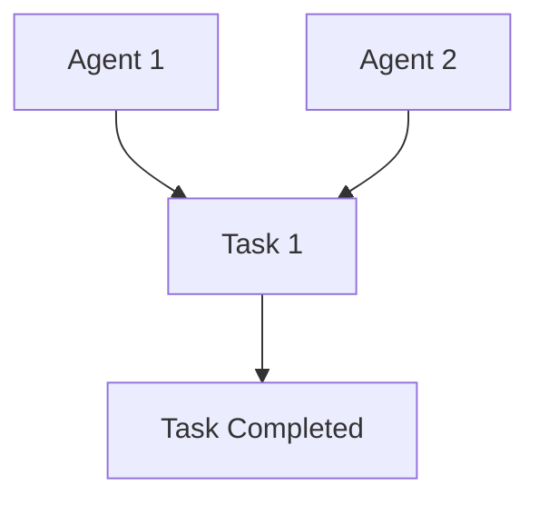

## Quickstart

**Swarms** is an enterprise-grade, production-ready multi-agent collaboration framework that enables you to orchestrate agents to work collaboratively at scale to automate real-world activities. Follow this quickstart guide to get up and running with Swarms, including setting up your environment, building an agent, and leveraging multi-agent methods.

### **Requirements**

- Python 3.10 or above
- `.env` file with API keys from your providers like `OPENAI_API_KEY`, `ANTHROPIC_API_KEY`
- Set an environment variable for your workspace directory:
  ```bash
  WORKSPACE_DIR="agent_workspace"
  ```

### **Installation**

To install Swarms, run:
```bash
$ pip install -U swarms
```

### **Usage Example: Single Agent**

Here’s a simple example of creating a financial analysis agent powered by OpenAI’s GPT-4 model. This agent will analyze financial queries like how to set up a ROTH IRA.

```python
import os
from swarms import Agent
from swarm_models import OpenAIChat
from dotenv import load_dotenv

load_dotenv()

# Initialize OpenAI model
model = OpenAIChat(
    openai_api_key=os.getenv("OPENAI_API_KEY"), model_name="gpt-4o-mini", temperature=0.1
)

# Initialize the agent
agent = Agent(
    agent_name="Financial-Analysis-Agent",
    system_prompt="Analyze financial situations and provide advice...",
    llm=model,
    max_loops=1,
    autosave=True,
    dashboard=False,
    verbose=True,
    saved_state_path="finance_agent.json"
)

# Run the agent on a financial query
out = agent.run("How can I establish a ROTH IRA to buy stocks and get a tax break? What are the criteria?")
print(out)
```

#### **Agent Class**

- **Attributes:**
  - `agent_name`: Name of the agent.
  - `system_prompt`: System-level instruction guiding the agent's behavior.
  - `llm`: Language model used by the agent (e.g., GPT, Anthropic).
  - `max_loops`: Max iterations for a task.
  - `autosave`: Auto-saves the state after each iteration.
  
- **Methods:**
  - `run(task: str)`: Executes the agent’s task.
  - `ingest_docs(doc_path: str)`: Ingests documents into the agent’s knowledge base.
  - `filtered_run(task: str)`: Runs agent with a filtered system prompt.
  
## Integrating External Agents
Integrating external agents from other agent frameworks is easy with swarms.

Steps:

1. Create a new class that inherits `Agent`
2. Create a `.run(task: str) -> str` method that runs the agent and returns the response. 
3. The new Agent must return a string of the response. But you may add additional methods to save the output to JSON.


### Griptape Example

For example, here's an example on how to create an agent from griptape.

Here’s how you can create a custom **Griptape** agent that integrates with the **Swarms** framework by inheriting from the `Agent` class in **Swarms** and overriding the `run(task: str) -> str` method.


```python
from swarms import (
    Agent as SwarmsAgent,
)  # Import the base Agent class from Swarms
from griptape.structures import Agent as GriptapeAgent
from griptape.tools import (
    WebScraperTool,
    FileManagerTool,
    PromptSummaryTool,
)


# Create a custom agent class that inherits from SwarmsAgent
class GriptapeSwarmsAgent(SwarmsAgent):
    def __init__(self, *args, **kwargs):
        # Initialize the Griptape agent with its tools
        self.agent = GriptapeAgent(
            input="Load {{ args[0] }}, summarize it, and store it in a file called {{ args[1] }}.",
            tools=[
                WebScraperTool(off_prompt=True),
                PromptSummaryTool(off_prompt=True),
                FileManagerTool(),
            ],
            *args,
            **kwargs,
            # Add additional settings
        )

    # Override the run method to take a task and execute it using the Griptape agent
    def run(self, task: str) -> str:
        # Extract URL and filename from task (you can modify this parsing based on task structure)
        url, filename = task.split(
            ","
        )  # Example of splitting task string
        # Execute the Griptape agent with the task inputs
        result = self.agent.run(url.strip(), filename.strip())
        # Return the final result as a string
        return str(result)


# Example usage:
griptape_swarms_agent = GriptapeSwarmsAgent()
output = griptape_swarms_agent.run(
    "https://griptape.ai, griptape.txt"
)
print(output)
```

### Key Components:
1. **GriptapeSwarmsAgent**: A custom class that inherits from the `SwarmsAgent` class and integrates the Griptape agent.
2. **run(task: str) -> str**: A method that takes a task string, processes it (e.g., splitting into a URL and filename), and runs the Griptape agent with the provided inputs.
3. **Griptape Tools**: The tools integrated into the Griptape agent (e.g., `WebScraperTool`, `PromptSummaryTool`, `FileManagerTool`) allow for web scraping, summarization, and file management.

You can now easily plug this custom Griptape agent into the **Swarms Framework** and use it to run tasks!


## Overview of Swarm Architectures in the Swarms Framework
---

### 1. **Sequential Workflow**

**Overview**: The `SequentialWorkflow` enables tasks to be executed one after the other. Each agent processes its task and passes the output to the next agent in the sequence.

#### Mermaid Graph:


#### Code Example:

```python
from swarms import Agent, SequentialWorkflow
from swarm_models import Anthropic

# Initialize agents
agent1 = Agent(agent_name="Blog generator", system_prompt="Generate a blog post", llm=Anthropic(), max_loops=1)
agent2 = Agent(agent_name="Summarizer", system_prompt="Summarize the blog post", llm=Anthropic(), max_loops=1)

# Create Sequential workflow
workflow = SequentialWorkflow(agents=[agent1, agent2], max_loops=1)

# Run workflow
output = workflow.run("Generate a blog post on how swarms of agents can help businesses grow.")
print(output)
```

---

### 2. **Agent Rearrange**

**Overview**: `AgentRearrange` allows the orchestration of agents in both sequential and parallel configurations. The user can define a flexible flow of tasks between agents.

#### Mermaid Graph:


#### Code Example:

```python
from swarms import Agent, AgentRearrange
from swarm_models import Anthropic

# Initialize agents
director = Agent(agent_name="Director", system_prompt="Directs tasks", llm=Anthropic(), max_loops=1)
worker1 = Agent(agent_name="Worker1", system_prompt="Generate a transcript", llm=Anthropic(), max_loops=1)
worker2 = Agent(agent_name="Worker2", system_prompt="Summarize the transcript", llm=Anthropic(), max_loops=1)

# Define agent relationships and workflow
flow = "Director -> Worker1 -> Worker2"
agent_system = AgentRearrange(agents=[director, worker1, worker2], flow=flow)

# Run agent system
output = agent_system.run("Create a YouTube transcript and summary")
print(output)
```

---

### 3. **Graph Workflow**

**Overview**: `GraphWorkflow` allows agents to work in a graph-based architecture, where agents or tasks can be connected in any manner—both sequentially and concurrently.

#### Mermaid Graph:



#### Code Example:

```python
from swarms import Agent, Edge, GraphWorkflow, Node, NodeType
from swarm_models import OpenAIChat
import os

# Initialize agents
agent1 = Agent(llm=OpenAIChat(openai_api_key=os.getenv("OPENAI_API_KEY"), max_tokens=4000), max_loops=1)
agent2 = Agent(llm=OpenAIChat(openai_api_key=os.getenv("OPENAI_API_KEY"), max_tokens=4000), max_loops=1)

def sample_task():
    return "Task completed"

# Create the graph workflow
wf_graph = GraphWorkflow()
wf_graph.add_node(Node(id="agent1", type=NodeType.AGENT, agent=agent1))
wf_graph.add_node(Node(id="agent2", type=NodeType.AGENT, agent=agent2))
wf_graph.add_node(Node(id="task1", type=NodeType.TASK, callable=sample_task))

# Define the flow of the graph
wf_graph.add_edge(Edge(source="agent1", target="task1"))
wf_graph.add_edge(Edge(source="agent2", target="task1"))

# Set entry and end points
wf_graph.set_entry_points(["agent1", "agent2"])
wf_graph.set_end_points(["task1"])

# Run the workflow
results = wf_graph.run()
print("Execution results:", results)
```

---

### 4. **Mixture of Agents**

**Overview**: `MixtureOfAgents` is a parallelized architecture where agents perform tasks concurrently and then feed their results back into a loop for final aggregation. This is useful for highly parallelizable tasks.

#### Mermaid Graph:


#### Code Example:

```python
from swarms import Agent, OpenAIChat, MixtureOfAgents

# Initialize agents
director = Agent(agent_name="Director", system_prompt="Directs tasks", llm=OpenAIChat(), max_loops=1)
accountant1 = Agent(agent_name="Accountant1", system_prompt="Prepare financial statements", llm=OpenAIChat(), max_loops=1)
accountant2 = Agent(agent_name="Accountant2", system_prompt="Audit financial records", llm=OpenAIChat(), max_loops=1)

# Create Mixture of Agents swarm
swarm = MixtureOfAgents(name="Mixture of Accountants", agents=[director, accountant1, accountant2], layers=3, final_agent=director)

# Run the swarm
output = swarm.run("Prepare financial statements and audit financial records")
print(output)
```

---

### 5. **Spreadsheet Swarm**

**Overview**: `SpreadSheetSwarm` enables the management of thousands of agents simultaneously, where each agent operates on its own thread. It’s ideal for overseeing large-scale agent outputs.

#### Mermaid Graph:


#### Code Example:

```python
from swarms import Agent
from swarm_models import OpenAIChat
from swarms.structs.spreadsheet_swarm import SpreadSheetSwarm
import os

# Initialize agents for different marketing platforms
agents = [
    Agent(agent_name="Twitter Agent", system_prompt="Create a tweet", llm=OpenAIChat(openai_api_key=os.getenv("OPENAI_API_KEY")), max_loops=1),
    Agent(agent_name="Instagram Agent", system_prompt="Create an Instagram post", llm=OpenAIChat(openai_api_key=os.getenv("OPENAI_API_KEY")), max_loops=1),
    Agent(agent_name="Facebook Agent", system_prompt="Create a Facebook post", llm=OpenAIChat(openai_api_key=os.getenv("OPENAI_API_KEY")), max_loops=1),
    Agent(agent_name="LinkedIn Agent", system_prompt="Create a LinkedIn post", llm=OpenAIChat(openai_api_key=os.getenv("OPENAI_API_KEY")), max_loops=1),
    Agent(agent_name="Email Agent", system_prompt="Write a marketing email", llm=OpenAIChat(openai_api_key=os.getenv("OPENAI_API_KEY")), max_loops=1),
]

# Create the Spreadsheet Swarm
swarm = SpreadSheetSwarm(agents=agents, save_file_path="real_estate_marketing_spreadsheet.csv", run_all_agents=False, max_loops=2)

# Run the swarm
swarm.run("Create posts to promote luxury properties in North Texas.")
```

---

These are the key swarm architectures available in the **Swarms Framework**. Each one is designed to solve different types of multi-agent orchestration problems, from sequential tasks to large-scale parallel processing.


### Overview of Swarm Architectures
#### **Workflow Classes**

- **SequentialWorkflow:**
  - Chains agents, where one agent's output becomes the next agent’s input.
  
- **AgentRearrange:**
  - Dynamically rearranges agent tasks either in parallel or sequentially based on defined flow.

#### **Swarm Architectures**

- **Hierarchical Swarms:**
  - Implements top-down control, where a boss agent coordinates tasks among sub-agents.
  
- **Spreadsheet Swarm:**
  - A large-scale swarm architecture for managing multiple agents working concurrently.

