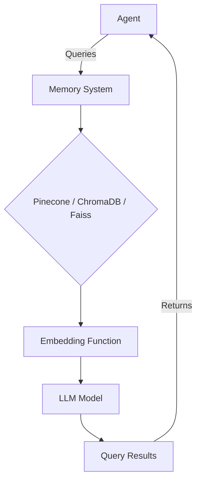

# Integrating the Agent Class with Memory Systems in the Swarms Memory Framework

## Introduction

In this guide, we will cover how to integrate various memory systems from the Swarms Memory framework into an agent class. The Swarms Memory framework allows for the integration of different database-backed memory systems, enabling agents to retain and query long-term knowledge effectively. We'll walk through examples of integrating with Pinecone, ChromaDB, and Faiss, showcasing how to configure custom functions and embed memory functionality into an agent class.

## Installation

First, you need to install the Swarms Memory package:

```bash
$ pip install swarms-memory
```

## Usage Examples

### Integrating Pinecone with the Agent Class

Pinecone is a vector database for high-speed querying of large-scale datasets. Here's how you can integrate it with your agent:

```python
from typing import List, Dict, Any
from swarms_memory import PineconeMemory
from swarms import Agent, Anthropic
from transformers import AutoTokenizer, AutoModel
import torch
import os

# Custom embedding function using a HuggingFace model
def custom_embedding_function(text: str) -> List[float]:
    tokenizer = AutoTokenizer.from_pretrained("bert-base-uncased")
    model = AutoModel.from_pretrained("bert-base-uncased")
    inputs = tokenizer(
        text,
        return_tensors="pt",
        padding=True,
        truncation=True,
        max_length=512,
    )
    with torch.no_grad():
        outputs = model(**inputs)
    embeddings = (
        outputs.last_hidden_state.mean(dim=1).squeeze().tolist()
    )
    return embeddings

# Initialize the Pinecone memory wrapper
pinecone_memory = PineconeMemory(
    api_key="your-api-key",
    environment="your-environment",
    index_name="your-index-name",
    embedding_function=custom_embedding_function,
)

# Model
model = Anthropic(anthropic_api_key=os.getenv("ANTHROPIC_API_KEY"))

# Initialize the agent with Pinecone memory
agent = Agent(
    agent_name="Financial-Analysis-Agent",
    system_prompt="Agent system prompt here",
    agent_description="Agent performs financial analysis.",
    llm=model,
    long_term_memory=pinecone_memory,
)

# Run a query
agent.run("What is the current market trend in AI investments?")
```

### Integrating ChromaDB with the Agent Class

ChromaDB is a simple, high-performance vector store for use with embeddings. Here's how you can integrate ChromaDB:

```python
from swarms_memory import ChromaDB
from swarms import Agent, Anthropic
import os

# Initialize the ChromaDB client
chromadb_memory = ChromaDB(
    metric="cosine",
    output_dir="finance_agent_rag",
)

# Model
model = Anthropic(anthropic_api_key=os.getenv("ANTHROPIC_API_KEY"))

# Initialize the agent with ChromaDB memory
agent = Agent(
    agent_name="Financial-Analysis-Agent",
    system_prompt="Agent system prompt here",
    agent_description="Agent performs financial analysis.",
    llm=model,
    long_term_memory=chromadb_memory,
)

# Run a query
agent.run("What are the components of a startup's stock incentive equity plan?")
```

### Integrating Faiss with the Agent Class

Faiss is a library for efficient similarity search and clustering of dense vectors. Here's how you can integrate Faiss:

```python
from typing import List, Dict, Any
from swarms_memory.faiss_wrapper import FAISSDB
from swarms import Agent, Anthropic
from transformers import AutoTokenizer, AutoModel
import torch
import os

# Custom embedding function using a HuggingFace model
def custom_embedding_function(text: str) -> List[float]:
    tokenizer = AutoTokenizer.from_pretrained("bert-base-uncased")
    model = AutoModel.from_pretrained("bert-base-uncased")
    inputs = tokenizer(
        text,
        return_tensors="pt",
        padding=True,
        truncation=True,
        max_length=512,
    )
    with torch.no_grad():
        outputs = model(**inputs)
    embeddings = (
        outputs.last_hidden_state.mean(dim=1).squeeze().tolist()
    )
    return embeddings

# Initialize the FAISS memory wrapper
faiss_memory = FAISSDB(
    dimension=768,
    index_type="Flat",
    embedding_function=custom_embedding_function,
    metric="cosine",
)

# Model
model = Anthropic(anthropic_api_key=os.getenv("ANTHROPIC_API_KEY"))

# Initialize the agent with Faiss memory
agent = Agent(
    agent_name="Financial-Analysis-Agent",
    system_prompt="Agent system prompt here",
    agent_description="Agent performs financial analysis.",
    llm=model,
    long_term_memory=faiss_memory,
)

# Run a query
agent.run("Explain the differences between various types of financial instruments.")
```

## Mermaid Graphs for Visualizing Integration

To help visualize the integration process, here's a Mermaid graph illustrating how an agent interacts with the memory systems:



This graph shows the flow from the agent sending queries to the memory system, which processes them using the embedding function and LLM model, and finally returns the results back to the agent.

## Conclusion

Integrating various memory systems from the Swarms Memory framework into the agent class enables the creation of powerful, memory-augmented agents capable of retaining and recalling information over time. Whether you're using Pinecone, ChromaDB, or Faiss, the process involves initializing the memory system, embedding functions, and then passing this memory system to the agent class. The examples and visualizations provided should help you get started with building your own memory-augmented agents.

Happy coding!
