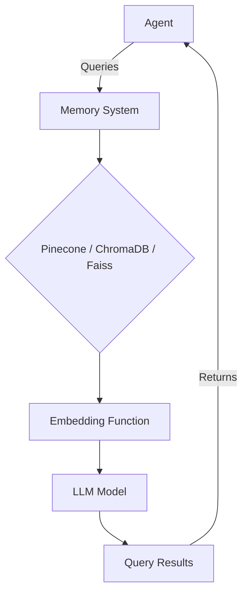

# Integrating the Agent Class with Memory Systems in the Swarms Memory Framework

## Introduction

In this guide, we will cover how to integrate various memory systems from the Swarms Memory framework into an agent class. The Swarms Memory framework allows for the integration of different database-backed memory systems, enabling agents to retain and query long-term knowledge effectively. We'll walk through examples of integrating with Pinecone, ChromaDB, and Faiss, showcasing how to configure custom functions and embed memory functionality into an agent class.

## Installation

First, you need to install the Swarms Memory package:

```bash
$ pip install swarms-memory
```

## Usage Examples

### Integrating Pinecone with the Agent Class

The next step is to implement the abstract methods defined in the `BaseVectorDatabase` class. These methods provide the core functionality for interacting with your vector database, such as connecting, querying, and performing CRUD operations.

```python
from swarms import BaseVectorDatabase


class MyCustomVectorDatabase(BaseVectorDatabase):

    def __init__(self, *args, **kwargs):

        # Custom initialization logic

        pass

    def connect(self):

        # Implementation for connecting to the vector database

        pass

    def close(self):

        # Implementation for closing the vector database connection

        pass

    def query(self, query: str):

        # Implementation for executing a query on the vector database

        pass

    def fetch_all(self):

        # Implementation for fetching all rows from the result set

        pass

    def fetch_one(self):

        # Implementation for fetching a single row from the result set

        pass

    def add(self, doc: str):

        # Implementation for adding a new record to the vector database

        pass

    def get(self, query: str):

        # Implementation for retrieving a record from the vector database

        pass

    def update(self, doc):

        # Implementation for updating a record in the vector database

        pass

    def delete(self, message):

        # Implementation for deleting a record from the vector database

        pass

```

In this example, we define placeholders for each of the abstract methods within the `MyCustomVectorDatabase` class. These placeholders will be replaced with the actual implementation logic specific to your chosen vector database solution.

### Step 3: Choose and Integrate Your Vector Database Solution

With the foundational structure in place, it's time to choose a specific vector database solution and integrate it into your custom implementation. In this guide, we'll explore several popular vector database solutions, including PostgreSQL, Pinecone, Chroma, FAISS, and more, providing examples and guidance on how to integrate them seamlessly.

### PostgreSQL Integration

PostgreSQL is a powerful open-source relational database management system that supports vector data types and operations, making it a viable choice for building custom vector memory databases.

```python

import psycopg2
from swarms import BaseVectorDatabase

class PostgreSQLVectorDatabase(MyCustomVectorDatabase):

    def __init__(self, *args, **kwargs):

        super().__init__(*args, **kwargs)

        # PostgreSQL connection details

        self.conn = psycopg2.connect(

            host="localhost",

            database="vector_db",

            user="postgres",

            password="your_password"

        )

        self.cur = self.conn.cursor()

    def connect(self):

        # PostgreSQL connection logic

        pass

    def close(self):

        # Close PostgreSQL connection

        self.cur.close()

        self.conn.close()

    def query(self, query: str):

        # Execute PostgreSQL query

        self.cur.execute(query)

    def fetch_all(self):

        # Fetch all rows from PostgreSQL result set

        return self.cur.fetchall()

    # Implement other abstract methods

```

In this example, we define a `PostgreSQLVectorDatabase` class that inherits from `MyCustomVectorDatabase`. Within the `__init__` method, we establish a connection to a PostgreSQL database using the `psycopg2` library. We then implement the `connect()`, `close()`, `query()`, and `fetch_all()` methods specific to PostgreSQL.

### Pinecone Integration

Pinecone is a managed vector database service that provides efficient storage, retrieval, and manipulation of high-dimensional vector data.

```python

import pinecone
from swarms import BaseVectorDatabase


class PineconeVectorDatabase(MyCustomVectorDatabase):

    def __init__(self, *args, **kwargs):

        super().__init__(*args, **kwargs)

        # Pinecone initialization

        pinecone.init(api_key="your_api_key", environment="your_environment")

        self.index = pinecone.Index("your_index_name")

    def connect(self):

        # Pinecone connection logic

        pass

    def close(self):

        # Close Pinecone connection

        pass

    def query(self, query: str):

        # Execute Pinecone query

        results = self.index.query(query)

        return results

    def add(self, doc: str):

        # Add document to Pinecone index

        self.index.upsert([("id", doc)])

    # Implement other abstract methods

```

In this example, we define a `PineconeVectorDatabase` class that inherits from `MyCustomVectorDatabase`. Within the `__init__` method, we initialize the Pinecone client and create an index. We then implement the `query()` and `add()` methods specific to the Pinecone API.

### Chroma Integration

Chroma is an open-source vector database library that provides efficient storage, retrieval, and manipulation of vector data using various backends, including DuckDB, Chromadb, and more.

```python
import logging
import os
import uuid
from typing import Optional

import chromadb
from dotenv import load_dotenv

from swarms.utils.data_to_text import data_to_text
from swarms.utils.markdown_message import display_markdown_message
from swarms_memory import  BaseVectorDatabase

# Load environment variables
load_dotenv()


# Results storage using local ChromaDB
class ChromaDB(BaseVectorDatabase):
    """

    ChromaDB database

    Args:
        metric (str): The similarity metric to use.
        output (str): The name of the collection to store the results in.
        limit_tokens (int, optional): The maximum number of tokens to use for the query. Defaults to 1000.
        n_results (int, optional): The number of results to retrieve. Defaults to 2.

    Methods:
        add: _description_
        query: _description_

    Examples:
        >>> chromadb = ChromaDB(
        >>>     metric="cosine",
        >>>     output="results",
        >>>     llm="gpt3",
        >>>     openai_api_key=OPENAI_API_KEY,
        >>> )
        >>> chromadb.add(task, result, result_id)
    """

    def __init__(
        self,
        metric: str = "cosine",
        output_dir: str = "swarms",
        limit_tokens: Optional[int] = 1000,
        n_results: int = 3,
        docs_folder: str = None,
        verbose: bool = False,
        *args,
        **kwargs,
    ):
        self.metric = metric
        self.output_dir = output_dir
        self.limit_tokens = limit_tokens
        self.n_results = n_results
        self.docs_folder = docs_folder
        self.verbose = verbose

        # Disable ChromaDB logging
        if verbose:
            logging.getLogger("chromadb").setLevel(logging.INFO)

        # Create Chroma collection
        chroma_persist_dir = "chroma"
        chroma_client = chromadb.PersistentClient(
            settings=chromadb.config.Settings(
                persist_directory=chroma_persist_dir,
            ),
            *args,
            **kwargs,
        )

        # Create ChromaDB client
        self.client = chromadb.Client()

        # Create Chroma collection
        self.collection = chroma_client.get_or_create_collection(
            name=output_dir,
            metadata={"hnsw:space": metric},
            *args,
            **kwargs,
        )
        display_markdown_message(
            "ChromaDB collection created:"
            f" {self.collection.name} with metric: {self.metric} and"
            f" output directory: {self.output_dir}"
        )

        # If docs
        if docs_folder:
            display_markdown_message(
                f"Traversing directory: {docs_folder}"
            )
            self.traverse_directory()

    def add(
        self,
        document: str,
        *args,
        **kwargs,
    ):
        """
        Add a document to the ChromaDB collection.

        Args:
            document (str): The document to be added.
            condition (bool, optional): The condition to check before adding the document. Defaults to True.

        Returns:
            str: The ID of the added document.
        """
        try:
            doc_id = str(uuid.uuid4())
            self.collection.add(
                ids=[doc_id],
                documents=[document],
                *args,
                **kwargs,
            )
            print("-----------------")
            print("Document added successfully")
            print("-----------------")
            return doc_id
        except Exception as e:
            raise Exception(f"Failed to add document: {str(e)}")

    def query(
        self,
        query_text: str,
        *args,
        **kwargs,
    ):
        """
        Query documents from the ChromaDB collection.

        Args:
            query (str): The query string.
            n_docs (int, optional): The number of documents to retrieve. Defaults to 1.

        Returns:
            dict: The retrieved documents.
        """
        try:
            docs = self.collection.query(
                query_texts=[query_text],
                n_results=self.n_results,
                *args,
                **kwargs,
            )["documents"]
            return docs[0]
        except Exception as e:
            raise Exception(f"Failed to query documents: {str(e)}")

    def traverse_directory(self):
        """
        Traverse through every file in the given directory and its subdirectories,
        and return the paths of all files.
        Parameters:
        - directory_name (str): The name of the directory to traverse.
        Returns:
        - list: A list of paths to each file in the directory and its subdirectories.
        """
        added_to_db = False

        for root, dirs, files in os.walk(self.docs_folder):
            for file in files:
                file = os.path.join(self.docs_folder, file)
                _, ext = os.path.splitext(file)
                data = data_to_text(file)
                added_to_db = self.add(str(data))
                print(f"{file} added to Database")

        return added_to_db

```

In this example, we define a `ChromaDB` class that inherits from `MyCustomVectorDatabase`. Within the `__init__` method, we create a Chroma client and get or create a collection. We then implement the `query()` and `add()` methods specific to the Chroma API.

### FAISS Integration

FAISS (Facebook AI Similarity Search) is a library for efficient similarity search and clustering of dense vectors, developed by Meta AI.

```python

import faiss

class FAISSVectorDatabase(MyCustomVectorDatabase):

    def __init__(self, *args, **kwargs):

        super().__init__(*args, **kwargs)

        # FAISS initialization

        self.index = faiss.IndexFlatL2(64)  # Assuming 64-dimensional vectors

        self.index_path = "faiss_index.index"

    def connect(self):

        # FAISS connection logic

        self.index = faiss.read_index(self.index_path)

    def close(self):

        # Close FAISS connection

        faiss.write_index(self.index, self.index_path)

    def query(self, query: str):

        # Execute FAISS query

        query_vector = # Convert query to vector

        distances, indices = self.index.search(query_vector, k=10)

        return [(self.index.reconstruct(i), d) for i, d in zip(indices, distances)]

    def add(self, doc: str):

        # Add document to FAISS index

        doc_vector = # Convert doc to vector

        self.index.add(doc_vector)

    # Implement other abstract methods

```

Now, how do you integrate a vector datbase with an agent? This is how:

## Integrate Memory with `Agent`

```python
from typing import List, Dict, Any
from swarms_memory import PineconeMemory
from swarms import Agent, Anthropic
from transformers import AutoTokenizer, AutoModel
import torch
import os

# Custom embedding function using a HuggingFace model
def custom_embedding_function(text: str) -> List[float]:
    tokenizer = AutoTokenizer.from_pretrained("bert-base-uncased")
    model = AutoModel.from_pretrained("bert-base-uncased")
    inputs = tokenizer(
        text,
        return_tensors="pt",
        padding=True,
        truncation=True,
        max_length=512,
    )
    with torch.no_grad():
        outputs = model(**inputs)
    embeddings = (
        outputs.last_hidden_state.mean(dim=1).squeeze().tolist()
    )
    return embeddings

# Initialize the Pinecone memory wrapper
pinecone_memory = PineconeMemory(
    api_key="your-api-key",
    environment="your-environment",
    index_name="your-index-name",
    embedding_function=custom_embedding_function,
)

# Model
model = Anthropic(anthropic_api_key=os.getenv("ANTHROPIC_API_KEY"))

# Initialize the agent with Pinecone memory
agent = Agent(
    agent_name="Financial-Analysis-Agent",
    system_prompt="Agent system prompt here",
    agent_description="Agent performs financial analysis.",
    llm=model,
    long_term_memory=pinecone_memory,
)

# Run a query
agent.run("What is the current market trend in AI investments?")
```

### Integrating ChromaDB with the Agent Class

ChromaDB is a simple, high-performance vector store for use with embeddings. Here's how you can integrate ChromaDB:

```python
from swarms_memory import ChromaDB
from swarms import Agent, Anthropic
import os

# Initialize the ChromaDB client
chromadb_memory = ChromaDB(
    metric="cosine",
    output_dir="finance_agent_rag",
)

# Model
model = Anthropic(anthropic_api_key=os.getenv("ANTHROPIC_API_KEY"))

# Initialize the agent with ChromaDB memory
agent = Agent(
    agent_name="Financial-Analysis-Agent",
    system_prompt="Agent system prompt here",
    agent_description="Agent performs financial analysis.",
    llm=model,
    long_term_memory=chromadb_memory,
)

# Run a query
agent.run("What are the components of a startup's stock incentive equity plan?")
```

### Integrating Faiss with the Agent Class

Faiss is a library for efficient similarity search and clustering of dense vectors. Here's how you can integrate Faiss:

```python
from typing import List, Dict, Any
from swarms_memory.faiss_wrapper import FAISSDB
from swarms import Agent, Anthropic
from transformers import AutoTokenizer, AutoModel
import torch
import os

# Custom embedding function using a HuggingFace model
def custom_embedding_function(text: str) -> List[float]:
    tokenizer = AutoTokenizer.from_pretrained("bert-base-uncased")
    model = AutoModel.from_pretrained("bert-base-uncased")
    inputs = tokenizer(
        text,
        return_tensors="pt",
        padding=True,
        truncation=True,
        max_length=512,
    )
    with torch.no_grad():
        outputs = model(**inputs)
    embeddings = (
        outputs.last_hidden_state.mean(dim=1).squeeze().tolist()
    )
    return embeddings

# Initialize the FAISS memory wrapper
faiss_memory = FAISSDB(
    dimension=768,
    index_type="Flat",
    embedding_function=custom_embedding_function,
    metric="cosine",
)

# Model
model = Anthropic(anthropic_api_key=os.getenv("ANTHROPIC_API_KEY"))

# Initialize the agent with Faiss memory
agent = Agent(
    agent_name="Financial-Analysis-Agent",
    system_prompt="Agent system prompt here",
    agent_description="Agent performs financial analysis.",
    llm=model,
    long_term_memory=faiss_memory,
)

# Run a query
agent.run("Explain the differences between various types of financial instruments.")
```

## Mermaid Graphs for Visualizing Integration

To help visualize the integration process, here's a Mermaid graph illustrating how an agent interacts with the memory systems:



This graph shows the flow from the agent sending queries to the memory system, which processes them using the embedding function and LLM model, and finally returns the results back to the agent.

## Conclusion

Integrating various memory systems from the Swarms Memory framework into the agent class enables the creation of powerful, memory-augmented agents capable of retaining and recalling information over time. Whether you're using Pinecone, ChromaDB, or Faiss, the process involves initializing the memory system, embedding functions, and then passing this memory system to the agent class. The examples and visualizations provided should help you get started with building your own memory-augmented agents.

Happy coding!
