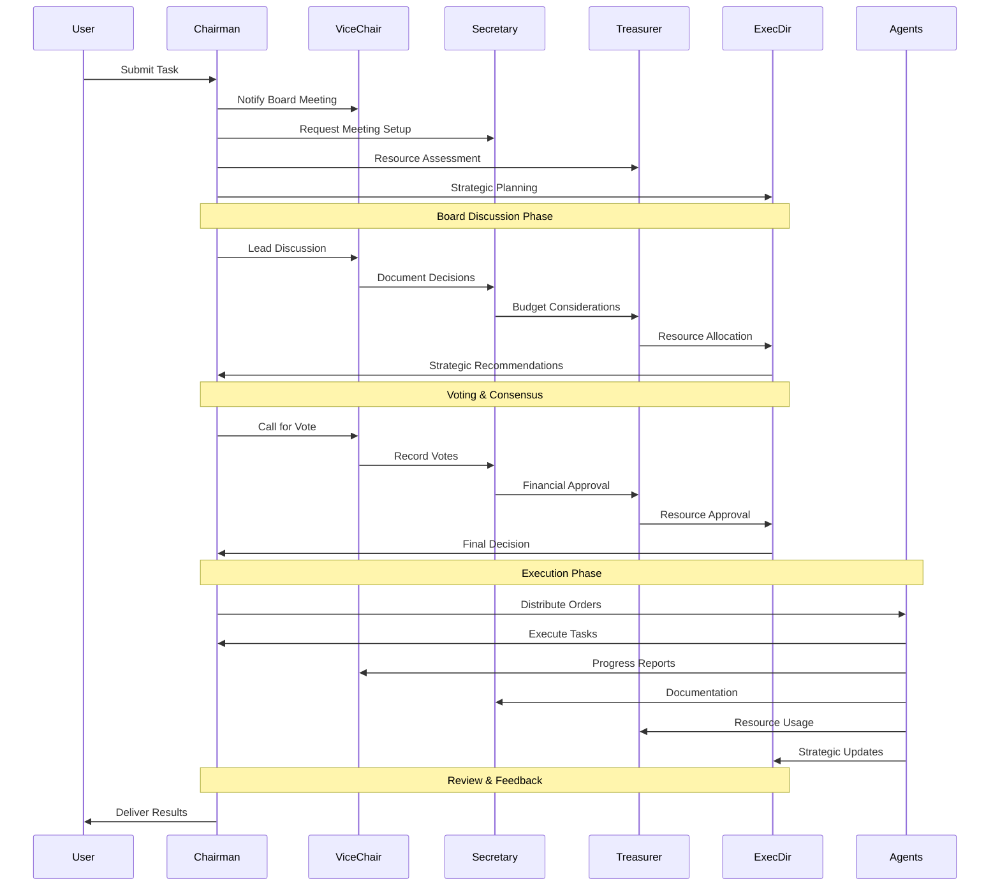

# Board of Directors - Multi-Agent Architecture

The Board of Directors is a sophisticated multi-agent architecture that implements collective decision-making through democratic processes, voting mechanisms, and role-based leadership. This architecture provides an alternative to single-director patterns by enabling collaborative intelligence through structured governance.

## 🏛️ Overview

The Board of Directors architecture follows a democratic workflow pattern:

1. **Task Reception**: User provides a task to the swarm
2. **Board Meeting**: Board of Directors convenes to discuss and create a plan
3. **Voting & Consensus**: Board members vote and reach consensus on task distribution
4. **Order Distribution**: Board distributes orders to specialized worker agents
5. **Execution**: Individual agents execute their assigned tasks
6. **Feedback Loop**: Board evaluates results and issues new orders if needed (up to `max_loops`)
7. **Context Preservation**: All conversation history and context is maintained throughout the process

## 🏗️ Architecture Components

### Core Components

| Component | Description | Purpose |
|-----------|-------------|---------|
| **BoardOfDirectorsSwarm** | Main orchestration class | Manages the entire board workflow and agent coordination |
| **Board Member Roles** | Role definitions and hierarchy | Defines responsibilities and voting weights for each board member |
| **Decision Making Process** | Voting and consensus mechanisms | Implements democratic decision-making with weighted voting |
| **Workflow Management** | Process orchestration | Manages the complete lifecycle from task reception to final delivery |

### Board Member Interaction Flow



## 👥 Board Member Roles

The Board of Directors supports various roles with different responsibilities and voting weights:

| Role | Description | Voting Weight | Responsibilities |
|------|-------------|---------------|------------------|
| `CHAIRMAN` | Primary leader responsible for board meetings and final decisions | 1.5 | Leading meetings, facilitating consensus, making final decisions |
| `VICE_CHAIRMAN` | Secondary leader who supports the chairman | 1.2 | Supporting chairman, coordinating operations |
| `SECRETARY` | Responsible for documentation and meeting minutes | 1.0 | Documenting meetings, maintaining records |
| `TREASURER` | Manages financial aspects and resource allocation | 1.0 | Financial oversight, resource management |
| `EXECUTIVE_DIRECTOR` | Executive-level board member with operational authority | 1.5 | Strategic planning, operational oversight |
| `MEMBER` | General board member with specific expertise | 1.0 | Contributing expertise, participating in decisions |

### Role Hierarchy and Authority

```python
# Example: Role hierarchy implementation
class BoardRoleHierarchy:
    def __init__(self):
        self.roles = {
            "CHAIRMAN": {
                "voting_weight": 1.5,
                "authority_level": "FINAL",
                "supervises": ["VICE_CHAIRMAN", "EXECUTIVE_DIRECTOR", "SECRETARY", "TREASURER", "MEMBER"],
                "responsibilities": ["leadership", "final_decision", "consensus_facilitation"],
                "override_capability": True
            },
            "VICE_CHAIRMAN": {
                "voting_weight": 1.2,
                "authority_level": "SENIOR",
                "supervises": ["MEMBER"],
                "responsibilities": ["operational_support", "coordination", "implementation"],
                "backup_for": "CHAIRMAN"
            },
            "EXECUTIVE_DIRECTOR": {
                "voting_weight": 1.5,
                "authority_level": "SENIOR",
                "supervises": ["MEMBER"],
                "responsibilities": ["strategic_planning", "execution_oversight", "performance_management"],
                "strategic_authority": True
            },
            "SECRETARY": {
                "voting_weight": 1.0,
                "authority_level": "STANDARD",
                "supervises": [],
                "responsibilities": ["documentation", "record_keeping", "communication"],
                "administrative_authority": True
            },
            "TREASURER": {
                "voting_weight": 1.0,
                "authority_level": "STANDARD",
                "supervises": [],
                "responsibilities": ["financial_oversight", "resource_management", "budget_control"],
                "financial_authority": True
            },
            "MEMBER": {
                "voting_weight": 1.0,
                "authority_level": "STANDARD",
                "supervises": [],
                "responsibilities": ["expertise_contribution", "analysis", "voting"],
                "specialized_expertise": True
            }
        }
```

## 🚀 Quick Start

### Basic Setup

```python
from swarms import Agent
from swarms.structs.board_of_directors_swarm import (
    BoardOfDirectorsSwarm,
    BoardMember,
    BoardMemberRole
)
from swarms.config.board_config import enable_board_feature

# Enable the Board of Directors feature
enable_board_feature()

# Create board members with specific roles
chairman = Agent(
    agent_name="Chairman",
    agent_description="Chairman of the Board responsible for leading meetings",
    model_name="gpt-4o-mini",
    system_prompt="You are the Chairman of the Board..."
)

vice_chairman = Agent(
    agent_name="Vice-Chairman",
    agent_description="Vice Chairman who supports the Chairman",
    model_name="gpt-4o-mini",
    system_prompt="You are the Vice Chairman..."
)

# Create BoardMember objects with roles and expertise
board_members = [
    BoardMember(chairman, BoardMemberRole.CHAIRMAN, 1.5, ["leadership", "strategy"]),
    BoardMember(vice_chairman, BoardMemberRole.VICE_CHAIRMAN, 1.2, ["operations", "coordination"]),
]

# Create worker agents
research_agent = Agent(
    agent_name="Research-Specialist",
    agent_description="Expert in market research and analysis",
    model_name="gpt-4o",
)

financial_agent = Agent(
    agent_name="Financial-Analyst",
    agent_description="Specialist in financial analysis and valuation",
    model_name="gpt-4o",
)

# Initialize the Board of Directors swarm
board_swarm = BoardOfDirectorsSwarm(
    name="Executive_Board_Swarm",
    description="Executive board with specialized roles for strategic decision-making",
    board_members=board_members,
    agents=[research_agent, financial_agent],
    max_loops=2,
    verbose=True,
    decision_threshold=0.6,
    enable_voting=True,
    enable_consensus=True,
)

# Execute a complex task with democratic decision-making
result = board_swarm.run(task="Analyze the market potential for Tesla (TSLA) stock")
print(result)
```

## 📋 Comprehensive Examples

### 1. Strategic Investment Analysis

```python
# Create specialized agents for investment analysis
market_research_agent = Agent(
    agent_name="Market-Research-Specialist",
    agent_description="Expert in market research, competitive analysis, and industry trends",
    model_name="gpt-4o",
    system_prompt="""You are a Market Research Specialist. Your responsibilities include:
1. Conducting comprehensive market research and analysis
2. Identifying market trends, opportunities, and risks
3. Analyzing competitive landscape and positioning
4. Providing market size and growth projections
5. Supporting strategic decision-making with research findings

You should be thorough, analytical, and objective in your research."""
)

financial_analyst_agent = Agent(
    agent_name="Financial-Analyst",
    agent_description="Specialist in financial analysis, valuation, and investment assessment",
    model_name="gpt-4o",
    system_prompt="""You are a Financial Analyst. Your responsibilities include:
1. Conducting financial analysis and valuation
2. Assessing investment opportunities and risks
3. Analyzing financial performance and metrics
4. Providing financial insights and recommendations
5. Supporting financial decision-making

You should be financially astute, analytical, and focused on value creation."""
)

technical_assessor_agent = Agent(
    agent_name="Technical-Assessor",
    agent_description="Expert in technical feasibility and implementation assessment",
    model_name="gpt-4o",
    system_prompt="""You are a Technical Assessor. Your responsibilities include:
1. Evaluating technical feasibility and requirements
2. Assessing implementation challenges and risks
3. Analyzing technology stack and architecture
4. Providing technical insights and recommendations
5. Supporting technical decision-making

You should be technically proficient, practical, and solution-oriented."""
)

# Create comprehensive board members
board_members = [
    BoardMember(
        chairman, 
        BoardMemberRole.CHAIRMAN, 
        1.5, 
        ["leadership", "strategy", "governance", "decision_making"]
    ),
    BoardMember(
        vice_chairman, 
        BoardMemberRole.VICE_CHAIRMAN, 
        1.2, 
        ["operations", "coordination", "communication", "implementation"]
    ),
    BoardMember(
        secretary, 
        BoardMemberRole.SECRETARY, 
        1.0, 
        ["documentation", "compliance", "record_keeping", "communication"]
    ),
    BoardMember(
        treasurer, 
        BoardMemberRole.TREASURER, 
        1.0, 
        ["finance", "budgeting", "risk_management", "resource_allocation"]
    ),
    BoardMember(
        executive_director, 
        BoardMemberRole.EXECUTIVE_DIRECTOR, 
        1.5, 
        ["strategy", "operations", "innovation", "performance_management"]
    )
]

# Initialize the investment analysis board
investment_board = BoardOfDirectorsSwarm(
    name="Investment_Analysis_Board",
    description="Specialized board for investment analysis and decision-making",
    board_members=board_members,
    agents=[market_research_agent, financial_analyst_agent, technical_assessor_agent],
    max_loops=3,
    verbose=True,
    decision_threshold=0.75,  # Higher threshold for investment decisions
    enable_voting=True,
    enable_consensus=True,
    max_workers=3,
    output_type="dict"
)

# Execute investment analysis
investment_task = """
Analyze the strategic investment opportunity for a $50M Series B funding round in a 
fintech startup. Consider market conditions, competitive landscape, financial projections, 
technical feasibility, and strategic fit. Provide comprehensive recommendations including:
1. Investment recommendation (proceed/hold/decline)
2. Valuation analysis and suggested terms
3. Risk assessment and mitigation strategies
4. Strategic value and synergies
5. Implementation timeline and milestones
"""

result = investment_board.run(task=investment_task)
print("Investment Analysis Results:")
print(json.dumps(result, indent=2))
```

### 2. Technology Strategy Development

```python
# Create technology-focused agents
tech_strategy_agent = Agent(
    agent_name="Tech-Strategy-Specialist",
    agent_description="Expert in technology strategy and digital transformation",
    model_name="gpt-4o",
    system_prompt="""You are a Technology Strategy Specialist. Your responsibilities include:
1. Developing technology roadmaps and strategies
2. Assessing digital transformation opportunities
3. Evaluating emerging technologies and trends
4. Planning technology investments and priorities
5. Supporting technology decision-making

You should be strategic, forward-thinking, and technology-savvy."""
)

implementation_planner_agent = Agent(
    agent_name="Implementation-Planner",
    agent_description="Expert in implementation planning and project management",
    model_name="gpt-4o",
    system_prompt="""You are an Implementation Planner. Your responsibilities include:
1. Creating detailed implementation plans
2. Assessing resource requirements and timelines
3. Identifying implementation risks and challenges
4. Planning change management strategies
5. Supporting implementation decision-making

You should be practical, organized, and execution-focused."""
)

# Technology strategy board configuration
tech_board = BoardOfDirectorsSwarm(
    name="Technology_Strategy_Board",
    description="Specialized board for technology strategy and digital transformation",
    board_members=board_members,
    agents=[tech_strategy_agent, implementation_planner_agent, technical_assessor_agent],
    max_loops=4,  # More loops for complex technology planning
    verbose=True,
    decision_threshold=0.7,
    enable_voting=True,
    enable_consensus=True,
    max_workers=3,
    output_type="dict"
)

# Execute technology strategy development
tech_strategy_task = """
Develop a comprehensive technology strategy for a mid-size manufacturing company 
looking to digitize operations and implement Industry 4.0 technologies. Consider:
1. Current technology assessment and gaps
2. Technology roadmap and implementation plan
3. Investment requirements and ROI analysis
4. Risk assessment and mitigation strategies
5. Change management and training requirements
6. Competitive positioning and market advantages
"""

result = tech_board.run(task=tech_strategy_task)
print("Technology Strategy Results:")
print(json.dumps(result, indent=2))
```

### 3. Crisis Management and Response

```python
# Create crisis management agents
crisis_coordinator_agent = Agent(
    agent_name="Crisis-Coordinator",
    agent_description="Expert in crisis management and emergency response",
    model_name="gpt-4o",
    system_prompt="""You are a Crisis Coordinator. Your responsibilities include:
1. Coordinating crisis response efforts
2. Assessing crisis severity and impact
3. Developing immediate response plans
4. Managing stakeholder communications
5. Supporting crisis decision-making

You should be calm, decisive, and action-oriented."""
)

communications_specialist_agent = Agent(
    agent_name="Communications-Specialist",
    agent_description="Expert in crisis communications and stakeholder management",
    model_name="gpt-4o",
    system_prompt="""You are a Communications Specialist. Your responsibilities include:
1. Developing crisis communication strategies
2. Managing stakeholder communications
3. Coordinating public relations efforts
4. Ensuring message consistency and accuracy
5. Supporting communication decision-making

You should be clear, empathetic, and strategic in communications."""
)

# Crisis management board configuration
crisis_board = BoardOfDirectorsSwarm(
    name="Crisis_Management_Board",
    description="Specialized board for crisis management and emergency response",
    board_members=board_members,
    agents=[crisis_coordinator_agent, communications_specialist_agent, financial_analyst_agent],
    max_loops=2,  # Faster response needed
    verbose=True,
    decision_threshold=0.6,  # Lower threshold for urgent decisions
    enable_voting=True,
    enable_consensus=True,
    max_workers=3,
    output_type="dict"
)

# Execute crisis management
crisis_task = """
Our company is facing a major data breach. Develop an immediate response plan.
Include:
1. Immediate containment and mitigation steps
2. Communication strategy for stakeholders
3. Legal and regulatory compliance requirements
4. Financial impact assessment
5. Long-term recovery and prevention measures
6. Timeline and resource allocation
"""

result = crisis_board.run(task=crisis_task)
print("Crisis Management Results:")
print(json.dumps(result, indent=2))
```

## ⚙️ Configuration and Parameters

### BoardOfDirectorsSwarm Parameters

```python
# Complete parameter reference
board_swarm = BoardOfDirectorsSwarm(
    # Basic Configuration
    name="Board_Name",                    # Name of the board
    description="Board description",      # Description of the board's purpose
    
    # Board Members and Agents
    board_members=board_members,          # List of BoardMember objects
    agents=worker_agents,                 # List of worker Agent objects
    
    # Execution Control
    max_loops=3,                         # Maximum number of refinement loops
    max_workers=4,                       # Maximum parallel workers
    
    # Decision Making
    decision_threshold=0.7,              # Consensus threshold (0.0-1.0)
    enable_voting=True,                  # Enable voting mechanisms
    enable_consensus=True,               # Enable consensus building
    
    # Advanced Features
    auto_assign_roles=True,              # Auto-assign roles based on expertise
    role_mapping={                       # Custom role mapping
        "financial_analysis": ["Treasurer", "Financial_Member"],
        "strategic_planning": ["Chairman", "Executive_Director"]
    },
    
    # Consensus Configuration
    consensus_timeout=300,               # Consensus timeout in seconds
    min_participation_rate=0.8,          # Minimum participation rate
    auto_fallback_to_chairman=True,      # Chairman can make final decisions
    consensus_rounds=3,                  # Maximum consensus building rounds
    
    # Output Configuration
    output_type="dict",                  # Output format: "dict", "str", "list"
    verbose=True,                        # Enable detailed logging
    
    # Quality Control
    quality_threshold=0.8,               # Quality threshold for outputs
    enable_quality_gates=True,           # Enable quality checkpoints
    enable_peer_review=True,             # Enable peer review mechanisms
    
    # Performance Optimization
    parallel_execution=True,             # Enable parallel execution
    enable_agent_pooling=True,           # Enable agent pooling
    timeout_per_agent=300,               # Timeout per agent in seconds
    
    # Monitoring and Logging
    enable_logging=True,                 # Enable detailed logging
    log_level="INFO",                    # Logging level
    enable_metrics=True,                 # Enable performance metrics
    enable_tracing=True                  # Enable request tracing
)
```

### Voting Configuration

```python
# Voting system configuration
voting_config = {
    "method": "weighted_majority",        # Voting method
    "threshold": 0.75,                   # Consensus threshold
    "weights": {                         # Role-based voting weights
        "CHAIRMAN": 1.5,
        "VICE_CHAIRMAN": 1.2,
        "SECRETARY": 1.0,
        "TREASURER": 1.0,
        "EXECUTIVE_DIRECTOR": 1.5
    },
    "tie_breaker": "CHAIRMAN",           # Tie breaker role
    "allow_abstention": True,            # Allow board members to abstain
    "secret_ballot": False,              # Use secret ballot voting
    "transparent_process": True          # Transparent voting process
}
```

### Quality Control Configuration

```python
# Quality control configuration
quality_config = {
    "quality_gates": True,               # Enable quality checkpoints
    "quality_threshold": 0.8,            # Quality threshold
    "enable_peer_review": True,          # Enable peer review
    "review_required": True,             # Require peer review
    "output_validation": True,           # Validate outputs
    "enable_metrics_tracking": True,     # Track quality metrics
    
    # Quality metrics
    "quality_metrics": {
        "completeness": {"weight": 0.2, "threshold": 0.8},
        "accuracy": {"weight": 0.25, "threshold": 0.85},
        "feasibility": {"weight": 0.2, "threshold": 0.8},
        "risk": {"weight": 0.15, "threshold": 0.7},
        "impact": {"weight": 0.2, "threshold": 0.8}
    }
}
```

## 📊 Performance Monitoring and Analytics

### Board Performance Metrics

```python
# Get comprehensive board performance metrics
board_summary = board_swarm.get_board_summary()
print("Board Summary:")
print(f"Board Name: {board_summary['board_name']}")
print(f"Total Board Members: {board_summary['total_members']}")
print(f"Total Worker Agents: {board_summary['total_agents']}")
print(f"Decision Threshold: {board_summary['decision_threshold']}")
print(f"Max Loops: {board_summary['max_loops']}")

# Display board member details
print("\nBoard Members:")
for member in board_summary['members']:
    print(f"- {member['name']} (Role: {member['role']}, Weight: {member['voting_weight']})")
    print(f"  Expertise: {', '.join(member['expertise_areas'])}")

# Display worker agent details
print("\nWorker Agents:")
for agent in board_summary['agents']:
    print(f"- {agent['name']}: {agent['description']}")
```

### Decision Analysis

```python
# Analyze decision-making patterns
if hasattr(result, 'get') and callable(result.get):
    conversation_history = result.get('conversation_history', [])
    
    print(f"\nDecision Analysis:")
    print(f"Total Messages: {len(conversation_history)}")
    
    # Count board member contributions
    board_contributions = {}
    for msg in conversation_history:
        if 'Board' in msg.get('role', ''):
            member_name = msg.get('agent_name', 'Unknown')
            board_contributions[member_name] = board_contributions.get(member_name, 0) + 1
    
    print(f"Board Member Contributions:")
    for member, count in board_contributions.items():
        print(f"- {member}: {count} contributions")
    
    # Count agent executions
    agent_executions = {}
    for msg in conversation_history:
        if any(agent.agent_name in msg.get('role', '') for agent in worker_agents):
            agent_name = msg.get('agent_name', 'Unknown')
            agent_executions[agent_name] = agent_executions.get(agent_name, 0) + 1
    
    print(f"\nAgent Executions:")
    for agent, count in agent_executions.items():
        print(f"- {agent}: {count} executions")
```

### Performance Monitoring System

```python
# Performance monitoring system
class PerformanceMonitor:
    def __init__(self):
        self.metrics = {
            "execution_times": [],
            "quality_scores": [],
            "consensus_rounds": [],
            "error_rates": []
        }
    
    def track_execution_time(self, phase, duration):
        """Track execution time for different phases"""
        self.metrics["execution_times"].append({
            "phase": phase,
            "duration": duration,
            "timestamp": datetime.now().isoformat()
        })
    
    def track_quality_score(self, score):
        """Track quality scores"""
        self.metrics["quality_scores"].append({
            "score": score,
            "timestamp": datetime.now().isoformat()
        })
    
    def generate_performance_report(self):
        """Generate comprehensive performance report"""
        return {
            "average_execution_time": self.calculate_average_execution_time(),
            "quality_trends": self.analyze_quality_trends(),
            "consensus_efficiency": self.analyze_consensus_efficiency(),
            "error_analysis": self.analyze_errors(),
            "recommendations": self.generate_recommendations()
        }

# Usage example
monitor = PerformanceMonitor()
# ... track metrics during execution ...
report = monitor.generate_performance_report()
print("Performance Report:")
print(json.dumps(report, indent=2))
```

## 🔧 Advanced Features and Customization

### Custom Board Templates

```python
from swarms.config.board_config import get_default_board_template

# Get pre-configured board templates
financial_board = get_default_board_template("financial_analysis")
strategic_board = get_default_board_template("strategic_planning")
tech_board = get_default_board_template("technology_assessment")
crisis_board = get_default_board_template("crisis_management")

# Custom board template
custom_template = {
    "name": "Custom_Board",
    "description": "Custom board for specific use case",
    "board_members": [
        {"role": "CHAIRMAN", "expertise": ["leadership", "strategy"]},
        {"role": "VICE_CHAIRMAN", "expertise": ["operations", "coordination"]},
        {"role": "SECRETARY", "expertise": ["documentation", "communication"]},
        {"role": "TREASURER", "expertise": ["finance", "budgeting"]},
        {"role": "EXECUTIVE_DIRECTOR", "expertise": ["strategy", "operations"]}
    ],
    "agents": [
        {"name": "Research_Agent", "expertise": ["research", "analysis"]},
        {"name": "Technical_Agent", "expertise": ["technical", "implementation"]}
    ],
    "config": {
        "max_loops": 3,
        "decision_threshold": 0.7,
        "enable_voting": True,
        "enable_consensus": True
    }
}
```

### Dynamic Role Assignment

```python
# Automatically assign roles based on task requirements
board_swarm = BoardOfDirectorsSwarm(
    board_members=board_members,
    agents=agents,
    auto_assign_roles=True,
    role_mapping={
        "financial_analysis": ["Treasurer", "Financial_Member"],
        "strategic_planning": ["Chairman", "Executive_Director"],
        "technical_assessment": ["Technical_Member", "Executive_Director"],
        "research_analysis": ["Research_Member", "Secretary"],
        "crisis_management": ["Chairman", "Vice_Chairman", "Communications_Member"]
    }
)
```

### Consensus Optimization

```python
# Advanced consensus-building mechanisms
board_swarm = BoardOfDirectorsSwarm(
    board_members=board_members,
    agents=agents,
    enable_consensus=True,
    consensus_timeout=300,  # 5 minutes timeout
    min_participation_rate=0.8,  # 80% minimum participation
    auto_fallback_to_chairman=True,  # Chairman can make final decisions
    consensus_rounds=3,  # Maximum consensus building rounds
    consensus_method="weighted_majority",  # Consensus method
    enable_mediation=True,  # Enable mediation for conflicts
    mediation_timeout=120  # Mediation timeout in seconds
)
```

## 🛠️ Troubleshooting and Debugging

### Common Issues and Solutions

1. **Consensus Failures**
   - **Issue**: Board cannot reach consensus within loop limit
   - **Solution**: Lower voting threshold, increase max_loops, or adjust voting weights
   ```python
   board_swarm = BoardOfDirectorsSwarm(
       decision_threshold=0.6,  # Lower threshold
       max_loops=5,            # More loops
       consensus_timeout=600   # Longer timeout
   )
   ```

2. **Agent Timeout**
   - **Issue**: Individual agents take too long to respond
   - **Solution**: Increase timeout settings or optimize agent prompts
   ```python
   board_swarm = BoardOfDirectorsSwarm(
       timeout_per_agent=600,  # 10 minutes per agent
       enable_agent_pooling=True  # Use agent pooling
   )
   ```

3. **Poor Quality Output**
   - **Issue**: Final output doesn't meet quality standards
   - **Solution**: Enable quality gates, increase max_loops, or improve agent prompts
   ```python
   board_swarm = BoardOfDirectorsSwarm(
       enable_quality_gates=True,
       quality_threshold=0.8,
       enable_peer_review=True,
       max_loops=4
   )
   ```

4. **Resource Exhaustion**
   - **Issue**: System runs out of resources during execution
   - **Solution**: Implement resource limits, use agent pooling, or optimize parallel execution
   ```python
   board_swarm = BoardOfDirectorsSwarm(
       max_workers=2,  # Limit parallel workers
       enable_agent_pooling=True,
       parallel_execution=False  # Disable parallel execution
   )
   ```

### Debugging Techniques

```python
# Debugging configuration
debug_config = BoardConfig(
    max_loops=1,  # Limit loops for debugging
    enable_logging=True,
    log_level="DEBUG",
    enable_tracing=True,
    debug_mode=True
)

# Create debug swarm
debug_swarm = BoardOfDirectorsSwarm(
    agents=agents,
    config=debug_config
)

# Execute with debugging
try:
    result = debug_swarm.run(task)
except Exception as e:
    print(f"Error: {e}")
    print(f"Debug info: {debug_swarm.get_debug_info()}")

# Enable detailed logging
import logging
logging.basicConfig(
    level=logging.DEBUG,
    format='%(asctime)s - %(name)s - %(levelname)s - %(message)s'
)

# Create swarm with logging enabled
logging_swarm = BoardOfDirectorsSwarm(
    agents=agents,
    config=BoardConfig(
        enable_logging=True,
        log_level="DEBUG",
        enable_metrics=True,
        enable_tracing=True
    )
)
```

## 📋 Use Cases

### Corporate Governance
- **Strategic Planning**: Long-term business strategy development
- **Risk Management**: Comprehensive risk assessment and mitigation
- **Resource Allocation**: Optimal distribution of company resources
- **Performance Oversight**: Monitoring and evaluating organizational performance

### Financial Analysis
- **Portfolio Management**: Investment portfolio optimization and rebalancing
- **Market Analysis**: Comprehensive market research and trend analysis
- **Risk Assessment**: Financial risk evaluation and management
- **Compliance Monitoring**: Regulatory compliance and audit preparation

### Research & Development
- **Technology Assessment**: Evaluation of emerging technologies
- **Product Development**: Strategic product planning and development
- **Innovation Management**: Managing innovation pipelines and initiatives
- **Quality Assurance**: Ensuring high standards across development processes

### Project Management
- **Complex Project Planning**: Multi-faceted project strategy development
- **Resource Optimization**: Efficient allocation of project resources
- **Stakeholder Management**: Coordinating diverse stakeholder interests
- **Risk Mitigation**: Identifying and addressing project risks

### Crisis Management
- **Emergency Response**: Rapid response to critical situations
- **Stakeholder Communication**: Managing communications during crises
- **Recovery Planning**: Developing recovery and prevention strategies
- **Legal Compliance**: Ensuring compliance during crisis situations

## 🎯 Success Criteria

A successful Board of Directors implementation should demonstrate:

- ✅ **Democratic Decision Making**: All board members contribute to decisions
- ✅ **Consensus Achievement**: Decisions reached through collaborative processes
- ✅ **Role Effectiveness**: Each board member fulfills their responsibilities
- ✅ **Agent Coordination**: Worker agents execute tasks efficiently
- ✅ **Quality Output**: High-quality results through collective intelligence
- ✅ **Process Transparency**: Clear visibility into decision-making processes
- ✅ **Performance Optimization**: Efficient resource utilization and execution
- ✅ **Continuous Improvement**: Learning from each execution cycle

## 📚 Best Practices

### 1. Role Definition
- Clearly define responsibilities for each board member
- Ensure expertise areas align with organizational needs
- Balance voting weights based on role importance
- Document role interactions and communication protocols

### 2. Task Formulation
- Provide clear, specific task descriptions
- Include relevant context and constraints
- Specify expected outputs and deliverables
- Define quality criteria and success metrics

### 3. Consensus Building
- Allow adequate time for discussion and consensus
- Encourage diverse perspectives and viewpoints
- Use structured decision-making processes
- Implement conflict resolution mechanisms

### 4. Performance Monitoring
- Track decision quality and outcomes
- Monitor board member participation
- Analyze agent utilization and effectiveness
- Implement continuous improvement processes

### 5. Resource Management
- Optimize agent allocation and utilization
- Implement parallel execution where appropriate
- Monitor resource usage and performance
- Scale resources based on task complexity

---

The Board of Directors architecture represents a sophisticated approach to multi-agent collaboration, enabling organizations to leverage collective intelligence through structured governance and democratic decision-making processes. This comprehensive implementation provides the tools and frameworks needed to build effective, scalable, and intelligent decision-making systems. 