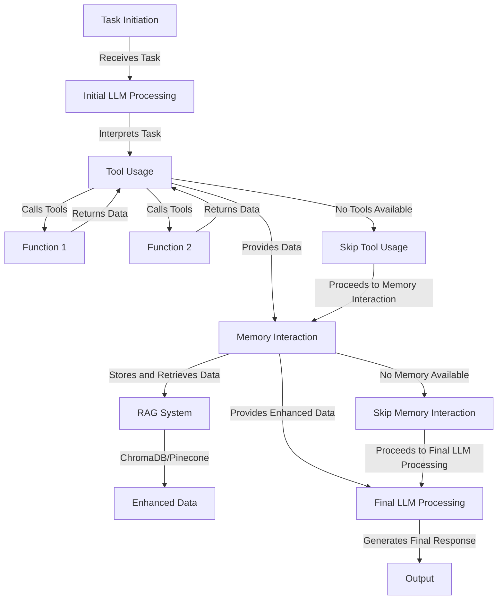

# `Agent`

Swarm Agent is a powerful autonomous agent framework designed to connect Language Models (LLMs) with various tools and long-term memory. This class provides the ability to ingest and process various types of documents such as PDFs, text files, Markdown files, JSON files, and more. The Agent structure offers a wide range of features to enhance the capabilities of LLMs and facilitate efficient task execution.

## Overview

The `Agent` class establishes a conversational loop with a language model, allowing for interactive task execution, feedback collection, and dynamic response generation. It includes features such as:

1. **Conversational Loop**: Enables back-and-forth interaction with the model.
2. **Feedback Collection**: Allows users to provide feedback on generated responses.
3. **Stoppable Conversation**: Supports custom stopping conditions for the conversation.
4. **Retry Mechanism**: Implements a retry system for handling issues in response generation.
5. **Tool Integration**: Supports the integration of various tools for enhanced capabilities.
6. **Long-term Memory Management**: Incorporates vector databases for efficient information retrieval.
7. **Document Ingestion**: Processes various document types for information extraction.
8. **Interactive Mode**: Allows real-time communication with the agent.
9. **Sentiment Analysis**: Evaluates the sentiment of generated responses.
10. **Output Filtering and Cleaning**: Ensures generated responses meet specific criteria.
11. **Asynchronous and Concurrent Execution**: Supports efficient parallelization of tasks.
12. **Planning and Reasoning**: Implements techniques like algorithm of thoughts for enhanced decision-making.


## Architecture




## `Agent` Attributes

| Attribute | Description |
|-----------|-------------|
| `id` | Unique identifier for the agent instance. |
| `llm` | Language model instance used by the agent. |
| `template` | Template used for formatting responses. |
| `max_loops` | Maximum number of loops the agent can run. |
| `stopping_condition` | Callable function determining when to stop looping. |
| `loop_interval` | Interval (in seconds) between loops. |
| `retry_attempts` | Number of retry attempts for failed LLM calls. |
| `retry_interval` | Interval (in seconds) between retry attempts. |
| `return_history` | Boolean indicating whether to return conversation history. |
| `stopping_token` | Token that stops the agent from looping when present in the response. |
| `dynamic_loops` | Boolean indicating whether to dynamically determine the number of loops. |
| `interactive` | Boolean indicating whether to run in interactive mode. |
| `dashboard` | Boolean indicating whether to display a dashboard. |
| `agent_name` | Name of the agent instance. |
| `agent_description` | Description of the agent instance. |
| `system_prompt` | System prompt used to initialize the conversation. |
| `tools` | List of callable functions representing tools the agent can use. |
| `dynamic_temperature_enabled` | Boolean indicating whether to dynamically adjust the LLM's temperature. |
| `sop` | Standard operating procedure for the agent. |
| `sop_list` | List of strings representing the standard operating procedure. |
| `saved_state_path` | File path for saving and loading the agent's state. |
| `autosave` | Boolean indicating whether to automatically save the agent's state. |
| `context_length` | Maximum length of the context window (in tokens) for the LLM. |
| `user_name` | Name used to represent the user in the conversation. |
| `self_healing_enabled` | Boolean indicating whether to attempt self-healing in case of errors. |
| `code_interpreter` | Boolean indicating whether to interpret and execute code snippets. |
| `multi_modal` | Boolean indicating whether to support multimodal inputs. |
| `pdf_path` | File path of a PDF document to be ingested. |
| `list_of_pdf` | List of file paths for PDF documents to be ingested. |
| `tokenizer` | Instance of a tokenizer used for token counting and management. |
| `long_term_memory` | Instance of a `BaseVectorDatabase` implementation for long-term memory management. |
| `preset_stopping_token` | Boolean indicating whether to use a preset stopping token. |
| `traceback` | Object used for traceback handling. |
| `traceback_handlers` | List of traceback handlers. |
| `streaming_on` | Boolean indicating whether to stream responses. |
| `docs` | List of document paths or contents to be ingested. |
| `docs_folder` | Path to a folder containing documents to be ingested. |
| `verbose` | Boolean indicating whether to print verbose output. |
| `parser` | Callable function used for parsing input data. |
| `best_of_n` | Integer indicating the number of best responses to generate. |
| `callback` | Callable function to be called after each agent loop. |
| `metadata` | Dictionary containing metadata for the agent. |
| `callbacks` | List of callable functions to be called during execution. |
| `logger_handler` | Handler for logging messages. |
| `search_algorithm` | Callable function for long-term memory retrieval. |
| `logs_to_filename` | File path for logging agent activities. |
| `evaluator` | Callable function for evaluating the agent's responses. |
| `stopping_func` | Callable function used as a stopping condition. |
| `custom_loop_condition` | Callable function used as a custom loop condition. |
| `sentiment_threshold` | Float value representing the sentiment threshold for evaluating responses. |
| `custom_exit_command` | String representing a custom command for exiting the agent's loop. |
| `sentiment_analyzer` | Callable function for sentiment analysis on outputs. |
| `limit_tokens_from_string` | Callable function for limiting the number of tokens in a string. |
| `custom_tools_prompt` | Callable function for generating a custom prompt for tool usage. |
| `tool_schema` | Data structure representing the schema for the agent's tools. |
| `output_type` | Type representing the expected output type of responses. |
| `function_calling_type` | String representing the type of function calling. |
| `output_cleaner` | Callable function for cleaning the agent's output. |
| `function_calling_format_type` | String representing the format type for function calling. |
| `list_base_models` | List of base models used for generating tool schemas. |
| `metadata_output_type` | String representing the output type for metadata. |
| `state_save_file_type` | String representing the file type for saving the agent's state. |
| `chain_of_thoughts` | Boolean indicating whether to use the chain of thoughts technique. |
| `algorithm_of_thoughts` | Boolean indicating whether to use the algorithm of thoughts technique. |
| `tree_of_thoughts` | Boolean indicating whether to use the tree of thoughts technique. |
| `tool_choice` | String representing the method for tool selection. |
| `execute_tool` | Boolean indicating whether to execute tools. |
| `rules` | String representing the rules for the agent's behavior. |
| `planning` | Boolean indicating whether to perform planning. |
| `planning_prompt` | String representing the prompt for planning. |
| `device` | String representing the device on which the agent should run. |
| `custom_planning_prompt` | String representing a custom prompt for planning. |
| `memory_chunk_size` | Integer representing the maximum size of memory chunks for long-term memory retrieval. |
| `agent_ops_on` | Boolean indicating whether agent operations should be enabled. |
| `return_step_meta` | Boolean indicating whether to return JSON of all steps and additional metadata. |
| `output_type` | Literal type indicating whether to output "string", "str", "list", "json", "dict", or "yaml". |
| `time_created` | Float representing the time the agent was created. |
| `tags` | Optional list of strings for tagging the agent. |
| `use_cases` | Optional list of dictionaries describing use cases for the agent. |
| `step_pool` | List of Step objects representing the agent's execution steps. |
| `print_every_step` | Boolean indicating whether to print every step of execution. |
| `agent_output` | ManySteps object containing the agent's output and metadata. |
| `executor_workers` | Integer representing the number of executor workers for concurrent operations. |
| `data_memory` | Optional callable for data memory operations. |
| `load_yaml_path` | String representing the path to a YAML file for loading configurations. |
| `auto_generate_prompt` | Boolean indicating whether to automatically generate prompts. |
| `rag_every_loop` | Boolean indicating whether to query RAG database for context on every loop |
| `plan_enabled` | Boolean indicating whether planning functionality is enabled |
| `artifacts_on` | Boolean indicating whether to save artifacts from agent execution |
| `artifacts_output_path` | File path where artifacts should be saved |
| `artifacts_file_extension` | File extension to use for saved artifacts |
| `device` | Device to run computations on ("cpu" or "gpu") |
| `all_cores` | Boolean indicating whether to use all CPU cores |
| `device_id` | ID of the GPU device to use if running on GPU |
| `scheduled_run_date` | Optional datetime for scheduling future agent runs |
| `expertise_areas` | List of areas the agent specializes in |
| `importance_threshold` | Minimum importance threshold for notifications |
| `notification_profile` | Profile containing notification preferences |


## `Agent` Methods

| Method | Description | Inputs | Usage Example |
|--------|-------------|--------|----------------|
| `run(task, img=None, is_last=False, device="cpu", device_id=0, all_cores=True, *args, **kwargs)` | Runs the autonomous agent loop to complete the given task. | `task` (str): The task to be performed.<br>`img` (str, optional): Path to an image file.<br>`is_last` (bool): Whether this is the last task.<br>`device` (str): Device to run on ("cpu" or "gpu").<br>`device_id` (int): ID of the GPU to use.<br>`all_cores` (bool): Whether to use all CPU cores.<br>`*args`, `**kwargs`: Additional arguments. | `response = agent.run("Generate a report on financial performance.")` |
| `__call__(task, img=None, *args, **kwargs)` | Alternative way to call the `run` method. | Same as `run`. | `response = agent("Generate a report on financial performance.")` |
| `parse_and_execute_tools(response, *args, **kwargs)` | Parses the agent's response and executes any tools mentioned in it. | `response` (str): The agent's response to be parsed.<br>`*args`, `**kwargs`: Additional arguments. | `agent.parse_and_execute_tools(response)` |
| `add_memory(message)` | Adds a message to the agent's memory. | `message` (str): The message to add. | `agent.add_memory("Important information")` |
| `plan(task, *args, **kwargs)` | Plans the execution of a task. | `task` (str): The task to plan.<br>`*args`, `**kwargs`: Additional arguments. | `agent.plan("Analyze market trends")` |
| `run_concurrent(task, *args, **kwargs)` | Runs a task concurrently. | `task` (str): The task to run.<br>`*args`, `**kwargs`: Additional arguments. | `response = await agent.run_concurrent("Concurrent task")` |
| `run_concurrent_tasks(tasks, *args, **kwargs)` | Runs multiple tasks concurrently. | `tasks` (List[str]): List of tasks to run.<br>`*args`, `**kwargs`: Additional arguments. | `responses = agent.run_concurrent_tasks(["Task 1", "Task 2"])` |
| `bulk_run(inputs)` | Generates responses for multiple input sets. | `inputs` (List[Dict[str, Any]]): List of input dictionaries. | `responses = agent.bulk_run([{"task": "Task 1"}, {"task": "Task 2"}])` |
| `save()` | Saves the agent's history to a file. | None | `agent.save()` |
| `load(file_path)` | Loads the agent's history from a file. | `file_path` (str): Path to the file. | `agent.load("agent_history.json")` |
| `graceful_shutdown()` | Gracefully shuts down the system, saving the state. | None | `agent.graceful_shutdown()` |
| `analyze_feedback()` | Analyzes the feedback for issues. | None | `agent.analyze_feedback()` |
| `undo_last()` | Undoes the last response and returns the previous state. | None | `previous_state, message = agent.undo_last()` |
| `add_response_filter(filter_word)` | Adds a response filter to filter out certain words. | `filter_word` (str): Word to filter. | `agent.add_response_filter("sensitive")` |
| `apply_response_filters(response)` | Applies response filters to the given response. | `response` (str): Response to filter. | `filtered_response = agent.apply_response_filters(response)` |
| `filtered_run(task)` | Runs a task with response filtering applied. | `task` (str): Task to run. | `response = agent.filtered_run("Generate a report")` |
| `save_to_yaml(file_path)` | Saves the agent to a YAML file. | `file_path` (str): Path to save the YAML file. | `agent.save_to_yaml("agent_config.yaml")` |
| `get_llm_parameters()` | Returns the parameters of the language model. | None | `llm_params = agent.get_llm_parameters()` |
| `save_state(file_path, *args, **kwargs)` | Saves the current state of the agent to a JSON file. | `file_path` (str): Path to save the JSON file.<br>`*args`, `**kwargs`: Additional arguments. | `agent.save_state("agent_state.json")` |
| `update_system_prompt(system_prompt)` | Updates the system prompt. | `system_prompt` (str): New system prompt. | `agent.update_system_prompt("New system instructions")` |
| `update_max_loops(max_loops)` | Updates the maximum number of loops. | `max_loops` (int): New maximum number of loops. | `agent.update_max_loops(5)` |
| `update_loop_interval(loop_interval)` | Updates the loop interval. | `loop_interval` (int): New loop interval. | `agent.update_loop_interval(2)` |
| `update_retry_attempts(retry_attempts)` | Updates the number of retry attempts. | `retry_attempts` (int): New number of retry attempts. | `agent.update_retry_attempts(3)` |
| `update_retry_interval(retry_interval)` | Updates the retry interval. | `retry_interval` (int): New retry interval. | `agent.update_retry_interval(5)` |
| `reset()` | Resets the agent's memory. | None | `agent.reset()` |
| `ingest_docs(docs, *args, **kwargs)` | Ingests documents into the agent's memory. | `docs` (List[str]): List of document paths.<br>`*args`, `**kwargs`: Additional arguments. | `agent.ingest_docs(["doc1.pdf", "doc2.txt"])` |
| `ingest_pdf(pdf)` | Ingests a PDF document into the agent's memory. | `pdf` (str): Path to the PDF file. | `agent.ingest_pdf("document.pdf")` |
| `receive_message(name, message)` | Receives a message and adds it to the agent's memory. | `name` (str): Name of the sender.<br>`message` (str): Content of the message. | `agent.receive_message("User", "Hello, agent!")` |
| `send_agent_message(agent_name, message, *args, **kwargs)` | Sends a message from the agent to a user. | `agent_name` (str): Name of the agent.<br>`message` (str): Message to send.<br>`*args`, `**kwargs`: Additional arguments. | `response = agent.send_agent_message("AgentX", "Task completed")` |
| `add_tool(tool)` | Adds a tool to the agent's toolset. | `tool` (Callable): Tool to add. | `agent.add_tool(my_custom_tool)` |
| `add_tools(tools)` | Adds multiple tools to the agent's toolset. | `tools` (List[Callable]): List of tools to add. | `agent.add_tools([tool1, tool2])` |
| `remove_tool(tool)` | Removes a tool from the agent's toolset. || Method | Description | Inputs | Usage Example |
|--------|-------------|--------|----------------|
| `remove_tool(tool)` | Removes a tool from the agent's toolset. | `tool` (Callable): Tool to remove. | `agent.remove_tool(my_custom_tool)` |
| `remove_tools(tools)` | Removes multiple tools from the agent's toolset. | `tools` (List[Callable]): List of tools to remove. | `agent.remove_tools([tool1, tool2])` |
| `get_docs_from_doc_folders()` | Retrieves and processes documents from the specified folder. | None | `agent.get_docs_from_doc_folders()` |
| `check_end_session_agentops()` | Checks and ends the AgentOps session if enabled. | None | `agent.check_end_session_agentops()` |
| `memory_query(task, *args, **kwargs)` | Queries the long-term memory for relevant information. | `task` (str): The task or query.<br>`*args`, `**kwargs`: Additional arguments. | `result = agent.memory_query("Find information about X")` |
| `sentiment_analysis_handler(response)` | Performs sentiment analysis on the given response. | `response` (str): The response to analyze. | `agent.sentiment_analysis_handler("Great job!")` |
| `count_and_shorten_context_window(history, *args, **kwargs)` | Counts tokens and shortens the context window if necessary. | `history` (str): The conversation history.<br>`*args`, `**kwargs`: Additional arguments. | `shortened_history = agent.count_and_shorten_context_window(history)` |
| `output_cleaner_and_output_type(response, *args, **kwargs)` | Cleans and formats the output based on specified type. | `response` (str): The response to clean and format.<br>`*args`, `**kwargs`: Additional arguments. | `cleaned_response = agent.output_cleaner_and_output_type(response)` |
| `stream_response(response, delay=0.001)` | Streams the response token by token. | `response` (str): The response to stream.<br>`delay` (float): Delay between tokens. | `agent.stream_response("This is a streamed response")` |
| `dynamic_context_window()` | Dynamically adjusts the context window. | None | `agent.dynamic_context_window()` |
| `check_available_tokens()` | Checks and returns the number of available tokens. | None | `available_tokens = agent.check_available_tokens()` |
| `tokens_checks()` | Performs token checks and returns available tokens. | None | `token_info = agent.tokens_checks()` |
| `truncate_string_by_tokens(input_string, limit)` | Truncates a string to fit within a token limit. | `input_string` (str): String to truncate.<br>`limit` (int): Token limit. | `truncated_string = agent.truncate_string_by_tokens("Long string", 100)` |
| `tokens_operations(input_string)` | Performs various token-related operations on the input string. | `input_string` (str): String to process. | `processed_string = agent.tokens_operations("Input string")` |
| `parse_function_call_and_execute(response)` | Parses a function call from the response and executes it. | `response` (str): Response containing the function call. | `result = agent.parse_function_call_and_execute(response)` |
| `activate_agentops()` | Activates AgentOps functionality. | None | `agent.activate_agentops()` |
| `llm_output_parser(response)` | Parses the output from the language model. | `response` (Any): Response from the LLM. | `parsed_response = agent.llm_output_parser(llm_output)` |
| `log_step_metadata(loop, task, response)` | Logs metadata for each step of the agent's execution. | `loop` (int): Current loop number.<br>`task` (str): Current task.<br>`response` (str): Agent's response. | `agent.log_step_metadata(1, "Analyze data", "Analysis complete")` |
| `to_dict()` | Converts the agent's attributes to a dictionary. | None | `agent_dict = agent.to_dict()` |
| `to_json(indent=4, *args, **kwargs)` | Converts the agent's attributes to a JSON string. | `indent` (int): Indentation for JSON.<br>`*args`, `**kwargs`: Additional arguments. | `agent_json = agent.to_json()` |
| `to_yaml(indent=4, *args, **kwargs)` | Converts the agent's attributes to a YAML string. | `indent` (int): Indentation for YAML.<br>`*args`, `**kwargs`: Additional arguments. | `agent_yaml = agent.to_yaml()` |
| `to_toml(*args, **kwargs)` | Converts the agent's attributes to a TOML string. | `*args`, `**kwargs`: Additional arguments. | `agent_toml = agent.to_toml()` |
| `model_dump_json()` | Saves the agent model to a JSON file in the workspace directory. | None | `agent.model_dump_json()` |
| `model_dump_yaml()` | Saves the agent model to a YAML file in the workspace directory. | None | `agent.model_dump_yaml()` |
| `log_agent_data()` | Logs the agent's data to an external API. | None | `agent.log_agent_data()` |
| `handle_tool_schema_ops()` | Handles operations related to tool schemas. | None | `agent.handle_tool_schema_ops()` |
| `call_llm(task, *args, **kwargs)` | Calls the appropriate method on the language model. | `task` (str): Task for the LLM.<br>`*args`, `**kwargs`: Additional arguments. | `response = agent.call_llm("Generate text")` |
| `handle_sop_ops()` | Handles operations related to standard operating procedures. | None | `agent.handle_sop_ops()` |
| `agent_output_type(responses)` | Processes and returns the agent's output based on the specified output type. | `responses` (list): List of responses. | `formatted_output = agent.agent_output_type(responses)` |
| `check_if_no_prompt_then_autogenerate(task)` | Checks if a system prompt is not set and auto-generates one if needed. | `task` (str): The task to use for generating a prompt. | `agent.check_if_no_prompt_then_autogenerate("Analyze data")` |
| `check_if_no_prompt_then_autogenerate(task)` | Checks if auto_generate_prompt is enabled and generates a prompt by combining agent name, description and system prompt | `task` (str, optional): Task to use as fallback | `agent.check_if_no_prompt_then_autogenerate("Analyze data")` |
| `handle_artifacts(response, output_path, extension)` | Handles saving artifacts from agent execution | `response` (str): Agent response<br>`output_path` (str): Output path<br>`extension` (str): File extension | `agent.handle_artifacts(response, "outputs/", ".txt")` |
| `update_notification_preferences` | Update agent's notification preferences | `expertise_areas`: List[str]<br>`importance_threshold`: float | `agent.update_notification_preferences(expertise_areas=["finance"])` |
| `handle_vector_db_update` | Handle notification of vector DB update | `update_metadata`: UpdateMetadata | `agent.handle_vector_db_update(update)` |


## Updated Run Method

Update the run method documentation to include new parameters:

| Method | Description | Inputs | Usage Example |
|--------|-------------|--------|----------------|
| `run(task, img=None, is_last=False, device="cpu", device_id=0, all_cores=True, scheduled_run_date=None)` | Runs the agent with specified parameters | `task` (str): Task to run<br>`img` (str, optional): Image path<br>`is_last` (bool): If this is last task<br>`device` (str): Device to use<br>`device_id` (int): GPU ID<br>`all_cores` (bool): Use all CPU cores<br>`scheduled_run_date` (datetime, optional): Future run date | `agent.run("Analyze data", device="gpu", device_id=0)` |


## Getting Started

To use the Swarm Agent, first install the required dependencies:

```bash
pip3 install -U swarms
```

Then, you can initialize and use the agent as follows:

```python
import os
from swarms import Agent
from swarm_models import OpenAIChat
from swarms.prompts.finance_agent_sys_prompt import FINANCIAL_AGENT_SYS_PROMPT

# Get the OpenAI API key from the environment variable
api_key = os.getenv("OPENAI_API_KEY")

# Create an instance of the OpenAIChat class
model = OpenAIChat(
    api_key=api_key, model_name="gpt-4-0613", temperature=0.1
)

# Initialize the agent
agent = Agent(
    agent_name="Financial-Analysis-Agent",
    system_prompt=FINANCIAL_AGENT_SYS_PROMPT,
    llm=model,
    max_loops=1,
    autosave=True,
    dashboard=False,
    verbose=True,
    dynamic_temperature_enabled=True,
    saved_state_path="finance_agent.json",
    user_name="swarms_corp",
    retry_attempts=1,
    context_length=200000,
    return_step_meta=False,
    output_type="str",
)

# Run the agent
response = agent.run(
    "How can I establish a ROTH IRA to buy stocks and get a tax break? What are the criteria?"
)
print(response)
```

## Advanced Usage

### Tool Integration

To integrate tools with the Swarm `Agent`, you can pass a list of callable functions with types and doc strings to the `tools` parameter when initializing the `Agent` instance. The agent will automatically convert these functions into an OpenAI function calling schema and make them available for use during task execution.

## Requirements for a tool
- Function
  - With types
  - with doc strings

```python
from swarms import Agent
from swarm_models import OpenAIChat
import subprocess

def terminal(code: str):
    """
    Run code in the terminal.

    Args:
        code (str): The code to run in the terminal.

    Returns:
        str: The output of the code.
    """
    out = subprocess.run(code, shell=True, capture_output=True, text=True).stdout
    return str(out)

# Initialize the agent with a tool
agent = Agent(
    agent_name="Terminal-Agent",
    llm=OpenAIChat(api_key=os.getenv("OPENAI_API_KEY")),
    tools=[terminal],
    system_prompt="You are an agent that can execute terminal commands. Use the tools provided to assist the user.",
)

# Run the agent
response = agent.run("List the contents of the current directory")
print(response)
```

### Long-term Memory Management

The Swarm Agent supports integration with vector databases for long-term memory management. Here's an example using ChromaDB:

```python
from swarms import Agent
from swarm_models import Anthropic
from swarms_memory import ChromaDB

# Initialize ChromaDB
chromadb = ChromaDB(
    metric="cosine",
    output_dir="finance_agent_rag",
)

# Initialize the agent with long-term memory
agent = Agent(
    agent_name="Financial-Analysis-Agent",
    llm=Anthropic(anthropic_api_key=os.getenv("ANTHROPIC_API_KEY")),
    long_term_memory=chromadb,
    system_prompt="You are a financial analysis agent with access to long-term memory.",
)

# Run the agent
response = agent.run("What are the components of a startup's stock incentive equity plan?")
print(response)
```

### Interactive Mode

To enable interactive mode, set the `interactive` parameter to `True` when initializing the `Agent`:

```python
agent = Agent(
    agent_name="Interactive-Agent",
    llm=OpenAIChat(api_key=os.getenv("OPENAI_API_KEY")),
    interactive=True,
    system_prompt="You are an interactive agent. Engage in a conversation with the user.",
)

# Run the agent in interactive mode
agent.run("Let's start a conversation")
```

### Sentiment Analysis

To perform sentiment analysis on the agent's outputs, you can provide a sentiment analyzer function:

```python
from textblob import TextBlob

def sentiment_analyzer(text):
    analysis = TextBlob(text)
    return analysis.sentiment.polarity

agent = Agent(
    agent_name="Sentiment-Analysis-Agent",
    llm=OpenAIChat(api_key=os.getenv("OPENAI_API_KEY")),
    sentiment_analyzer=sentiment_analyzer,
    sentiment_threshold=0.5,
    system_prompt="You are an agent that generates responses with sentiment analysis.",
)

response = agent.run("Generate a positive statement about AI")
print(response)
```


### Undo Functionality

```python
# Feature 2: Undo functionality
response = agent.run("Another task")
print(f"Response: {response}")
previous_state, message = agent.undo_last()
print(message)
```

### Response Filtering

```python
# Feature 3: Response filtering
agent.add_response_filter("report")
response = agent.filtered_run("Generate a report on finance")
print(response)
```

### Saving and Loading State

```python
# Save the agent state
agent.save_state('saved_flow.json')

# Load the agent state
agent = Agent(llm=llm_instance, max_loops=5)
agent.load('saved_flow.json')
agent.run("Continue with the task")
```

### Async and Concurrent Execution

```python
# Run a task concurrently
response = await agent.run_concurrent("Concurrent task")
print(response)

# Run multiple tasks concurrently
tasks = [
    {"task": "Task 1"},
    {"task": "Task 2", "img": "path/to/image.jpg"},
    {"task": "Task 3", "custom_param": 42}
]
responses = agent.bulk_run(tasks)
print(responses)
```


### Various other settings

```python
# # Convert the agent object to a dictionary
print(agent.to_dict())
print(agent.to_toml())
print(agent.model_dump_json())
print(agent.model_dump_yaml())

# Ingest documents into the agent's knowledge base
agent.ingest_docs("your_pdf_path.pdf")

# Receive a message from a user and process it
agent.receive_message(name="agent_name", message="message")

# Send a message from the agent to a user
agent.send_agent_message(agent_name="agent_name", message="message")

# Ingest multiple documents into the agent's knowledge base
agent.ingest_docs("your_pdf_path.pdf", "your_csv_path.csv")

# Run the agent with a filtered system prompt
agent.filtered_run(
    "How can I establish a ROTH IRA to buy stocks and get a tax break? What are the criteria?"
)

# Run the agent with multiple system prompts
agent.bulk_run(
    [
        "How can I establish a ROTH IRA to buy stocks and get a tax break? What are the criteria?",
        "Another system prompt",
    ]
)

# Add a memory to the agent
agent.add_memory("Add a memory to the agent")

# Check the number of available tokens for the agent
agent.check_available_tokens()

# Perform token checks for the agent
agent.tokens_checks()

# Print the dashboard of the agent
agent.print_dashboard()


# Fetch all the documents from the doc folders
agent.get_docs_from_doc_folders()

# Activate agent ops
agent.activate_agentops()
agent.check_end_session_agentops()

# Dump the model to a JSON file
agent.model_dump_json()
print(agent.to_toml())
```

## Auto Generate Prompt + CPU Execution


```python

import os
from swarms import Agent
from swarm_models import OpenAIChat

from dotenv import load_dotenv

# Load environment variables
load_dotenv()

# Retrieve the OpenAI API key from the environment variable
api_key = os.getenv("GROQ_API_KEY")

# Initialize the model for OpenAI Chat
model = OpenAIChat(
    openai_api_base="https://api.groq.com/openai/v1",
    openai_api_key=api_key,
    model_name="llama-3.1-70b-versatile",
    temperature=0.1,
)

# Initialize the agent with automated prompt engineering enabled
agent = Agent(
    agent_name="Financial-Analysis-Agent",
    system_prompt=None,  # System prompt is dynamically generated
    agent_description=None,
    llm=model,
    max_loops=1,
    autosave=True,
    dashboard=False,
    verbose=False,
    dynamic_temperature_enabled=True,
    saved_state_path="finance_agent.json",
    user_name="Human:",
    return_step_meta=False,
    output_type="string",
    streaming_on=False,
    auto_generate_prompt=True,  # Enable automated prompt engineering
)

# Run the agent with a task description and specify the device
agent.run(
    "How can I establish a ROTH IRA to buy stocks and get a tax break? What are the criteria",
    ## Will design a system prompt based on the task if description and system prompt are None
    device="cpu",
)

# Print the dynamically generated system prompt
print(agent.system_prompt)


```

## Best Practices

1. Always provide a clear and concise `system_prompt` to guide the agent's behavior.
2. Use `tools` to extend the agent's capabilities for specific tasks.
3. Implement error handling and utilize the `retry_attempts` feature for robust execution.
4. Leverage `long_term_memory` for tasks that require persistent information.
5. Use `interactive` mode for real-time conversations and `dashboard` for monitoring.
6. Implement `sentiment_analysis` for applications requiring tone management.
7. Utilize `autosave` and `save`/`load` methods for continuity across sessions.
8. Optimize token usage with `dynamic_context_window` and `tokens_checks` methods.
9. Use `concurrent` and `async` methods for performance-critical applications.
10. Regularly review and analyze feedback using the `analyze_feedback` method.
11. Use `artifacts_on` to save important outputs from agent execution
12. Configure `device` and `device_id` appropriately for optimal performance
13. Enable `rag_every_loop` when continuous context from long-term memory is needed
14. Use `scheduled_run_date` for automated task scheduling

By following these guidelines and leveraging the Swarm Agent's extensive features, you can create powerful, flexible, and efficient autonomous agents for a wide range of applications.

## Notification Example
 ```python
 from swarms import Agent
 from swarms.structs.notification_manager import UpdateMetadata
 from datetime import datetime
 
 # Create agent with notification preferences
 agent = Agent(
     agent_name="FinancialAgent",
     expertise_areas=["finance", "stocks", "trading"],
     importance_threshold=0.6
 )
 
 # Update notification preferences
 agent.update_notification_preferences(
     expertise_areas=["finance", "cryptocurrency"],
     importance_threshold=0.7
 )
 
 # Handle vector DB update
 update = UpdateMetadata(
     topic="crypto_market",
     importance=0.8,
     timestamp=datetime.now(),
     affected_areas=["cryptocurrency", "trading"]
 )
 agent.handle_vector_db_update(update) ```