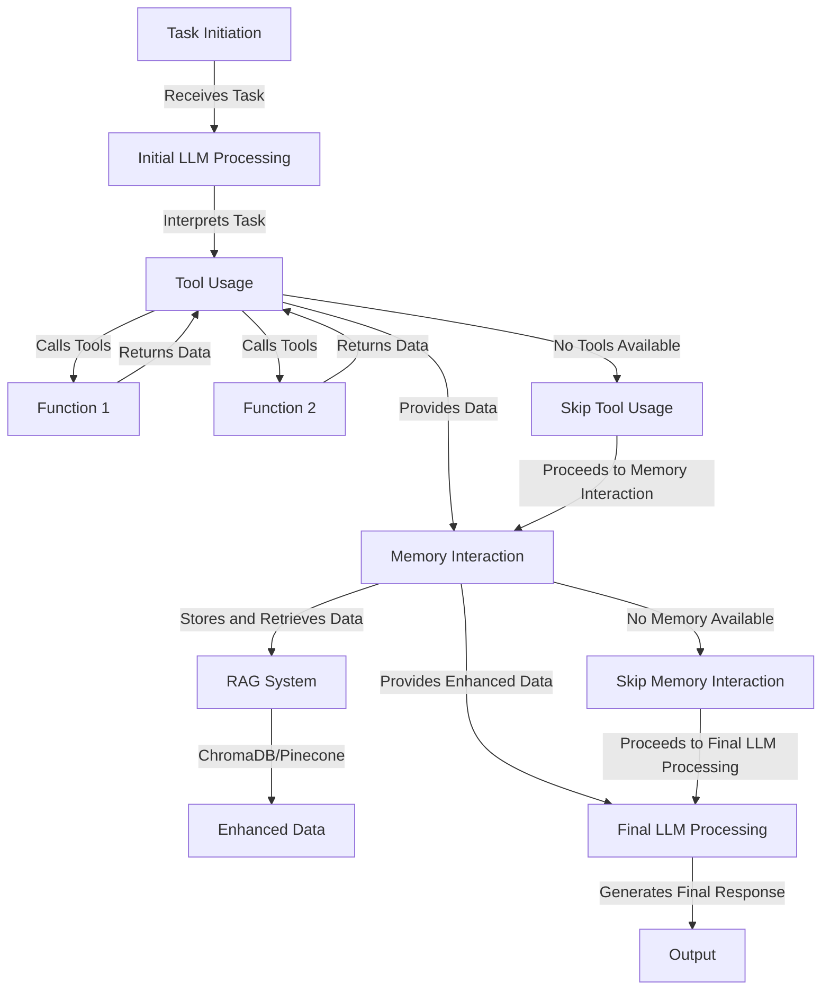

# `Agent` Structure Reference Documentation



The `Agent` class is the core component of the Swarm Agent framework. It serves as an autonomous agent that bridges Language Models (LLMs) with external tools and long-term memory systems. The class is designed to handle a variety of document types—including PDFs, text files, Markdown, and JSON—enabling robust document ingestion and processing. By integrating these capabilities, the `Agent` class empowers LLMs to perform complex tasks, utilize external resources, and manage information efficiently, making it a versatile solution for advanced autonomous workflows.


## Features
The `Agent` class establishes a conversational loop with a language model, allowing for interactive task execution, feedback collection, and dynamic response generation. It includes features such as:

| Feature                                 | Description                                                                                      |
|------------------------------------------|--------------------------------------------------------------------------------------------------|
| **Conversational Loop**                  | Enables back-and-forth interaction with the model.                                               |
| **Feedback Collection**                  | Allows users to provide feedback on generated responses.                                         |
| **Stoppable Conversation**               | Supports custom stopping conditions for the conversation.                                        |
| **Retry Mechanism**                      | Implements a retry system for handling issues in response generation.                            |
| **Tool Integration**                     | Supports the integration of various tools for enhanced capabilities.                             |
| **Long-term Memory Management**          | Incorporates vector databases for efficient information retrieval.                               |
| **Document Ingestion**                   | Processes various document types for information extraction.                                     |
| **Interactive Mode**                     | Allows real-time communication with the agent.                                                   |
| **Sentiment Analysis**                   | Evaluates the sentiment of generated responses.                                                  |
| **Output Filtering and Cleaning**        | Ensures generated responses meet specific criteria.                                              |
| **Asynchronous and Concurrent Execution**| Supports efficient parallelization of tasks.                                                     |
| **Planning and Reasoning**               | Implements techniques like algorithm of thoughts for enhanced decision-making.                   |


## `Agent` Attributes

| Attribute | Type | Description |
|-----------|------|-------------|
| `id` | `Optional[str]` | Unique identifier for the agent instance. |
| `llm` | `Optional[Any]` | Language model instance used by the agent. |
| `template` | `Optional[str]` | Template used for formatting responses. |
| `max_loops` | `Optional[Union[int, str]]` | Maximum number of loops the agent can run. |
| `stopping_condition` | `Optional[Callable[[str], bool]]` | Callable function determining when to stop looping. |
| `loop_interval` | `Optional[int]` | Interval (in seconds) between loops. |
| `retry_attempts` | `Optional[int]` | Number of retry attempts for failed LLM calls. |
| `retry_interval` | `Optional[int]` | Interval (in seconds) between retry attempts. |
| `return_history` | `Optional[bool]` | Boolean indicating whether to return conversation history. |
| `stopping_token` | `Optional[str]` | Token that stops the agent from looping when present in the response. |
| `dynamic_loops` | `Optional[bool]` | Boolean indicating whether to dynamically determine the number of loops. |
| `interactive` | `Optional[bool]` | Boolean indicating whether to run in interactive mode. |
| `dashboard` | `Optional[bool]` | Boolean indicating whether to display a dashboard. |
| `agent_name` | `Optional[str]` | Name of the agent instance. |
| `agent_description` | `Optional[str]` | Description of the agent instance. |
| `system_prompt` | `Optional[str]` | System prompt used to initialize the conversation. |
| `tools` | `List[Callable]` | List of callable functions representing tools the agent can use. |
| `dynamic_temperature_enabled` | `Optional[bool]` | Boolean indicating whether to dynamically adjust the LLM's temperature. |
| `sop` | `Optional[str]` | Standard operating procedure for the agent. |
| `sop_list` | `Optional[List[str]]` | List of strings representing the standard operating procedure. |
| `saved_state_path` | `Optional[str]` | File path for saving and loading the agent's state. |
| `autosave` | `Optional[bool]` | Boolean indicating whether to automatically save the agent's state. |
| `context_length` | `Optional[int]` | Maximum length of the context window (in tokens) for the LLM. |
| `transforms` | `Optional[Union[TransformConfig, dict]]` | Message transformation configuration for handling context limits. |
| `user_name` | `Optional[str]` | Name used to represent the user in the conversation. |
| `self_healing_enabled` | `Optional[bool]` | Boolean indicating whether to attempt self-healing in case of errors. |
| `code_interpreter` | `Optional[bool]` | Boolean indicating whether to interpret and execute code snippets. |
| `multi_modal` | `Optional[bool]` | Boolean indicating whether to support multimodal inputs. |
| `pdf_path` | `Optional[str]` | File path of a PDF document to be ingested. |
| `list_of_pdf` | `Optional[str]` | List of file paths for PDF documents to be ingested. |
| `tokenizer` | `Optional[Any]` | Instance of a tokenizer used for token counting and management. |
| `long_term_memory` | `Optional[Union[Callable, Any]]` | Instance of a `BaseVectorDatabase` implementation for long-term memory management. |
| `fallback_model_name` | `Optional[str]` | The fallback model name to use if primary model fails. |
| `fallback_models` | `Optional[List[str]]` | List of model names to try in order. First model is primary, rest are fallbacks. |
| `preset_stopping_token` | `Optional[bool]` | Boolean indicating whether to use a preset stopping token. |
| `traceback` | `Optional[Any]` | Object used for traceback handling. |
| `traceback_handlers` | `Optional[Any]` | List of traceback handlers. |
| `streaming_on` | `Optional[bool]` | Boolean indicating whether to stream responses. |
| `stream` | `Optional[bool]` | Boolean indicating whether to enable detailed token-by-token streaming with metadata. |
| `streaming_callback` | `Optional[Callable[[str], None]]` | Callback function to receive streaming tokens in real-time. |
| `docs` | `List[str]` | List of document paths or contents to be ingested. |
| `docs_folder` | `Optional[str]` | Path to a folder containing documents to be ingested. |
| `verbose` | `Optional[bool]` | Boolean indicating whether to print verbose output. |
| `parser` | `Optional[Callable]` | Callable function used for parsing input data. |
| `best_of_n` | `Optional[int]` | Integer indicating the number of best responses to generate. |
| `callback` | `Optional[Callable]` | Callable function to be called after each agent loop. |
| `metadata` | `Optional[Dict[str, Any]]` | Dictionary containing metadata for the agent. |
| `callbacks` | `Optional[List[Callable]]` | List of callable functions to be called during execution. |
| `handoffs` | `Optional[Union[Sequence[Callable], Any]]` | List of Agent instances that can be delegated tasks to. When provided, the agent will use a MultiAgentRouter to intelligently route tasks to the most appropriate specialized agent. |
| `capabilities` | `Optional[List[str]]` | List of strings describing the agent's capabilities. |
| `mode` | `Literal["interactive", "fast", "standard"]` | Execution mode: "interactive" for real-time interaction, "fast" for optimized performance, "standard" for default behavior. |
| `publish_to_marketplace` | `bool` | Boolean indicating whether to publish the agent's prompt to the Swarms marketplace. |
| `marketplace_prompt_id` | `Optional[str]` | Unique UUID identifier of a prompt from the Swarms marketplace. When provided, the agent will automatically fetch and load the prompt as the system prompt. |
| `search_algorithm` | `Optional[Callable]` | Callable function for long-term memory retrieval. |
| `logs_to_filename` | `Optional[str]` | File path for logging agent activities. |
| `evaluator` | `Optional[Callable]` | Callable function for evaluating the agent's responses. |
| `stopping_func` | `Optional[Callable]` | Callable function used as a stopping condition. |
| `custom_loop_condition` | `Optional[Callable]` | Callable function used as a custom loop condition. |
| `sentiment_threshold` | `Optional[float]` | Float value representing the sentiment threshold for evaluating responses. |
| `custom_exit_command` | `Optional[str]` | String representing a custom command for exiting the agent's loop. |
| `sentiment_analyzer` | `Optional[Callable]` | Callable function for sentiment analysis on outputs. |
| `limit_tokens_from_string` | `Optional[Callable]` | Callable function for limiting the number of tokens in a string. |
| `custom_tools_prompt` | `Optional[Callable]` | Callable function for generating a custom prompt for tool usage. |
| `tool_schema` | `ToolUsageType` | Data structure representing the schema for the agent's tools. |
| `output_type` | `OutputType` | Type representing the expected output type of responses. |
| `function_calling_type` | `str` | String representing the type of function calling. |
| `output_cleaner` | `Optional[Callable]` | Callable function for cleaning the agent's output. |
| `function_calling_format_type` | `Optional[str]` | String representing the format type for function calling. |
| `list_base_models` | `Optional[List[BaseModel]]` | List of base models used for generating tool schemas. |
| `metadata_output_type` | `str` | String representing the output type for metadata. |
| `state_save_file_type` | `str` | String representing the file type for saving the agent's state. |
| `chain_of_thoughts` | `bool` | Boolean indicating whether to use the chain of thoughts technique. |
| `algorithm_of_thoughts` | `bool` | Boolean indicating whether to use the algorithm of thoughts technique. |
| `tree_of_thoughts` | `bool` | Boolean indicating whether to use the tree of thoughts technique. |
| `tool_choice` | `str` | String representing the method for tool selection. |
| `execute_tool` | `bool` | Boolean indicating whether to execute tools. |
| `rules` | `str` | String representing the rules for the agent's behavior. |
| `planning` | `Optional[str]` | Boolean indicating whether to perform planning. |
| `planning_prompt` | `Optional[str]` | String representing the prompt for planning. |
| `device` | `str` | String representing the device on which the agent should run. |
| `custom_planning_prompt` | `str` | String representing a custom prompt for planning. |
| `memory_chunk_size` | `int` | Integer representing the maximum size of memory chunks for long-term memory retrieval. |
| `agent_ops_on` | `bool` | Boolean indicating whether agent operations should be enabled. |
| `return_step_meta` | `Optional[bool]` | Boolean indicating whether to return JSON of all steps and additional metadata. |
| `time_created` | `Optional[str]` | Float representing the time the agent was created. |
| `tags` | `Optional[List[str]]` | Optional list of strings for tagging the agent. |
| `use_cases` | `Optional[List[Dict[str, str]]]` | Optional list of dictionaries describing use cases for the agent. |
| `step_pool` | `List[Step]` | List of Step objects representing the agent's execution steps. |
| `print_every_step` | `Optional[bool]` | Boolean indicating whether to print every step of execution. |
| `agent_output` | `ManySteps` | ManySteps object containing the agent's output and metadata. |
| `data_memory` | `Optional[Callable]` | Optional callable for data memory operations. |
| `load_yaml_path` | `str` | String representing the path to a YAML file for loading configurations. |
| `auto_generate_prompt` | `bool` | Boolean indicating whether to automatically generate prompts. |
| `rag_every_loop` | `bool` | Boolean indicating whether to query RAG database for context on every loop |
| `plan_enabled` | `bool` | Boolean indicating whether planning functionality is enabled |
| `artifacts_on` | `bool` | Boolean indicating whether to save artifacts from agent execution |
| `artifacts_output_path` | `str` | File path where artifacts should be saved |
| `artifacts_file_extension` | `str` | File extension to use for saved artifacts |
| `all_cores` | `bool` | Boolean indicating whether to use all CPU cores |
| `device_id` | `int` | ID of the GPU device to use if running on GPU |
| `scheduled_run_date` | `Optional[datetime]` | Optional datetime for scheduling future agent runs |
| `do_not_use_cluster_ops` | `bool` | Boolean indicating whether to avoid cluster operations |
| `all_gpus` | `bool` | Boolean indicating whether to use all available GPUs |
| `model_name` | `str` | String representing the name of the model to use |
| `llm_args` | `dict` | Dictionary containing additional arguments for the LLM |
| `load_state_path` | `str` | String representing the path to load state from |
| `role` | `agent_roles` | String representing the role of the agent (e.g., "worker") |
| `print_on` | `bool` | Boolean indicating whether to print output |
| `tools_list_dictionary` | `Optional[List[Dict[str, Any]]]` | List of dictionaries representing tool schemas |
| `mcp_url` | `Optional[Union[str, MCPConnection]]` | String or MCPConnection representing the MCP server URL |
| `mcp_urls` | `List[str]` | List of strings representing multiple MCP server URLs |
| `react_on` | `bool` | Boolean indicating whether to enable ReAct reasoning |
| `safety_prompt_on` | `bool` | Boolean indicating whether to enable safety prompts |
| `random_models_on` | `bool` | Boolean indicating whether to randomly select models |
| `mcp_config` | `Optional[MCPConnection]` | MCPConnection object containing MCP configuration |
| `mcp_configs` | `Optional[MultipleMCPConnections]` | MultipleMCPConnections object for managing multiple MCP server connections |
| `top_p` | `Optional[float]` | Float representing the top-p sampling parameter |
| `conversation_schema` | `Optional[ConversationSchema]` | ConversationSchema object for conversation formatting |
| `llm_base_url` | `Optional[str]` | String representing the base URL for the LLM API |
| `llm_api_key` | `Optional[str]` | String representing the API key for the LLM |
| `tool_call_summary` | `bool` | Boolean indicating whether to summarize tool calls |
| `output_raw_json_from_tool_call` | `bool` | Boolean indicating whether to output raw JSON from tool calls |
| `summarize_multiple_images` | `bool` | Boolean indicating whether to summarize multiple image outputs |
| `tool_retry_attempts` | `int` | Integer representing the number of retry attempts for tool execution |
| `reasoning_prompt_on` | `bool` | Boolean indicating whether to enable reasoning prompts |
| `reasoning_effort` | `Optional[str]` | Reasoning effort level for reasoning-enabled models (e.g., "low", "medium", "high") |
| `reasoning_enabled` | `bool` | Boolean indicating whether to enable reasoning capabilities |
| `thinking_tokens` | `Optional[int]` | Maximum number of thinking tokens for reasoning models |
| `drop_params` | `bool` | Boolean indicating whether to drop parameters during processing |
| `dynamic_context_window` | `bool` | Boolean indicating whether to dynamically adjust context window |
| `show_tool_execution_output` | `bool` | Boolean indicating whether to show tool execution output |
| `created_at` | `float` | Float representing the timestamp when the agent was created |
| `workspace_dir` | `str` | String representing the workspace directory for the agent |
| `timeout` | `Optional[int]` | Integer representing the timeout for operations in seconds |
| `temperature` | `float` | Float representing the temperature for the LLM |
| `max_tokens` | `int` | Integer representing the maximum number of tokens |
| `frequency_penalty` | `float` | Float representing the frequency penalty |
| `presence_penalty` | `float` | Float representing the presence penalty |
| `tool_system_prompt` | `str` | String representing the system prompt for tools |
| `log_directory` | `str` | String representing the directory for logs |

## `Agent` Methods

| Method | Description | Inputs | Usage Example |
|--------|-------------|--------|----------------|
| `run(task, img=None, imgs=None, correct_answer=None, streaming_callback=None, *args, **kwargs)` | Runs the autonomous agent loop to complete the given task with enhanced parameters. | `task` (str): The task to be performed.<br>`img` (str, optional): Path to a single image file.<br>`imgs` (List[str], optional): List of image paths for batch processing.<br>`correct_answer` (str, optional): Expected correct answer for validation with automatic retries.<br>`streaming_callback` (Callable, optional): Callback function for real-time token streaming.<br>`*args`, `**kwargs`: Additional arguments. | `response = agent.run("Generate a report on financial performance.")` |
| `run_batched(tasks, imgs=None, *args, **kwargs)` | Runs multiple tasks concurrently in batch mode. | `tasks` (List[str]): List of tasks to run.<br>`imgs` (List[str], optional): List of images to process.<br>`*args`, `**kwargs`: Additional arguments. | `responses = agent.run_batched(["Task 1", "Task 2"])` |
| `run_multiple_images(task, imgs, *args, **kwargs)` | Runs the agent with multiple images using concurrent processing. | `task` (str): The task to perform on each image.<br>`imgs` (List[str]): List of image paths or URLs.<br>`*args`, `**kwargs`: Additional arguments. | `outputs = agent.run_multiple_images("Describe image", ["img1.jpg", "img2.png"])` |
| `continuous_run_with_answer(task, img=None, correct_answer=None, max_attempts=10)` | Runs the agent until the correct answer is provided. | `task` (str): The task to perform.<br>`img` (str, optional): Image to process.<br>`correct_answer` (str): Expected answer.<br>`max_attempts` (int): Maximum attempts. | `response = agent.continuous_run_with_answer("Math problem", correct_answer="42")` |
| `tool_execution_retry(response, loop_count)` | Executes tools with retry logic for handling failures. | `response` (any): Response containing tool calls.<br>`loop_count` (int): Current loop number. | `agent.tool_execution_retry(response, 1)` |
| `__call__(task, img=None, *args, **kwargs)` | Alternative way to call the `run` method. | Same as `run`. | `response = agent("Generate a report on financial performance.")` |
| `parse_and_execute_tools(response, *args, **kwargs)` | Parses the agent's response and executes any tools mentioned in it. | `response` (str): The agent's response to be parsed.<br>`*args`, `**kwargs`: Additional arguments. | `agent.parse_and_execute_tools(response)` |
| `add_memory(message)` | Adds a message to the agent's memory. | `message` (str): The message to add. | `agent.add_memory("Important information")` |
| `plan(task, *args, **kwargs)` | Plans the execution of a task. | `task` (str): The task to plan.<br>`*args`, `**kwargs`: Additional arguments. | `agent.plan("Analyze market trends")` |
| `run_concurrent(task, *args, **kwargs)` | Runs a task concurrently. | `task` (str): The task to run.<br>`*args`, `**kwargs`: Additional arguments. | `response = await agent.run_concurrent("Concurrent task")` |
| `run_concurrent_tasks(tasks, *args, **kwargs)` | Runs multiple tasks concurrently. | `tasks` (List[str]): List of tasks to run.<br>`*args`, `**kwargs`: Additional arguments. | `responses = agent.run_concurrent_tasks(["Task 1", "Task 2"])` |
| `bulk_run(inputs)` | Generates responses for multiple input sets. | `inputs` (List[Dict[str, Any]]): List of input dictionaries. | `responses = agent.bulk_run([{"task": "Task 1"}, {"task": "Task 2"}])` |
| `run_multiple_images(task, imgs, *args, **kwargs)` | Runs the agent with multiple images using concurrent processing. | `task` (str): The task to perform on each image.<br>`imgs` (List[str]): List of image paths or URLs.<br>`*args`, `**kwargs`: Additional arguments. | `outputs = agent.run_multiple_images("Describe image", ["img1.jpg", "img2.png"])` |
| `continuous_run_with_answer(task, img=None, correct_answer=None, max_attempts=10)` | Runs the agent until the correct answer is provided. | `task` (str): The task to perform.<br>`img` (str, optional): Image to process.<br>`correct_answer` (str): Expected answer.<br>`max_attempts` (int): Maximum attempts. | `response = agent.continuous_run_with_answer("Math problem", correct_answer="42")` |
| `save()` | Saves the agent's history to a file. | None | `agent.save()` |
| `load(file_path)` | Loads the agent's history from a file. | `file_path` (str): Path to the file. | `agent.load("agent_history.json")` |
| `graceful_shutdown()` | Gracefully shuts down the system, saving the state. | None | `agent.graceful_shutdown()` |
| `analyze_feedback()` | Analyzes the feedback for issues. | None | `agent.analyze_feedback()` |
| `undo_last()` | Undoes the last response and returns the previous state. | None | `previous_state, message = agent.undo_last()` |
| `add_response_filter(filter_word)` | Adds a response filter to filter out certain words. | `filter_word` (str): Word to filter. | `agent.add_response_filter("sensitive")` |
| `apply_response_filters(response)` | Applies response filters to the given response. | `response` (str): Response to filter. | `filtered_response = agent.apply_response_filters(response)` |
| `filtered_run(task)` | Runs a task with response filtering applied. | `task` (str): Task to run. | `response = agent.filtered_run("Generate a report")` |
| `save_to_yaml(file_path)` | Saves the agent to a YAML file. | `file_path` (str): Path to save the YAML file. | `agent.save_to_yaml("agent_config.yaml")` |
| `get_llm_parameters()` | Returns the parameters of the language model. | None | `llm_params = agent.get_llm_parameters()` |
| `save_state(file_path, *args, **kwargs)` | Saves the current state of the agent to a JSON file. | `file_path` (str): Path to save the JSON file.<br>`*args`, `**kwargs`: Additional arguments. | `agent.save_state("agent_state.json")` |
| `update_system_prompt(system_prompt)` | Updates the system prompt. | `system_prompt` (str): New system prompt. | `agent.update_system_prompt("New system instructions")` |
| `update_max_loops(max_loops)` | Updates the maximum number of loops. | `max_loops` (int): New maximum number of loops. | `agent.update_max_loops(5)` |
| `update_loop_interval(loop_interval)` | Updates the loop interval. | `loop_interval` (int): New loop interval. | `agent.update_loop_interval(2)` |
| `update_retry_attempts(retry_attempts)` | Updates the number of retry attempts. | `retry_attempts` (int): New number of retry attempts. | `agent.update_retry_attempts(3)` |
| `update_retry_interval(retry_interval)` | Updates the retry interval. | `retry_interval` (int): New retry interval. | `agent.update_retry_interval(5)` |
| `reset()` | Resets the agent's memory. | None | `agent.reset()` |
| `ingest_docs(docs, *args, **kwargs)` | Ingests documents into the agent's memory. | `docs` (List[str]): List of document paths.<br>`*args`, `**kwargs`: Additional arguments. | `agent.ingest_docs(["doc1.pdf", "doc2.txt"])` |
| `ingest_pdf(pdf)` | Ingests a PDF document into the agent's memory. | `pdf` (str): Path to the PDF file. | `agent.ingest_pdf("document.pdf")` |
| `receive_message(name, message)` | Receives a message and adds it to the agent's memory. | `name` (str): Name of the sender.<br>`message` (str): Content of the message. | `agent.receive_message("User", "Hello, agent!")` |
| `send_agent_message(agent_name, message, *args, **kwargs)` | Sends a message from the agent to a user. | `agent_name` (str): Name of the agent.<br>`message` (str): Message to send.<br>`*args`, `**kwargs`: Additional arguments. | `response = agent.send_agent_message("AgentX", "Task completed")` |
| `add_tool(tool)` | Adds a tool to the agent's toolset. | `tool` (Callable): Tool to add. | `agent.add_tool(my_custom_tool)` |
| `add_tools(tools)` | Adds multiple tools to the agent's toolset. | `tools` (List[Callable]): List of tools to add. | `agent.add_tools([tool1, tool2])` |
| `remove_tool(tool)` | Removes a tool from the agent's toolset. | `tool` (Callable): Tool to remove. | `agent.remove_tool(my_custom_tool)` |
| `remove_tools(tools)` | Removes multiple tools from the agent's toolset. | `tools` (List[Callable]): List of tools to remove. | `agent.remove_tools([tool1, tool2])` |
| `get_docs_from_doc_folders()` | Retrieves and processes documents from the specified folder. | None | `agent.get_docs_from_doc_folders()` |
| `memory_query(task, *args, **kwargs)` | Queries the long-term memory for relevant information. | `task` (str): The task or query.<br>`*args`, `**kwargs`: Additional arguments. | `result = agent.memory_query("Find information about X")` |
| `sentiment_analysis_handler(response)` | Performs sentiment analysis on the given response. | `response` (str): The response to analyze. | `agent.sentiment_analysis_handler("Great job!")` |
| `count_and_shorten_context_window(history, *args, **kwargs)` | Counts tokens and shortens the context window if necessary. | `history` (str): The conversation history.<br>`*args`, `**kwargs`: Additional arguments. | `shortened_history = agent.count_and_shorten_context_window(history)` |
| `output_cleaner_and_output_type(response, *args, **kwargs)` | Cleans and formats the output based on specified type. | `response` (str): The response to clean and format.<br>`*args`, `**kwargs`: Additional arguments. | `cleaned_response = agent.output_cleaner_and_output_type(response)` |
| `stream_response(response, delay=0.001)` | Streams the response token by token. | `response` (str): The response to stream.<br>`delay` (float): Delay between tokens. | `agent.stream_response("This is a streamed response")` |
| `dynamic_context_window()` | Dynamically adjusts the context window. | None | `agent.dynamic_context_window()` |
| `check_available_tokens()` | Checks and returns the number of available tokens. | None | `available_tokens = agent.check_available_tokens()` |
| `tokens_checks()` | Performs token checks and returns available tokens. | None | `token_info = agent.tokens_checks()` |
| `truncate_string_by_tokens(input_string, limit)` | Truncates a string to fit within a token limit. | `input_string` (str): String to truncate.<br>`limit` (int): Token limit. | `truncated_string = agent.truncate_string_by_tokens("Long string", 100)` |
| `tokens_operations(input_string)` | Performs various token-related operations on the input string. | `input_string` (str): String to process. | `processed_string = agent.tokens_operations("Input string")` |
| `parse_function_call_and_execute(response)` | Parses a function call from the response and executes it. | `response` (str): Response containing the function call. | `result = agent.parse_function_call_and_execute(response)` |
| `llm_output_parser(response)` | Parses the output from the language model. | `response` (Any): Response from the LLM. | `parsed_response = agent.llm_output_parser(llm_output)` |
| `log_step_metadata(loop, task, response)` | Logs metadata for each step of the agent's execution. | `loop` (int): Current loop number.<br>`task` (str): Current task.<br>`response` (str): Agent's response. | `agent.log_step_metadata(1, "Analyze data", "Analysis complete")` |
| `to_dict()` | Converts the agent's attributes to a dictionary. | None | `agent_dict = agent.to_dict()` |
| `to_json(indent=4, *args, **kwargs)` | Converts the agent's attributes to a JSON string. | `indent` (int): Indentation for JSON.<br>`*args`, `**kwargs`: Additional arguments. | `agent_json = agent.to_json()` |
| `to_yaml(indent=4, *args, **kwargs)` | Converts the agent's attributes to a YAML string. | `indent` (int): Indentation for YAML.<br>`*args`, `**kwargs`: Additional arguments. | `agent_yaml = agent.to_yaml()` |
| `to_toml(*args, **kwargs)` | Converts the agent's attributes to a TOML string. | `*args`, `**kwargs`: Additional arguments. | `agent_toml = agent.to_toml()` |
| `model_dump_json()` | Saves the agent model to a JSON file in the workspace directory. | None | `agent.model_dump_json()` |
| `model_dump_yaml()` | Saves the agent model to a YAML file in the workspace directory. | None | `agent.model_dump_yaml()` |
| `log_agent_data()` | Logs the agent's data to an external API. | None | `agent.log_agent_data()` |
| `handle_tool_schema_ops()` | Handles operations related to tool schemas. | None | `agent.handle_tool_schema_ops()` |
| `handle_handoffs(task)` | Handles task delegation to specialized agents when handoffs are configured. | `task` (str): Task to be delegated to appropriate specialized agent. | `response = agent.handle_handoffs("Analyze market data")` |
| `call_llm(task, *args, **kwargs)` | Calls the appropriate method on the language model. | `task` (str): Task for the LLM.<br>`*args`, `**kwargs`: Additional arguments. | `response = agent.call_llm("Generate text")` |
| `handle_sop_ops()` | Handles operations related to standard operating procedures. | None | `agent.handle_sop_ops()` |
| `agent_output_type(responses)` | Processes and returns the agent's output based on the specified output type. | `responses` (list): List of responses. | `formatted_output = agent.agent_output_type(responses)` |
| `check_if_no_prompt_then_autogenerate(task)` | Checks if a system prompt is not set and auto-generates one if needed. | `task` (str): The task to use for generating a prompt. | `agent.check_if_no_prompt_then_autogenerate("Analyze data")` |
| `handle_artifacts(response, output_path, extension)` | Handles saving artifacts from agent execution | `response` (str): Agent response<br>`output_path` (str): Output path<br>`extension` (str): File extension | `agent.handle_artifacts(response, "outputs/", ".txt")` |
| `showcase_config()` | Displays the agent's configuration in a formatted table. | None | `agent.showcase_config()` |
| `talk_to(agent, task, img=None, *args, **kwargs)` | Initiates a conversation with another agent. | `agent` (Any): Target agent.<br>`task` (str): Task to discuss.<br>`img` (str, optional): Image to share.<br>`*args`, `**kwargs`: Additional arguments. | `response = agent.talk_to(other_agent, "Let's collaborate")` |
| `talk_to_multiple_agents(agents, task, *args, **kwargs)` | Talks to multiple agents concurrently. | `agents` (List[Any]): List of target agents.<br>`task` (str): Task to discuss.<br>`*args`, `**kwargs`: Additional arguments. | `responses = agent.talk_to_multiple_agents([agent1, agent2], "Group discussion")` |
| `get_agent_role()` | Returns the role of the agent. | None | `role = agent.get_agent_role()` |
| `pretty_print(response, loop_count)` | Prints the response in a formatted panel. | `response` (str): Response to print.<br>`loop_count` (int): Current loop number. | `agent.pretty_print("Analysis complete", 1)` |
| `parse_llm_output(response)` | Parses and standardizes the output from the LLM. | `response` (Any): Response from the LLM. | `parsed_response = agent.parse_llm_output(llm_output)` |
| `sentiment_and_evaluator(response)` | Performs sentiment analysis and evaluation on the response. | `response` (str): Response to analyze. | `agent.sentiment_and_evaluator("Great response!")` |
| `output_cleaner_op(response)` | Applies output cleaning operations to the response. | `response` (str): Response to clean. | `cleaned_response = agent.output_cleaner_op(response)` |
| `mcp_tool_handling(response, current_loop)` | Handles MCP tool execution and responses. | `response` (Any): Response containing tool calls.<br>`current_loop` (int): Current loop number. | `agent.mcp_tool_handling(response, 1)` |
| `temp_llm_instance_for_tool_summary()` | Creates a temporary LLM instance for tool summaries. | None | `temp_llm = agent.temp_llm_instance_for_tool_summary()` |
| `execute_tools(response, loop_count)` | Executes tools based on the LLM response. | `response` (Any): Response containing tool calls.<br>`loop_count` (int): Current loop number. | `agent.execute_tools(response, 1)` |
| `list_output_types()` | Returns available output types. | None | `types = agent.list_output_types()` |
| `tool_execution_retry(response, loop_count)` | Executes tools with retry logic for handling failures. | `response` (Any): Response containing tool calls.<br>`loop_count` (int): Current loop number. | `agent.tool_execution_retry(response, 1)` |


## `Agent.run(*args, **kwargs)`

The `run` method has been significantly enhanced with new parameters for advanced functionality:

### Method Signature
```python
def run(
    self,
    task: Optional[Union[str, Any]] = None,
    img: Optional[str] = None,
    imgs: Optional[List[str]] = None,
    correct_answer: Optional[str] = None,
    streaming_callback: Optional[Callable[[str], None]] = None,
    *args,
    **kwargs,
) -> Any:
```

### Parameters

| Parameter | Type | Description | Default |
|-----------|------|-------------|---------|
| `task` | `Optional[Union[str, Any]]` | The task to be executed | `None` |
| `img` | `Optional[str]` | Path to a single image file | `None` |
| `imgs` | `Optional[List[str]]` | List of image paths for batch processing | `None` |
| `correct_answer` | `Optional[str]` | Expected correct answer for validation with automatic retries | `None` |
| `streaming_callback` | `Optional[Callable[[str], None]]` | Callback function to receive streaming tokens in real-time | `None` |
| `*args` | `Any` | Additional positional arguments | - |
| `**kwargs` | `Any` | Additional keyword arguments | - |

### Examples


```python
# --- Enhanced Run Method Examples ---

# Basic Usage
# Simple task execution
response = agent.run("Generate a report on financial performance.")

# Single Image Processing
# Process a single image
response = agent.run(
    task="Analyze this image and describe what you see",
    img="path/to/image.jpg"
)

# Multiple Image Processing
# Process multiple images concurrently
response = agent.run(
    task="Analyze these images and identify common patterns",
    imgs=["image1.jpg", "image2.png", "image3.jpeg"]
)

# Answer Validation with Retries
# Run until correct answer is found
response = agent.run(
    task="What is the capital of France?",
    correct_answer="Paris"
)

# Real-time Streaming
def streaming_callback(token: str):
    print(token, end="", flush=True)

response = agent.run(
    task="Tell me a long story about space exploration",
    streaming_callback=streaming_callback
)

# Combined Parameters
# Complex task with multiple features
response = agent.run(
    task="Analyze these financial charts and provide insights",
    imgs=["chart1.png", "chart2.png", "chart3.png"],
    correct_answer="market volatility",
    streaming_callback=my_callback
)
```

### Return Types

The `run` method returns different types based on the input parameters:

| Scenario              | Return Type                                   | Description                                             |
|-----------------------|-----------------------------------------------|---------------------------------------------------------|
| Single task           | `str`                                         | Returns the agent's response                            |
| Multiple images       | `List[Any]`                                   | Returns a list of results, one for each image           |
| Answer validation     | `str`                                         | Returns the correct answer as a string                  |
| Streaming             | `str`                                         | Returns the complete response after streaming completes |


## Advanced Capabilities

### Tool Integration

The `Agent` class allows seamless integration of external tools by accepting a list of Python functions via the `tools` parameter during initialization. Each tool function must include type annotations and a docstring. The `Agent` class automatically converts these functions into an OpenAI-compatible function calling schema, making them accessible for use during task execution.

Learn more about tools [here](https://docs.swarms.world/en/latest/swarms/tools/tools_examples/)

## Requirements for a tool

| Requirement         | Description                                                      |
|---------------------|------------------------------------------------------------------|
| Function            | The tool must be a Python function.                              |
| With types          | The function must have type annotations for its parameters.      |
| With doc strings    | The function must include a docstring describing its behavior.   |
| Must return a string| The function must return a string value.                         |

```python
from swarms import Agent
import subprocess

def terminal(code: str):
    """
    Run code in the terminal.

    Args:
        code (str): The code to run in the terminal.

    Returns:
        str: The output of the code.
    """
    out = subprocess.run(code, shell=True, capture_output=True, text=True).stdout
    return str(out)

# Initialize the agent with a tool
agent = Agent(
    agent_name="Terminal-Agent",
    model_name="claude-sonnet-4-20250514",
    tools=[terminal],
    system_prompt="You are an agent that can execute terminal commands. Use the tools provided to assist the user.",
)

# Run the agent
response = agent.run("List the contents of the current directory")
print(response)
```

### Long-term Memory Management

The Swarm Agent supports integration with vector databases for long-term memory management. Here's an example using ChromaDB:

```python
from swarms import Agent
from swarms_memory import ChromaDB

# Initialize ChromaDB
chromadb = ChromaDB(
    metric="cosine",
    output_dir="finance_agent_rag",
)

# Initialize the agent with long-term memory
agent = Agent(
    agent_name="Financial-Analysis-Agent",
    model_name="claude-sonnet-4-20250514",
    long_term_memory=chromadb,
    system_prompt="You are a financial analysis agent with access to long-term memory.",
)

# Run the agent
response = agent.run("What are the components of a startup's stock incentive equity plan?")
print(response)
```

### Agent Handoffs and Task Delegation

The `Agent` class supports intelligent task delegation through the `handoffs` parameter. When provided with a list of specialized agents, the main agent acts as a router that analyzes incoming tasks and delegates them to the most appropriate specialized agent based on their capabilities and descriptions.

#### How Handoffs Work

1. **Task Analysis**: When a task is received, the main agent uses a built-in "boss agent" to analyze the task requirements
2. **Agent Selection**: The boss agent evaluates all available specialized agents and selects the most suitable one(s) based on their descriptions and capabilities
3. **Task Delegation**: The selected agent(s) receive the task (potentially modified for better execution) and process it
4. **Response Aggregation**: Results from specialized agents are collected and returned

#### Key Features

| Feature                   | Description                                                                                   |
|---------------------------|-----------------------------------------------------------------------------------------------|
| **Intelligent Routing**   | Uses AI to determine the best agent for each task                                             |
| **Multiple Agent Support**| Can delegate to multiple agents for complex tasks requiring different expertise               |
| **Task Modification**     | Can modify tasks to better suit the selected agent's capabilities                             |
| **Transparent Reasoning** | Provides clear explanations for agent selection decisions                                     |
| **Seamless Integration**  | Works transparently with the existing `run()` method                                          |

#### Basic Handoff Example

```python
from swarms import Agent

# Create specialized agents
risk_metrics_agent = Agent(
    agent_name="Risk-Metrics-Calculator",
    agent_description="Calculates key risk metrics like VaR, Sharpe ratio, and volatility",
    system_prompt="""You are a risk metrics specialist. Calculate and explain:
    - Value at Risk (VaR)
    - Sharpe ratio
    - Volatility
    - Maximum drawdown
    - Beta coefficient
    
    Provide clear, numerical results with brief explanations.""",
    max_loops=1,
    model_name="gpt-4o-mini",
    dynamic_temperature_enabled=True,
)

market_risk_agent = Agent(
    agent_name="Market-Risk-Monitor",
    agent_description="Monitors market conditions and identifies risk factors",
    system_prompt="""You are a market risk monitor. Identify and assess:
    - Market volatility trends
    - Economic risk factors
    - Geopolitical risks
    - Interest rate risks
    - Currency risks
    
    Provide current risk alerts and trends.""",
    max_loops=1,
    dynamic_temperature_enabled=True,
)

# Create main agent with handoffs
portfolio_risk_agent = Agent(
    agent_name="Portfolio-Risk-Analyzer",
    agent_description="Analyzes portfolio diversification and concentration risk",
    system_prompt="""You are a portfolio risk analyst. Focus on:
    - Portfolio diversification analysis
    - Concentration risk assessment
    - Correlation analysis
    - Sector/asset allocation risk
    - Liquidity risk evaluation
    
    Provide actionable insights for risk reduction.""",
    max_loops=1,
    dynamic_temperature_enabled=True,
    handoffs=[
        risk_metrics_agent,
        market_risk_agent,
    ],
)

# Run task - will be automatically delegated to appropriate agent
response = portfolio_risk_agent.run(
    "Calculate VaR and Sharpe ratio for a portfolio with 15% annual return and 20% volatility"
)
print(response)
```


#### Use Cases

- **Financial Analysis**: Route different types of financial analysis to specialized agents (risk, valuation, market analysis)
- **Software Development**: Delegate coding, testing, documentation, and code review to different agents
- **Research Projects**: Route research tasks to domain-specific agents
- **Customer Support**: Delegate different types of inquiries to specialized support agents
- **Content Creation**: Route writing, editing, and fact-checking to different content specialists

### Interactive Mode

To enable interactive mode, set the `interactive` parameter to `True` when initializing the `Agent`:

```python
agent = Agent(
    agent_name="Interactive-Agent",
    model_name="claude-sonnet-4-20250514",
    interactive=True,
    system_prompt="You are an interactive agent. Engage in a conversation with the user.",
)

# Run the agent in interactive mode
agent.run("Let's start a conversation")
```

### Undo Functionality

```python
# Feature 2: Undo functionality
response = agent.run("Another task")
print(f"Response: {response}")
previous_state, message = agent.undo_last()
print(message)
```

### Response Filtering

```python
# Feature 3: Response filtering
agent.add_response_filter("report")
response = agent.filtered_run("Generate a report on finance")
print(response)
```

### Saving and Loading State

```python
# Save the agent state
agent.save_state('saved_flow.json')

# Load the agent state
agent = Agent(llm=llm_instance, max_loops=5)
agent.load('saved_flow.json')
agent.run("Continue with the task")
```

### Async and Concurrent Execution

```python
# Run a task concurrently
response = await agent.run_concurrent("Concurrent task")
print(response)

# Run multiple tasks concurrently
tasks = [
    {"task": "Task 1"},
    {"task": "Task 2", "img": "path/to/image.jpg"},
    {"task": "Task 3", "custom_param": 42}
]
responses = agent.bulk_run(tasks)
print(responses)

# Run multiple tasks in batch mode (new method)
task_list = ["Analyze data", "Generate report", "Create summary"]
batch_responses = agent.run_batched(task_list)
print(f"Completed {len(batch_responses)} tasks in batch mode")
```


### Batch Processing with `run_batched`

The new `run_batched` method allows you to process multiple tasks efficiently:

#### Method Signature

```python
def run_batched(
    self,
    tasks: List[str],
    imgs: List[str] = None,
    *args,
    **kwargs,
) -> List[Any]:
```

#### Parameters

| Parameter | Type | Description | Default |
|-----------|------|-------------|---------|
| `tasks` | `List[str]` | List of tasks to run concurrently | Required |
| `imgs` | `List[str]` | List of images to process with each task | `None` |
| `*args` | `Any` | Additional positional arguments | - |
| `**kwargs` | `Any` | Additional keyword arguments | - |

#### Usage Examples

```python
# Process multiple tasks in batch
tasks = [
    "Analyze the financial data for Q1",
    "Generate a summary report for stakeholders", 
    "Create recommendations for Q2 planning"
]

# Run all tasks concurrently
batch_results = agent.run_batched(tasks)

# Process results
for i, (task, result) in enumerate(zip(tasks, batch_results)):
    print(f"Task {i+1}: {task}")
    print(f"Result: {result}\n")
```

#### Batch Processing with Images

```python
# Process multiple tasks with multiple images
tasks = [
    "Analyze this chart for trends",
    "Identify patterns in this data visualization",
    "Summarize the key insights from this graph"
]

images = ["chart1.png", "chart2.png", "chart3.png"]

# Each task will process all images
batch_results = agent.run_batched(tasks, imgs=images)
```

#### Return Type

- **Returns**: `List[Any]` - List of results from each task execution
- **Order**: Results are returned in the same order as the input tasks

### Various other settings

```python
# # Convert the agent object to a dictionary
print(agent.to_dict())
print(agent.to_toml())
print(agent.model_dump_json())
print(agent.model_dump_yaml())

# Ingest documents into the agent's knowledge base
agent.ingest_docs("your_pdf_path.pdf")

# Receive a message from a user and process it
agent.receive_message(name="agent_name", message="message")

# Send a message from the agent to a user
agent.send_agent_message(agent_name="agent_name", message="message")

# Ingest multiple documents into the agent's knowledge base
agent.ingest_docs("your_pdf_path.pdf", "your_csv_path.csv")

# Run the agent with a filtered system prompt
agent.filtered_run(
    "How can I establish a ROTH IRA to buy stocks and get a tax break? What are the criteria?"
)

# Run the agent with multiple system prompts
agent.bulk_run(
    [
        "How can I establish a ROTH IRA to buy stocks and get a tax break? What are the criteria?",
        "Another system prompt",
    ]
)

# Add a memory to the agent
agent.add_memory("Add a memory to the agent")

# Check the number of available tokens for the agent
agent.check_available_tokens()

# Perform token checks for the agent
agent.tokens_checks()

# Print the dashboard of the agent
agent.print_dashboard()


# Fetch all the documents from the doc folders
agent.get_docs_from_doc_folders()

# Dump the model to a JSON file
agent.model_dump_json()
print(agent.to_toml())
```


## Examples

### Auto Generate Prompt + CPU Execution


```python

import os
from swarms import Agent

from dotenv import load_dotenv

# Load environment variables
load_dotenv()

# Initialize the agent with automated prompt engineering enabled
agent = Agent(
    agent_name="Financial-Analysis-Agent",
    system_prompt=None,  # System prompt is dynamically generated
    model_name="gpt-4.1",
    agent_description=None,
    llm=model,
    max_loops=1,
    autosave=True,
    dashboard=False,
    verbose=False,
    dynamic_temperature_enabled=True,
    saved_state_path="finance_agent.json",
    user_name="Human:",
    return_step_meta=False,
    output_type="string",
    streaming_on=False,
    auto_generate_prompt=True,  # Enable automated prompt engineering
)

# Run the agent with a task description and specify the device
agent.run(
    "How can I establish a ROTH IRA to buy stocks and get a tax break? What are the criteria",
)

# Print the dynamically generated system prompt
print(agent.system_prompt)

```

### Token-by-Token Streaming

```python
from swarms import Agent

# Initialize agent with detailed streaming
agent = Agent(
    model_name="gpt-4.1",
    max_loops=1,
    stream=True,  # Enable detailed token-by-token streaming
)

# Run with detailed streaming - each token shows metadata
agent.run("Tell me a short story about a robot learning to paint.")
```

## Agent Structured Outputs

- Create a structured output schema for the agent [List[Dict]]

- Input in the `tools_list_dictionary` parameter

- Output is a dictionary

- Use the `str_to_dict` function to convert the output to a dictionary

```python

from dotenv import load_dotenv

from swarms import Agent
from swarms.prompts.finance_agent_sys_prompt import (
    FINANCIAL_AGENT_SYS_PROMPT,
)
from swarms.utils.str_to_dict import str_to_dict

load_dotenv()

tools = [
    {
        "type": "function",
        "function": {
            "name": "get_stock_price",
            "description": "Retrieve the current stock price and related information for a specified company.",
            "parameters": {
                "type": "object",
                "properties": {
                    "ticker": {
                        "type": "string",
                        "description": "The stock ticker symbol of the company, e.g. AAPL for Apple Inc.",
                    },
                    "include_history": {
                        "type": "boolean",
                        "description": "Indicates whether to include historical price data along with the current price.",
                    },
                    "time": {
                        "type": "string",
                        "format": "date-time",
                        "description": "Optional parameter to specify the time for which the stock data is requested, in ISO 8601 format.",
                    },
                },
                "required": [
                    "ticker",
                    "include_history",
                    "time",
                ],
            },
        },
    }
]


# Initialize the agent
agent = Agent(
    agent_name="Financial-Analysis-Agent",
    agent_description="Personal finance advisor agent",
    system_prompt=FINANCIAL_AGENT_SYS_PROMPT,
    max_loops=1,
    tools_list_dictionary=tools,
)

out = agent.run(
    "What is the current stock price for Apple Inc. (AAPL)? Include historical price data.",
)

print(out)

print(type(out))

print(str_to_dict(out))

print(type(str_to_dict(out)))


```

## Comprehensive Agent Configuration Examples

### Advanced Agent with All New Features

```python
from swarms import Agent
from swarms_memory import ChromaDB
from datetime import datetime, timedelta

# Initialize advanced agent with comprehensive configuration
agent = Agent(
    # Basic Configuration
    agent_name="Advanced-Analysis-Agent",
    agent_description="Multi-modal analysis agent with advanced capabilities",
    system_prompt="You are an advanced analysis agent capable of processing multiple data types.",
    
    # Enhanced Run Parameters
    max_loops=3,
    dynamic_loops=True,
    interactive=False,
    dashboard=True,
    
    # Device and Resource Management
    device="gpu",
    device_id=0,
    all_cores=True,
    all_gpus=False,
    do_not_use_cluster_ops=True,
    
    # Memory and Context Management
    context_length=100000,
    memory_chunk_size=3000,
    dynamic_context_window=True,
    rag_every_loop=True,
    
    # Advanced Features
    auto_generate_prompt=True,
    plan_enabled=True,
    react_on=True,
    safety_prompt_on=True,
    reasoning_prompt_on=True,
    
    # Tool Management
    tool_retry_attempts=5,
    tool_call_summary=True,
    show_tool_execution_output=True,
    function_calling_format_type="OpenAI",
    
    # Artifacts and Output
    artifacts_on=True,
    artifacts_output_path="./outputs",
    artifacts_file_extension=".md",
    output_type="json",
    
    # LLM Configuration
    model_name="gpt-4.1",
    temperature=0.3,
    max_tokens=8000,
    top_p=0.95,
    frequency_penalty=0.1,
    presence_penalty=0.1,
    
    # MCP Integration
    mcp_url="http://localhost:8000",
    mcp_config=None,
    
    # Performance Settings
    timeout=300,
    retry_attempts=3,
    retry_interval=2,
    
    # Scheduling
    scheduled_run_date=datetime.now() + timedelta(hours=1),
    
    # Metadata and Organization
    tags=["analysis", "multi-modal", "advanced"],
    use_cases=[{"name": "Data Analysis", "description": "Process and analyze complex datasets"}],
    
    # Verbosity and Logging
    verbose=True,
    print_on=True,
    print_every_step=True,
    log_directory="./logs"
)

# Run with multiple images and streaming
def streaming_callback(token: str):
    print(token, end="", flush=True)

response = agent.run(
    task="Analyze these financial charts and provide comprehensive insights",
    imgs=["chart1.png", "chart2.png", "chart3.png"],
    streaming_callback=streaming_callback
)

# Run batch processing
tasks = [
    "Analyze Q1 financial performance",
    "Generate Q2 projections",
    "Create executive summary"
]

batch_results = agent.run_batched(tasks)

# Run with answer validation
validated_response = agent.run(
    task="What is the current market trend?",
    correct_answer="bullish",
    max_attempts=5
)
```

### MCP-Enabled Agent Example

```python
from swarms import Agent
from swarms.schemas.mcp_schemas import MCPConnection

# Configure MCP connection
mcp_config = MCPConnection(
    server_path="http://localhost:8000",
    server_name="my_mcp_server",
    capabilities=["tools", "filesystem"]
)

# Initialize agent with MCP integration
mcp_agent = Agent(
    agent_name="MCP-Enabled-Agent",
    system_prompt="You are an agent with access to external tools via MCP.",
    mcp_config=mcp_config,
    mcp_urls=["http://localhost:8000", "http://localhost:8001"],
    tool_call_summary=True,
    output_raw_json_from_tool_call=True
)

# Run with MCP tools
response = mcp_agent.run("Use the available tools to analyze the current system status")
```

### Multi-Image Processing Agent

```python
# Initialize agent optimized for image processing
image_agent = Agent(
    agent_name="Image-Analysis-Agent",
    system_prompt="You are an expert at analyzing images and extracting insights.",
    multi_modal=True,
    summarize_multiple_images=True,
    artifacts_on=True,
    artifacts_output_path="./image_analysis",
    artifacts_file_extension=".txt"
)

# Process multiple images with summarization
images = ["product1.jpg", "product2.jpg", "product3.jpg"]
analysis = image_agent.run(
    task="Analyze these product images and identify design patterns",
    imgs=images
)

# The agent will automatically summarize results if summarize_multiple_images=True
print(f"Analysis complete: {len(analysis)} images processed")
```

## New Features and Parameters

### Enhanced Run Method Parameters

The `run` method now supports several new parameters for advanced functionality:

- **`imgs`**: Process multiple images simultaneously instead of just one
- **`correct_answer`**: Validate responses against expected answers with automatic retries
- **`streaming_callback`**: Real-time token streaming for interactive applications

### MCP (Model Context Protocol) Integration

| Parameter      | Description                                         |
|----------------|-----------------------------------------------------|
| `mcp_url`      | Connect to a single MCP server                      |
| `mcp_urls`     | Connect to multiple MCP servers                     |
| `mcp_config`   | Advanced MCP configuration options for a single server |
| `mcp_configs`  | MultipleMCPConnections object for managing multiple MCP server connections |

### Advanced Reasoning and Safety

| Parameter            | Description                                                        |
|----------------------|--------------------------------------------------------------------|
| `react_on`           | Enable ReAct reasoning for complex problem-solving                 |
| `safety_prompt_on`   | Add safety constraints to agent responses                          |
| `reasoning_prompt_on`| Enable multi-loop reasoning for complex tasks                      |
| `reasoning_enabled` | Enable reasoning capabilities for supported models (e.g., o1)     |
| `reasoning_effort`   | Set reasoning effort level: "low", "medium", or "high"            |
| `thinking_tokens`   | Maximum number of thinking tokens for reasoning models            |

### Performance and Resource Management

| Parameter                | Description                                                              |
|--------------------------|--------------------------------------------------------------------------|
| `dynamic_context_window` | Automatically adjust context window based on available tokens             |
| `tool_retry_attempts`    | Configure retry behavior for tool execution                              |
| `summarize_multiple_images` | Automatically summarize results from multiple image processing         |

### Device and Resource Management

| Parameter                | Description                                                              |
|--------------------------|--------------------------------------------------------------------------|
| `device`                 | Specify CPU or GPU execution (`"cpu"` or `"gpu"`)                      |
| `device_id`              | Specify which GPU device to use                                          |
| `all_cores`              | Enable use of all available CPU cores                                    |
| `all_gpus`               | Enable use of all available GPUs                                         |
| `do_not_use_cluster_ops` | Control cluster operation usage                                          |

### Advanced Memory and Context

| Parameter                | Description                                                              |
|--------------------------|--------------------------------------------------------------------------|
| `rag_every_loop`         | Query RAG database on every loop iteration                              |
| `memory_chunk_size`      | Control memory chunk size for long-term memory                          |
| `auto_generate_prompt`   | Automatically generate system prompts based on tasks                    |
| `plan_enabled`           | Enable planning functionality for complex tasks                          |

### Artifacts and Output Management

| Parameter                | Description                                                              |
|--------------------------|--------------------------------------------------------------------------|
| `artifacts_on`           | Enable saving artifacts from agent execution                             |
| `artifacts_output_path`  | Specify where to save artifacts                                          |
| `artifacts_file_extension` | Control artifact file format                                            |
| `output_raw_json_from_tool_call` | Control tool call output format                                    |

### Enhanced Tool Management

| Parameter                | Description                                                              |
|--------------------------|--------------------------------------------------------------------------|
| `tools_list_dictionary`  | Provide tool schemas in dictionary format                               |
| `tool_call_summary`      | Enable automatic summarization of tool calls                            |
| `show_tool_execution_output` | Control visibility of tool execution details                        |
| `function_calling_format_type` | Specify function calling format (OpenAI, etc.)                     |

### Advanced LLM Configuration

| Parameter                | Description                                                              |
|--------------------------|--------------------------------------------------------------------------|
| `llm_args`               | Pass additional arguments to the LLM                                     |
| `llm_base_url`           | Specify custom LLM API endpoint                                          |
| `llm_api_key`            | Provide LLM API key directly                                             |
| `top_p`                  | Control top-p sampling parameter                                         |
| `frequency_penalty`      | Control frequency penalty                                                 |
| `presence_penalty`       | Control presence penalty                                                  |


### Reasoning and Advanced Capabilities

| Parameter                | Description                                                              |
|--------------------------|--------------------------------------------------------------------------|
| `reasoning_enabled`      | Enable reasoning capabilities for supported models                       |
| `reasoning_effort`       | Set reasoning effort level ("low", "medium", "high")                    |
| `thinking_tokens`        | Maximum number of thinking tokens for reasoning models                   |
| `drop_params`            | Drop parameters during processing for optimization                       |

### Execution Modes and Marketplace

| Parameter                | Description                                                              |
|--------------------------|--------------------------------------------------------------------------|
| `mode`                   | Execution mode: "interactive", "fast", or "standard"                    |
| `capabilities`           | List of agent capabilities for documentation and routing                 |
| `publish_to_marketplace` | Publish agent prompt to Swarms marketplace                              |
| `marketplace_prompt_id`  | Load prompt from Swarms marketplace by UUID                              |

### Message Transforms and Context Management

| Parameter                | Description                                                              |
|--------------------------|--------------------------------------------------------------------------|
| `transforms`             | TransformConfig for handling context limits and message transformations |
| `conversation_schema`    | ConversationSchema for custom conversation formatting                    |

## Simple Examples for New Features

### Fallback Models

```python
from swarms import Agent

# Agent with fallback models - automatically switches if primary fails
agent = Agent(
    model_name="gpt-4o",
    fallback_models=["gpt-4o-mini", "gpt-3.5-turbo"],
    max_loops=1
)

# Will try gpt-4o first, then fallback to gpt-4o-mini if it fails
response = agent.run("Analyze this data")
```

### Marketplace Prompt Loading

```python
from swarms import Agent

# Load a prompt from the Swarms marketplace
agent = Agent(
    model_name="gpt-4o-mini",
    marketplace_prompt_id="550e8400-e29b-41d4-a716-446655440000",
    max_loops=1
)

# Agent automatically loads the system prompt from marketplace
response = agent.run("Execute the marketplace prompt task")
```

### Reasoning-Enabled Models

```python
from swarms import Agent

# Agent with reasoning capabilities
agent = Agent(
    model_name="o1-preview",
    reasoning_enabled=True,
    reasoning_effort="high",
    thinking_tokens=10000,
    max_loops=1
)

response = agent.run("Solve this complex mathematical problem step by step")
```

### Execution Modes

```python
from swarms import Agent

# Fast mode - optimized for performance (reduces verbosity)
fast_agent = Agent(
    model_name="gpt-4o-mini",
    mode="fast",  # Disables print_on and verbose automatically
    max_loops=1
)

# Interactive mode - for real-time conversations
interactive_agent = Agent(
    model_name="gpt-4o-mini",
    mode="interactive",
    max_loops=5
)

# Standard mode - default behavior
standard_agent = Agent(
    model_name="gpt-4o-mini",
    mode="standard",
    max_loops=1
)
```

### Streaming Callback

```python
from swarms import Agent

# Define a custom streaming callback
def my_streaming_callback(token: str):
    print(token, end="", flush=True)

# Agent with streaming callback
agent = Agent(
    model_name="gpt-4o-mini",
    streaming_callback=my_streaming_callback,
    max_loops=1
)

# Tokens will be streamed to the callback in real-time
response = agent.run("Tell me a story")
```

### Multiple MCP Connections

```python
from swarms import Agent
from swarms.schemas.mcp_schemas import MultipleMCPConnections

# Configure multiple MCP servers
mcp_configs = MultipleMCPConnections(
    connections=[
        {"server_path": "http://localhost:8000", "server_name": "server1"},
        {"server_path": "http://localhost:8001", "server_name": "server2"}
    ]
)

agent = Agent(
    model_name="gpt-4o-mini",
    mcp_configs=mcp_configs,
    max_loops=1
)

response = agent.run("Use tools from both MCP servers")
```

### Message Transforms for Context Management

```python
from swarms import Agent
from swarms.structs.transforms import TransformConfig

# Configure message transforms to handle long contexts
transforms = TransformConfig(
    max_tokens=8000,
    strategy="truncate_oldest"
)

agent = Agent(
    model_name="gpt-4o-mini",
    transforms=transforms,
    context_length=100000,
    max_loops=1
)

# Agent will automatically manage context length
response = agent.run("Process this very long conversation history")
```

### Agent with Capabilities

```python
from swarms import Agent

# Agent with defined capabilities for better routing
agent = Agent(
    model_name="gpt-4o-mini",
    agent_name="Data-Analysis-Agent",
    capabilities=["data_analysis", "statistics", "visualization"],
    max_loops=1
)

response = agent.run("Analyze this dataset")
```

### Publishing to Marketplace

```python
from swarms import Agent

# Agent configured to publish prompt to marketplace
agent = Agent(
    model_name="gpt-4o-mini",
    agent_name="Financial-Advisor",
    agent_description="Expert financial advisor agent",
    system_prompt="You are an expert financial advisor...",
    tags=["finance", "advisor"],
    capabilities=["financial_planning", "investment_advice"],
    use_cases=[
        {"title": "Retirement Planning", "description": "Help users plan for retirement"},
        {"title": "Investment Analysis", "description": "Analyze investment opportunities"}
    ],
    publish_to_marketplace=True,
    max_loops=1
)

# Prompt will be published to marketplace on initialization
```

## Best Practices

| Best Practice / Feature                                 | Description                                                                                      |
|---------------------------------------------------------|--------------------------------------------------------------------------------------------------|
| `system_prompt`                                         | Always provide a clear and concise system prompt to guide the agent's behavior.                  |
| `tools`                                                 | Use tools to extend the agent's capabilities for specific tasks.                                 |
| `retry_attempts` & error handling                       | Implement error handling and utilize the retry_attempts feature for robust execution.            |
| `long_term_memory`                                      | Leverage long_term_memory for tasks that require persistent information.                         |
| `interactive` & `dashboard`                             | Use interactive mode for real-time conversations and dashboard for monitoring.                   |
| `sentiment_analysis`                                    | Implement sentiment_analysis for applications requiring tone management.                         |
| `autosave`, `save`/`load`                               | Utilize autosave and save/load methods for continuity across sessions.                           |
| `dynamic_context_window` & `tokens_checks`              | Optimize token usage with dynamic_context_window and tokens_checks methods.                      |
| `concurrent` & `async` methods                          | Use concurrent and async methods for performance-critical applications.                          |
| `analyze_feedback`                                      | Regularly review and analyze feedback using the analyze_feedback method.                         |
| `artifacts_on`                                          | Use artifacts_on to save important outputs from agent execution.                                 |
| `device` & `device_id`                                  | Configure device and device_id appropriately for optimal performance.                            |
| `rag_every_loop`                                        | Enable rag_every_loop when continuous context from long-term memory is needed.                   |
| `scheduled_run_date`                                    | Use scheduled_run_date for automated task scheduling.                                            |
| `run_batched`                                           | Leverage run_batched for efficient processing of multiple related tasks.                         |
| `mcp_url` or `mcp_urls`                                 | Use mcp_url or mcp_urls to extend agent capabilities with external tools.                        |
| `react_on`                                              | Enable react_on for complex reasoning tasks requiring step-by-step analysis.                     |
| `tool_retry_attempts`                                   | Configure tool_retry_attempts for robust tool execution in production environments.              |
| `handoffs`                                              | Use handoffs to create specialized agent teams that can intelligently route tasks based on complexity and expertise requirements. |

By following these guidelines and leveraging the Swarm Agent's extensive features, you can create powerful, flexible, and efficient autonomous agents for a wide range of applications.
