# Agent MCP Integration Guide

<div class="grid cards" markdown>

-   :material-connection: **Direct MCP Server Connection**

    ---

    Connect agents to MCP servers via URL for seamless integration

    [:octicons-arrow-right-24: Quick Start](#quick-start)

-   :material-tools: **Dynamic Tool Discovery**

    ---

    Automatically fetch and utilize tools from MCP servers

    [:octicons-arrow-right-24: Tool Discovery](#integration-flow)

-   :material-chart-line: **Real-time Communication**

    ---

    Server-sent Events (SSE) for live data streaming

    [:octicons-arrow-right-24: Configuration](#configuration-options)

-   :material-code-json: **Structured Output**

    ---

    Process and format responses with multiple output types

    [:octicons-arrow-right-24: Examples](#example-implementations)

</div>

## Overview

The **Model Context Protocol (MCP)** integration enables Swarms agents to dynamically connect to external tools and services through a standardized protocol. This powerful feature expands agent capabilities by providing access to APIs, databases, and specialized services.

!!! info "What is MCP?"
    The Model Context Protocol is a standardized way for AI agents to interact with external tools and services, providing a consistent interface for tool discovery and execution.

---

## :material-check-circle: Features Matrix

=== "✅ Current Capabilities"

    | Feature | Status | Description |
    |---------|--------|-------------|
    | **Direct MCP Connection** | ✅ Ready | Connect via URL to MCP servers |
    | **Tool Discovery** | ✅ Ready | Auto-fetch available tools |
    | **SSE Communication** | ✅ Ready | Real-time server communication |
    | **Multiple Tool Execution** | ✅ Ready | Execute multiple tools per session |
    | **Structured Output** | ✅ Ready | Format responses in multiple types |

=== "🚧 In Development"

    | Feature | Status | Expected |
    |---------|--------|----------|
    | **MCPConnection Model** | 🚧 Development | Q1 2024 |
    | **Multiple Server Support** | ✅ Ready | - |
    | **Parallel Function Calling** | 🚧 Research | Q2 2024 |
    | **Auto-discovery** | 🚧 Planned | Q3 2024 |

---

## :material-rocket: Quick Start

!!! tip "Prerequisites"
    === "System Requirements"
        - Python 3.8+
        - Swarms framework
        - Running MCP server
        
    === "Installation"
        ```bash
        pip install swarms
        ```

### Step 1: Basic Agent Setup

!!! example "Simple MCP Agent"

    ```python
    from swarms import Agent

    # Initialize agent with MCP integration
    agent = Agent(
        agent_name="Financial-Analysis-Agent",
        agent_description="AI-powered financial advisor",
        max_loops=1,
        mcp_url="http://localhost:8000/sse",  # Your MCP server
        output_type="all",
    )

    # Execute task using MCP tools
    result = agent.run(
        "Get current Bitcoin price and analyze market trends"
    )
    print(result)
    ```

### Step 2: Advanced Configuration

!!! example "Production-Ready Setup"

    ```python
    from swarms import Agent
    from swarms.prompts.finance_agent_sys_prompt import FINANCIAL_AGENT_SYS_PROMPT

    agent = Agent(
        agent_name="Advanced-Financial-Agent",
        agent_description="Comprehensive market analysis agent",
        system_prompt=FINANCIAL_AGENT_SYS_PROMPT,
        max_loops=3,
        mcp_url="http://production-server:8000/sse",
        output_type="json",
        # Additional parameters for production
        temperature=0.1,
        verbose=True,
    )
    ```

---

### MCP Payload Format

When the agent generates a function call for an MCP tool it should return a
payload in the following format:

```json
[
  {
    "function_name": "tool_name",
    "server_url": "http://server:8000/sse",
    "payload": {"arg": "value"}
  }
]
```

Use `handle_multiple_mcp_tools` to execute each payload across the configured
servers.

Example servers can be started with:

```bash
python examples/tools/mcp_examples/servers/weather_server.py
python examples/tools/mcp_examples/servers/news_server.py
```


---

## Integration Flow

The following diagram illustrates the complete MCP integration workflow:

```mermaid
graph TD
    A[🚀 Agent Receives Task] --> B[🔗 Connect to MCP Server]
    B --> C[🔍 Discover Available Tools]
    C --> D[🧠 Analyze Task Requirements]
    D --> E[📝 Generate Tool Request]
    E --> F[📤 Send to MCP Server]
    F --> G[⚙️ Server Processes Request]
    G --> H[📥 Receive Response]
    H --> I[🔄 Process & Validate]
    I --> J[📊 Summarize Results]
    J --> K[✅ Return Final Output]
    
    class A,K startEnd
    class D,I,J process
    class F,G,H communication
```



### Detailed Process Breakdown

!!! abstract "Process Steps"

    === "1-3: Initialization"
        
        **Task Initiation** - Agent receives user query
        
        **Server Connection** - Establish MCP server link
        
        **Tool Discovery** - Fetch available tool schemas

    === "4-6: Execution"
        
        **Task Analysis** - Determine required tools
        
        **Request Generation** - Create structured API calls
        
        **Server Communication** - Send requests via SSE

    === "7-9: Processing"
        
        **Server Processing** - MCP server executes tools
        
        **Response Handling** - Receive and validate data
        
        **Result Processing** - Parse and structure output

    === "10-11: Completion"
        
        **Summarization** - Generate user-friendly summary
        
        **Final Output** - Return complete response

---

## :material-cog: Configuration Options

### Agent Parameters

!!! note "Configuration Reference"

    | Parameter | Type | Description | Default | Example |
    |-----------|------|-------------|---------|---------|
    | `mcp_url` | `str` | MCP server endpoint | `None` | `"http://localhost:8000/sse"` |
    | `output_type` | `str` | Response format | `"str"` | `"json"`, `"all"`, `"dict"` |
    | `max_loops` | `int` | Execution iterations | `1` | `3` |
    | `temperature` | `float` | Response creativity | `0.1` | `0.1-1.0` |
    | `verbose` | `bool` | Debug logging | `False` | `True` |

---

## :material-code-tags: Example Implementations

### Cryptocurrency Trading Agent

!!! example "Crypto Price Monitor"

    ```python
    from swarms import Agent

    crypto_agent = Agent(
        agent_name="Crypto-Trading-Agent",
        agent_description="Real-time cryptocurrency market analyzer",
        max_loops=2,
        mcp_urls=[
            "http://crypto-server:8000/sse",
            "http://backup-server:8001/sse",
        ],
        output_type="json",
        temperature=0.1,
    )

    # Multi-exchange price comparison
    result = crypto_agent.run(
        """
        Compare Bitcoin and Ethereum prices across OKX and HTX exchanges.
        Calculate arbitrage opportunities and provide trading recommendations.
        """
    )
    ```

### Financial Analysis Suite

!!! example "Advanced Financial Agent"

    ```python
    from swarms import Agent
    from swarms.prompts.finance_agent_sys_prompt import FINANCIAL_AGENT_SYS_PROMPT

    financial_agent = Agent(
        agent_name="Financial-Analysis-Suite",
        agent_description="Comprehensive financial market analyst",
        system_prompt=FINANCIAL_AGENT_SYS_PROMPT,
        max_loops=4,
        mcp_url="http://finance-api:8000/sse",
        output_type="all",
        temperature=0.2,
    )

    # Complex market analysis
    analysis = financial_agent.run(
        """
        Perform a comprehensive analysis of Tesla (TSLA) stock:
        1. Current price and technical indicators
        2. Recent news sentiment analysis
        3. Competitor comparison (GM, Ford)
        4. Investment recommendation with risk assessment
        """
    )
    ```

### Custom Industry Agent

!!! example "Healthcare Data Agent"

    ```python
    from swarms import Agent

    healthcare_agent = Agent(
        agent_name="Healthcare-Data-Agent",
        agent_description="Medical data analysis and research assistant",
        max_loops=3,
        mcp_url="http://medical-api:8000/sse",
        output_type="dict",
        system_prompt="""
        You are a healthcare data analyst. Use available medical databases
        and research tools to provide accurate, evidence-based information.
        Always cite sources and include confidence levels.
        """,
    )

    research = healthcare_agent.run(
        "Research latest treatments for Type 2 diabetes and their efficacy rates"
    )
    ```

---

## :material-server: MCP Server Development

### FastMCP Server Example

!!! example "Building a Custom MCP Server"

    ```python
    from mcp.server.fastmcp import FastMCP
    import requests
    from typing import Optional
    import asyncio

    # Initialize MCP server
    mcp = FastMCP("crypto_analysis_server")

    @mcp.tool(
        name="get_crypto_price",
        description="Fetch current cryptocurrency price with market data",
    )
    def get_crypto_price(
        symbol: str, 
        currency: str = "USD",
        include_24h_change: bool = True
    ) -> dict:
        """
        Get real-time cryptocurrency price and market data.
        
        Args:
            symbol: Cryptocurrency symbol (e.g., BTC, ETH)
            currency: Target currency for price (default: USD)
            include_24h_change: Include 24-hour price change data
        """
        try:
            url = f"https://api.coingecko.com/api/v3/simple/price"
            params = {
                "ids": symbol.lower(),
                "vs_currencies": currency.lower(),
                "include_24hr_change": include_24h_change
            }
            
            response = requests.get(url, params=params, timeout=10)
            response.raise_for_status()
            
            data = response.json()
            return {
                "symbol": symbol.upper(),
                "price": data[symbol.lower()][currency.lower()],
                "currency": currency.upper(),
                "change_24h": data[symbol.lower()].get("24h_change", 0),
                "timestamp": "2024-01-15T10:30:00Z"
            }
            
        except Exception as e:
            return {"error": f"Failed to fetch price: {str(e)}"}

    @mcp.tool(
        name="analyze_market_sentiment",
        description="Analyze cryptocurrency market sentiment from social media",
    )
    def analyze_market_sentiment(symbol: str, timeframe: str = "24h") -> dict:
        """Analyze market sentiment for a cryptocurrency."""
        # Implement sentiment analysis logic
        return {
            "symbol": symbol,
            "sentiment_score": 0.75,
            "sentiment": "Bullish",
            "confidence": 0.85,
            "timeframe": timeframe
        }

    if __name__ == "__main__":
        mcp.run(transport="sse")
    ```

### Server Best Practices

!!! tip "Server Development Guidelines"

    === "🏗️ Architecture"
        - **Modular Design**: Separate tools into logical modules
        - **Error Handling**: Implement comprehensive error responses
        - **Async Support**: Use async/await for better performance
        - **Type Hints**: Include proper type annotations

    === "🔒 Security"
        - **Input Validation**: Sanitize all user inputs
        - **Rate Limiting**: Implement request throttling
        - **Authentication**: Add API key validation
        - **Logging**: Log all requests and responses

    === "⚡ Performance"
        - **Caching**: Cache frequently requested data
        - **Connection Pooling**: Reuse database connections
        - **Timeouts**: Set appropriate request timeouts
        - **Load Testing**: Test under realistic load

---

## :material-alert: Current Limitations

!!! warning "Important Limitations"

    ### 🚧 MCPConnection Model
    
    The enhanced connection model is under development:
    
    ```python
    # ❌ Not available yet
    from swarms.schemas.mcp_schemas import MCPConnection
    
    mcp_config = MCPConnection(
        url="http://server:8000/sse",
        headers={"Authorization": "Bearer token"},
        timeout=30,
        retry_attempts=3
    )
    
    # ✅ Use direct URL instead
    mcp_url = "http://server:8000/sse"
    ```

    ### ✅ Multiple Server Support

    Agents can now connect to multiple MCP servers. Provide a list of URLs via
    the `mcp_urls` parameter or set the environment variable `MCP_URLS`.

    ```python
    mcp_urls = [
        "http://server1:8000/sse",
        "http://server2:8000/sse",
    ]
    agent = Agent(mcp_urls=mcp_urls)
    ```

    ### 🚧 Sequential Execution
    
    Tools execute sequentially, not in parallel:
    
    ```python
    # Current: tool1() → tool2() → tool3()
    # Future: tool1() | tool2() | tool3() (parallel)
    ```

---

## :material-wrench: Troubleshooting

### Common Issues & Solutions

!!! bug "Connection Problems"

    === "Server Unreachable"
        **Symptoms**: Connection timeout or refused
        
        **Solutions**:
        ```bash
        # Check server status
        curl -I http://localhost:8000/sse
        
        # Verify port is open
        netstat -tulpn | grep :8000
        
        # Test network connectivity
        ping your-server-host
        ```

    === "Authentication Errors"
        **Symptoms**: 401/403 HTTP errors
        
        **Solutions**:
        ```python
        # Verify API credentials
        headers = {"Authorization": "Bearer your-token"}
        
        # Check token expiration
        # Validate permissions
        ```

    === "SSL/TLS Issues"
        **Symptoms**: Certificate errors
        
        **Solutions**:
        ```python
        # For development only
        import ssl
        ssl._create_default_https_context = ssl._create_unverified_context
        ```

!!! bug "Tool Discovery Failures"

    === "Empty Tool List"
        **Symptoms**: No tools found from server
        
        **Debugging**:
        ```python
        # Check server tool registration
        @mcp.tool(name="tool_name", description="...")
        def your_tool():
            pass
        
        # Verify server startup logs
        # Check tool endpoint responses
        ```

    === "Schema Validation Errors"
        **Symptoms**: Invalid tool parameters
        
        **Solutions**:
        ```python
        # Ensure proper type hints
        def tool(param: str, optional: int = 0) -> dict:
            return {"result": "success"}
        
        # Validate parameter types
        # Check required vs optional parameters
        ```

!!! bug "Performance Issues"

    === "Slow Response Times"
        **Symptoms**: Long wait times for responses
        
        **Optimization**:
        ```python
        # Increase timeout
        agent = Agent(
            mcp_url="http://server:8000/sse",
            timeout=60,  # seconds
        )
        
        # Optimize server performance
        # Use connection pooling
        # Implement caching
        ```

    === "Memory Usage"
        **Symptoms**: High memory consumption
        
        **Solutions**:
        ```python
        # Limit max_loops
        agent = Agent(max_loops=2)
        
        # Use streaming for large responses
        # Implement garbage collection
        ```

### Debugging Tools

!!! tip "Debug Configuration"

    ```python
    import logging
    
    # Enable debug logging
    logging.basicConfig(level=logging.DEBUG)
    
    agent = Agent(
        agent_name="Debug-Agent",
        mcp_url="http://localhost:8000/sse",
        verbose=True,  # Enable verbose output
        output_type="all",  # Get full execution trace
    )
    
    # Monitor network traffic
    # Check server logs
    # Use profiling tools
    ```

---

## :material-security: Security Best Practices

### Authentication & Authorization

!!! shield "Security Checklist"

    === "🔑 Authentication"
        - **API Keys**: Use strong, unique API keys
        - **Token Rotation**: Implement automatic token refresh
        - **Encryption**: Use HTTPS for all communications
        - **Storage**: Secure credential storage (environment variables)

    === "🛡️ Authorization"
        - **Role-Based Access**: Implement user role restrictions
        - **Tool Permissions**: Limit tool access per user/agent
        - **Rate Limiting**: Prevent abuse with request limits
        - **Audit Logging**: Log all tool executions

    === "🔒 Data Protection"
        - **Input Sanitization**: Validate all user inputs
        - **Output Filtering**: Sanitize sensitive data in responses
        - **Encryption**: Encrypt sensitive data in transit/rest
        - **Compliance**: Follow industry standards (GDPR, HIPAA)

### Secure Configuration

!!! example "Production Security Setup"

    ```python
    import os
    from swarms import Agent

    # Secure configuration
    agent = Agent(
        agent_name="Production-Agent",
        mcp_url=os.getenv("MCP_SERVER_URL"),  # From environment
        # Additional security headers would go here when MCPConnection is available
        verbose=False,  # Disable verbose logging in production
        output_type="json",  # Structured output only
    )

    # Environment variables (.env file)
    """
    MCP_SERVER_URL=https://secure-server.company.com/sse
    MCP_API_KEY=your-secure-api-key
    MCP_TIMEOUT=30
    """
    ```

---

## :material-chart-line: Performance Optimization

### Agent Optimization

!!! rocket "Performance Tips"

    === "⚡ Configuration"
        ```python
        # Optimized agent settings
        agent = Agent(
            max_loops=2,  # Limit iterations
            temperature=0.1,  # Reduce randomness
            output_type="json",  # Structured output
            # Future: connection_pool_size=10
        )
        ```

    === "🔄 Caching"
        ```python
        # Implement response caching
        from functools import lru_cache
        
        @lru_cache(maxsize=100)
        def cached_mcp_call(query):
            return agent.run(query)
        ```

    === "📊 Monitoring"
        ```python
        import time
        
        start_time = time.time()
        result = agent.run("query")
        execution_time = time.time() - start_time
        
        print(f"Execution time: {execution_time:.2f}s")
        ```

### Server Optimization

!!! rocket "Server Performance"

    ```python
    from mcp.server.fastmcp import FastMCP
    import asyncio
    from concurrent.futures import ThreadPoolExecutor

    mcp = FastMCP("optimized_server")

    # Async tool with thread pool
    @mcp.tool(name="async_heavy_task")
    async def heavy_computation(data: str) -> dict:
        loop = asyncio.get_event_loop()
        with ThreadPoolExecutor() as executor:
            result = await loop.run_in_executor(
                executor, process_heavy_task, data
            )
        return result

    def process_heavy_task(data):
        # CPU-intensive processing
        return {"processed": data}
    ```

---

## :material-timeline: Future Roadmap

### Upcoming Features

!!! rocket "Development Timeline"

    === "1 Week"
        - **MCPConnection Model** - Enhanced configuration
        - **Authentication Support** - Built-in auth mechanisms
        - **Error Recovery** - Automatic retry logic
        - **Connection Pooling** - Improved performance

    === "2 Week"
        - **Multiple Server Support** - *Completed*
        - **Parallel Execution** - Concurrent tool calling
        - **Load Balancing** - Distribute requests across servers
        - **Advanced Monitoring** - Real-time metrics

    === "3 Week"
        - **Auto-discovery** - Automatic server detection
        - **Workflow Engine** - Complex task orchestration
        - **Plugin System** - Custom MCP extensions
        - **Cloud Integration** - Native cloud provider support

### Contributing

!!! heart "Get Involved"

    We welcome contributions to improve MCP integration:

    - **Bug Reports**: [GitHub Issues](https://github.com/kyegomez/swarms/issues)
    - **Feature Requests**: [Discussions](https://github.com/kyegomez/swarms/discussions)
    - **Code Contributions**: [Pull Requests](https://github.com/kyegomez/swarms/pulls)
    - **Documentation**: Help improve these docs

---

## :material-help-circle: Support & Resources

### Getting Help

!!! question "Need Assistance?"

    === "📚 Documentation"
        - [Official Docs](https://docs.swarms.world)
        - [Tutorials](https://docs.swarms.world/tutorials)

    === "💬 Community"
        - [Discord Server](https://discord.gg/jM3Z6M9uMq)
        - [GitHub Discussions](https://github.com/kyegomez/swarms/discussions)

    === "🔧 Development"
        - [GitHub Repository](https://github.com/kyegomez/swarms)
        - [Example Projects](https://github.com/kyegomez/swarms/tree/main/examples)
        - [Contributing Guide](https://github.com/kyegomez/swarms/blob/main/CONTRIBUTING.md)

### Quick Reference

!!! abstract "Cheat Sheet"

    ```python
    # Basic setup
    from swarms import Agent
    
    agent = Agent(
        agent_name="Your-Agent",
        mcp_url="http://localhost:8000/sse",
        output_type="json",
        max_loops=2
    )
    
    # Execute task
    result = agent.run("Your query here")
    
    # Common patterns
    crypto_query = "Get Bitcoin price"
    analysis_query = "Analyze Tesla stock performance"
    research_query = "Research recent AI developments"
    ```

---

## :material-check-all: Conclusion

The MCP integration brings powerful external tool connectivity to Swarms agents, enabling them to access real-world data and services through a standardized protocol. While some advanced features are still in development, the current implementation provides robust functionality for most use cases.

!!! success "Ready to Start?"
    
    Begin with the [Quick Start](#quick-start) section and explore the [examples](#example-implementations) to see MCP integration in action. As new features become available, this documentation will be updated with the latest capabilities and best practices.

!!! tip "Stay Updated"
    
    Join our [Discord community](https://discord.gg/jM3Z6M9uMq) to stay informed about new MCP features and connect with other developers building amazing agent applications.

---

<div class="grid cards" markdown>

-   :material-rocket: **[Quick Start](#quick-start)**

    Get up and running with MCP integration in minutes

-   :material-book-open: **[Examples](#example-implementations)**

    Explore real-world implementations and use cases

-   :material-cog: **[Configuration](#configuration-options)**

    Learn about all available configuration options

-   :material-help: **[Troubleshooting](#troubleshooting)**

    Solve common issues and optimize performance

</div>
