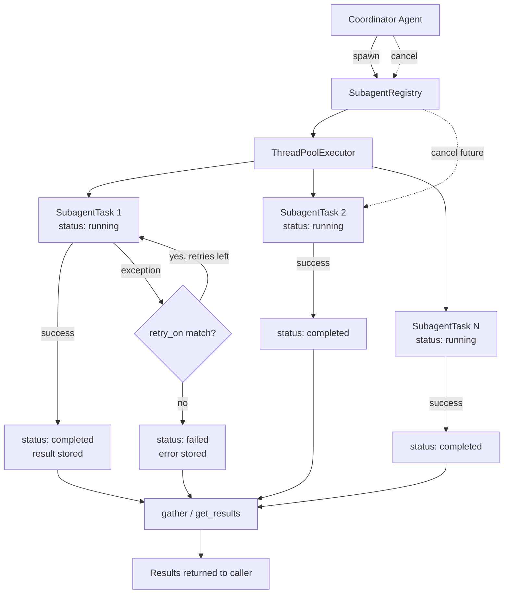
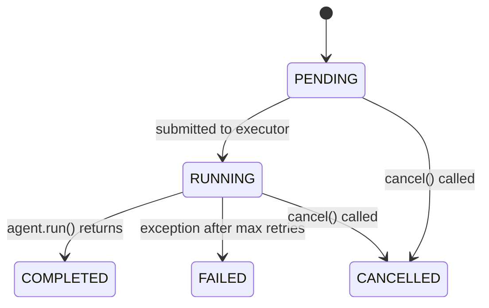
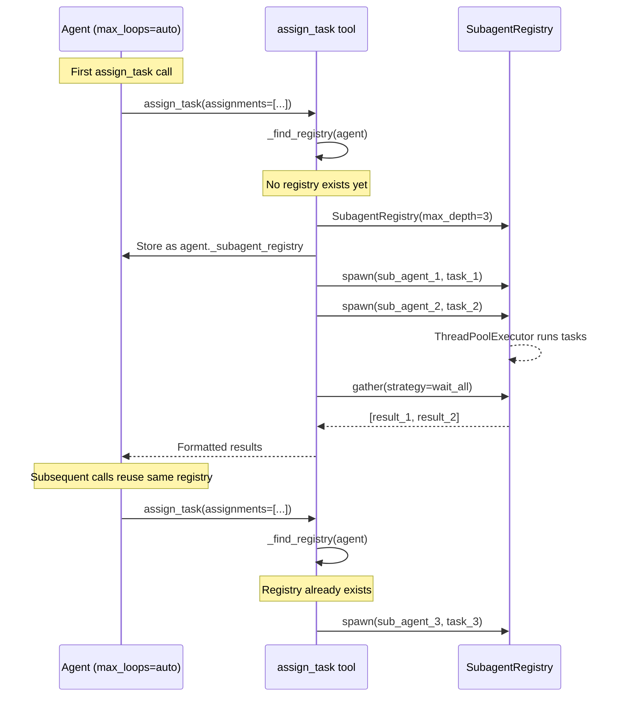

# `SubagentRegistry`

The `SubagentRegistry` is a thread-safe task execution engine that manages background sub-agent tasks with status tracking, result aggregation, retry policies, and depth-limited recursion. It is the core runtime behind the [sub-agent delegation](../examples/sub_agent_tutorial.md) feature.



Each spawned task is tracked as a `SubagentTask` dataclass through a five-state lifecycle (`pending` → `running` → `completed` / `failed` / `cancelled`). The registry uses Python's `concurrent.futures.ThreadPoolExecutor` for background execution, making it compatible with any Python environment without requiring an async event loop.

## Key Features

| Feature | Description |
|---------|-------------|
| **Background Execution** | Tasks run in a `ThreadPoolExecutor`, freeing the coordinator to continue planning |
| **Status Tracking** | Every task is tracked with status, timestamps, retry count, and depth |
| **Result Aggregation** | `get_results()` and `gather()` collect outcomes from all tasks in one call |
| **Retry Policies** | Per-task `max_retries` and `retry_on` exception-type filtering |
| **Depth-Limited Recursion** | `max_depth` prevents infinite nesting of sub-agent hierarchies |
| **Cancellation** | Cancel pending or running tasks via their `Future` handle |
| **Gather Strategies** | `wait_all` blocks until every task completes; `wait_first` returns as soon as any task finishes |
| **Thread Safety** | Task registration is protected by a `threading.Lock` |

## Installation

```bash
pip install -U swarms
```

## Import

```python
from swarms.structs.async_subagent import (
    SubagentRegistry,
    SubagentTask,
    TaskStatus,
)
```

## `TaskStatus`

Enum representing the lifecycle states of a sub-agent task.

| Value | Description |
|-------|-------------|
| `PENDING` | Task created but not yet submitted to the executor |
| `RUNNING` | Task currently executing in the thread pool |
| `COMPLETED` | Task finished successfully; result is available |
| `FAILED` | Task raised an exception after all retries were exhausted |
| `CANCELLED` | Task was cancelled before completion |



## `SubagentTask`

Dataclass that tracks a single async sub-agent task.

### Attributes

| Attribute | Type | Default | Description |
|-----------|------|---------|-------------|
| `id` | `str` | — | Unique task identifier (`task-{uuid_hex[:8]}`) |
| `agent` | `Any` | — | The `Agent` instance assigned to this task |
| `task_str` | `str` | — | The task description passed to `agent.run()` |
| `status` | `TaskStatus` | `PENDING` | Current lifecycle status |
| `result` | `Any` | `None` | Return value from `agent.run()` on success |
| `error` | `Optional[Exception]` | `None` | Exception instance on failure |
| `future` | `Optional[Future]` | `None` | The `concurrent.futures.Future` handle for this task |
| `parent_id` | `Optional[str]` | `None` | ID of the parent task, for nested sub-agent hierarchies |
| `depth` | `int` | `0` | Recursion depth (0 = top-level task) |
| `retries` | `int` | `0` | Number of retries attempted so far |
| `max_retries` | `int` | `0` | Maximum retries allowed for this task |
| `retry_on` | `Optional[List[Type[Exception]]]` | `None` | Exception types that should trigger a retry |
| `created_at` | `float` | `time.time()` | Timestamp when the task was created |
| `completed_at` | `Optional[float]` | `None` | Timestamp when the task finished (success, failure, or cancellation) |

## `SubagentRegistry`

### Constructor

```python
SubagentRegistry(
    max_depth: int = 3,
    max_workers: Optional[int] = None,
)
```

#### Parameters

| Parameter | Type | Default | Required | Description |
|-----------|------|---------|----------|-------------|
| `max_depth` | `int` | `3` | No | Maximum recursion depth for nested sub-agent spawning. A `ValueError` is raised if `spawn()` is called with `depth > max_depth` |
| `max_workers` | `Optional[int]` | `None` | No | Maximum number of threads in the `ThreadPoolExecutor`. When `None`, uses Python's default (typically `min(32, os.cpu_count() + 4)`) |

#### Internal State

| Attribute | Type | Description |
|-----------|------|-------------|
| `_tasks` | `Dict[str, SubagentTask]` | Map of task IDs to task objects |
| `_executor` | `ThreadPoolExecutor` | The thread pool used for background execution |
| `_lock` | `threading.Lock` | Guards concurrent access to `_tasks` |

---

### Methods

### `spawn()`

Submit an agent task for background execution in the thread pool.

```python
def spawn(
    self,
    agent: Any,
    task: str,
    parent_id: Optional[str] = None,
    depth: int = 0,
    max_retries: int = 0,
    retry_on: Optional[List[Type[Exception]]] = None,
    fail_fast: bool = True,
) -> str
```

#### Parameters

| Parameter | Type | Default | Required | Description |
|-----------|------|---------|----------|-------------|
| `agent` | `Any` | — | **Yes** | An `Agent` instance (must have a `.run(task_str)` method) |
| `task` | `str` | — | **Yes** | Task description to pass to `agent.run()` |
| `parent_id` | `Optional[str]` | `None` | No | ID of a parent task, for tracking nested hierarchies |
| `depth` | `int` | `0` | No | Recursion depth of this task. Must be `<= max_depth` |
| `max_retries` | `int` | `0` | No | Number of times to retry the task on failure |
| `retry_on` | `Optional[List[Type[Exception]]]` | `None` | No | Only retry when the exception is an instance of one of these types. If empty or `None`, retries on any exception |
| `fail_fast` | `bool` | `True` | No | If `True`, re-raises the exception after all retries are exhausted. If `False`, stores the error and returns `None` |

#### Returns

| Type | Description |
|------|-------------|
| `str` | The unique task ID (format: `task-{uuid_hex[:8]}`) |

#### Raises

| Exception | Condition |
|-----------|-----------|
| `ValueError` | If `depth > max_depth` |

#### Example

```python
from swarms.structs.agent import Agent
from swarms.structs.async_subagent import SubagentRegistry

registry = SubagentRegistry(max_depth=3)

agent = Agent(
    agent_name="Researcher",
    model_name="gpt-4.1",
    max_loops=1,
)

task_id = registry.spawn(
    agent=agent,
    task="Research the latest advances in quantum computing",
    max_retries=2,
    retry_on=[TimeoutError],
    fail_fast=False,
)
print(f"Spawned task: {task_id}")
```

---

### `get_task()`

Retrieve a task by its ID.

```python
def get_task(self, task_id: str) -> SubagentTask
```

#### Parameters

| Parameter | Type | Required | Description |
|-----------|------|----------|-------------|
| `task_id` | `str` | **Yes** | The task ID returned by `spawn()` |

#### Returns

| Type | Description |
|------|-------------|
| `SubagentTask` | The task object with current status, result, and metadata |

#### Raises

| Exception | Condition |
|-----------|-----------|
| `KeyError` | If no task exists with the given ID |

---

### `get_results()`

Collect results from all completed and failed tasks.

```python
def get_results(self) -> Dict[str, Any]
```

#### Returns

| Type | Description |
|------|-------------|
| `Dict[str, Any]` | Map of task ID → result (for completed tasks) or exception (for failed tasks). Tasks still running or pending are excluded |

#### Example

```python
results = registry.get_results()
for task_id, value in results.items():
    if isinstance(value, Exception):
        print(f"{task_id} failed: {value}")
    else:
        print(f"{task_id} result: {value[:100]}...")
```

---

### `gather()`

Block until tasks complete and return their results.

```python
def gather(
    self,
    strategy: str = "wait_all",
    timeout: Optional[float] = None,
) -> List[Any]
```

#### Parameters

| Parameter | Type | Default | Required | Description |
|-----------|------|---------|----------|-------------|
| `strategy` | `str` | `"wait_all"` | No | `"wait_all"` waits for every task to finish. `"wait_first"` returns as soon as any task completes |
| `timeout` | `Optional[float]` | `None` | No | Maximum seconds to wait. `None` means wait indefinitely |

#### Returns

| Type | Description |
|------|-------------|
| `List[Any]` | List of results. Completed tasks contribute their return value; failed tasks contribute their exception |

#### Example

```python
# Spawn multiple tasks
ids = []
for agent, task in work_items:
    ids.append(registry.spawn(agent=agent, task=task))

# Wait for all tasks to complete
results = registry.gather(strategy="wait_all", timeout=120.0)

for i, result in enumerate(results):
    print(f"Task {i}: {result}")
```

---

### `cancel()`

Cancel a pending or running task.

```python
def cancel(self, task_id: str) -> bool
```

#### Parameters

| Parameter | Type | Required | Description |
|-----------|------|----------|-------------|
| `task_id` | `str` | **Yes** | The task ID to cancel |

#### Returns

| Type | Description |
|------|-------------|
| `bool` | `True` if the task was successfully cancelled, `False` if it was already completed/failed or could not be cancelled |

!!! note
    Cancellation calls `Future.cancel()` from `concurrent.futures`. A task that has already started executing may not be cancellable depending on timing — the executor does not forcibly kill running threads.

---

### `shutdown()`

Shut down the thread pool executor. Running tasks are not waited on.

```python
def shutdown(self) -> None
```

---

### `tasks` (property)

Read-only snapshot of all tracked tasks.

```python
@property
def tasks(self) -> Dict[str, SubagentTask]
```

#### Returns

| Type | Description |
|------|-------------|
| `Dict[str, SubagentTask]` | A shallow copy of the internal tasks dictionary |

---

## Integration with the Agent Class

The `SubagentRegistry` is not used directly in most workflows. Instead, it is created and managed automatically by the autonomous loop when an `Agent` runs with `max_loops="auto"`.

### How It Is Wired

1. The `Agent` class has two related attributes:
   - `max_subagent_depth` (constructor parameter, default `3`) — passed to `SubagentRegistry(max_depth=...)`
   - `_subagent_registry` (internal, default `None`) — holds the lazily-created registry instance

2. When the autonomous loop's `assign_task` tool is called, the helper function `_find_registry(agent)` checks for an existing registry on `agent._subagent_registry`. If none exists, it creates one and stores it:

```python
def _find_registry(agent):
    existing = getattr(agent, "_subagent_registry", None)
    if isinstance(existing, SubagentRegistry):
        return existing
    max_depth = getattr(agent, "max_subagent_depth", 3)
    registry = SubagentRegistry(max_depth=max_depth)
    setattr(agent, "_subagent_registry", registry)
    return registry
```

3. The four autonomous loop tools that interact with the registry:

| Tool | Registry Method Used |
|------|---------------------|
| `assign_task` | `spawn()`, `gather()`, `get_results()` |
| `check_sub_agent_status` | `tasks` property (reads task status) |
| `cancel_sub_agent_tasks` | `cancel()` |
| `create_sub_agent` | Does not use registry (stores agents in `agent.sub_agents`) |

### Lifecycle



## Direct Usage

While the registry is typically used indirectly through autonomous loop tools, it can be used directly for programmatic sub-agent orchestration:

```python
from swarms.structs.agent import Agent
from swarms.structs.async_subagent import SubagentRegistry

# Create agents
analyst = Agent(agent_name="Analyst", model_name="gpt-4.1", max_loops=1)
writer = Agent(agent_name="Writer", model_name="gpt-4.1", max_loops=1)

# Create registry
registry = SubagentRegistry(max_depth=3, max_workers=4)

# Spawn tasks concurrently
task_1 = registry.spawn(
    agent=analyst,
    task="Analyze Q4 revenue trends",
    fail_fast=False,
)
task_2 = registry.spawn(
    agent=writer,
    task="Draft an executive summary of Q4 performance",
    fail_fast=False,
)

# Wait for all tasks
results = registry.gather(strategy="wait_all")
print(f"Analyst result: {results[0]}")
print(f"Writer result: {results[1]}")

# Or inspect individual tasks
task = registry.get_task(task_1)
print(f"Status: {task.status}, Duration: {task.completed_at - task.created_at:.2f}s")

# Clean up
registry.shutdown()
```

### With Retry Policies

```python
registry = SubagentRegistry(max_depth=3)

task_id = registry.spawn(
    agent=analyst,
    task="Fetch and analyze live market data",
    max_retries=3,
    retry_on=[ConnectionError, TimeoutError],
    fail_fast=False,
)

results = registry.gather()

task = registry.get_task(task_id)
if task.status == TaskStatus.FAILED:
    print(f"Failed after {task.retries} retries: {task.error}")
elif task.status == TaskStatus.COMPLETED:
    print(f"Completed in {task.retries} retries: {task.result[:100]}...")
```

### With Cancellation

```python
import time

registry = SubagentRegistry()

task_id = registry.spawn(
    agent=analyst,
    task="Run a very long analysis",
    fail_fast=False,
)

# Cancel after some condition
time.sleep(2)
cancelled = registry.cancel(task_id)
print(f"Cancelled: {cancelled}")

task = registry.get_task(task_id)
print(f"Status: {task.status}")  # CANCELLED if it hadn't finished yet
```

## Related Resources

| Resource | Description |
|----------|-------------|
| [Sub-Agent Delegation Tutorial](../examples/sub_agent_tutorial.md) | End-to-end guide with examples for using sub-agents through the autonomous loop |
| [Autonomous Agent Tutorial](../examples/autonomous_agent_tutorial.md) | Full guide to autonomous mode (`max_loops="auto"`) |
| [Agent Reference](agent.md) | Complete `Agent` class API documentation |
| [AgentRegistry](agent_registry.md) | Separate registry for managing collections of `Agent` instances (not related to async task execution) |
