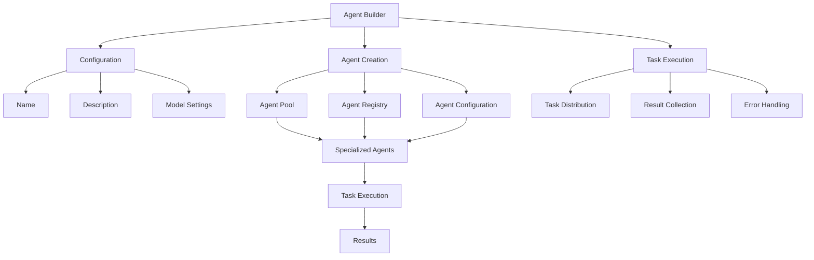
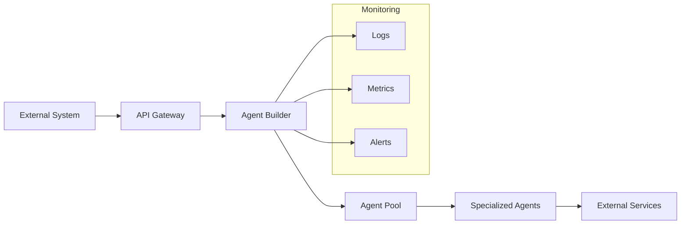

# Agent Builder

The Agent Builder is a powerful class that automatically builds and manages swarms of AI agents. It provides a flexible and extensible framework for creating, coordinating, and executing multiple AI agents working together to accomplish complex tasks.

## Overview

The Agent Builder uses a boss agent to delegate work and create new specialized agents as needed. It's designed to be production-ready with robust error handling, logging, and configuration options.

## Architecture



## Class Structure

### AgentsBuilder Class

| Parameter | Type | Default | Description |
|-----------|------|---------|-------------|
| name | str | "swarm-creator-01" | The name of the swarm |
| description | str | "This is a swarm that creates swarms" | A description of the swarm's purpose |
| verbose | bool | True | Whether to output detailed logs |
| max_loops | int | 1 | Maximum number of execution loops |
| model_name | str | "gpt-4o" | The model to use for agent creation |
| return_dictionary | bool | True | Whether to return results as a dictionary |
| system_prompt | str | BOSS_SYSTEM_PROMPT | The system prompt for the boss agent |

### Methods

| Method | Description | Parameters | Returns |
|--------|-------------|------------|---------|
| run | Run the swarm on a given task | task: str, image_url: str = None, *args, **kwargs | Tuple[List[Agent], int] |
| _create_agents | Create necessary agents for a task | task: str, *args, **kwargs | List[Agent] |
| build_agent | Build a single agent with specifications | agent_name: str, agent_description: str, agent_system_prompt: str, max_loops: int = 1, model_name: str = "gpt-4o", dynamic_temperature_enabled: bool = True, auto_generate_prompt: bool = False, role: str = "worker", max_tokens: int = 8192, temperature: float = 0.5 | Agent |

## Enterprise Use Cases

### 1. Customer Service Automation
- Create specialized agents for different aspects of customer service

- Handle ticket routing, response generation, and escalation

- Maintain consistent service quality across channels

### 2. Data Analysis Pipeline
- Build agents for data collection, cleaning, analysis, and visualization

- Automate complex data processing workflows

- Generate insights and reports automatically

### 3. Content Creation and Management
- Deploy agents for content research, writing, editing, and publishing

- Maintain brand consistency across content

- Automate content scheduling and distribution

### 4. Process Automation
- Create agents for workflow automation

- Handle document processing and routing

- Manage approval chains and notifications

### 5. Research and Development
- Build agents for literature review, experiment design, and data collection

- Automate research documentation and reporting

- Facilitate collaboration between research teams

## Example Usage

```python
from swarms import AgentsBuilder

# Initialize the agent builder
agents_builder = AgentsBuilder(
    name="enterprise-automation",
    description="Enterprise workflow automation swarm",
    verbose=True
)

# Define a use-case for building agents
task = "Develop a swarm of agents to automate the generation of personalized marketing strategies based on customer data and market trends"

# Run the swarm
agents = agents_builder.run(task)

# Access results
print(agents)
```

## Best Practices

1. **Error Handling**
   - Always implement proper error handling for agent failures
   - Use retry mechanisms for transient failures
   - Log all errors for debugging and monitoring

2. **Resource Management**
   - Monitor agent resource usage
   - Implement rate limiting for API calls
   - Use connection pooling for database operations

3. **Security**
   - Implement proper authentication and authorization
   - Secure sensitive data and API keys
   - Follow least privilege principle for agent permissions

4. **Monitoring and Logging**
   - Implement comprehensive logging
   - Monitor agent performance metrics
   - Set up alerts for critical failures

5. **Scalability**
   - Design for horizontal scaling
   - Implement load balancing
   - Use distributed systems when needed

## Integration Patterns



## Performance Considerations

1. **Agent Pool Management**
   - Implement connection pooling
   - Use caching for frequently accessed data
   - Optimize agent creation and destruction

2. **Task Distribution**
   - Implement load balancing
   - Use priority queues for task scheduling
   - Handle task timeouts and retries

3. **Resource Optimization**
   - Monitor memory usage
   - Implement garbage collection
   - Use efficient data structures

## Troubleshooting

Common issues and solutions:

1. **Agent Creation Failures**
   - Check API credentials
   - Verify model availability
   - Review system prompts

2. **Performance Issues**
   - Monitor resource usage
   - Check network latency
   - Review agent configurations

3. **Integration Problems**
   - Verify API endpoints
   - Check authentication
   - Review data formats
