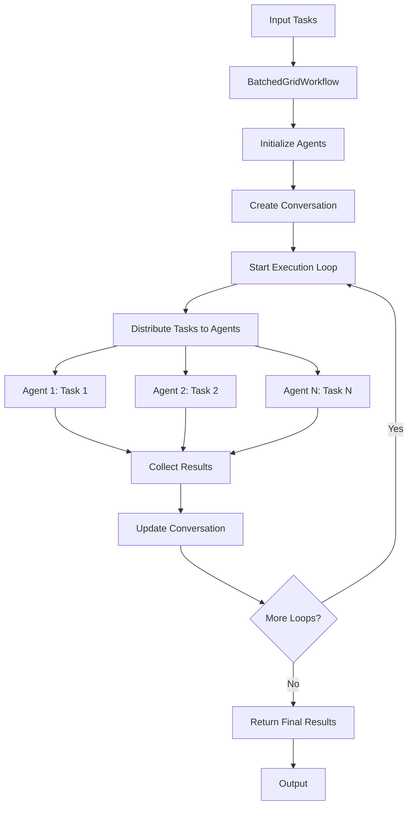

# BatchedGridWorkflow

The `BatchedGridWorkflow` is a multi-agent orchestration pattern that executes tasks in a batched grid format, where each agent processes a different task simultaneously. This workflow is particularly useful for parallel processing scenarios where you have multiple agents and multiple tasks that can be distributed across them.

## Overview

The BatchedGridWorkflow provides a structured approach to:

- Execute multiple tasks across multiple agents in parallel

- Manage conversation state across execution loops

- Handle error scenarios gracefully

- Control the number of execution iterations

## Architecture



## Key Features

| Feature                  | Description                                                                                   |
|--------------------------|-----------------------------------------------------------------------------------------------|
| **Parallel Execution**   | Multiple agents work on different tasks simultaneously                                        |
| **Conversation Management** | Maintains conversation state across execution loops                                         |
| **Error Handling**       | Comprehensive error logging and exception handling                                            |
| **Configurable Loops**   | Control the number of execution iterations                                                    |
| **Agent Flexibility**    | Supports any agent type that implements the `AgentType` interface                             |

## Class Definition

```python
class BatchedGridWorkflow:
    def __init__(
        self,
        id: str = swarm_id(),
        name: str = "BatchedGridWorkflow",
        description: str = "For every agent, run the task on a different task",
        agents: List[AgentType] = None,
        conversation_args: dict = None,
        max_loops: int = 1,
    ):
```

## Parameters

| Parameter | Type | Default | Description |
|-----------|------|---------|-------------|
| `id` | str | `swarm_id()` | Unique identifier for the workflow |
| `name` | str | `"BatchedGridWorkflow"` | Name of the workflow |
| `description` | str | `"For every agent, run the task on a different task"` | Description of what the workflow does |
| `agents` | List[AgentType] | `None` | List of agents to execute tasks |
| `conversation_args` | dict | `None` | Arguments for the conversation |
| `max_loops` | int | `1` | Maximum number of execution loops to run (must be >= 1) |

## Methods

### `step(tasks: List[str])`

Execute one step of the batched grid workflow.

**Parameters:**

- `tasks` (List[str]): List of tasks to execute

**Returns:**

- Output from the batched grid agent execution

### `run(tasks: List[str])`

Run the batched grid workflow with the given tasks. This is the main entry point that includes error handling.

**Parameters:**

- `tasks` (List[str]): List of tasks to execute

**Returns:**
- str: The final conversation string after all loops

### `run_(tasks: List[str])`

Internal method that runs the workflow without error handling.

**Parameters:**

- `tasks` (List[str]): List of tasks to execute

**Returns:**
- str: The final conversation string after all loops

## Usage Patterns

### Basic Usage

```python
from swarms import Agent
from swarms.structs.batched_grid_workflow import BatchedGridWorkflow

# Initialize the ETF-focused agent
agent = Agent(
    agent_name="ETF-Research-Agent",
    agent_description="Specialized agent for researching, analyzing, and recommending Exchange-Traded Funds (ETFs) across various sectors and markets.",
    model_name="claude-sonnet-4-20250514",
    dynamic_temperature_enabled=True,
    max_loops=1,
    dynamic_context_window=True,
)


# Create workflow with default settings
workflow = BatchedGridWorkflow(agents=[agent, agent])

# Define simple tasks
tasks = [
    "What are the best GOLD ETFs?",
    "What are the best american energy ETFs?",
]

# Run the workflow
result = workflow.run(tasks)

print(result)
```

### Multi-Loop Execution

```python
# Create workflow with multiple loops
workflow = BatchedGridWorkflow(
    agents=[agent1, agent2, agent3],
    max_loops=3,
    conversation_args={"message_id_on": True}
)

# Execute tasks with multiple iterations
tasks = ["Task 1", "Task 2", "Task 3"]
result = workflow.run(tasks)
```

## Error Handling

The workflow includes comprehensive error handling:

- **Validation**: Ensures `max_loops` is a positive integer
- **Execution Errors**: Catches and logs exceptions during execution
- **Detailed Logging**: Provides detailed error information including traceback

## Best Practices

| Best Practice              | Description                                                                                           |
|----------------------------|-------------------------------------------------------------------------------------------------------|
| **Agent Selection**        | Choose agents with complementary capabilities for diverse task processing                             |
| **Task Distribution**      | Ensure tasks are well-distributed and can be processed independently                                  |
| **Loop Configuration**     | Use multiple loops when iterative refinement is needed                                                |
| **Error Monitoring**       | Monitor logs for execution errors and adjust agent configurations accordingly                         |
| **Resource Management**    | Consider computational resources when setting up multiple agents                                      |

## Use Cases

| Use Case               | Description                                                                                   |
|------------------------|-----------------------------------------------------------------------------------------------|
| **Content Generation** | Multiple writers working on different topics                                                  |
| **Data Analysis**      | Different analysts processing various datasets                                                |
| **Research Tasks**     | Multiple researchers investigating different aspects of a problem                            |
| **Parallel Processing**| Any scenario requiring simultaneous task execution across multiple agents                     |
