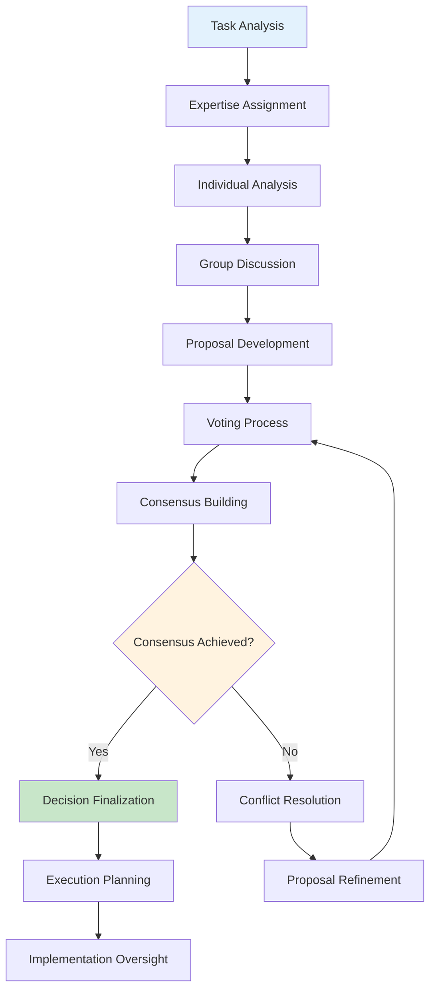
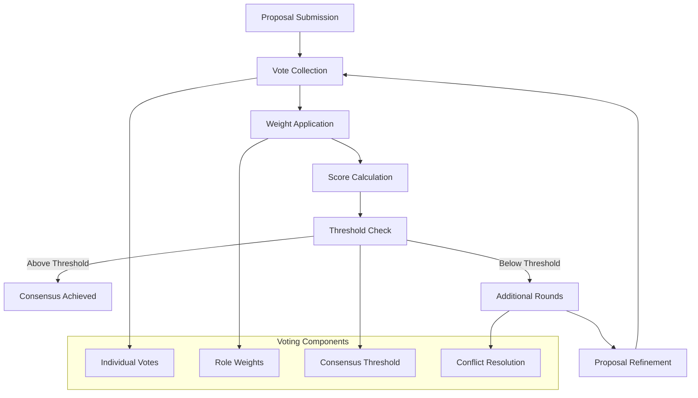
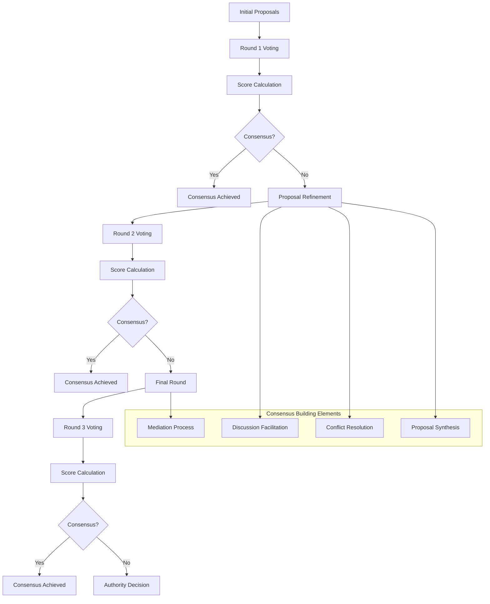
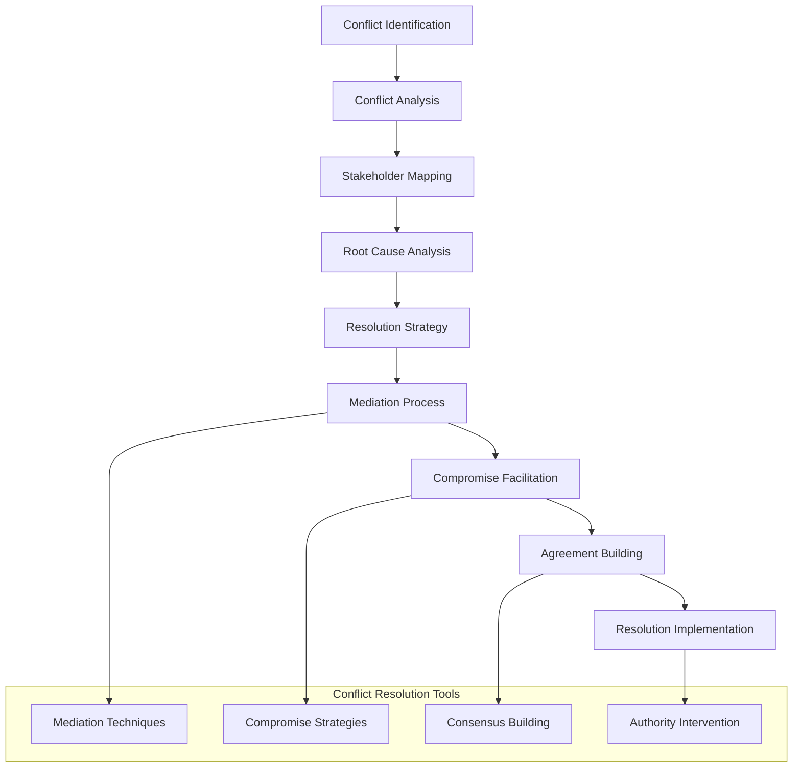
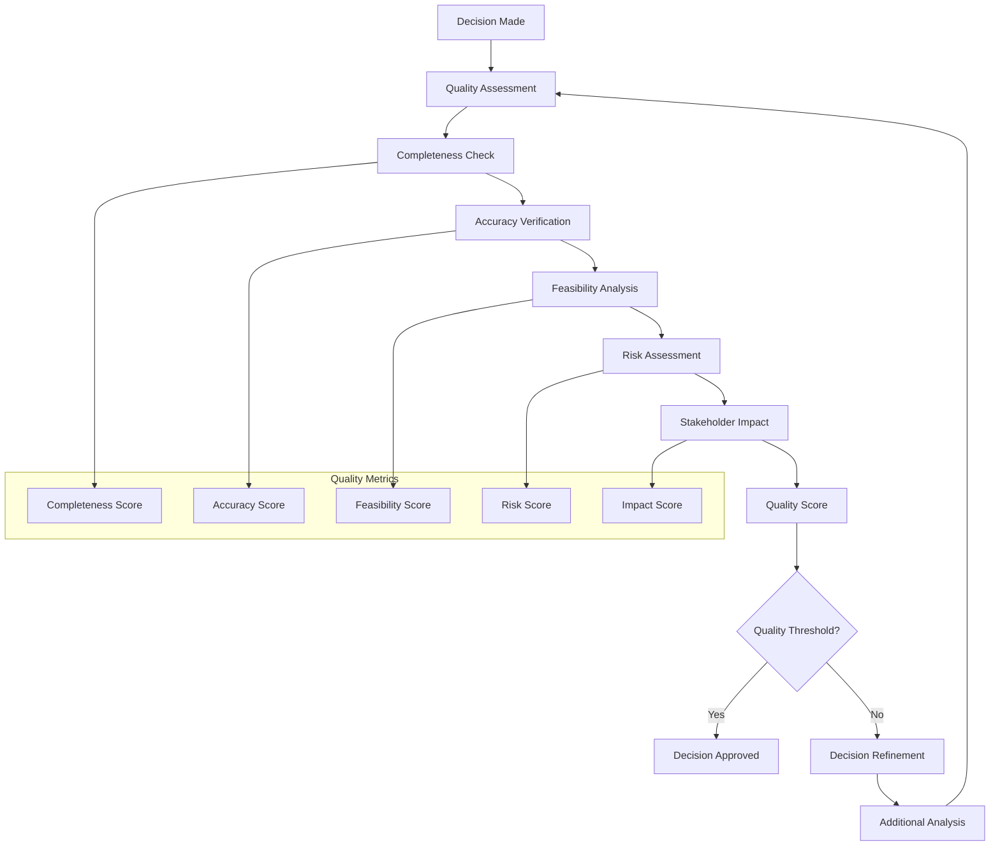

# Board of Directors Decision Making

The Board of Directors decision-making process is a sophisticated, multi-layered system that ensures comprehensive analysis, balanced consideration, and effective consensus building. This process combines democratic principles with hierarchical authority to achieve optimal outcomes.

## Decision-Making Framework

### Overview of the Decision Process



**Diagram Explanation:**
This comprehensive decision-making framework shows the complete process from initial task analysis to final implementation oversight. The process begins with task analysis and expertise assignment, followed by individual analysis where each board member contributes their specialized knowledge. Group discussion facilitates information sharing and debate, leading to proposal development. The voting process and consensus building ensure democratic decision-making, with conflict resolution mechanisms for when consensus cannot be reached. Once consensus is achieved, decisions are finalized and execution planning begins, followed by implementation oversight.

**Technical Implementation:**
```python
# Example: Decision-making framework implementation
class DecisionMakingFramework:
    def __init__(self, board_members, config):
        self.board_members = board_members
        self.config = config
        self.decision_history = []
        self.consensus_threshold = config.get("consensus_threshold", 0.7)
        self.max_voting_rounds = config.get("max_voting_rounds", 3)
    
    async def execute_decision_process(self, task):
        """Execute the complete decision-making process"""
        decision_result = {
            "task": task,
            "phases": [],
            "final_decision": None,
            "consensus_achieved": False,
            "execution_plan": None
        }
        
        # Phase 1: Task Analysis and Expertise Assignment
        analysis_phase = await self.analyze_task_and_assign_expertise(task)
        decision_result["phases"].append(analysis_phase)
        
        # Phase 2: Individual Analysis
        individual_analysis = await self.conduct_individual_analysis(task, analysis_phase["expertise_assignments"])
        decision_result["phases"].append(individual_analysis)
        
        # Phase 3: Group Discussion
        group_discussion = await self.facilitate_group_discussion(individual_analysis)
        decision_result["phases"].append(group_discussion)
        
        # Phase 4: Proposal Development
        proposal_development = await self.develop_proposals(group_discussion)
        decision_result["phases"].append(proposal_development)
        
        # Phase 5: Voting and Consensus Building
        consensus_result = await self.build_consensus(proposal_development["proposals"])
        decision_result["phases"].append(consensus_result)
        
        # Phase 6: Decision Finalization
        if consensus_result["consensus_achieved"]:
            finalization = await self.finalize_decision(consensus_result)
            decision_result["phases"].append(finalization)
            decision_result["final_decision"] = finalization["decision"]
            decision_result["consensus_achieved"] = True
        else:
            # Handle conflict resolution
            conflict_resolution = await self.resolve_conflicts(consensus_result)
            decision_result["phases"].append(conflict_resolution)
            decision_result["final_decision"] = conflict_resolution["decision"]
            decision_result["consensus_achieved"] = False
        
        # Phase 7: Execution Planning
        execution_planning = await self.plan_execution(decision_result["final_decision"])
        decision_result["phases"].append(execution_planning)
        decision_result["execution_plan"] = execution_planning["plan"]
        
        # Store decision in history
        self.decision_history.append(decision_result)
        
        return decision_result
    
    async def analyze_task_and_assign_expertise(self, task):
        """Analyze task and assign expertise areas to board members"""
        # Analyze task complexity and requirements
        task_analysis = await self.analyze_task_complexity(task)
        
        # Identify required expertise areas
        required_expertise = await self.identify_required_expertise(task_analysis)
        
        # Assign expertise areas to board members
        expertise_assignments = await self.assign_expertise_to_members(required_expertise)
        
        return {
            "phase": "task_analysis_and_expertise_assignment",
            "task_analysis": task_analysis,
            "required_expertise": required_expertise,
            "expertise_assignments": expertise_assignments,
            "timestamp": datetime.now().isoformat()
        }
    
    async def conduct_individual_analysis(self, task, expertise_assignments):
        """Conduct individual analysis by each board member"""
        individual_analyses = {}
        
        for member_role, expertise_areas in expertise_assignments.items():
            member = self.board_members[member_role]
            
            # Conduct analysis based on assigned expertise
            analysis = await member.analyze_task_areas(task, expertise_areas)
            
            individual_analyses[member_role] = {
                "expertise_areas": expertise_areas,
                "analysis": analysis,
                "recommendations": analysis.get("recommendations", []),
                "concerns": analysis.get("concerns", []),
                "proposals": analysis.get("proposals", [])
            }
        
        return {
            "phase": "individual_analysis",
            "analyses": individual_analyses,
            "timestamp": datetime.now().isoformat()
        }
```

## Voting Mechanisms

### Weighted Voting System



**Diagram Explanation:**
This diagram illustrates the weighted voting system used by the Board of Directors. The process begins with proposal submission, followed by vote collection from all board members. Each vote is weighted according to the member's role and authority level. Scores are calculated using the weighted voting formula, and results are checked against the consensus threshold. If the threshold is met, consensus is achieved. If not, additional voting rounds with proposal refinement are conducted until consensus is reached or maximum rounds are exceeded.

**Technical Implementation:**
```python
# Example: Weighted voting system implementation
class WeightedVotingSystem:
    def __init__(self, board_members, config):
        self.board_members = board_members
        self.config = config
        self.voting_weights = {
            "CHAIRMAN": 1.5,
            "VICE_CHAIRMAN": 1.2,
            "EXECUTIVE_DIRECTOR": 1.5,
            "SECRETARY": 1.0,
            "TREASURER": 1.0,
            "MEMBER": 1.0
        }
        self.consensus_threshold = config.get("consensus_threshold", 0.7)
        self.max_voting_rounds = config.get("max_voting_rounds", 3)
    
    async def conduct_weighted_voting(self, proposals):
        """Conduct weighted voting on proposals"""
        voting_result = {
            "rounds": [],
            "final_decision": None,
            "consensus_achieved": False,
            "voting_summary": {}
        }
        
        current_proposals = proposals
        round_number = 1
        
        while round_number <= self.max_voting_rounds:
            # Collect votes from all board members
            votes = await self.collect_votes(current_proposals)
            
            # Apply voting weights
            weighted_votes = self.apply_voting_weights(votes)
            
            # Calculate scores
            scores = self.calculate_weighted_scores(weighted_votes, current_proposals)
            
            # Check consensus threshold
            consensus_check = self.check_consensus_threshold(scores)
            
            round_result = {
                "round": round_number,
                "votes": votes,
                "weighted_votes": weighted_votes,
                "scores": scores,
                "consensus_achieved": consensus_check["achieved"],
                "winning_proposal": consensus_check["winning_proposal"]
            }
            
            voting_result["rounds"].append(round_result)
            
            if consensus_check["achieved"]:
                voting_result["final_decision"] = consensus_check["winning_proposal"]
                voting_result["consensus_achieved"] = True
                break
            
            # Refine proposals for next round
            current_proposals = await self.refine_proposals(current_proposals, round_result)
            round_number += 1
        
        # Generate voting summary
        voting_result["voting_summary"] = self.generate_voting_summary(voting_result["rounds"])
        
        return voting_result
    
    async def collect_votes(self, proposals):
        """Collect votes from all board members"""
        votes = {}
        
        for member_role, member in self.board_members.items():
            # Each member votes on all proposals
            member_votes = await member.vote_on_proposals(proposals)
            
            votes[member_role] = {
                "proposal_scores": member_votes["scores"],
                "rationale": member_votes["rationale"],
                "confidence_level": member_votes.get("confidence_level", 1.0),
                "timestamp": datetime.now().isoformat()
            }
        
        return votes
    
    def apply_voting_weights(self, votes):
        """Apply voting weights to member votes"""
        weighted_votes = {}
        
        for member_role, vote_data in votes.items():
            weight = self.voting_weights.get(member_role, 1.0)
            
            weighted_scores = {}
            for proposal_id, score in vote_data["proposal_scores"].items():
                weighted_scores[proposal_id] = score * weight
            
            weighted_votes[member_role] = {
                "original_scores": vote_data["proposal_scores"],
                "weighted_scores": weighted_scores,
                "weight": weight,
                "rationale": vote_data["rationale"],
                "confidence_level": vote_data["confidence_level"]
            }
        
        return weighted_votes
    
    def calculate_weighted_scores(self, weighted_votes, proposals):
        """Calculate final weighted scores for each proposal"""
        proposal_scores = {}
        
        for proposal in proposals:
            proposal_id = proposal["id"]
            total_weighted_score = 0
            total_weight = 0
            vote_count = 0
            
            for member_role, vote_data in weighted_votes.items():
                if proposal_id in vote_data["weighted_scores"]:
                    weighted_score = vote_data["weighted_scores"][proposal_id]
                    weight = vote_data["weight"]
                    
                    total_weighted_score += weighted_score
                    total_weight += weight
                    vote_count += 1
            
            # Calculate average weighted score
            if total_weight > 0:
                final_score = total_weighted_score / total_weight
            else:
                final_score = 0
            
            proposal_scores[proposal_id] = {
                "final_score": final_score,
                "total_weight": total_weight,
                "vote_count": vote_count,
                "consensus_percentage": final_score
            }
        
        return proposal_scores
    
    def check_consensus_threshold(self, scores):
        """Check if any proposal meets the consensus threshold"""
        best_proposal = None
        best_score = 0
        
        for proposal_id, score_data in scores.items():
            if score_data["final_score"] > best_score:
                best_score = score_data["final_score"]
                best_proposal = proposal_id
        
        consensus_achieved = best_score >= self.consensus_threshold
        
        return {
            "achieved": consensus_achieved,
            "winning_proposal": best_proposal if consensus_achieved else None,
            "best_score": best_score,
            "threshold": self.consensus_threshold
        }
```

## Consensus Building Process

### Multi-Round Consensus Building



**Diagram Explanation:**
This flowchart shows the multi-round consensus building process used by the Board of Directors. The process begins with initial proposals and proceeds through multiple voting rounds. After each round, scores are calculated and consensus is checked. If consensus is not achieved, proposals are refined through discussion facilitation, conflict resolution, proposal synthesis, and mediation processes. The process continues for up to three rounds, after which authority decision-making is used if consensus still cannot be reached.

**Technical Implementation:**
```python
# Example: Consensus building system
class ConsensusBuildingSystem:
    def __init__(self, board_members, config):
        self.board_members = board_members
        self.config = config
        self.max_rounds = config.get("max_consensus_rounds", 3)
        self.consensus_threshold = config.get("consensus_threshold", 0.7)
        self.discussion_facilitator = board_members.get("CHAIRMAN")
    
    async def build_consensus(self, initial_proposals):
        """Build consensus through multiple rounds"""
        consensus_result = {
            "rounds": [],
            "consensus_achieved": False,
            "final_proposal": None,
            "authority_decision": None
        }
        
        current_proposals = initial_proposals
        round_number = 1
        
        while round_number <= self.max_rounds:
            # Conduct voting round
            voting_result = await self.conduct_voting_round(current_proposals, round_number)
            
            # Check consensus
            if voting_result["consensus_achieved"]:
                consensus_result["rounds"].append(voting_result)
                consensus_result["consensus_achieved"] = True
                consensus_result["final_proposal"] = voting_result["winning_proposal"]
                break
            
            # If no consensus and not final round, refine proposals
            if round_number < self.max_rounds:
                refinement_result = await self.refine_proposals(current_proposals, voting_result)
                consensus_result["rounds"].append(voting_result)
                current_proposals = refinement_result["refined_proposals"]
            else:
                # Final round - use authority decision
                authority_decision = await self.make_authority_decision(voting_result)
                consensus_result["rounds"].append(voting_result)
                consensus_result["authority_decision"] = authority_decision
                consensus_result["final_proposal"] = authority_decision["selected_proposal"]
            
            round_number += 1
        
        return consensus_result
    
    async def conduct_voting_round(self, proposals, round_number):
        """Conduct a single voting round"""
        round_result = {
            "round": round_number,
            "proposals": proposals,
            "votes": {},
            "scores": {},
            "consensus_achieved": False,
            "winning_proposal": None
        }
        
        # Collect votes from all board members
        for member_role, member in self.board_members.items():
            vote = await member.vote_on_proposals(proposals, round_number)
            round_result["votes"][member_role] = vote
        
        # Calculate weighted scores
        weighted_scores = self.calculate_weighted_scores(round_result["votes"], proposals)
        round_result["scores"] = weighted_scores
        
        # Check consensus
        consensus_check = self.check_consensus(weighted_scores)
        round_result["consensus_achieved"] = consensus_check["achieved"]
        round_result["winning_proposal"] = consensus_check["winning_proposal"]
        
        return round_result
    
    async def refine_proposals(self, current_proposals, voting_result):
        """Refine proposals based on voting results and discussion"""
        refinement_result = {
            "refined_proposals": [],
            "discussion_summary": "",
            "conflicts_resolved": []
        }
        
        # Analyze voting patterns
        voting_analysis = self.analyze_voting_patterns(voting_result)
        
        # Identify areas of disagreement
        disagreements = self.identify_disagreements(voting_result)
        
        # Facilitate discussion to resolve conflicts
        discussion_result = await self.facilitate_discussion(disagreements, current_proposals)
        refinement_result["discussion_summary"] = discussion_result["summary"]
        refinement_result["conflicts_resolved"] = discussion_result["resolved_conflicts"]
        
        # Synthesize refined proposals
        refined_proposals = await self.synthesize_proposals(current_proposals, discussion_result)
        refinement_result["refined_proposals"] = refined_proposals
        
        return refinement_result
    
    async def facilitate_discussion(self, disagreements, proposals):
        """Facilitate discussion to resolve disagreements"""
        discussion_result = {
            "summary": "",
            "resolved_conflicts": [],
            "new_insights": []
        }
        
        # Chairman facilitates discussion
        if self.discussion_facilitator:
            facilitation_result = await self.discussion_facilitator.facilitate_discussion(
                disagreements, proposals
            )
            
            discussion_result["summary"] = facilitation_result["summary"]
            discussion_result["resolved_conflicts"] = facilitation_result["resolved_conflicts"]
            discussion_result["new_insights"] = facilitation_result["new_insights"]
        
        return discussion_result
    
    async def make_authority_decision(self, final_voting_result):
        """Make authority decision when consensus cannot be reached"""
        # Chairman makes final decision based on best available information
        authority_decision = {
            "decision_maker": "CHAIRMAN",
            "decision_method": "authority_decision",
            "selected_proposal": None,
            "rationale": "",
            "board_support_level": 0.0
        }
        
        # Analyze all proposals and select the best one
        best_proposal = self.select_best_proposal(final_voting_result["scores"])
        authority_decision["selected_proposal"] = best_proposal["proposal_id"]
        authority_decision["rationale"] = best_proposal["rationale"]
        authority_decision["board_support_level"] = best_proposal["support_level"]
        
        return authority_decision
```

## Conflict Resolution Mechanisms

### Structured Conflict Resolution



**Diagram Explanation:**
This diagram illustrates the structured conflict resolution process used by the Board of Directors. The process begins with conflict identification and proceeds through systematic analysis including stakeholder mapping and root cause analysis. A resolution strategy is developed, followed by mediation processes and compromise facilitation. The process culminates in agreement building and resolution implementation, using various tools including mediation techniques, compromise strategies, consensus building, and authority intervention when necessary.

**Technical Implementation:**
```python
# Example: Conflict resolution system
class ConflictResolutionSystem:
    def __init__(self, board_members, config):
        self.board_members = board_members
        self.config = config
        self.mediation_techniques = [
            "active_listening",
            "interest_based_negotiation",
            "brainstorming",
            "consensus_building"
        ]
        self.resolution_strategies = [
            "compromise",
            "collaboration",
            "accommodation",
            "authority_decision"
        ]
    
    async def resolve_conflicts(self, conflicts, context):
        """Resolve conflicts using structured approach"""
        resolution_result = {
            "conflicts": conflicts,
            "resolution_process": [],
            "final_resolution": None,
            "implementation_plan": None
        }
        
        for conflict in conflicts:
            # Step 1: Analyze conflict
            conflict_analysis = await self.analyze_conflict(conflict, context)
            resolution_result["resolution_process"].append({
                "step": "conflict_analysis",
                "conflict_id": conflict["id"],
                "analysis": conflict_analysis
            })
            
            # Step 2: Map stakeholders
            stakeholder_mapping = await self.map_stakeholders(conflict, context)
            resolution_result["resolution_process"].append({
                "step": "stakeholder_mapping",
                "conflict_id": conflict["id"],
                "mapping": stakeholder_mapping
            })
            
            # Step 3: Analyze root causes
            root_cause_analysis = await self.analyze_root_causes(conflict, context)
            resolution_result["resolution_process"].append({
                "step": "root_cause_analysis",
                "conflict_id": conflict["id"],
                "analysis": root_cause_analysis
            })
            
            # Step 4: Develop resolution strategy
            resolution_strategy = await self.develop_resolution_strategy(
                conflict, conflict_analysis, stakeholder_mapping, root_cause_analysis
            )
            resolution_result["resolution_process"].append({
                "step": "resolution_strategy",
                "conflict_id": conflict["id"],
                "strategy": resolution_strategy
            })
            
            # Step 5: Implement resolution
            resolution_implementation = await self.implement_resolution(
                conflict, resolution_strategy
            )
            resolution_result["resolution_process"].append({
                "step": "resolution_implementation",
                "conflict_id": conflict["id"],
                "implementation": resolution_implementation
            })
        
        # Generate final resolution
        resolution_result["final_resolution"] = await self.generate_final_resolution(
            resolution_result["resolution_process"]
        )
        
        # Create implementation plan
        resolution_result["implementation_plan"] = await self.create_implementation_plan(
            resolution_result["final_resolution"]
        )
        
        return resolution_result
    
    async def analyze_conflict(self, conflict, context):
        """Analyze the nature and scope of a conflict"""
        analysis = {
            "conflict_type": self.categorize_conflict(conflict),
            "severity_level": self.assess_severity(conflict),
            "scope": self.define_scope(conflict),
            "impact_assessment": await self.assess_impact(conflict, context),
            "urgency_level": self.assess_urgency(conflict)
        }
        
        return analysis
    
    async def map_stakeholders(self, conflict, context):
        """Map stakeholders involved in the conflict"""
        stakeholders = {
            "primary_stakeholders": [],
            "secondary_stakeholders": [],
            "influencers": [],
            "decision_makers": []
        }
        
        # Identify stakeholders based on conflict type
        if conflict["type"] == "resource_allocation":
            stakeholders["primary_stakeholders"] = self.identify_resource_stakeholders(conflict)
        elif conflict["type"] == "strategic_direction":
            stakeholders["primary_stakeholders"] = self.identify_strategic_stakeholders(conflict)
        elif conflict["type"] == "implementation_approach":
            stakeholders["primary_stakeholders"] = self.identify_implementation_stakeholders(conflict)
        
        # Map stakeholder interests and positions
        for stakeholder in stakeholders["primary_stakeholders"]:
            stakeholder["interests"] = await self.identify_stakeholder_interests(stakeholder, conflict)
            stakeholder["position"] = await self.identify_stakeholder_position(stakeholder, conflict)
            stakeholder["influence_level"] = self.assess_influence_level(stakeholder)
        
        return stakeholders
    
    async def analyze_root_causes(self, conflict, context):
        """Analyze root causes of the conflict"""
        root_causes = {
            "structural_causes": [],
            "communication_causes": [],
            "resource_causes": [],
            "process_causes": []
        }
        
        # Analyze based on conflict type
        if conflict["type"] == "resource_allocation":
            root_causes["resource_causes"] = await self.analyze_resource_causes(conflict)
        elif conflict["type"] == "strategic_direction":
            root_causes["structural_causes"] = await self.analyze_structural_causes(conflict)
        elif conflict["type"] == "implementation_approach":
            root_causes["process_causes"] = await self.analyze_process_causes(conflict)
        
        # Identify communication issues
        root_causes["communication_causes"] = await self.analyze_communication_causes(conflict)
        
        return root_causes
    
    async def develop_resolution_strategy(self, conflict, analysis, stakeholders, root_causes):
        """Develop appropriate resolution strategy"""
        strategy = {
            "approach": self.select_resolution_approach(analysis, stakeholders),
            "techniques": self.select_mediation_techniques(conflict, stakeholders),
            "timeline": self.estimate_resolution_timeline(analysis),
            "resources": self.identify_resolution_resources(analysis),
            "success_criteria": self.define_success_criteria(conflict)
        }
        
        return strategy
    
    async def implement_resolution(self, conflict, strategy):
        """Implement the resolution strategy"""
        implementation = {
            "mediation_process": await self.conduct_mediation(conflict, strategy),
            "compromise_facilitation": await self.facilitate_compromise(conflict, strategy),
            "agreement_building": await self.build_agreement(conflict, strategy),
            "implementation_oversight": await self.oversee_implementation(conflict, strategy)
        }
        
        return implementation
```

## Decision Quality Assurance

### Quality Assessment Framework



**Diagram Explanation:**
This diagram shows the quality assessment framework used to ensure high-quality decisions. After a decision is made, it undergoes comprehensive quality assessment including completeness checks, accuracy verification, feasibility analysis, risk assessment, and stakeholder impact evaluation. A quality score is calculated based on these metrics, and the decision is either approved if it meets the quality threshold or sent back for refinement and additional analysis.

**Technical Implementation:**
```python
# Example: Decision quality assurance system
class DecisionQualityAssurance:
    def __init__(self, config):
        self.config = config
        self.quality_threshold = config.get("quality_threshold", 0.8)
        self.quality_metrics = {
            "completeness": {"weight": 0.2, "threshold": 0.8},
            "accuracy": {"weight": 0.25, "threshold": 0.85},
            "feasibility": {"weight": 0.2, "threshold": 0.8},
            "risk": {"weight": 0.15, "threshold": 0.7},
            "impact": {"weight": 0.2, "threshold": 0.8}
        }
    
    async def assess_decision_quality(self, decision, context):
        """Assess the quality of a decision"""
        quality_assessment = {
            "decision": decision,
            "metrics": {},
            "overall_score": 0.0,
            "threshold_met": False,
            "recommendations": []
        }
        
        # Assess completeness
        completeness_score = await self.assess_completeness(decision, context)
        quality_assessment["metrics"]["completeness"] = completeness_score
        
        # Assess accuracy
        accuracy_score = await self.assess_accuracy(decision, context)
        quality_assessment["metrics"]["accuracy"] = accuracy_score
        
        # Assess feasibility
        feasibility_score = await self.assess_feasibility(decision, context)
        quality_assessment["metrics"]["feasibility"] = feasibility_score
        
        # Assess risk
        risk_score = await self.assess_risk(decision, context)
        quality_assessment["metrics"]["risk"] = risk_score
        
        # Assess stakeholder impact
        impact_score = await self.assess_stakeholder_impact(decision, context)
        quality_assessment["metrics"]["impact"] = impact_score
        
        # Calculate overall score
        overall_score = self.calculate_overall_score(quality_assessment["metrics"])
        quality_assessment["overall_score"] = overall_score
        
        # Check if threshold is met
        quality_assessment["threshold_met"] = overall_score >= self.quality_threshold
        
        # Generate recommendations
        quality_assessment["recommendations"] = await self.generate_quality_recommendations(
            quality_assessment["metrics"], overall_score
        )
        
        return quality_assessment
    
    async def assess_completeness(self, decision, context):
        """Assess the completeness of the decision"""
        completeness_factors = {
            "all_aspects_covered": self.check_aspect_coverage(decision, context),
            "stakeholder_consideration": self.check_stakeholder_consideration(decision, context),
            "implementation_details": self.check_implementation_details(decision),
            "resource_allocation": self.check_resource_allocation(decision),
            "timeline_definition": self.check_timeline_definition(decision)
        }
        
        # Calculate completeness score
        completeness_score = sum(completeness_factors.values()) / len(completeness_factors)
        
        return {
            "score": completeness_score,
            "factors": completeness_factors,
            "threshold_met": completeness_score >= self.quality_metrics["completeness"]["threshold"]
        }
    
    async def assess_accuracy(self, decision, context):
        """Assess the accuracy of the decision"""
        accuracy_factors = {
            "data_quality": self.assess_data_quality(decision, context),
            "analysis_quality": self.assess_analysis_quality(decision, context),
            "assumption_validity": self.assess_assumption_validity(decision, context),
            "conclusion_soundness": self.assess_conclusion_soundness(decision, context)
        }
        
        # Calculate accuracy score
        accuracy_score = sum(accuracy_factors.values()) / len(accuracy_factors)
        
        return {
            "score": accuracy_score,
            "factors": accuracy_factors,
            "threshold_met": accuracy_score >= self.quality_metrics["accuracy"]["threshold"]
        }
    
    def calculate_overall_score(self, metrics):
        """Calculate overall quality score"""
        weighted_score = 0.0
        total_weight = 0.0
        
        for metric_name, metric_data in metrics.items():
            weight = self.quality_metrics[metric_name]["weight"]
            score = metric_data["score"]
            
            weighted_score += score * weight
            total_weight += weight
        
        return weighted_score / total_weight if total_weight > 0 else 0.0
```

## Best Practices for Decision Making

### 1. Structured Approach
- Follow the defined decision-making framework
- Ensure all phases are completed thoroughly
- Document decisions and rationale

### 2. Inclusive Participation
- Encourage all board members to contribute
- Value diverse perspectives and expertise
- Ensure fair representation in voting

### 3. Quality Assurance
- Implement quality checkpoints throughout the process
- Assess decision quality before implementation
- Continuously monitor and improve decision-making processes

### 4. Conflict Management
- Address conflicts promptly and constructively
- Use appropriate resolution strategies
- Maintain focus on organizational objectives

### 5. Continuous Improvement
- Learn from previous decisions
- Refine decision-making processes based on outcomes
- Adapt to changing circumstances and requirements 