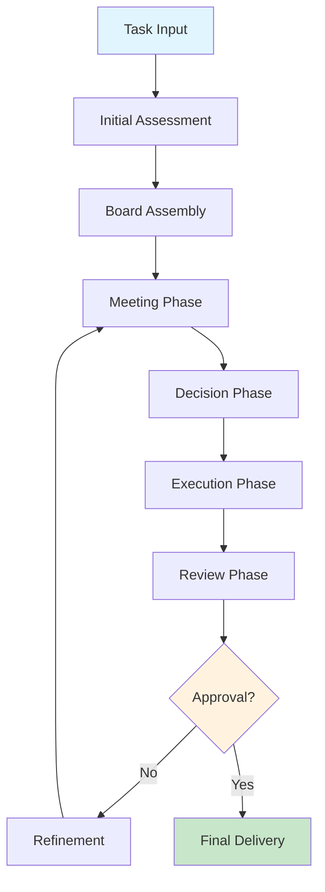
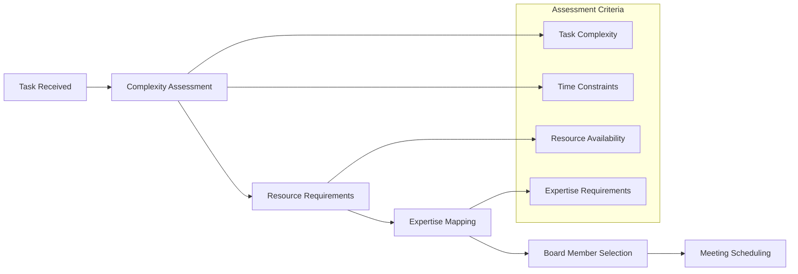
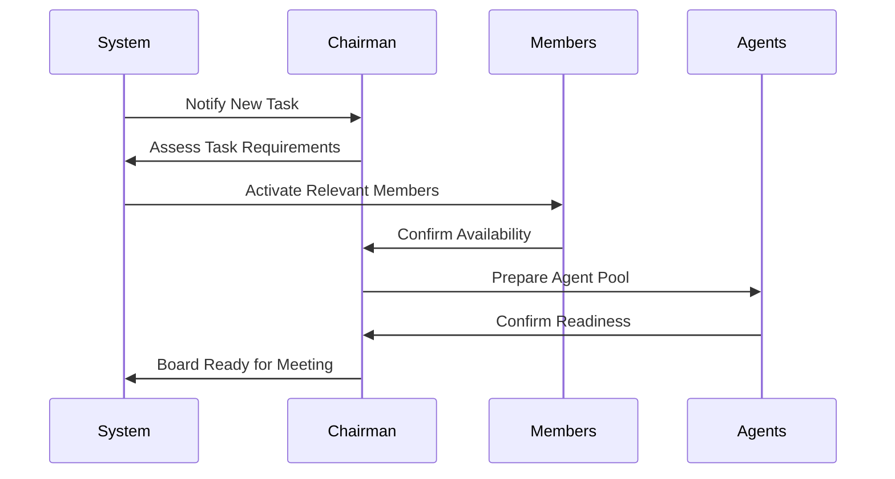
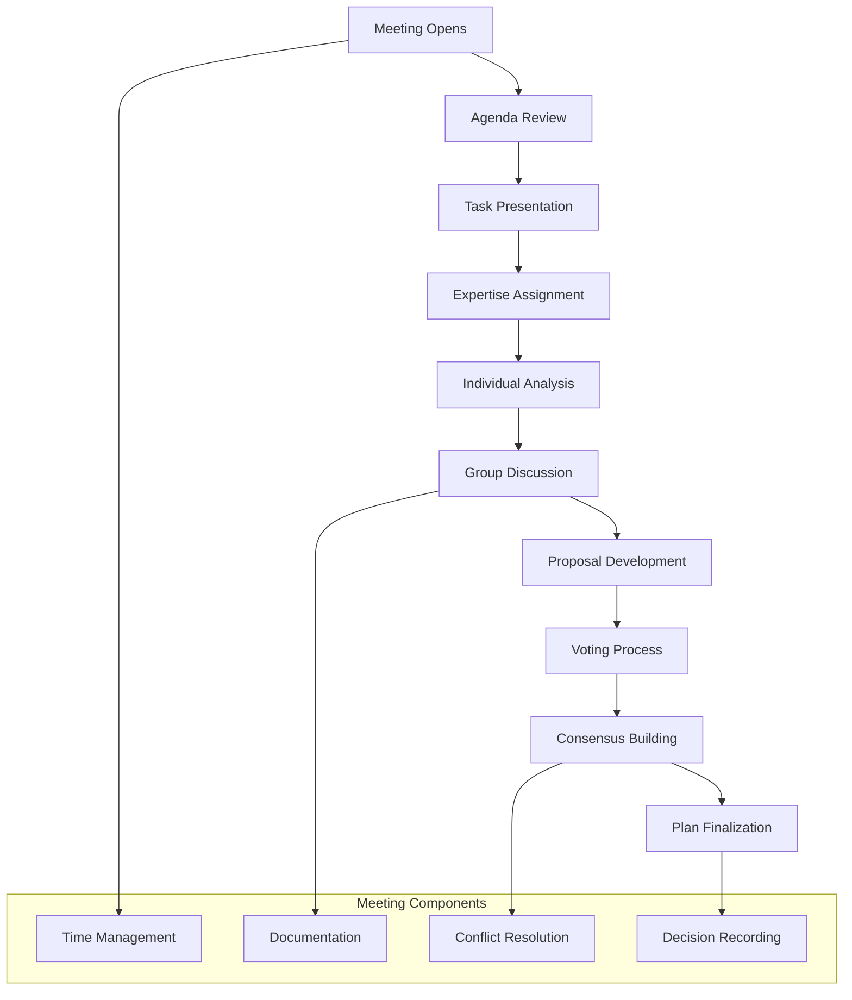
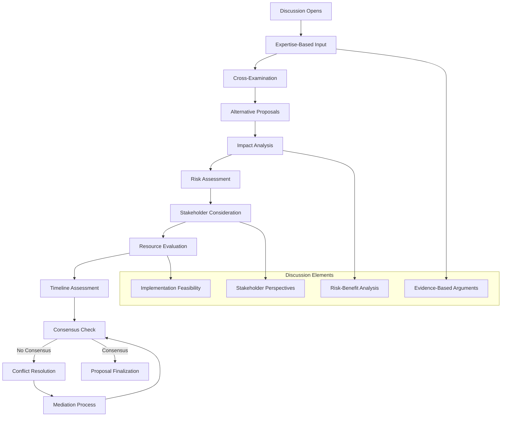
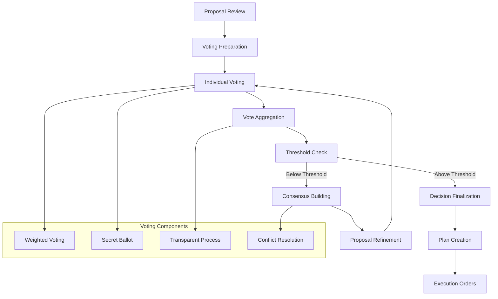
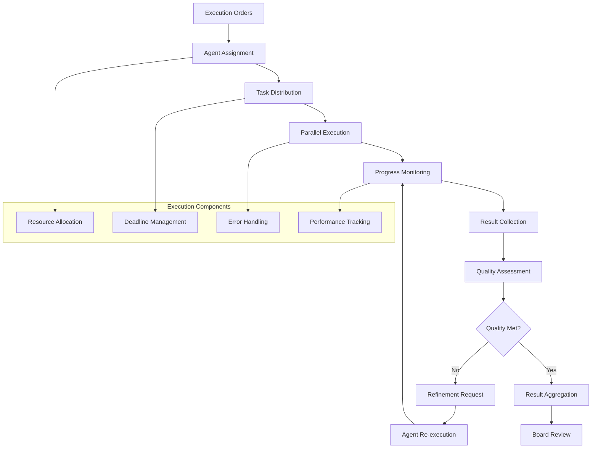

# Board of Directors Workflow

The Board of Directors workflow is a sophisticated multi-stage process that ensures comprehensive task analysis, collaborative decision-making, and effective execution through specialized agents. This workflow implements a corporate governance model that balances efficiency with thoroughness, ensuring high-quality outcomes through structured collaboration.

## Workflow Overview



**Diagram Explanation:**
This high-level workflow diagram shows the complete lifecycle of a task through the Board of Directors system. The process begins with task input, followed by an initial assessment to understand requirements and complexity. The board then assembles with appropriate members, conducts a structured meeting phase for analysis and discussion, makes decisions through voting and consensus, executes the plan through specialized agents, reviews results, and either approves for final delivery or returns to refinement loops for improvement.

**Technical Implementation Details:**
- **Task Input Validation**: System validates task format, requirements, and constraints
- **Dynamic Board Assembly**: Board members are selected based on task requirements and availability
- **Structured Meeting Protocol**: Follows corporate governance best practices
- **Iterative Refinement**: Quality gates ensure output meets standards before final delivery

## Phase 1: Initial Assessment

### Task Analysis and Board Preparation



**Diagram Explanation:**
This flowchart illustrates the systematic approach to task analysis and board preparation. When a task is received, the system performs a comprehensive assessment including complexity evaluation, resource requirement analysis, expertise mapping, and board member selection. The assessment criteria include task complexity, time constraints, resource availability, and specific expertise requirements needed for successful completion.

**Technical Implementation:**
```python
# Example: Task assessment implementation
class TaskAssessment:
    def __init__(self):
        self.complexity_metrics = {
            "scope": 0.0,      # Task scope (0-1)
            "technical_depth": 0.0,  # Technical complexity (0-1)
            "stakeholder_count": 0,  # Number of stakeholders
            "timeline_constraints": 0.0,  # Time pressure (0-1)
            "resource_intensity": 0.0  # Resource requirements (0-1)
        }
    
    def assess_task(self, task_description):
        """Assess task complexity and requirements"""
        assessment = {
            "complexity_score": self.calculate_complexity(),
            "required_expertise": self.identify_expertise_needs(),
            "resource_requirements": self.estimate_resources(),
            "timeline_estimate": self.estimate_timeline(),
            "recommended_board_size": self.calculate_board_size()
        }
        return assessment
    
    def calculate_complexity(self):
        """Calculate overall task complexity score"""
        weights = {
            "scope": 0.25,
            "technical_depth": 0.3,
            "stakeholder_count": 0.15,
            "timeline_constraints": 0.2,
            "resource_intensity": 0.1
        }
        
        complexity_score = sum(
            self.complexity_metrics[key] * weights[key]
            for key in weights
        )
        return min(complexity_score, 1.0)
    
    def identify_expertise_needs(self):
        """Identify required expertise areas"""
        expertise_areas = []
        
        if self.complexity_metrics["technical_depth"] > 0.5:
            expertise_areas.append("technical")
        
        if self.complexity_metrics["stakeholder_count"] > 3:
            expertise_areas.append("stakeholder_management")
        
        if self.complexity_metrics["resource_intensity"] > 0.5:
            expertise_areas.append("resource_management")
        
        return expertise_areas
```

### Board Member Activation



**Diagram Explanation:**
This sequence diagram shows the systematic process of board member activation and preparation. The system notifies the Chairman of a new task, who then assesses requirements and determines which board members are needed. The system activates relevant members, who confirm their availability. The Chairman prepares the agent pool and confirms readiness before declaring the board ready for the meeting.

**Technical Implementation:**
```python
# Example: Board member activation system
class BoardActivation:
    def __init__(self, board_members, agents):
        self.board_members = board_members
        self.agents = agents
        self.activation_status = {}
    
    async def activate_board(self, task_assessment):
        """Activate board members based on task requirements"""
        # Determine required members
        required_members = self.select_required_members(task_assessment)
        
        # Activate members
        activation_results = []
        for member in required_members:
            status = await self.activate_member(member, task_assessment)
            activation_results.append(status)
        
        # Prepare agent pool
        agent_pool = self.prepare_agent_pool(task_assessment)
        
        # Confirm readiness
        readiness_status = await self.confirm_readiness(activation_results, agent_pool)
        
        return {
            "board_ready": readiness_status["ready"],
            "active_members": readiness_status["active_members"],
            "agent_pool": readiness_status["agent_pool"],
            "estimated_start_time": readiness_status["start_time"]
        }
    
    def select_required_members(self, assessment):
        """Select board members based on task requirements"""
        required_members = ["CHAIRMAN"]  # Chairman always required
        
        if assessment["complexity_score"] > 0.7:
            required_members.extend(["VICE_CHAIRMAN", "EXECUTIVE_DIRECTOR"])
        
        if "technical" in assessment["required_expertise"]:
            required_members.append("TECHNICAL_DIRECTOR")
        
        if "financial" in assessment["required_expertise"]:
            required_members.append("TREASURER")
        
        if assessment["stakeholder_count"] > 5:
            required_members.append("SECRETARY")
        
        return list(set(required_members))  # Remove duplicates
    
    async def activate_member(self, member_role, assessment):
        """Activate individual board member"""
        member = self.board_members.get(member_role)
        if not member:
            return {"status": "error", "message": f"Member {member_role} not found"}
        
        # Check availability
        availability = await member.check_availability()
        if not availability["available"]:
            return {"status": "unavailable", "member": member_role, "reason": availability["reason"]}
        
        # Prepare member for task
        preparation_status = await member.prepare_for_task(assessment)
        
        return {
            "status": "activated",
            "member": member_role,
            "preparation_time": preparation_status["preparation_time"],
            "expertise_areas": preparation_status["expertise_areas"]
        }
```

## Phase 2: Board Meeting

### Meeting Structure



**Diagram Explanation:**
This diagram shows the structured meeting process that follows corporate governance best practices. The meeting begins with agenda review and task presentation, followed by expertise assignment where board members are given specific areas to analyze. Individual analysis leads to group discussion, proposal development, voting, consensus building, and plan finalization. Throughout the process, time management, documentation, conflict resolution, and decision recording ensure effective governance.

**Technical Implementation:**
```python
# Example: Meeting management system
class BoardMeeting:
    def __init__(self, board_members, task, config):
        self.board_members = board_members
        self.task = task
        self.config = config
        self.meeting_phases = []
        self.decisions = []
        self.documentation = {}
    
    async def conduct_meeting(self):
        """Conduct the board meeting following structured phases"""
        meeting_result = {
            "phases": [],
            "decisions": [],
            "documentation": {},
            "consensus_achieved": False,
            "final_plan": None
        }
        
        # Phase 1: Meeting Opening and Agenda Review
        opening_phase = await self.conduct_opening_phase()
        meeting_result["phases"].append(opening_phase)
        
        # Phase 2: Task Presentation and Expertise Assignment
        presentation_phase = await self.conduct_presentation_phase()
        meeting_result["phases"].append(presentation_phase)
        
        # Phase 3: Individual Analysis
        analysis_phase = await self.conduct_analysis_phase()
        meeting_result["phases"].append(analysis_phase)
        
        # Phase 4: Group Discussion
        discussion_phase = await self.conduct_discussion_phase()
        meeting_result["phases"].append(discussion_phase)
        
        # Phase 5: Proposal Development
        proposal_phase = await self.conduct_proposal_phase()
        meeting_result["phases"].append(proposal_phase)
        
        # Phase 6: Voting and Consensus
        voting_phase = await self.conduct_voting_phase()
        meeting_result["phases"].append(voting_phase)
        
        # Phase 7: Plan Finalization
        finalization_phase = await self.conduct_finalization_phase()
        meeting_result["phases"].append(finalization_phase)
        
        meeting_result["decisions"] = self.decisions
        meeting_result["documentation"] = self.documentation
        meeting_result["consensus_achieved"] = voting_phase["consensus_achieved"]
        meeting_result["final_plan"] = finalization_phase["final_plan"]
        
        return meeting_result
    
    async def conduct_opening_phase(self):
        """Conduct meeting opening and agenda review"""
        chairman = self.board_members["CHAIRMAN"]
        
        # Open meeting
        opening_statement = await chairman.open_meeting(self.task)
        
        # Review agenda
        agenda_review = await chairman.review_agenda(self.task)
        
        # Set meeting parameters
        meeting_params = {
            "time_limit": self.config.get("meeting_time_limit", 3600),  # 1 hour default
            "voting_threshold": self.config.get("voting_threshold", 0.7),
            "consensus_method": self.config.get("consensus_method", "majority")
        }
        
        return {
            "phase": "opening",
            "opening_statement": opening_statement,
            "agenda_review": agenda_review,
            "meeting_params": meeting_params,
            "timestamp": datetime.now().isoformat()
        }
    
    async def conduct_presentation_phase(self):
        """Conduct task presentation and expertise assignment"""
        chairman = self.board_members["CHAIRMAN"]
        
        # Present task details
        task_presentation = await chairman.present_task(self.task)
        
        # Assign expertise areas
        expertise_assignments = await chairman.assign_expertise_areas(
            self.board_members, self.task
        )
        
        return {
            "phase": "presentation",
            "task_presentation": task_presentation,
            "expertise_assignments": expertise_assignments,
            "timestamp": datetime.now().isoformat()
        }
```

### Discussion and Debate Process



**Diagram Explanation:**
This flowchart details the discussion and debate process that ensures thorough consideration of all aspects before decision-making. The process begins with expertise-based input from each board member, followed by cross-examination to validate claims. Alternative proposals are considered, and comprehensive impact analysis, risk assessment, stakeholder consideration, resource evaluation, and timeline assessment are conducted. If consensus isn't reached, conflict resolution and mediation processes are employed until agreement is achieved.

**Technical Implementation:**
```python
# Example: Discussion and debate management
class DiscussionManager:
    def __init__(self, board_members, config):
        self.board_members = board_members
        self.config = config
        self.discussion_points = []
        self.conflicts = []
        self.consensus_status = False
    
    async def conduct_discussion(self, task, expertise_assignments):
        """Conduct structured discussion and debate"""
        discussion_result = {
            "phases": [],
            "consensus_achieved": False,
            "final_proposal": None,
            "conflicts_resolved": []
        }
        
        # Phase 1: Expertise-based input
        expertise_input = await self.gather_expertise_input(task, expertise_assignments)
        discussion_result["phases"].append(expertise_input)
        
        # Phase 2: Cross-examination
        cross_examination = await self.conduct_cross_examination(expertise_input)
        discussion_result["phases"].append(cross_examination)
        
        # Phase 3: Alternative proposals
        alternatives = await self.generate_alternatives(task, expertise_input)
        discussion_result["phases"].append(alternatives)
        
        # Phase 4: Comprehensive analysis
        analysis = await self.conduct_comprehensive_analysis(task, alternatives)
        discussion_result["phases"].append(analysis)
        
        # Phase 5: Consensus building
        consensus = await self.build_consensus(analysis)
        discussion_result["phases"].append(consensus)
        
        discussion_result["consensus_achieved"] = consensus["achieved"]
        discussion_result["final_proposal"] = consensus["final_proposal"]
        discussion_result["conflicts_resolved"] = consensus["conflicts_resolved"]
        
        return discussion_result
    
    async def gather_expertise_input(self, task, expertise_assignments):
        """Gather input from each board member based on their expertise"""
        expertise_inputs = {}
        
        for member_role, expertise_areas in expertise_assignments.items():
            member = self.board_members[member_role]
            
            # Generate expertise-based analysis
            analysis = await member.analyze_task_areas(task, expertise_areas)
            
            expertise_inputs[member_role] = {
                "expertise_areas": expertise_areas,
                "analysis": analysis,
                "recommendations": analysis.get("recommendations", []),
                "concerns": analysis.get("concerns", []),
                "proposals": analysis.get("proposals", [])
            }
        
        return {
            "phase": "expertise_input",
            "inputs": expertise_inputs,
            "timestamp": datetime.now().isoformat()
        }
    
    async def conduct_cross_examination(self, expertise_input):
        """Conduct cross-examination of expertise inputs"""
        cross_examination_results = {}
        
        for member_role, input_data in expertise_input["inputs"].items():
            member = self.board_members[member_role]
            
            # Other members examine this member's input
            examinations = []
            for examiner_role, examiner in self.board_members.items():
                if examiner_role != member_role:
                    examination = await examiner.examine_input(
                        input_data, member_role
                    )
                    examinations.append({
                        "examiner": examiner_role,
                        "examination": examination
                    })
            
            cross_examination_results[member_role] = {
                "original_input": input_data,
                "examinations": examinations,
                "validation_status": self.assess_validation_status(examinations)
            }
        
        return {
            "phase": "cross_examination",
            "results": cross_examination_results,
            "timestamp": datetime.now().isoformat()
        }
    
    async def generate_alternatives(self, task, expertise_input):
        """Generate alternative proposals based on expertise input"""
        alternatives = []
        
        # Generate alternatives from each expertise area
        for member_role, input_data in expertise_input["inputs"].items():
            member = self.board_members[member_role]
            
            member_alternatives = await member.generate_alternatives(
                task, input_data
            )
            
            alternatives.extend(member_alternatives)
        
        # Combine and synthesize alternatives
        synthesized_alternatives = await self.synthesize_alternatives(alternatives)
        
        return {
            "phase": "alternatives",
            "individual_alternatives": alternatives,
            "synthesized_alternatives": synthesized_alternatives,
            "timestamp": datetime.now().isoformat()
        }
```

## Phase 3: Decision Making

### Voting and Consensus Process



**Diagram Explanation:**
This diagram shows the structured voting and consensus process that ensures fair and transparent decision-making. The process begins with proposal review and voting preparation, followed by individual voting where each board member casts their vote. Votes are aggregated and checked against the consensus threshold. If the threshold isn't met, consensus building and proposal refinement processes are initiated. Once the threshold is achieved, the decision is finalized, a plan is created, and execution orders are generated.

**Technical Implementation:**
```python
# Example: Voting and consensus system
class VotingSystem:
    def __init__(self, board_members, config):
        self.board_members = board_members
        self.config = config
        self.voting_history = []
        self.consensus_threshold = config.get("voting_threshold", 0.7)
        self.voting_weights = config.get("voting_weights", {})
    
    async def conduct_voting(self, proposals):
        """Conduct voting on proposals"""
        voting_result = {
            "rounds": [],
            "final_decision": None,
            "consensus_achieved": False,
            "voting_summary": {}
        }
        
        current_proposals = proposals
        round_number = 1
        
        while round_number <= self.config.get("max_voting_rounds", 3):
            # Conduct voting round
            round_result = await self.conduct_voting_round(
                current_proposals, round_number
            )
            voting_result["rounds"].append(round_result)
            
            # Check if consensus achieved
            if round_result["consensus_achieved"]:
                voting_result["final_decision"] = round_result["winning_proposal"]
                voting_result["consensus_achieved"] = True
                break
            
            # Refine proposals for next round
            current_proposals = await self.refine_proposals(
                current_proposals, round_result
            )
            
            round_number += 1
        
        # Generate voting summary
        voting_result["voting_summary"] = self.generate_voting_summary(
            voting_result["rounds"]
        )
        
        return voting_result
    
    async def conduct_voting_round(self, proposals, round_number):
        """Conduct a single voting round"""
        round_result = {
            "round": round_number,
            "proposals": proposals,
            "votes": {},
            "aggregated_results": {},
            "consensus_achieved": False,
            "winning_proposal": None
        }
        
        # Collect votes from each board member
        for member_role, member in self.board_members.items():
            vote = await member.vote_on_proposals(proposals, round_number)
            round_result["votes"][member_role] = vote
        
        # Aggregate votes
        aggregated_results = self.aggregate_votes(
            round_result["votes"], proposals
        )
        round_result["aggregated_results"] = aggregated_results
        
        # Check consensus
        consensus_check = self.check_consensus(aggregated_results)
        round_result["consensus_achieved"] = consensus_check["achieved"]
        round_result["winning_proposal"] = consensus_check["winning_proposal"]
        
        return round_result
    
    def aggregate_votes(self, votes, proposals):
        """Aggregate votes using weighted voting system"""
        aggregated_results = {}
        
        for proposal_id in [p["id"] for p in proposals]:
            total_weighted_score = 0
            total_weight = 0
            vote_counts = {}
            
            for member_role, vote in votes.items():
                member_weight = self.voting_weights.get(member_role, 1.0)
                
                if proposal_id in vote["scores"]:
                    score = vote["scores"][proposal_id]
                    weighted_score = score * member_weight
                    total_weighted_score += weighted_score
                    total_weight += member_weight
                    
                    # Track vote distribution
                    vote_counts[member_role] = {
                        "score": score,
                        "weight": member_weight,
                        "weighted_score": weighted_score
                    }
            
            # Calculate final score
            final_score = total_weighted_score / total_weight if total_weight > 0 else 0
            
            aggregated_results[proposal_id] = {
                "final_score": final_score,
                "total_weight": total_weight,
                "vote_counts": vote_counts,
                "consensus_percentage": final_score
            }
        
        return aggregated_results
    
    def check_consensus(self, aggregated_results):
        """Check if consensus threshold is met"""
        best_proposal = None
        best_score = 0
        
        for proposal_id, result in aggregated_results.items():
            if result["final_score"] > best_score:
                best_score = result["final_score"]
                best_proposal = proposal_id
        
        consensus_achieved = best_score >= self.consensus_threshold
        
        return {
            "achieved": consensus_achieved,
            "winning_proposal": best_proposal if consensus_achieved else None,
            "best_score": best_score,
            "threshold": self.consensus_threshold
        }
```

## Phase 4: Execution and Monitoring

### Agent Execution Management



**Diagram Explanation:**
This diagram illustrates the execution and monitoring phase where the board's decisions are implemented through specialized agents. Execution orders are created and distributed to appropriate agents, who execute tasks in parallel while being monitored for progress. Results are collected, assessed for quality, and either approved or sent back for refinement. Once quality standards are met, results are aggregated and presented to the board for final review.

**Technical Implementation:**
```python
# Example: Execution management system
class ExecutionManager:
    def __init__(self, agents, config):
        self.agents = agents
        self.config = config
        self.execution_status = {}
        self.performance_metrics = {}
    
    async def execute_plan(self, execution_plan):
        """Execute the board's approved plan"""
        execution_result = {
            "phases": [],
            "final_results": None,
            "quality_metrics": {},
            "performance_summary": {}
        }
        
        # Phase 1: Agent assignment and task distribution
        assignment_phase = await self.assign_agents(execution_plan)
        execution_result["phases"].append(assignment_phase)
        
        # Phase 2: Parallel execution with monitoring
        execution_phase = await self.execute_tasks(assignment_phase["assignments"])
        execution_result["phases"].append(execution_phase)
        
        # Phase 3: Result collection and quality assessment
        assessment_phase = await self.assess_results(execution_phase["results"])
        execution_result["phases"].append(assessment_phase)
        
        # Phase 4: Result aggregation and board review
        review_phase = await self.prepare_board_review(assessment_phase)
        execution_result["phases"].append(review_phase)
        
        execution_result["final_results"] = review_phase["final_results"]
        execution_result["quality_metrics"] = assessment_phase["quality_metrics"]
        execution_result["performance_summary"] = execution_phase["performance_summary"]
        
        return execution_result
    
    async def assign_agents(self, execution_plan):
        """Assign agents to tasks based on execution plan"""
        assignments = {}
        
        for task_id, task_details in execution_plan["tasks"].items():
            # Select appropriate agent based on task requirements
            selected_agent = await self.select_agent_for_task(task_details)
            
            # Prepare task assignment
            assignment = {
                "task_id": task_id,
                "agent": selected_agent,
                "task_details": task_details,
                "deadline": task_details.get("deadline"),
                "priority": task_details.get("priority", "normal"),
                "resources": task_details.get("resources", []),
                "expected_output": task_details.get("expected_output")
            }
            
            assignments[task_id] = assignment
        
        return {
            "phase": "agent_assignment",
            "assignments": assignments,
            "timestamp": datetime.now().isoformat()
        }
    
    async def execute_tasks(self, assignments):
        """Execute tasks in parallel with monitoring"""
        execution_tasks = []
        execution_results = {}
        performance_metrics = {}
        
        # Create execution tasks
        for task_id, assignment in assignments.items():
            task = self.create_execution_task(assignment)
            execution_tasks.append(task)
        
        # Execute tasks in parallel
        results = await asyncio.gather(*execution_tasks, return_exceptions=True)
        
        # Process results
        for i, result in enumerate(results):
            task_id = list(assignments.keys())[i]
            
            if isinstance(result, Exception):
                execution_results[task_id] = {
                    "status": "error",
                    "error": str(result),
                    "retry_count": 0
                }
            else:
                execution_results[task_id] = {
                    "status": "completed",
                    "result": result,
                    "execution_time": result.get("execution_time"),
                    "quality_score": result.get("quality_score")
                }
            
            # Collect performance metrics
            performance_metrics[task_id] = self.collect_performance_metrics(
                task_id, result
            )
        
        return {
            "phase": "task_execution",
            "results": execution_results,
            "performance_summary": self.summarize_performance(performance_metrics),
            "timestamp": datetime.now().isoformat()
        }
    
    async def assess_results(self, execution_results):
        """Assess quality of execution results"""
        quality_metrics = {}
        overall_quality_score = 0
        total_tasks = len(execution_results)
        
        for task_id, result in execution_results.items():
            if result["status"] == "completed":
                # Assess individual task quality
                task_quality = await self.assess_task_quality(result)
                quality_metrics[task_id] = task_quality
                overall_quality_score += task_quality["overall_score"]
            else:
                quality_metrics[task_id] = {
                    "overall_score": 0,
                    "completeness": 0,
                    "accuracy": 0,
                    "relevance": 0,
                    "issues": ["Task failed to execute"]
                }
        
        # Calculate overall quality
        overall_quality_score = overall_quality_score / total_tasks if total_tasks > 0 else 0
        
        return {
            "phase": "quality_assessment",
            "quality_metrics": quality_metrics,
            "overall_quality_score": overall_quality_score,
            "quality_threshold_met": overall_quality_score >= self.config.get("quality_threshold", 0.8),
            "timestamp": datetime.now().isoformat()
        }
```

## Best Practices and Optimization

### Performance Optimization Strategies

1. **Parallel Execution**: Maximize parallel agent execution for faster results
2. **Resource Pooling**: Implement agent pooling for better resource utilization
3. **Caching**: Cache common analysis results to avoid redundant computation
4. **Load Balancing**: Distribute tasks evenly across available agents

### Quality Assurance

1. **Quality Gates**: Implement quality checkpoints throughout the process
2. **Peer Review**: Enable peer review mechanisms for critical decisions
3. **Validation**: Validate outputs against predefined criteria
4. **Continuous Improvement**: Learn from previous executions to improve future performance

### Monitoring and Analytics

```python
# Example: Performance monitoring system
class PerformanceMonitor:
    def __init__(self):
        self.metrics = {
            "execution_times": [],
            "quality_scores": [],
            "consensus_rounds": [],
            "error_rates": []
        }
    
    def track_execution_time(self, phase, duration):
        """Track execution time for different phases"""
        self.metrics["execution_times"].append({
            "phase": phase,
            "duration": duration,
            "timestamp": datetime.now().isoformat()
        })
    
    def track_quality_score(self, score):
        """Track quality scores"""
        self.metrics["quality_scores"].append({
            "score": score,
            "timestamp": datetime.now().isoformat()
        })
    
    def generate_performance_report(self):
        """Generate comprehensive performance report"""
        return {
            "average_execution_time": self.calculate_average_execution_time(),
            "quality_trends": self.analyze_quality_trends(),
            "consensus_efficiency": self.analyze_consensus_efficiency(),
            "error_analysis": self.analyze_errors(),
            "recommendations": self.generate_recommendations()
        }
``` 