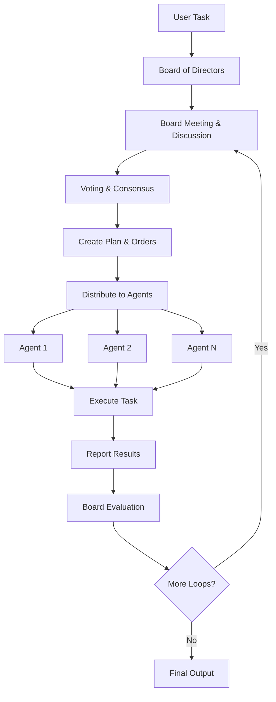

# Board of Directors - Multi-Agent Architecture

The Board of Directors is a sophisticated multi-agent architecture that implements collective decision-making through democratic processes, voting mechanisms, and role-based leadership. This architecture provides an alternative to single-director patterns by enabling collaborative intelligence through structured governance.

## 🏛️ Overview

The Board of Directors architecture follows a democratic workflow pattern:

1. **Task Reception**: User provides a task to the swarm
2. **Board Meeting**: Board of Directors convenes to discuss and create a plan
3. **Voting & Consensus**: Board members vote and reach consensus on task distribution
4. **Order Distribution**: Board distributes orders to specialized worker agents
5. **Execution**: Individual agents execute their assigned tasks
6. **Feedback Loop**: Board evaluates results and issues new orders if needed (up to `max_loops`)
7. **Context Preservation**: All conversation history and context is maintained throughout the process

## 🏗️ Architecture Components

### Core Components

| Component | Description | Purpose |
|-----------|-------------|---------|
| **[BoardOfDirectorsSwarm](board_of_directors_swarm.md)** | Main orchestration class | Manages the entire board workflow and agent coordination |
| **[Board Member Roles](board_of_directors_roles.md)** | Role definitions and hierarchy | Defines responsibilities and voting weights for each board member |
| **[Decision Making Process](board_of_directors_decision_making.md)** | Voting and consensus mechanisms | Implements democratic decision-making with weighted voting |
| **[Workflow Management](board_of_directors_workflow.md)** | Process orchestration | Manages the complete lifecycle from task reception to final delivery |

### Architecture Diagram



## 🎯 Key Features

### Democratic Decision Making
- **Collective Intelligence**: Multiple perspectives through board member collaboration
- **Weighted Voting**: Different voting weights based on roles and expertise
- **Consensus Building**: Support for both majority voting and consensus approaches
- **Conflict Resolution**: Structured processes for handling disagreements

### Role-Based Leadership
- **Hierarchical Structure**: Clear roles with defined responsibilities
- **Specialized Expertise**: Each board member brings unique domain knowledge
- **Authority Distribution**: Balanced power distribution across roles
- **Accountability**: Clear lines of responsibility and decision ownership

### Operational Excellence
- **Iterative Refinement**: Multiple feedback loops for improved results
- **Context Preservation**: Full conversation history maintained
- **Flexible Output Formats**: Support for various output types (dict, str, list)
- **Comprehensive Logging**: Detailed logging for debugging and monitoring

## 👥 Board Member Roles

The Board of Directors supports various roles with different responsibilities and voting weights:

| Role | Description | Voting Weight | Responsibilities |
|------|-------------|---------------|------------------|
| `CHAIRMAN` | Primary leader responsible for board meetings and final decisions | 1.5 | Leading meetings, facilitating consensus, making final decisions |
| `VICE_CHAIRMAN` | Secondary leader who supports the chairman | 1.2 | Supporting chairman, coordinating operations |
| `SECRETARY` | Responsible for documentation and meeting minutes | 1.0 | Documenting meetings, maintaining records |
| `TREASURER` | Manages financial aspects and resource allocation | 1.0 | Financial oversight, resource management |
| `EXECUTIVE_DIRECTOR` | Executive-level board member with operational authority | 1.5 | Strategic planning, operational oversight |
| `MEMBER` | General board member with specific expertise | 1.0 | Contributing expertise, participating in decisions |

## 🚀 Quick Start

### Basic Setup

```python
from swarms import Agent
from swarms.structs.board_of_directors_swarm import (
    BoardOfDirectorsSwarm,
    BoardMember,
    BoardMemberRole
)
from swarms.config.board_config import enable_board_feature

# Enable the Board of Directors feature
enable_board_feature()

# Create board members with specific roles
chairman = Agent(
    agent_name="Chairman",
    agent_description="Chairman of the Board responsible for leading meetings",
    model_name="gpt-4o-mini",
    system_prompt="You are the Chairman of the Board..."
)

vice_chairman = Agent(
    agent_name="Vice-Chairman",
    agent_description="Vice Chairman who supports the Chairman",
    model_name="gpt-4o-mini",
    system_prompt="You are the Vice Chairman..."
)

# Create BoardMember objects with roles and expertise
board_members = [
    BoardMember(chairman, BoardMemberRole.CHAIRMAN, 1.5, ["leadership", "strategy"]),
    BoardMember(vice_chairman, BoardMemberRole.VICE_CHAIRMAN, 1.2, ["operations", "coordination"]),
]

# Create worker agents
research_agent = Agent(
    agent_name="Research-Specialist",
    agent_description="Expert in market research and analysis",
    model_name="gpt-4o",
)

financial_agent = Agent(
    agent_name="Financial-Analyst",
    agent_description="Specialist in financial analysis and valuation",
    model_name="gpt-4o",
)

# Initialize the Board of Directors swarm
board_swarm = BoardOfDirectorsSwarm(
    name="Executive_Board_Swarm",
    description="Executive board with specialized roles for strategic decision-making",
    board_members=board_members,
    agents=[research_agent, financial_agent],
    max_loops=2,
    verbose=True,
    decision_threshold=0.6,
    enable_voting=True,
    enable_consensus=True,
)

# Execute a complex task with democratic decision-making
result = board_swarm.run(task="Analyze the market potential for Tesla (TSLA) stock")
print(result)
```

## 📋 Use Cases

### Corporate Governance
- **Strategic Planning**: Long-term business strategy development
- **Risk Management**: Comprehensive risk assessment and mitigation
- **Resource Allocation**: Optimal distribution of company resources
- **Performance Oversight**: Monitoring and evaluating organizational performance

### Financial Analysis
- **Portfolio Management**: Investment portfolio optimization and rebalancing
- **Market Analysis**: Comprehensive market research and trend analysis
- **Risk Assessment**: Financial risk evaluation and management
- **Compliance Monitoring**: Regulatory compliance and audit preparation

### Research & Development
- **Technology Assessment**: Evaluation of emerging technologies
- **Product Development**: Strategic product planning and development
- **Innovation Management**: Managing innovation pipelines and initiatives
- **Quality Assurance**: Ensuring high standards across development processes

### Project Management
- **Complex Project Planning**: Multi-faceted project strategy development
- **Resource Optimization**: Efficient allocation of project resources
- **Stakeholder Management**: Coordinating diverse stakeholder interests
- **Risk Mitigation**: Identifying and addressing project risks

## ⚙️ Configuration

### Decision Thresholds
- **Default Threshold**: 60% consensus required for decisions
- **Configurable**: Adjustable based on organizational needs
- **Role-Based**: Different thresholds for different types of decisions
- **Fallback Mechanisms**: Chairman can make final decisions when consensus fails

### Voting Mechanisms
- **Weighted Voting**: Different voting weights based on roles
- **Consensus Building**: Support for both majority and consensus approaches
- **Conflict Resolution**: Structured processes for handling disagreements
- **Transparency**: Clear visibility into decision-making processes

### Operational Settings
- **Meeting Duration**: Configurable board meeting time limits
- **Participation Requirements**: Minimum participation rates for valid decisions
- **Feedback Loops**: Multiple iterations for complex problem-solving
- **Documentation**: Comprehensive record-keeping of all decisions

## 🔧 Advanced Features

### Custom Board Templates
Pre-configured board templates for common use cases:

```python
from swarms.config.board_config import get_default_board_template

# Get a financial analysis board template
financial_board = get_default_board_template("financial_analysis")

# Get a strategic planning board template
strategic_board = get_default_board_template("strategic_planning")
```

### Dynamic Role Assignment
Automatically assign roles based on task requirements:

```python
# Board members are automatically assigned roles based on expertise
board_swarm = BoardOfDirectorsSwarm(
    board_members=board_members,
    auto_assign_roles=True,
    role_mapping={
        "financial_analysis": ["Treasurer", "Financial_Member"],
        "strategic_planning": ["Chairman", "Executive_Director"]
    }
)
```

### Consensus Optimization
Advanced consensus-building mechanisms:

```python
# Enable advanced consensus features
board_swarm = BoardOfDirectorsSwarm(
    enable_consensus=True,
    consensus_timeout=300,  # 5 minutes
    min_participation_rate=0.5,  # 50% minimum participation
    auto_fallback_to_chairman=True
)
```

## 📊 Performance Monitoring

### Decision Metrics
- **Consensus Rate**: Percentage of decisions reached by consensus
- **Voting Participation**: Board member participation rates
- **Decision Quality**: Assessment of decision outcomes
- **Execution Efficiency**: Time from decision to implementation

### Operational Metrics
- **Meeting Duration**: Average board meeting length
- **Agent Utilization**: How effectively worker agents are utilized
- **Feedback Loop Efficiency**: Speed of iterative improvements
- **Resource Optimization**: Efficient use of computational resources

## 🛠️ Troubleshooting

### Common Issues

1. **Consensus Failures**: Lower decision threshold or increase timeout
2. **Role Conflicts**: Ensure clear role definitions and responsibilities
3. **Agent Coordination**: Verify agent communication and task distribution
4. **Performance Issues**: Monitor resource usage and optimize configurations

### Best Practices

1. **Role Clarity**: Define clear responsibilities for each board member
2. **Expertise Alignment**: Match board member expertise to task requirements
3. **Consensus Building**: Allow adequate time for discussion and consensus
4. **Documentation**: Maintain comprehensive records of all decisions
5. **Continuous Improvement**: Learn from each execution cycle

## 📚 Documentation Sections

- **[BoardOfDirectorsSwarm](board_of_directors_swarm.md)**: Complete API reference and implementation details
- **[Board Member Roles](board_of_directors_roles.md)**: Detailed role definitions and responsibilities
- **[Decision Making Process](board_of_directors_decision_making.md)**: Voting mechanisms and consensus building
- **[Workflow Management](board_of_directors_workflow.md)**: Complete process orchestration guide

## 🎯 Success Criteria

A successful Board of Directors implementation should demonstrate:

- ✅ **Democratic Decision Making**: All board members contribute to decisions
- ✅ **Consensus Achievement**: Decisions reached through collaborative processes
- ✅ **Role Effectiveness**: Each board member fulfills their responsibilities
- ✅ **Agent Coordination**: Worker agents execute tasks efficiently
- ✅ **Quality Output**: High-quality results through collective intelligence
- ✅ **Process Transparency**: Clear visibility into decision-making processes

---

The Board of Directors architecture represents a sophisticated approach to multi-agent collaboration, enabling organizations to leverage collective intelligence through structured governance and democratic decision-making processes. 