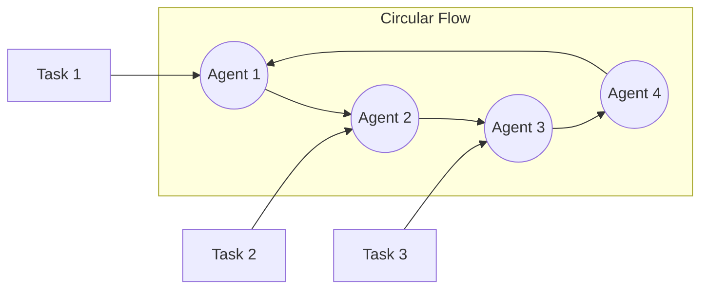

# `CircularSwarm`


The `CircularSwarm` is a multi-agent orchestration pattern that implements a circular workflow where agents process tasks in a round-robin manner. Each task is passed through all agents in sequence, creating a circular information flow pattern that ensures every agent processes every task.





## Overview


The Circular Swarm follows a clear workflow pattern:


1. **Task Distribution**: Each task is distributed to the first agent in the sequence
2. **Circular Processing**: Each agent processes the task and passes it to the next agent in the circle
3. **Full Coverage**: Every agent processes every task exactly once
4. **Context Preservation**: All conversation history and context is maintained throughout the process
5. **Ordered Execution**: Tasks are processed in a predictable, ordered manner


## Key Features


| Feature                      | Description                                                                                   |
|------------------------------|-----------------------------------------------------------------------------------------------|
| **Circular Flow**            | Tasks move in a circular pattern through all agents                                          |
| **Full Coverage**           | Each agent processes each task exactly once                                                   |
| **Predictable Ordering**    | Maintains strict ordering of task processing                                                  |
| **Context Preservation**     | Full conversation history maintained for each agent                                           |
| **Flexible Output Formats**  | Support for various output types (dict, str, list)                                            |
| **Simple Architecture**     | Easy to understand and implement                                                              |


## Two Implementation Options


The Circular Swarm is available in two forms:


1. **Function-based**: `circular_swarm()` - Simple function for quick usage
2. **Class-based**: `CircularSwarm` - Object-oriented approach with more control


## Function-Based Implementation


### `circular_swarm()`


A simple function that implements circular swarm processing.


#### Parameters


| Parameter | Type | Default | Required | Description |
|-----------|------|---------|----------|-------------|
| `agents` | `AgentListType` | - | **Yes** | List of Agent objects to participate in the swarm |
| `tasks` | `List[str]` | - | **Yes** | List of tasks to be processed by the agents |
| `output_type` | `OutputType` | `"dict"` | No | Format for output (dict, str, list) |


#### Returns


| Type | Description |
|------|-------------|
| `Union[Dict[str, Any], List[str]]` | The formatted output of the swarm's processing. If output_type is "dict", returns a dictionary containing the conversation history. If output_type is "list", returns a list of responses. |


#### Raises


| Exception | Condition |
|-----------|-----------|
| `ValueError` | If agents or tasks lists are empty |


#### Example


```python
from swarms import Agent
from swarms.structs.swarming_architectures import circular_swarm


# Create specialized agents
research_agent = Agent(
   agent_name="Researcher",
   system_prompt="You are a research specialist. Analyze and gather information.",
   model_name="gpt-4o-mini",
)


analysis_agent = Agent(
   agent_name="Analyst",
   system_prompt="You are a data analyst. Analyze data and provide insights.",
   model_name="gpt-4o-mini",
)


writing_agent = Agent(
   agent_name="Writer",
   system_prompt="You are a technical writer. Create clear, concise documentation.",
   model_name="gpt-4o-mini",
)


# Execute circular swarm
agents = [research_agent, analysis_agent, writing_agent]
tasks = [
   "Research the latest trends in AI",
   "Analyze market opportunities",
   "Create a summary report"
]


result = circular_swarm(agents, tasks, output_type="dict")
print(result)
```


## Class-Based Implementation


### `CircularSwarm`


An object-oriented implementation that provides more control and configurability.


### Constructor


#### `CircularSwarm.__init__()`


Initializes a new CircularSwarm instance.


##### Parameters


| Parameter | Type | Default | Required | Description |
|-----------|------|---------|----------|-------------|
| `agents` | `AgentListType` | - | **Yes** | List of Agent objects or nested list of Agent objects |
| `name` | `str` | `"CircularSwarm"` | No | The name identifier for this swarm instance |
| `description` | `str` | `"A circular swarm where agents pass tasks in a circular manner"` | No | A description of the swarm's purpose and capabilities |
| `output_type` | `str` | `"dict"` | No | Type of output format, one of 'dict', 'list', 'string', 'json', 'yaml', 'xml', etc. |


##### Returns


| Type | Description |
|------|-------------|
| `CircularSwarm` | A new CircularSwarm instance |


##### Raises


| Exception | Condition |
|-----------|-----------|
| `ValueError` | If no agents are provided |


### Core Methods


### `run()`


Executes the circular swarm with the given tasks.


#### Parameters


| Parameter | Type | Default | Required | Description |
|-----------|------|---------|----------|-------------|
| `tasks` | `List[str]` | - | **Yes** | List of tasks to be processed by the swarm |


#### Returns


| Type | Description |
|------|-------------|
| `Union[Dict, List, str]` | The conversation history in the requested format |


#### Raises


| Exception | Condition |
|-----------|-----------|
| `ValueError` | If agents or tasks lists are empty |


#### Example


```python
from swarms import Agent
from swarms.structs.various_alt_swarms import CircularSwarm


# Create specialized agents
market_agent = Agent(
   agent_name="Market-Analyst",
   agent_description="Expert in market analysis and trends",
   model_name="gpt-4o-mini",
)


risk_agent = Agent(
   agent_name="Risk-Manager",
   agent_description="Specialist in risk assessment and mitigation",
   model_name="gpt-4o-mini",
)


portfolio_agent = Agent(
   agent_name="Portfolio-Manager",
   agent_description="Expert in portfolio optimization",
   model_name="gpt-4o-mini",
)


# Initialize the circular swarm
swarm = CircularSwarm(
   name="Investment-Analysis-Swarm",
   description="A circular swarm for comprehensive investment analysis",
   agents=[market_agent, risk_agent, portfolio_agent],
   output_type="dict",
)


# Execute tasks
tasks = [
   "Analyze Tesla stock performance for Q4 2024",
   "Assess market risks and potential hedging strategies",
   "Recommend portfolio adjustments based on analysis"
]


result = swarm.run(tasks=tasks)
print(result)
```


## Use Cases


### When to Use Circular Swarm


Circular Swarm is ideal for scenarios where:


- **Round-Robin Processing**: You need each agent to process every task in sequence
- **Iterative Refinement**: Tasks benefit from multiple perspectives in a specific order
- **Quality Assurance**: Each task needs to be reviewed by all agents
- **Predictable Workflow**: You need a consistent, ordered processing pattern
- **Simple Coordination**: You want a straightforward, easy-to-understand workflow


### Example Use Cases


1. **Content Review Pipeline**
  - Writer → Editor → Fact-Checker → Publisher
  - Each piece of content goes through all stages


2. **Financial Analysis Workflow**
  - Market Analyst → Risk Assessor → Portfolio Manager → Compliance Officer
  - Each analysis is reviewed by all specialists


3. **Software Development Process**
  - Developer → Code Reviewer → QA Tester → Documentation Writer
  - Each feature goes through all stages


4. **Quality Control Systems**
  - Inspector → Validator → Approver → Archivist
  - Each item is checked by all quality control agents


## Output Types


The `CircularSwarm` supports various output formats through the `output_type` parameter:


| Output Type | Description | Use Case |
|-------------|-------------|----------|
| `"dict"` | Returns conversation history as a dictionary | When you need structured data with full context |
| `"list"` | Returns conversation history as a list | For sequential processing or simple iteration |
| `"str"` | Returns conversation history as a string | For simple text output or logging |
| `"json"` | Returns conversation history as JSON string | For API responses or data exchange |
| `"yaml"` | Returns conversation history as YAML string | For configuration files or documentation |
| `"xml"` | Returns conversation history as XML string | For structured data exchange |


## Advanced Examples


### Financial Analysis Swarm


```python
from swarms import Agent
from swarms.structs.various_alt_swarms import CircularSwarm


# Create specialized financial agents
market_research_agent = Agent(
   agent_name="Market-Research-Specialist",
   agent_description="Expert in market research, trend analysis, and competitive intelligence",
   system_prompt="""You are a senior market research specialist with expertise in:
   - Market trend analysis and forecasting
   - Competitive landscape assessment
   - Consumer behavior analysis
   - Industry report generation""",
   model_name="gpt-4o-mini",
)


financial_analyst_agent = Agent(
   agent_name="Financial-Analyst",
   agent_description="Specialist in financial statement analysis and valuation",
   system_prompt="""You are a senior financial analyst with deep expertise in:
   - Financial statement analysis
   - Valuation methodologies
   - Investment research and due diligence
   - Risk assessment and portfolio analysis""",
   model_name="gpt-4o-mini",
)


compliance_agent = Agent(
   agent_name="Compliance-Officer",
   agent_description="Expert in regulatory compliance and risk management",
   system_prompt="""You are a compliance officer with expertise in:
   - Regulatory compliance verification
   - Risk identification and mitigation
   - Legal requirement assessment
   - Audit preparation""",
   model_name="gpt-4o-mini",
)


# Initialize the circular swarm
financial_swarm = CircularSwarm(
   name="Financial-Analysis-Circular-Swarm",
   description="A circular swarm for comprehensive financial analysis",
   agents=[market_research_agent, financial_analyst_agent, compliance_agent],
   output_type="dict",
)


# Execute financial analysis
tasks = [
   "Conduct a comprehensive analysis of Tesla (TSLA) stock",
   "Evaluate market position and financial health",
   "Assess regulatory compliance and investment risks"
]


result = financial_swarm.run(tasks=tasks)
print(result)
```


### Content Creation Workflow


```python
from swarms import Agent
from swarms.structs.swarming_architectures import circular_swarm


# Create content creation agents
researcher = Agent(
   agent_name="Researcher",
   system_prompt="You are a research specialist. Gather comprehensive information on topics.",
   model_name="gpt-4o-mini",
)


writer = Agent(
   agent_name="Writer",
   system_prompt="You are a technical writer. Create clear, engaging content based on research.",
   model_name="gpt-4o-mini",
)


editor = Agent(
   agent_name="Editor",
   system_prompt="You are an editor. Review and refine content for clarity, grammar, and style.",
   model_name="gpt-4o-mini",
)


fact_checker = Agent(
   agent_name="Fact-Checker",
   system_prompt="You are a fact-checker. Verify the accuracy of information and claims.",
   model_name="gpt-4o-mini",
)


# Execute circular swarm
agents = [researcher, writer, editor, fact_checker]
tasks = [
   "Create an article about the future of AI",
   "Write a blog post on sustainable technology",
   "Develop content for a product launch"
]


result = circular_swarm(agents, tasks, output_type="dict")
```


## Best Practices


| Best Practice                | Description                                                                                      |
|------------------------------|--------------------------------------------------------------------------------------------------|
| **Agent Specialization**     | Create agents with specific, well-defined expertise areas                                        |
| **Clear Task Descriptions**  | Provide detailed, actionable task descriptions                                                  |
| **Appropriate Agent Count**  | Balance between thoroughness and performance (3-5 agents is often optimal)                       |
| **Context Preservation**     | Leverage the built-in conversation history for continuity                                       |
| **Error Handling**           | Implement proper error handling for production use                                              |
| **Output Format Selection**  | Choose the output format that best suits your downstream processing needs                       |


## Comparison with Other Swarm Types


| Swarm Type | Processing Pattern | Best For |
|------------|-------------------|----------|
| **Circular Swarm** | Each agent processes each task in sequence | Round-robin review, iterative refinement |
| **Star Swarm** | Central agent coordinates, others process | Centralized coordination |
| **Mesh Swarm** | Random task distribution from queue | Load balancing, parallel processing |
| **Sequential Workflow** | Linear chain, output feeds next input | Pipeline processing, dependencies |
| **Concurrent Workflow** | All agents process simultaneously | Parallel execution, independent tasks |


## Performance Considerations


- **Agent Count**: More agents increase processing time (each task goes through all agents)
- **Task Count**: More tasks multiply the total processing time
- **Model Selection**: Choose appropriate models for your use case and budget
- **Context Size**: Conversation history grows with each agent, which may affect token usage


## Error Handling


The `CircularSwarm` includes error handling with validation. Common issues and solutions:


- **No Agents**: Ensure at least one agent is provided
- **Empty Tasks**: Verify that the tasks list is not empty
- **Model Issues**: Check that all agents have valid model configurations
- **Output Format**: Ensure the output_type is one of the supported formats


## Summary


The `CircularSwarm` provides a simple yet powerful pattern for ensuring every agent processes every task in a predictable, ordered manner. It's ideal for workflows that require comprehensive review, iterative refinement, or quality assurance processes where each task must pass through all agents in sequence.


