# CorporateSwarm - Autonomous Corporate Governance System

CorporateSwarm is a sophisticated multi-agent orchestration system that simulates a complete corporate structure with board governance, executive leadership, departmental operations, and democratic decision-making processes. Built on the foundation of EuroSwarm Parliament with corporate-specific enhancements.

## Overview

CorporateSwarm provides a comprehensive corporate simulation including:

- **Board of Directors** with democratic voting and governance
- **Advanced Board Committees** (Audit, Compensation, Nominating, Risk, Technology, ESG, Sustainability, Cybersecurity, Innovation, Stakeholder, Crisis Management, AI Ethics, Data Privacy)
- **Executive Leadership** team coordination and decision-making
- **Departmental Swarm** management across all corporate functions
- **Financial Oversight** and budget management systems
- **Strategic Decision-Making** processes with multi-perspective analysis
- **Advanced ESG Framework** with environmental, social, and governance scoring
- **Comprehensive Risk Management** with multi-category risk assessment and mitigation
- **Stakeholder Engagement** with influence/interest mapping and satisfaction tracking
- **Regulatory Compliance** supporting SOX, GDPR, ISO 27001, HIPAA frameworks
- **AI Ethics & Responsible AI** governance with algorithmic fairness frameworks
- **Crisis Management** with emergency response protocols and business continuity
- **Innovation Governance** with R&D strategy oversight and digital transformation
- **Board Meetings** with agenda management and minutes
- **Performance Evaluation** and governance metrics
- **Independent Director** management and term tracking

## Key Features

| Feature | Description |
|---------|-------------|
| **Democratic Governance** | Board and executive voting with weighted representation |
| **Advanced Board Committees** | Audit, Compensation, Nominating, Risk, Technology, ESG, Sustainability, Cybersecurity, Innovation, Stakeholder, Crisis Management, AI Ethics, Data Privacy |
| **Multi-Department Structure** | Finance, Operations, Marketing, HR, Legal, Technology, R&D |
| **Proposal Management** | Create, track, and vote on corporate proposals |
| **Strategic Decision-Making** | Comprehensive analysis and voting on business decisions |
| **Board Meetings** | Structured meetings with agenda, minutes, and resolutions |
| **Committee Meetings** | Specialized committee meetings and decision-making |
| **Corporate Sessions** | Structured board meetings and governance sessions |
| **Financial Oversight** | Budget tracking and financial impact analysis |
| **Advanced ESG Framework** | Environmental, Social, and Governance scoring with sustainability metrics |
| **Comprehensive Risk Management** | Multi-category risk assessment, scoring, and mitigation strategies |
| **Stakeholder Engagement** | Multi-stakeholder management with influence/interest mapping |
| **Regulatory Compliance** | Support for SOX, GDPR, ISO 27001, HIPAA with compliance scoring |
| **AI Ethics & Responsible AI** | Dedicated AI ethics committees and algorithmic fairness frameworks |
| **Crisis Management** | Emergency response protocols and business continuity planning |
| **Innovation Governance** | R&D strategy oversight and digital transformation management |
| **Performance Evaluation** | Board performance metrics and governance scoring |
| **Independent Directors** | Management of independent vs executive directors |
| **Scalable Architecture** | Support for large corporate structures with hundreds of members |

## Architecture

```mermaid
graph TD
    A[CorporateSwarm] --> B[Board of Directors]
    A --> C[Executive Leadership]
    A --> D[Departmental Swarms]
    A --> E[Democratic Voting System]
    A --> F[Board Committees]
    A --> G[Board Meetings]
    
    B --> H[Strategic Decisions]
    B --> I[Governance Oversight]
    B --> J[Independent Directors]
    
    C --> K[CEO Agent]
    C --> L[CFO Agent]
    C --> M[CTO Agent]
    C --> N[COO Agent]
    
    D --> O[Finance Department]
    D --> P[Operations Department]
    D --> Q[Marketing Department]
    D --> R[HR Department]
    D --> S[Legal Department]
    D --> T[Technology Department]
    
    E --> U[Proposal Creation]
    E --> V[Vote Conducting]
    E --> W[Result Analysis]
    
    F --> X[Audit Committee]
    F --> Y[Compensation Committee]
    F --> Z[Nominating Committee]
    F --> AA[Risk Committee]
    F --> BB[Technology Committee]
    
    G --> CC[Meeting Scheduling]
    G --> DD[Agenda Management]
    G --> EE[Minutes & Resolutions]
```



## Installation

```bash
pip install swarms
```

## Quick Start

```python
from swarms.structs.corporate_swarm import CorporateSwarm, CorporateRole, DepartmentType, ProposalType

# Initialize CorporateSwarm
corporation = CorporateSwarm(
    name="TechCorp",
    description="A leading technology corporation",
    max_loops=2,
    enable_democratic_discussion=True,
    verbose=True
)

# Add corporate members
ceo_id = corporation.add_member(
    name="John Smith",
    role=CorporateRole.CEO,
    department=DepartmentType.OPERATIONS,
    expertise_areas=["strategy", "leadership"],
    voting_weight=2.0
)

# Create a proposal
proposal_id = corporation.create_proposal(
    title="AI Platform Expansion",
    description="Expand AI platform capabilities",
    proposal_type=ProposalType.STRATEGIC_INITIATIVE,
    sponsor_id=ceo_id,
    department=DepartmentType.TECHNOLOGY,
    budget_impact=2500000.0,
    timeline="18 months"
)

# Conduct democratic vote
vote = corporation.conduct_corporate_vote(proposal_id)
print(f"Vote Result: {vote.result.value}")

# Run corporate session
session_results = corporation.run_corporate_session(
    session_type="board_meeting",
    agenda_items=["Strategic Planning", "Budget Review"]
)

# Get corporate status
status = corporation.get_corporate_status()
print(f"Total Members: {status['total_members']}")
```

## Class Reference

### CorporateSwarm

The main class for corporate governance orchestration.

#### Constructor

```python
CorporateSwarm(
    name: str = "CorporateSwarm",
    description: str = "A comprehensive corporate governance system with democratic decision-making",
    max_loops: int = 1,
    enable_democratic_discussion: bool = True,
    enable_departmental_work: bool = True,
    enable_financial_oversight: bool = True,
    enable_lazy_loading: bool = True,
    enable_caching: bool = True,
    batch_size: int = 25,
    budget_limit: float = 200.0,
    verbose: bool = False
)
```

#### Parameters

| Parameter | Type | Default | Description |
|-----------|------|---------|-------------|
| `name` | str | "CorporateSwarm" | Name of the corporate entity |
| `description` | str | "A comprehensive..." | Description of the corporate structure |
| `max_loops` | int | 1 | Maximum number of decision-making loops |
| `enable_democratic_discussion` | bool | True | Enable democratic discussion features |
| `enable_departmental_work` | bool | True | Enable departmental collaboration |
| `enable_financial_oversight` | bool | True | Enable financial oversight features |
| `enable_lazy_loading` | bool | True | Enable lazy loading of member agents |
| `enable_caching` | bool | True | Enable response caching |
| `batch_size` | int | 25 | Number of members to process in batches |
| `budget_limit` | float | 200.0 | Maximum budget in dollars |
| `verbose` | bool | False | Enable detailed logging |

### Corporate Roles

```python
class CorporateRole(str, Enum):
    CEO = "ceo"
    CFO = "cfo"
    CTO = "cto"
    COO = "coo"
    BOARD_CHAIR = "board_chair"
    BOARD_MEMBER = "board_member"
    DEPARTMENT_HEAD = "department_head"
    MANAGER = "manager"
    EMPLOYEE = "employee"
    INVESTOR = "investor"
    ADVISOR = "advisor"
```

### Department Types

```python
class DepartmentType(str, Enum):
    FINANCE = "finance"
    OPERATIONS = "operations"
    MARKETING = "marketing"
    HUMAN_RESOURCES = "human_resources"
    LEGAL = "legal"
    TECHNOLOGY = "technology"
    RESEARCH_DEVELOPMENT = "research_development"
    SALES = "sales"
    CUSTOMER_SERVICE = "customer_service"
    COMPLIANCE = "compliance"
```

### Proposal Types

```python
class ProposalType(str, Enum):
    STRATEGIC_INITIATIVE = "strategic_initiative"
    BUDGET_ALLOCATION = "budget_allocation"
    HIRING_DECISION = "hiring_decision"
    PRODUCT_LAUNCH = "product_launch"
    PARTNERSHIP = "partnership"
    MERGER_ACQUISITION = "merger_acquisition"
    POLICY_CHANGE = "policy_change"
    INVESTMENT = "investment"
    OPERATIONAL_CHANGE = "operational_change"
    COMPLIANCE_UPDATE = "compliance_update"
```

## Methods

### Member Management

#### `add_member()`

Add a new corporate member with specific role and expertise.

```python
member_id = corporation.add_member(
    name="Sarah Johnson",
    role=CorporateRole.CFO,
    department=DepartmentType.FINANCE,
    expertise_areas=["finance", "accounting", "investments"],
    voting_weight=2.0
)
```

**Parameters:**
- `name` (str): Full name of the member
- `role` (CorporateRole): Corporate role and position
- `department` (DepartmentType): Department affiliation
- `expertise_areas` (List[str]): Areas of professional expertise
- `voting_weight` (float): Weight of vote in corporate decisions

**Returns:** str - Member ID of the created member

### Proposal Management

#### `create_proposal()`

Create a new corporate proposal requiring decision-making.

```python
proposal_id = corporation.create_proposal(
    title="New Product Launch",
    description="Launch AI-powered customer service platform",
    proposal_type=ProposalType.PRODUCT_LAUNCH,
    sponsor_id=ceo_id,
    department=DepartmentType.MARKETING,
    budget_impact=500000.0,
    timeline="6 months"
)
```

**Parameters:**
- `title` (str): Title of the proposal
- `description` (str): Detailed description of the proposal
- `proposal_type` (ProposalType): Type of corporate proposal
- `sponsor_id` (str): ID of the member sponsoring the proposal
- `department` (DepartmentType): Department responsible for implementation
- `budget_impact` (float): Financial impact of the proposal
- `timeline` (str): Implementation timeline

**Returns:** str - Proposal ID of the created proposal

### Democratic Voting

#### `conduct_corporate_vote()`

Conduct a democratic vote on a corporate proposal.

```python
vote = corporation.conduct_corporate_vote(
    proposal_id=proposal_id,
    participants=["board_member_1", "ceo", "cfo"]
)
```

**Parameters:**
- `proposal_id` (str): ID of the proposal to vote on
- `participants` (List[str]): List of member IDs to participate

**Returns:** CorporateVote - Vote results and analysis

### Corporate Sessions

#### `run_corporate_session()`

Run a corporate governance session with agenda items.

```python
session_results = corporation.run_corporate_session(
    session_type="board_meeting",
    agenda_items=[
        "Strategic Planning",
        "Budget Review", 
        "Market Analysis"
    ]
)
```

**Parameters:**
- `session_type` (str): Type of corporate session
- `agenda_items` (List[str]): List of agenda items to discuss

**Returns:** Dict[str, Any] - Session results and outcomes

### Board Governance

#### `create_board_committee()`

Create a new board committee with specific responsibilities.

```python
committee_id = corporation.create_board_committee(
    name="Audit Committee",
    committee_type=BoardCommitteeType.AUDIT,
    chair_id=chair_member_id,
    members=[member1_id, member2_id, member3_id],
    responsibilities=["financial_reporting", "internal_controls", "audit_oversight"],
    meeting_schedule="Quarterly"
)
```

**Parameters:**
- `name` (str): Name of the committee
- `committee_type` (BoardCommitteeType): Type of board committee
- `chair_id` (str): ID of the committee chair
- `members` (List[str]): List of member IDs to serve on the committee
- `responsibilities` (List[str]): List of committee responsibilities
- `meeting_schedule` (str): Regular meeting schedule
- `quorum_required` (int): Minimum members required for quorum

**Returns:** str - Committee ID of the created committee

#### `schedule_board_meeting()`

Schedule a board meeting with agenda and attendees.

```python
meeting_id = corporation.schedule_board_meeting(
    meeting_type=MeetingType.REGULAR_BOARD,
    date=time.time() + 86400,  # Tomorrow
    location="Board Room",
    agenda=["Strategic Planning", "Budget Review", "Risk Assessment"],
    attendees=board_member_ids
)
```

**Parameters:**
- `meeting_type` (MeetingType): Type of board meeting
- `date` (float): Meeting date and time
- `location` (str): Meeting location
- `agenda` (List[str]): List of agenda items
- `attendees` (List[str]): List of attendee member IDs

**Returns:** str - Meeting ID of the scheduled meeting

#### `conduct_board_meeting()`

Conduct a board meeting with discussion and decisions.

```python
meeting = corporation.conduct_board_meeting(
    meeting_id=meeting_id,
    discussion_topics=["Strategic Planning", "Budget Review"]
)
print(f"Resolutions: {meeting.resolutions}")
print(f"Minutes: {meeting.minutes}")
```

**Parameters:**
- `meeting_id` (str): ID of the meeting to conduct
- `discussion_topics` (List[str]): List of topics to discuss

**Returns:** BoardMeeting - Updated meeting with minutes and resolutions

#### `conduct_committee_meeting()`

Conduct a committee meeting with specialized focus.

```python
meeting = corporation.conduct_committee_meeting(
    committee_id=audit_committee_id,
    meeting_type=MeetingType.COMMITTEE_MEETING,
    agenda=["Financial Audit Review", "Internal Controls Assessment"]
)
```

**Parameters:**
- `committee_id` (str): ID of the committee
- `meeting_type` (MeetingType): Type of meeting
- `agenda` (List[str]): List of agenda items

**Returns:** BoardMeeting - Committee meeting results

#### `evaluate_board_performance()`

Evaluate board performance and governance effectiveness.

```python
performance = corporation.evaluate_board_performance()
print(f"Independence Ratio: {performance['board_composition']['independence_ratio']}")
print(f"Governance Score: {performance['compliance']['governance_score']}")
print(f"Decision Efficiency: {performance['decision_making']['decision_efficiency']}")
```

**Returns:** Dict[str, Any] - Board performance metrics and analysis

### Status Monitoring

#### `get_corporate_status()`

Get current corporate status and metrics including board governance.

```python
status = corporation.get_corporate_status()
print(f"Total Members: {status['total_members']}")
print(f"Board Committees: {status['board_committees']}")
print(f"Independent Directors: {status['independent_directors']}")
print(f"Board Governance: {status['board_governance']}")
```

**Returns:** Dict[str, Any] - Corporate status information including board governance metrics

## Data Structures

### CorporateMember

Represents a corporate stakeholder with specific role and responsibilities.

```python
@dataclass
class CorporateMember:
    member_id: str
    name: str
    role: CorporateRole
    department: DepartmentType
    expertise_areas: List[str]
    voting_weight: float
    agent: Optional[Agent]
    metadata: Dict[str, Any]
```

### CorporateProposal

Represents a corporate proposal requiring decision-making.

```python
@dataclass
class CorporateProposal:
    proposal_id: str
    title: str
    description: str
    proposal_type: ProposalType
    sponsor: str
    department: DepartmentType
    budget_impact: float
    timeline: str
    status: str
    metadata: Dict[str, Any]
```

### CorporateVote

Represents a corporate voting session and results.

```python
@dataclass
class CorporateVote:
    vote_id: str
    proposal: CorporateProposal
    participants: List[str]
    individual_votes: Dict[str, Dict[str, Any]]
    political_group_analysis: Dict[str, Any]
    result: VoteResult
    timestamp: float
    metadata: Dict[str, Any]
```

## Advanced Governance Features

### ESG Scoring and Sustainability

CorporateSwarm includes comprehensive ESG (Environmental, Social, Governance) scoring capabilities:

```python
# Calculate comprehensive ESG score
esg_score = corporation.calculate_esg_score()
print(f"Environmental Score: {esg_score.environmental_score}")
print(f"Social Score: {esg_score.social_score}")
print(f"Governance Score: {esg_score.governance_score}")
print(f"Overall ESG Score: {esg_score.overall_score}")

# Get sustainability goals and carbon footprint
sustainability_goals = corporation._get_sustainability_goals()
carbon_footprint = corporation._calculate_carbon_footprint()
print(f"Carbon Footprint: {carbon_footprint} tons CO2")
```

### Risk Assessment and Management

Comprehensive risk management with multi-category assessment:

```python
# Conduct comprehensive risk assessment
risk_assessment = corporation.conduct_risk_assessment()
print(f"Operational Risk: {risk_assessment.operational_risk}")
print(f"Financial Risk: {risk_assessment.financial_risk}")
print(f"Strategic Risk: {risk_assessment.strategic_risk}")
print(f"Compliance Risk: {risk_assessment.compliance_risk}")
print(f"Overall Risk Score: {risk_assessment.overall_risk_score}")

# Get risk mitigation strategies
mitigation_strategies = corporation._get_mitigation_strategies("operational")
print(f"Mitigation Strategies: {mitigation_strategies}")
```

### Stakeholder Engagement

Advanced stakeholder management with influence/interest mapping:

```python
# Manage stakeholder engagement
stakeholder_engagement = corporation.manage_stakeholder_engagement()
print(f"Stakeholder Satisfaction: {stakeholder_engagement.satisfaction_score}")
print(f"Key Concerns: {stakeholder_engagement.key_concerns}")
print(f"Engagement Level: {stakeholder_engagement.engagement_level}")

# Get stakeholder concerns
concerns = corporation._get_stakeholder_concerns()
print(f"Stakeholder Concerns: {concerns}")
```

### Regulatory Compliance

Support for multiple regulatory frameworks:

```python
# Establish compliance framework
compliance_framework = corporation.establish_compliance_framework()
print(f"SOX Compliance: {compliance_framework.sox_compliance}")
print(f"GDPR Compliance: {compliance_framework.gdpr_compliance}")
print(f"ISO 27001 Compliance: {compliance_framework.iso27001_compliance}")
print(f"Overall Compliance Score: {compliance_framework.overall_compliance_score}")

# Get compliance controls
controls = corporation._get_compliance_controls("SOX")
print(f"SOX Controls: {controls}")
```

### Comprehensive Governance Review

```python
# Conduct comprehensive governance review
governance_review = corporation.conduct_comprehensive_governance_review()
print(f"Governance Score: {governance_review['governance_score']}")
print(f"Risk Summary: {governance_review['risk_summary']}")
print(f"Stakeholder Summary: {governance_review['stakeholder_summary']}")
print(f"Compliance Status: {governance_review['compliance_status']}")
print(f"Recommendations: {governance_review['recommendations']}")
```

## Advanced Usage

### Custom Corporate Structure

```python
# Create a specialized corporation
corporation = CorporateSwarm(
    name="FinTech Innovations",
    description="A financial technology startup",
    max_loops=3,
    enable_financial_oversight=True
)

# Add specialized board members
corporation.add_member(
    name="Dr. Alice Chen",
    role=CorporateRole.BOARD_CHAIR,
    department=DepartmentType.FINANCE,
    expertise_areas=["fintech", "blockchain", "regulatory_compliance"],
    voting_weight=3.0
)

# Add department heads
corporation.add_member(
    name="Bob Wilson",
    role=CorporateRole.DEPARTMENT_HEAD,
    department=DepartmentType.TECHNOLOGY,
    expertise_areas=["blockchain", "cybersecurity", "api_development"],
    voting_weight=2.0
)
```

### Complex Proposal Workflow

```python
# Create a strategic initiative
strategic_proposal = corporation.create_proposal(
    title="Blockchain Payment Platform",
    description="Develop a blockchain-based payment platform for international transactions",
    proposal_type=ProposalType.STRATEGIC_INITIATIVE,
    sponsor_id=ceo_id,
    department=DepartmentType.TECHNOLOGY,
    budget_impact=5000000.0,
    timeline="24 months",
    market_size="$50B",
    competitive_advantage="faster_transactions"
)

# Conduct comprehensive vote
vote = corporation.conduct_corporate_vote(
    proposal_id=strategic_proposal,
    participants=corporation.board_members + corporation.executive_team
)

# Analyze results
if vote.result == VoteResult.APPROVED:
    print("Strategic initiative approved!")
    # Implement follow-up actions
else:
    print("Strategic initiative requires further review")
```

### Multi-Session Governance

```python
# Run quarterly board meeting
q4_session = corporation.run_corporate_session(
    session_type="quarterly_board_meeting",
    agenda_items=[
        "Q4 Financial Performance Review",
        "2024 Strategic Roadmap",
        "Technology Infrastructure Updates",
        "Market Expansion Strategy",
        "Talent Acquisition Plan"
    ]
)

# Run executive committee meeting
exec_session = corporation.run_corporate_session(
    session_type="executive_committee",
    agenda_items=[
        "Operational Efficiency Review",
        "Customer Satisfaction Analysis",
        "Product Development Updates"
    ]
)
```

## Best Practices

### 1. Corporate Structure Design

- **Balance Expertise**: Ensure diverse expertise across board and executive team
- **Clear Roles**: Define clear roles and responsibilities for each member
- **Voting Weights**: Set appropriate voting weights based on role and expertise
- **Department Alignment**: Align members with relevant departments

### 2. Proposal Management

- **Clear Descriptions**: Provide detailed, clear proposal descriptions
- **Financial Impact**: Always include budget impact and timeline
- **Stakeholder Analysis**: Consider all affected stakeholders
- **Risk Assessment**: Include risk factors and mitigation strategies

### 3. Democratic Decision-Making

- **Inclusive Participation**: Include relevant stakeholders in voting
- **Transparent Process**: Maintain transparency in decision-making
- **Documentation**: Document all decisions and reasoning
- **Follow-up**: Track implementation of approved proposals

### 4. Performance Monitoring

- **Regular Status Checks**: Monitor corporate status regularly
- **Metrics Tracking**: Track key performance indicators
- **Budget Management**: Monitor department budgets and spending
- **Decision Outcomes**: Evaluate the success of past decisions

## Error Handling

CorporateSwarm includes comprehensive error handling:

```python
try:
    # Create proposal with invalid sponsor
    proposal_id = corporation.create_proposal(
        title="Test Proposal",
        description="A test proposal",
        proposal_type=ProposalType.STRATEGIC_INITIATIVE,
        sponsor_id="invalid_sponsor_id",
        department=DepartmentType.OPERATIONS
    )
except ValueError as e:
    print(f"Error creating proposal: {e}")

try:
    # Vote on invalid proposal
    vote = corporation.conduct_corporate_vote("invalid_proposal_id")
except ValueError as e:
    print(f"Error conducting vote: {e}")
```

## Integration with Other Swarms

CorporateSwarm can be integrated with other Swarms architectures:

```python
from swarms.structs.hybrid_hiearchical_peer_swarm import HybridHierarchicalClusterSwarm
from swarms.structs.swarm_router import SwarmRouter

# Create specialized swarms for different corporate functions
finance_swarm = SwarmRouter(
    name="finance-swarm",
    description="Handles financial decisions and analysis",
    agents=[corporation.members[member_id].agent for member_id in finance_members],
    swarm_type="SequentialWorkflow"
)

# Integrate with hierarchical swarm
hierarchical_swarm = HybridHierarchicalClusterSwarm(
    name="Corporate Hierarchical Swarm",
    swarms=[finance_swarm, operations_swarm, marketing_swarm],
    max_loops=2
)
```

## Performance Considerations

- **Lazy Loading**: Enable lazy loading for large corporate structures
- **Batch Processing**: Use appropriate batch sizes for voting
- **Caching**: Enable caching for repeated operations
- **Budget Limits**: Set appropriate budget limits for API usage
- **Concurrent Processing**: Leverage concurrent processing for large votes

## Future Enhancements

CorporateSwarm V1 provides a solid foundation for autonomous corporate governance. Future versions may include:

- **Advanced Financial Modeling**: Sophisticated financial analysis and forecasting
- **Regulatory Compliance**: Automated compliance monitoring and reporting
- **Market Intelligence**: Real-time market analysis and competitive intelligence
- **Talent Management**: Advanced HR and talent acquisition systems
- **Customer Relationship Management**: Integrated CRM and customer analytics
- **Supply Chain Management**: End-to-end supply chain optimization
- **Risk Management**: Comprehensive risk assessment and mitigation
- **Performance Analytics**: Advanced KPI tracking and business intelligence

## Conclusion

CorporateSwarm represents a revolutionary advancement in autonomous corporate governance, providing an exceptional framework for democratic decision-making, strategic planning, and operational management that surpasses traditional board governance capabilities. Built on the proven foundation of EuroSwarm Parliament, it extends corporate capabilities with specialized business functions, advanced governance structures, and cutting-edge AI-powered decision-making processes.

The system includes comprehensive ESG scoring, multi-category risk assessment and management, advanced stakeholder engagement frameworks, regulatory compliance monitoring for SOX, GDPR, ISO 27001, and HIPAA, AI ethics and responsible AI governance, crisis management protocols, and innovation pipeline oversight. These advanced features enable organizations to achieve exceptional corporate governance standards that exceed traditional board governance capabilities.

The system is designed to scale from small startups to large enterprises, providing the flexibility and robustness needed for real-world corporate operations. With its democratic decision-making processes, comprehensive proposal management, advanced governance frameworks, and detailed status monitoring, CorporateSwarm offers a complete solution for autonomous corporate governance that sets new standards for AI-powered organizational management.
