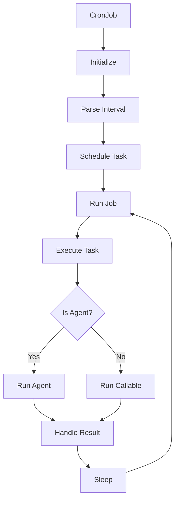

# CronJob

A wrapper class that turns any callable (including Swarms agents) into a scheduled cron job. This class provides functionality to schedule and run tasks at specified intervals using the schedule library with cron-style scheduling.

## Overview

The CronJob class allows you to:

- Schedule any callable or Swarms Agent to run at specified intervals

- Support for seconds, minutes, and hours intervals

- Run tasks in a separate thread

- Handle graceful start/stop of scheduled jobs

- Manage multiple concurrent scheduled jobs

## Architecture



## Class Reference

### Constructor

```python
def __init__(
    agent: Optional[Union[Agent, Callable]] = None,
    interval: Optional[str] = None,
    job_id: Optional[str] = None
)
```

| Parameter | Type | Description | Required |
|-----------|------|-------------|-----------|
| agent | Agent or Callable | The Swarms Agent instance or callable to be scheduled | No |
| interval | str | The interval string (e.g., "5seconds", "10minutes", "1hour") | No |
| job_id | str | Unique identifier for the job. If not provided, one will be generated | No |

### Methods

#### run

```python
def run(task: str, **kwargs)
```

| Parameter | Type | Description | Required |
|-----------|------|-------------|-----------|
| task | str | The task string to be executed by the agent | Yes |
| **kwargs | dict | Additional parameters to pass to the agent's run method | No |

#### __call__

```python
def __call__(task: str, **kwargs)
```

| Parameter | Type | Description | Required |
|-----------|------|-------------|-----------|
| task | str | The task string to be executed | Yes |
| **kwargs | dict | Additional parameters to pass to the agent's run method | No |

## Examples

### Basic Usage with Swarms Agent

```python
from swarms import Agent, CronJob
from loguru import logger

# Initialize the agent
agent = Agent(
    agent_name="Quantitative-Trading-Agent",
    agent_description="Advanced quantitative trading and algorithmic analysis agent",
    system_prompt="""You are an expert quantitative trading agent...""",
    max_loops=1,
    model_name="gpt-4.1",
    dynamic_temperature_enabled=True,
    output_type="str-all-except-first",
    streaming_on=True,
    print_on=True,
    telemetry_enable=False,
)

# Create and run a cron job every 10 seconds
logger.info("Starting example cron job")
cron_job = CronJob(agent=agent, interval="10seconds")
cron_job.run(
    task="What are the best top 3 etfs for gold coverage?"
)
```

### Using with a Custom Function

```python
def custom_task(task: str):
    print(f"Executing task: {task}")
    return "Task completed"

# Create a cron job with a custom function
cron_job = CronJob(
    agent=custom_task,
    interval="5minutes",
    job_id="custom_task_job"
)
cron_job.run("Perform analysis")
```


### Cron Jobs With Multi-Agent Structures

You can also run Cron Jobs with multi-agent structures like `SequentialWorkflow`, `ConcurrentWorkflow`, `HiearchicalSwarm`, and other methods. 

- Just initialize the class as the agent parameter in the `CronJob(agent=swarm)`

- Input your arguments into the `.run(task: str)` method


```python
"""
Cryptocurrency Concurrent Multi-Agent Cron Job Example

This example demonstrates how to use ConcurrentWorkflow with CronJob to create
a powerful cryptocurrency tracking system. Each specialized agent analyzes a
specific cryptocurrency concurrently every minute.

Features:
- ConcurrentWorkflow for parallel agent execution
- CronJob scheduling for automated runs every 1 minute
- Each agent specializes in analyzing one specific cryptocurrency
- Real-time data fetching from CoinGecko API
- Concurrent analysis of multiple cryptocurrencies
- Structured output with professional formatting

Architecture:
CronJob -> ConcurrentWorkflow -> [Bitcoin Agent, Ethereum Agent, Solana Agent, etc.] -> Parallel Analysis
"""

from typing import List
from loguru import logger

from swarms import Agent, CronJob, ConcurrentWorkflow
from swarms_tools import coin_gecko_coin_api


def create_crypto_specific_agents() -> List[Agent]:
    """
    Creates agents that each specialize in analyzing a specific cryptocurrency.

    Returns:
        List[Agent]: List of cryptocurrency-specific Agent instances
    """

    # Bitcoin Specialist Agent
    bitcoin_agent = Agent(
        agent_name="Bitcoin-Analyst",
        agent_description="Expert analyst specializing exclusively in Bitcoin (BTC) analysis and market dynamics",
        system_prompt="""You are a Bitcoin specialist and expert analyst. Your expertise includes:

BITCOIN SPECIALIZATION:
- Bitcoin's unique position as digital gold
- Bitcoin halving cycles and their market impact
- Bitcoin mining economics and hash rate analysis
- Lightning Network and Layer 2 developments
- Bitcoin adoption by institutions and countries
- Bitcoin's correlation with traditional markets
- Bitcoin technical analysis and on-chain metrics
- Bitcoin's role as a store of value and hedge against inflation

ANALYSIS FOCUS:
- Analyze ONLY Bitcoin data from the provided dataset
- Focus on Bitcoin-specific metrics and trends
- Consider Bitcoin's unique market dynamics
- Evaluate Bitcoin's dominance and market leadership
- Assess institutional adoption trends
- Monitor on-chain activity and network health

DELIVERABLES:
- Bitcoin-specific analysis and insights
- Price action assessment and predictions
- Market dominance analysis
- Institutional adoption impact
- Technical and fundamental outlook
- Risk factors specific to Bitcoin

Extract Bitcoin data from the provided dataset and provide comprehensive Bitcoin-focused analysis.""",
        model_name="groq/moonshotai/kimi-k2-instruct",
        max_loops=1,
        dynamic_temperature_enabled=True,
        streaming_on=False,
        tools=[coin_gecko_coin_api],
    )

    # Ethereum Specialist Agent
    ethereum_agent = Agent(
        agent_name="Ethereum-Analyst",
        agent_description="Expert analyst specializing exclusively in Ethereum (ETH) analysis and ecosystem development",
        system_prompt="""You are an Ethereum specialist and expert analyst. Your expertise includes:

ETHEREUM SPECIALIZATION:
- Ethereum's smart contract platform and DeFi ecosystem
- Ethereum 2.0 transition and proof-of-stake mechanics
- Gas fees, network usage, and scalability solutions
- Layer 2 solutions (Arbitrum, Optimism, Polygon)
- DeFi protocols and TVL (Total Value Locked) analysis
- NFT markets and Ethereum's role in digital assets
- Developer activity and ecosystem growth
- EIP proposals and network upgrades

ANALYSIS FOCUS:
- Analyze ONLY Ethereum data from the provided dataset
- Focus on Ethereum's platform utility and network effects
- Evaluate DeFi ecosystem health and growth
- Assess Layer 2 adoption and scalability solutions
- Monitor network usage and gas fee trends
- Consider Ethereum's competitive position vs other smart contract platforms

DELIVERABLES:
- Ethereum-specific analysis and insights
- Platform utility and adoption metrics
- DeFi ecosystem impact assessment
- Network health and scalability evaluation
- Competitive positioning analysis
- Technical and fundamental outlook for ETH

Extract Ethereum data from the provided dataset and provide comprehensive Ethereum-focused analysis.""",
        model_name="groq/moonshotai/kimi-k2-instruct",
        max_loops=1,
        dynamic_temperature_enabled=True,
        streaming_on=False,
        tools=[coin_gecko_coin_api],
    )

    # Solana Specialist Agent
    solana_agent = Agent(
        agent_name="Solana-Analyst",
        agent_description="Expert analyst specializing exclusively in Solana (SOL) analysis and ecosystem development",
        system_prompt="""You are a Solana specialist and expert analyst. Your expertise includes:

SOLANA SPECIALIZATION:
- Solana's high-performance blockchain architecture
- Proof-of-History consensus mechanism
- Solana's DeFi ecosystem and DEX platforms (Serum, Raydium)
- NFT marketplaces and creator economy on Solana
- Network outages and reliability concerns
- Developer ecosystem and Rust programming adoption
- Validator economics and network decentralization
- Cross-chain bridges and interoperability

ANALYSIS FOCUS:
- Analyze ONLY Solana data from the provided dataset
- Focus on Solana's performance and scalability advantages
- Evaluate network stability and uptime improvements
- Assess ecosystem growth and developer adoption
- Monitor DeFi and NFT activity on Solana
- Consider Solana's competitive position vs Ethereum

DELIVERABLES:
- Solana-specific analysis and insights
- Network performance and reliability assessment
- Ecosystem growth and adoption metrics
- DeFi and NFT market analysis
- Competitive advantages and challenges
- Technical and fundamental outlook for SOL

Extract Solana data from the provided dataset and provide comprehensive Solana-focused analysis.""",
        model_name="groq/moonshotai/kimi-k2-instruct",
        max_loops=1,
        dynamic_temperature_enabled=True,
        streaming_on=False,
        tools=[coin_gecko_coin_api],
    )

    # Cardano Specialist Agent
    cardano_agent = Agent(
        agent_name="Cardano-Analyst",
        agent_description="Expert analyst specializing exclusively in Cardano (ADA) analysis and research-driven development",
        system_prompt="""You are a Cardano specialist and expert analyst. Your expertise includes:

CARDANO SPECIALIZATION:
- Cardano's research-driven development approach
- Ouroboros proof-of-stake consensus protocol
- Smart contract capabilities via Plutus and Marlowe
- Cardano's three-layer architecture (settlement, computation, control)
- Academic partnerships and peer-reviewed research
- Cardano ecosystem projects and DApp development
- Native tokens and Cardano's UTXO model
- Sustainability and treasury funding mechanisms

ANALYSIS FOCUS:
- Analyze ONLY Cardano data from the provided dataset
- Focus on Cardano's methodical development approach
- Evaluate smart contract adoption and ecosystem growth
- Assess academic partnerships and research contributions
- Monitor native token ecosystem development
- Consider Cardano's long-term roadmap and milestones

DELIVERABLES:
- Cardano-specific analysis and insights
- Development progress and milestone achievements
- Smart contract ecosystem evaluation
- Academic research impact assessment
- Native token and DApp adoption metrics
- Technical and fundamental outlook for ADA

Extract Cardano data from the provided dataset and provide comprehensive Cardano-focused analysis.""",
        model_name="groq/moonshotai/kimi-k2-instruct",
        max_loops=1,
        dynamic_temperature_enabled=True,
        streaming_on=False,
        tools=[coin_gecko_coin_api],
    )

    # Binance Coin Specialist Agent
    bnb_agent = Agent(
        agent_name="BNB-Analyst",
        agent_description="Expert analyst specializing exclusively in BNB analysis and Binance ecosystem dynamics",
        system_prompt="""You are a BNB specialist and expert analyst. Your expertise includes:

BNB SPECIALIZATION:
- BNB's utility within the Binance ecosystem
- Binance Smart Chain (BSC) development and adoption
- BNB token burns and deflationary mechanics
- Binance exchange volume and market leadership
- BSC DeFi ecosystem and yield farming
- Cross-chain bridges and multi-chain strategies
- Regulatory challenges facing Binance globally
- BNB's role in transaction fee discounts and platform benefits

ANALYSIS FOCUS:
- Analyze ONLY BNB data from the provided dataset
- Focus on BNB's utility value and exchange benefits
- Evaluate BSC ecosystem growth and competition with Ethereum
- Assess token burn impact on supply and price
- Monitor Binance platform developments and regulations
- Consider BNB's centralized vs decentralized aspects

DELIVERABLES:
- BNB-specific analysis and insights
- Utility value and ecosystem benefits assessment
- BSC adoption and DeFi growth evaluation
- Token economics and burn mechanism impact
- Regulatory risk and compliance analysis
- Technical and fundamental outlook for BNB

Extract BNB data from the provided dataset and provide comprehensive BNB-focused analysis.""",
        model_name="groq/moonshotai/kimi-k2-instruct",
        max_loops=1,
        dynamic_temperature_enabled=True,
        streaming_on=False,
        tools=[coin_gecko_coin_api],
    )

    # XRP Specialist Agent
    xrp_agent = Agent(
        agent_name="XRP-Analyst",
        agent_description="Expert analyst specializing exclusively in XRP analysis and cross-border payment solutions",
        system_prompt="""You are an XRP specialist and expert analyst. Your expertise includes:

XRP SPECIALIZATION:
- XRP's role in cross-border payments and remittances
- RippleNet adoption by financial institutions
- Central Bank Digital Currency (CBDC) partnerships
- Regulatory landscape and SEC lawsuit implications
- XRP Ledger's consensus mechanism and energy efficiency
- On-Demand Liquidity (ODL) usage and growth
- Competition with SWIFT and traditional payment rails
- Ripple's partnerships with banks and payment providers

ANALYSIS FOCUS:
- Analyze ONLY XRP data from the provided dataset
- Focus on XRP's utility in payments and remittances
- Evaluate RippleNet adoption and institutional partnerships
- Assess regulatory developments and legal clarity
- Monitor ODL usage and transaction volumes
- Consider XRP's competitive position in payments

DELIVERABLES:
- XRP-specific analysis and insights
- Payment utility and adoption assessment
- Regulatory landscape and legal developments
- Institutional partnership impact evaluation
- Cross-border payment market analysis
- Technical and fundamental outlook for XRP

Extract XRP data from the provided dataset and provide comprehensive XRP-focused analysis.""",
        model_name="groq/moonshotai/kimi-k2-instruct",
        max_loops=1,
        dynamic_temperature_enabled=True,
        streaming_on=False,
        tools=[coin_gecko_coin_api],
    )

    return [
        bitcoin_agent,
        ethereum_agent,
        solana_agent,
        cardano_agent,
        bnb_agent,
        xrp_agent,
    ]


def create_crypto_workflow() -> ConcurrentWorkflow:
    """
    Creates a ConcurrentWorkflow with cryptocurrency-specific analysis agents.

    Returns:
        ConcurrentWorkflow: Configured workflow for crypto analysis
    """
    agents = create_crypto_specific_agents()

    workflow = ConcurrentWorkflow(
        name="Crypto-Specific-Analysis-Workflow",
        description="Concurrent execution of cryptocurrency-specific analysis agents",
        agents=agents,
        max_loops=1,
    )

    return workflow


def create_crypto_cron_job() -> CronJob:
    """
    Creates a CronJob that runs cryptocurrency-specific analysis every minute using ConcurrentWorkflow.

    Returns:
        CronJob: Configured cron job for automated crypto analysis
    """
    # Create the concurrent workflow
    workflow = create_crypto_workflow()

    # Create the cron job
    cron_job = CronJob(
        agent=workflow,  # Use the workflow as the agent
        interval="5seconds",  # Run every 1 minute
    )

    return cron_job


def main():
    """
    Main function to run the cryptocurrency-specific concurrent analysis cron job.
    """
    cron_job = create_crypto_cron_job()

    prompt = """
    
    Conduct a comprehensive analysis of your assigned cryptocurrency.
    
    """

    # Start the cron job
    logger.info("🔄 Starting automated analysis loop...")
    logger.info("⏰ Press Ctrl+C to stop the cron job")

    output = cron_job.run(task=prompt)
    print(output)


if __name__ == "__main__":
    main()
```

## Conclusion

The CronJob class provides a powerful way to schedule and automate tasks using Swarms Agents or custom functions. Key benefits include:

- Easy integration with Swarms Agents

- Flexible interval scheduling

- Thread-safe execution

- Graceful error handling

- Simple API for task scheduling

- Support for both agent and callable-based tasks 