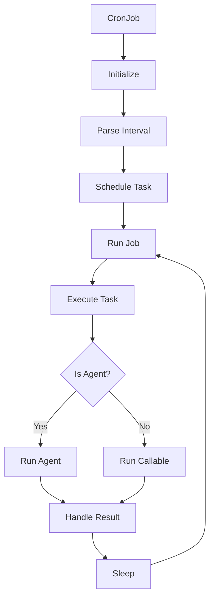

# CronJob

A wrapper class that turns any callable (including Swarms agents) into a scheduled cron job. This class provides functionality to schedule and run tasks at specified intervals using the schedule library with cron-style scheduling.

## Overview

The CronJob class allows you to:

- Schedule any callable or Swarms Agent to run at specified intervals

- Support for seconds, minutes, and hours intervals

- Run tasks in a separate thread

- Handle graceful start/stop of scheduled jobs

- Manage multiple concurrent scheduled jobs

## Architecture



## Class Reference

### Constructor

```python
def __init__(
    agent: Optional[Union[Agent, Callable]] = None,
    interval: Optional[str] = None,
    job_id: Optional[str] = None
)
```

| Parameter | Type | Description | Required |
|-----------|------|-------------|-----------|
| agent | Agent or Callable | The Swarms Agent instance or callable to be scheduled | No |
| interval | str | The interval string (e.g., "5seconds", "10minutes", "1hour") | No |
| job_id | str | Unique identifier for the job. If not provided, one will be generated | No |

### Methods

#### run

```python
def run(task: str, **kwargs)
```

| Parameter | Type | Description | Required |
|-----------|------|-------------|-----------|
| task | str | The task string to be executed by the agent | Yes |
| **kwargs | dict | Additional parameters to pass to the agent's run method | No |

#### __call__

```python
def __call__(task: str, **kwargs)
```

| Parameter | Type | Description | Required |
|-----------|------|-------------|-----------|
| task | str | The task string to be executed | Yes |
| **kwargs | dict | Additional parameters to pass to the agent's run method | No |

## Examples

### Basic Usage with Swarms Agent

```python
from swarms import Agent, CronJob
from loguru import logger

# Initialize the agent
agent = Agent(
    agent_name="Quantitative-Trading-Agent",
    agent_description="Advanced quantitative trading and algorithmic analysis agent",
    system_prompt="""You are an expert quantitative trading agent...""",
    max_loops=1,
    model_name="gpt-4.1",
    dynamic_temperature_enabled=True,
    output_type="str-all-except-first",
    streaming_on=True,
    print_on=True,
    telemetry_enable=False,
)

# Create and run a cron job every 10 seconds
logger.info("Starting example cron job")
cron_job = CronJob(agent=agent, interval="10seconds")
cron_job.run(
    task="What are the best top 3 etfs for gold coverage?"
)
```

### Using with a Custom Function

```python
def custom_task(task: str):
    print(f"Executing task: {task}")
    return "Task completed"

# Create a cron job with a custom function
cron_job = CronJob(
    agent=custom_task,
    interval="5minutes",
    job_id="custom_task_job"
)
cron_job.run("Perform analysis")
```

## Conclusion

The CronJob class provides a powerful way to schedule and automate tasks using Swarms Agents or custom functions. Key benefits include:

- Easy integration with Swarms Agents

- Flexible interval scheduling

- Thread-safe execution

- Graceful error handling

- Simple API for task scheduling

- Support for both agent and callable-based tasks 