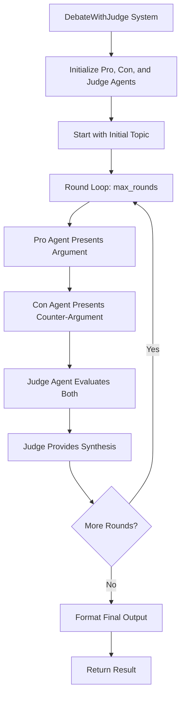

# DebateWithJudge Module Documentation

The `DebateWithJudge` module provides a sophisticated debate architecture with self-refinement through a judge agent. This system enables two agents (Pro and Con) to debate a topic, with a Judge agent evaluating their arguments and providing refined synthesis. The process repeats for N rounds to progressively refine the answer.

## Architecture



### Key Concepts

| Concept                  | Description                                                                                  |
|--------------------------|----------------------------------------------------------------------------------------------|
| Debate Architecture      | A structured process where two agents present opposing arguments on a topic                  |
| Pro Agent                | The agent arguing in favor of a position                                                     |
| Con Agent                | The agent arguing against a position                                                        |
| Judge Agent              | An impartial evaluator that analyzes both arguments and provides synthesis                   |
| Iterative Refinement     | The process repeats for multiple rounds, each round building upon the judge's previous synthesis |
| Progressive Improvement  | Each round refines the answer by incorporating feedback and addressing weaknesses            |

## Class Definition: `DebateWithJudge`

```python
class DebateWithJudge:
    def __init__(
        self,
        pro_agent: Agent,
        con_agent: Agent,
        judge_agent: Agent,
        max_rounds: int = 3,
        output_type: str = "str-all-except-first",
        verbose: bool = True,
    ):
```

### Constructor Parameters

| Parameter | Type | Default | Description |
|-----------|------|---------|-------------|
| `pro_agent` | `Agent` | Required | The agent arguing in favor (Pro position) |
| `con_agent` | `Agent` | Required | The agent arguing against (Con position) |
| `judge_agent` | `Agent` | Required | The judge agent that evaluates arguments and provides synthesis |
| `max_rounds` | `int` | `3` | Maximum number of debate rounds to execute |
| `output_type` | `str` | `"str-all-except-first"` | Format for the output conversation history |
| `verbose` | `bool` | `True` | Whether to enable verbose logging |

## API Reference

### Core Methods

#### `run(task: str) -> Union[str, List, dict]`

Executes the debate with judge refinement process for a single task and returns the refined result.

**Signature:**

```python
def run(self, task: str) -> Union[str, List, dict]
```

**Parameters:**

- `task` (`str`): The initial topic or question to debate

**Returns:**

- `Union[str, List, dict]`: The formatted conversation history or final refined answer, depending on `output_type`

**Process Flow:**

1. **Task Validation**: Validates that the task is a non-empty string
2. **Agent Initialization**: Initializes all three agents with their respective roles and the initial task context
3. **Multi-Round Execution**: For each round (up to `max_rounds`):
   - **Pro Argument**: Pro agent presents an argument in favor of the current topic
   
   - **Con Counter-Argument**: Con agent presents a counter-argument, addressing the Pro's points
   
   - **Judge Evaluation**: Judge agent evaluates both arguments, identifies strengths and weaknesses
   
   - **Synthesis Generation**: Judge provides a refined synthesis that incorporates the best elements from both sides
   
   - **Topic Refinement**: Judge's synthesis becomes the topic for the next round
4. **Result Formatting**: Returns the final result formatted according to `output_type`

**Example:**

```python
from swarms import Agent, DebateWithJudge

# Create the Pro agent (arguing in favor)
pro_agent = Agent(
    agent_name="Pro-Agent",
    system_prompt=(
        "You are a skilled debater who argues in favor of positions. "
        "You present well-reasoned arguments with evidence, examples, "
        "and logical reasoning. You are persuasive and articulate."
    ),
    model_name="gpt-4o-mini",
    max_loops=1,
)

# Create the Con agent (arguing against)
con_agent = Agent(
    agent_name="Con-Agent",
    system_prompt=(
        "You are a skilled debater who argues against positions. "
        "You present strong counter-arguments with evidence, examples, "
        "and logical reasoning. You identify weaknesses in opposing "
        "arguments and provide compelling alternatives."
    ),
    model_name="gpt-4o-mini",
    max_loops=1,
)

# Create the Judge agent (evaluates and synthesizes)
judge_agent = Agent(
    agent_name="Judge-Agent",
    system_prompt=(
        "You are an impartial judge who evaluates debates. "
        "You carefully analyze arguments from both sides, identify "
        "strengths and weaknesses, and provide balanced synthesis. "
        "You may declare a winner or provide a refined answer that "
        "incorporates the best elements from both arguments."
    ),
    model_name="gpt-4o-mini",
    max_loops=1,
)

# Create the DebateWithJudge system
debate_system = DebateWithJudge(
    pro_agent=pro_agent,
    con_agent=con_agent,
    judge_agent=judge_agent,
    max_rounds=3,
    output_type="str-all-except-first",
    verbose=True,
)

# Define the debate topic
topic = (
    "Should artificial intelligence be regulated by governments? "
    "Discuss the balance between innovation and safety."
)

# Run the debate
result = debate_system.run(task=topic)
print(result)
```

**Raises:**

- `ValueError`: If task is None or empty, or if any required agents are None, or if max_rounds is less than 1

---

#### `batched_run(tasks: List[str]) -> List[str]`

Executes the debate with judge refinement process for multiple tasks sequentially, processing each task through the complete multi-round debate process.

**Signature:**

```python
def batched_run(self, tasks: List[str]) -> List[str]
```

**Parameters:**

- `tasks` (`List[str]`): List of topics or questions to debate

**Returns:**

- `List[str]`: List of final refined answers, one for each input task

**Process Flow:**

1. **Sequential Processing**: Processes each task in the input list one by one
2. **Independent Execution**: Each task runs through the complete multi-round debate process independently
3. **Result Collection**: Collects and returns all results in the same order as input tasks

**Example:**

```python
# Define multiple debate topics
debate_topics = [
    "Should remote work become the standard for knowledge workers?",
    "Is cryptocurrency a viable alternative to traditional banking?",
    "Should social media platforms be held accountable for content moderation?",
    "Are electric vehicles the future of transportation?"
]

# Execute batch processing
results = debate_system.batched_run(debate_topics)

# Process results
for topic, result in zip(debate_topics, results):
    print(result)
```

**Performance Considerations:**

| Consideration                               | Description                                                               |
|---------------------------------------------|---------------------------------------------------------------------------|
| Sequential Processing                      | Tasks are processed one after another, not in parallel                    |
| Independent Conversation History           | Each task maintains its own conversation history                          |
| Memory Usage                               | Scales with the number of tasks and the length of each conversation       |
| Total Execution Time                       | Equals the sum of all individual task execution times                     |

---

### Helper Methods

#### `get_conversation_history() -> List[dict]`

Get the full conversation history from the debate.

**Signature:**

```python
def get_conversation_history(self) -> List[dict]
```

**Returns:**

- `List[dict]`: List of message dictionaries containing the conversation history

**Example:**

```python
# Run a debate
result = debate_system.run("Should AI be regulated?")

# Get the full conversation history
history = debate_system.get_conversation_history()
print(history)
```

---

#### `get_final_answer() -> str`

Get the final refined answer from the judge.

**Signature:**

```python
def get_final_answer(self) -> str
```

**Returns:**

- `str`: The content of the final judge synthesis

**Example:**

```python
# Run a debate
result = debate_system.run("Should AI be regulated?")

# Get just the final answer
final_answer = debate_system.get_final_answer()
print(final_answer)
```

---

### Properties

| Property | Type | Description |
|----------|------|-------------|
| `pro_agent` | `Agent` | The agent arguing in favor (Pro position) |
| `con_agent` | `Agent` | The agent arguing against (Con position) |
| `judge_agent` | `Agent` | The judge agent that evaluates arguments |
| `max_rounds` | `int` | Maximum number of debate rounds |
| `output_type` | `str` | Format for returned results |
| `verbose` | `bool` | Whether verbose logging is enabled |
| `conversation` | `Conversation` | Conversation history management object |

## Output Types

The `output_type` parameter controls how the conversation history is formatted:

| `output_type` Value         | Description                                                  |
|----------------------------|--------------------------------------------------------------|
| `"str-all-except-first"`    | Returns a formatted string with all messages except the first (default) |
| `"str"`                    | Returns all messages as a formatted string                   |
| `"dict"`                   | Returns messages as a dictionary                            |
| `"list"`                   | Returns messages as a list                                  |


## Usage Patterns

### Single Topic Debate

For focused debate and refinement on a single complex topic:

```python
# Simple single topic execution
result = debate_system.run("Should universal basic income be implemented?")

# With custom output format
debate_system.output_type = "dict"
result = debate_system.run("Should universal basic income be implemented?")
```

### Batch Processing

For processing multiple related topics sequentially:

```python
# Process multiple policy questions
policy_topics = [
    "Should healthcare be universal?",
    "Should education be free?",
    "Should carbon emissions be taxed?"
]
results = debate_system.batched_run(policy_topics)
```

### Custom Agent Configuration

For specialized debate scenarios with custom agent prompts:

```python
# Create specialized agents for technical debates
technical_pro = Agent(
    agent_name="Technical-Pro",
    system_prompt="You are a software engineering expert arguing for technical solutions...",
    model_name="gpt-4",
    max_loops=1,
)

technical_con = Agent(
    agent_name="Technical-Con",
    system_prompt="You are a software engineering expert arguing against technical solutions...",
    model_name="gpt-4",
    max_loops=1,
)

technical_judge = Agent(
    agent_name="Technical-Judge",
    system_prompt="You are a senior software architect evaluating technical arguments...",
    model_name="gpt-4",
    max_loops=1,
)

technical_debate = DebateWithJudge(
    pro_agent=technical_pro,
    con_agent=technical_con,
    judge_agent=technical_judge,
    max_rounds=5,  # More rounds for complex technical topics
    verbose=True,
)
```

## Usage Examples

### Example 1: Policy Debate on AI Regulation

This example demonstrates using `DebateWithJudge` for a comprehensive policy debate on AI regulation, with multiple rounds of refinement.

```python
from swarms import Agent, DebateWithJudge

# Create the Pro agent (arguing in favor of AI regulation)
pro_agent = Agent(
    agent_name="Pro-Regulation-Agent",
    system_prompt=(
        "You are a policy expert specializing in technology regulation. "
        "You argue in favor of government regulation of artificial intelligence. "
        "You present well-reasoned arguments focusing on safety, ethics, "
        "and public interest. You use evidence, examples, and logical reasoning. "
        "You are persuasive and articulate, emphasizing the need for oversight "
        "to prevent harm and ensure responsible AI development."
    ),
    model_name="gpt-4o-mini",
    max_loops=1,
)

# Create the Con agent (arguing against AI regulation)
con_agent = Agent(
    agent_name="Anti-Regulation-Agent",
    system_prompt=(
        "You are a technology policy expert specializing in innovation. "
        "You argue against heavy government regulation of artificial intelligence. "
        "You present strong counter-arguments focusing on innovation, economic growth, "
        "and the risks of over-regulation. You identify weaknesses in regulatory "
        "proposals and provide compelling alternatives such as industry self-regulation "
        "and ethical guidelines. You emphasize the importance of maintaining "
        "technological competitiveness."
    ),
    model_name="gpt-4o-mini",
    max_loops=1,
)

# Create the Judge agent (evaluates and synthesizes)
judge_agent = Agent(
    agent_name="Policy-Judge-Agent",
    system_prompt=(
        "You are an impartial policy analyst and judge who evaluates debates on "
        "technology policy. You carefully analyze arguments from both sides, "
        "identify strengths and weaknesses, and provide balanced synthesis. "
        "You consider multiple perspectives including safety, innovation, economic impact, "
        "and ethical considerations. You may declare a winner or provide a refined "
        "answer that incorporates the best elements from both arguments, such as "
        "balanced regulatory frameworks that protect public interest while fostering innovation."
    ),
    model_name="gpt-4o-mini",
    max_loops=1,
)

# Create the DebateWithJudge system
debate_system = DebateWithJudge(
    pro_agent=pro_agent,
    con_agent=con_agent,
    judge_agent=judge_agent,
    max_rounds=3,
    output_type="str-all-except-first",
    verbose=True,
)

# Define the debate topic
topic = (
    "Should artificial intelligence be regulated by governments? "
    "Discuss the balance between innovation and safety, considering "
    "both the potential benefits of regulation (safety, ethics, public trust) "
    "and the potential drawbacks (stifling innovation, economic impact, "
    "regulatory capture). Provide a nuanced analysis."
)

# Run the debate
result = debate_system.run(task=topic)
print(result)

# Get the final refined answer
final_answer = debate_system.get_final_answer()
print(final_answer)
```

### Example 2: Technical Architecture Debate with Batch Processing

This example demonstrates using `batched_run` to process multiple technical architecture questions, comparing different approaches to system design.

```python
from swarms import Agent, DebateWithJudge

# Create specialized technical agents
pro_agent = Agent(
    agent_name="Microservices-Pro",
    system_prompt=(
        "You are a software architecture expert advocating for microservices architecture. "
        "You present arguments focusing on scalability, independent deployment, "
        "technology diversity, and team autonomy. You use real-world examples and "
        "case studies to support your position."
    ),
    model_name="gpt-4o-mini",
    max_loops=1,
)

con_agent = Agent(
    agent_name="Monolith-Pro",
    system_prompt=(
        "You are a software architecture expert advocating for monolithic architecture. "
        "You present counter-arguments focusing on simplicity, reduced complexity, "
        "easier debugging, and lower operational overhead. You identify weaknesses "
        "in microservices approaches and provide compelling alternatives."
    ),
    model_name="gpt-4o-mini",
    max_loops=1,
)

judge_agent = Agent(
    agent_name="Architecture-Judge",
    system_prompt=(
        "You are a senior software architect evaluating architecture debates. "
        "You analyze both arguments considering factors like team size, project scale, "
        "complexity, operational capabilities, and long-term maintainability. "
        "You provide balanced synthesis that considers context-specific trade-offs."
    ),
    model_name="gpt-4o-mini",
    max_loops=1,
)

# Create the debate system
architecture_debate = DebateWithJudge(
    pro_agent=pro_agent,
    con_agent=con_agent,
    judge_agent=judge_agent,
    max_rounds=2,  # Fewer rounds for more focused technical debates
    output_type="str-all-except-first",
    verbose=True,
)

# Define multiple architecture questions
architecture_questions = [
    "Should a startup with 5 developers use microservices or monolithic architecture?",
    "Is serverless architecture better than containerized deployments for event-driven systems?",
    "Should a financial application use SQL or NoSQL databases for transaction processing?",
    "Is event-driven architecture superior to request-response for real-time systems?",
]

# Execute batch processing
results = architecture_debate.batched_run(architecture_questions)

# Display results
for result in results:
    print(result)
```

### Example 3: Business Strategy Debate with Custom Configuration

This example demonstrates a business strategy debate with custom agent configurations, multiple rounds, and accessing conversation history.

```python
from swarms import Agent, DebateWithJudge

# Create business strategy agents with detailed expertise
pro_agent = Agent(
    agent_name="Growth-Strategy-Pro",
    system_prompt=(
        "You are a business strategy consultant specializing in aggressive growth strategies. "
        "You argue in favor of rapid expansion, market penetration, and scaling. "
        "You present arguments focusing on first-mover advantages, market share capture, "
        "network effects, and competitive positioning. You use case studies from "
        "successful companies like Amazon, Uber, and Airbnb to support your position."
    ),
    model_name="gpt-4o-mini",
    max_loops=1,
)

con_agent = Agent(
    agent_name="Sustainable-Growth-Pro",
    system_prompt=(
        "You are a business strategy consultant specializing in sustainable, profitable growth. "
        "You argue against aggressive expansion in favor of measured, sustainable growth. "
        "You present counter-arguments focusing on profitability, unit economics, "
        "sustainable competitive advantages, and avoiding overextension. You identify "
        "weaknesses in 'growth at all costs' approaches and provide compelling alternatives "
        "based on companies like Apple, Microsoft, and Berkshire Hathaway."
    ),
    model_name="gpt-4o-mini",
    max_loops=1,
)

judge_agent = Agent(
    agent_name="Strategy-Judge",
    system_prompt=(
        "You are a seasoned business strategist and former CEO evaluating growth strategy debates. "
        "You carefully analyze arguments from both sides, considering factors like: "
        "- Market conditions and competitive landscape\n"
        "- Company resources and capabilities\n"
        "- Risk tolerance and financial position\n"
        "- Long-term sustainability vs. short-term growth\n"
        "- Industry-specific dynamics\n\n"
        "You provide balanced synthesis that incorporates the best elements from both arguments, "
        "considering context-specific factors. You may recommend a hybrid approach when appropriate."
    ),
    model_name="gpt-4o-mini",
    max_loops=1,
)

# Create the debate system with extended rounds for complex strategy discussions
strategy_debate = DebateWithJudge(
    pro_agent=pro_agent,
    con_agent=con_agent,
    judge_agent=judge_agent,
    max_rounds=4,  # More rounds for complex strategic discussions
    output_type="dict",  # Use dict format for structured analysis
    verbose=True,
)

# Define a complex business strategy question
strategy_question = (
    "A SaaS startup with $2M ARR, 40% gross margins, and $500K in the bank "
    "is considering two paths:\n"
    "1. Aggressive growth: Raise $10M, hire 50 people, expand to 5 new markets\n"
    "2. Sustainable growth: Focus on profitability, improve unit economics, "
    "expand gradually with existing resources\n\n"
    "Which strategy should they pursue? Consider market conditions, competitive "
    "landscape, and long-term viability."
)

# Run the debate
result = strategy_debate.run(task=strategy_question)
print(result)

# Get the full conversation history for detailed analysis
history = strategy_debate.get_conversation_history()
print(history)

# Get the final refined answer
final_answer = strategy_debate.get_final_answer()
print(final_answer)
```

## Best Practices

### Agent Configuration

!!! tip "Agent Configuration Best Practices"
    - **Pro Agent**: Should be configured with expertise in the topic area and strong argumentation skills
    - **Con Agent**: Should be configured to identify weaknesses and provide compelling alternatives
    - **Judge Agent**: Should be configured with broad expertise and impartial evaluation capabilities
    - Use appropriate models for the complexity of the debate topic
    - Consider using more powerful models for the Judge agent

### Round Configuration

!!! note "Round Configuration Tips"
    - Use 2-3 rounds for most topics
    - Use 4-5 rounds for complex, multi-faceted topics
    - More rounds allow for deeper refinement but increase execution time
    - Consider the trade-off between refinement quality and cost

### Output Format Selection

!!! info "Output Format Guidelines"
    - Use `"str-all-except-first"` for readable summaries (default)
    - Use `"dict"` for structured analysis and programmatic processing
    - Use `"list"` for detailed conversation inspection
    - Use `"str"` for complete conversation history as text

### Performance Optimization

!!! warning "Performance Considerations"
    - Batch processing is sequential - consider parallel execution for large batches
    - Each round requires 3 agent calls (Pro, Con, Judge)
    - Memory usage scales with conversation history length
    - Consider using lighter models for faster execution when appropriate

## Troubleshooting

### Common Issues

!!! danger "Common Problems"
    **Issue**: Agents not following their roles

    **Solution**: Ensure system prompts clearly define each agent's role and expertise

    ---

    **Issue**: Judge synthesis not improving over rounds

    **Solution**: Increase `max_rounds` or improve Judge agent's system prompt to emphasize refinement

    ---

    **Issue**: Debate results are too generic

    **Solution**: Use more specific system prompts and provide detailed context in the task

    ---

    **Issue**: Execution time is too long

    **Solution**: Reduce `max_rounds`, use faster models, or process fewer topics in batch

## Contributing

!!! success "Contributing"
    Contributions are welcome! Please feel free to submit a Pull Request.

## License

!!! info "License"
    This project is licensed under the MIT License - see the LICENSE file for details.
