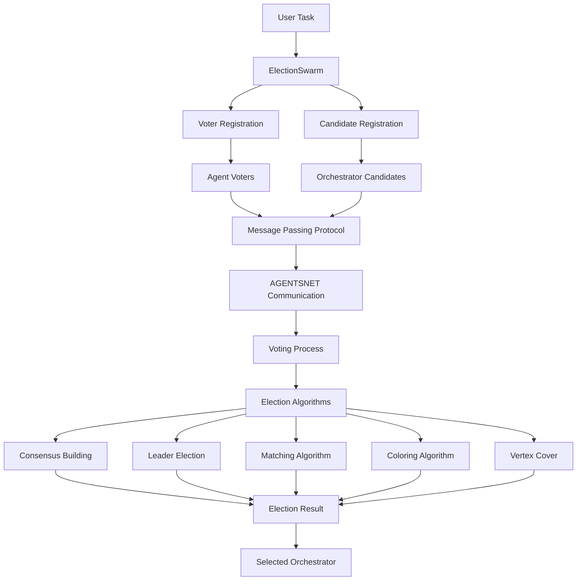
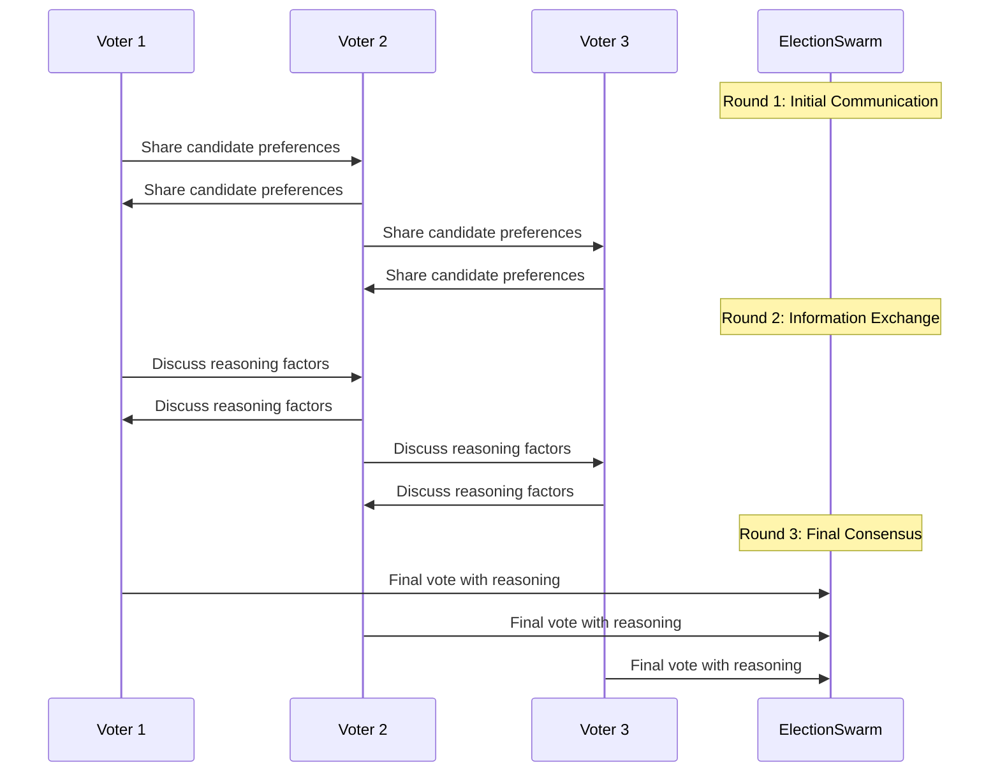

# ElectionSwarm

The `ElectionSwarm` is a sophisticated multi-agent orchestrator selection system that implements AGENTSNET communication protocols for democratic decision-making. It enables agent voters to elect the best orchestrator candidate through various coordination algorithms, providing a structured approach to leadership selection in multi-agent workflows.

## Imports!

```python
from swarms.structs import ElectionSwarm
# or
from swarms.structs.election_swarm import ElectionSwarm
```

## Overview

The ElectionSwarm follows a democratic election workflow pattern:

1. **Task Reception**: User provides an election task to the swarm
2. **Voter Registration**: Agent voters are registered with their preferences and expertise
3. **Candidate Presentation**: Orchestrator candidates present their platforms and capabilities
4. **Message Passing**: Voters communicate with neighbors using AGENTSNET protocols
5. **Voting Process**: Voters cast structured votes with detailed reasoning
6. **Result Determination**: Election algorithms determine the winning orchestrator
7. **Context Preservation**: All conversation history and voting records are maintained

## Architecture



## Key Features

| Feature | Description |
|---------|-------------|
| **AGENTSNET Protocols** | Implements distributed computing algorithms for coordination |
| **Message Passing** | Synchronous neighbor-to-neighbor communication in rounds |
| **Structured Voting** | Voters provide detailed reasoning, confidence, and candidate rankings |
| **Multiple Algorithms** | Consensus, Leader Election, Matching, Coloring, Vertex Cover |
| **Cost Tracking** | Budget management and token usage monitoring |
| **Caching System** | Response caching to avoid redundant LLM calls |
| **Lazy Loading** | Agents instantiated only when needed |
| **Parallel Execution** | Concurrent agent operations for efficiency |
| **Comprehensive Logging** | Detailed logging for debugging and monitoring |
| **Flexible Configuration** | Configurable election parameters and algorithms |
| **Voter Tool Calls** | Optional tool calls for detailed voting explanations |

## ElectionSwarm Constructor

| Parameter | Type | Default | Description |
|-----------|------|---------|-------------|
| `name` | `str` | `"ElectionSwarm"` | Name of the election swarm |
| `description` | `str` | `"Orchestrator selection with AGENTSNET algorithms"` | Description of the swarm purpose |
| `voters` | `List[VoterProfile]` | `None` | List of agent voters (defaults created if None) |
| `candidates` | `List[CandidateProfile]` | `None` | List of orchestrator candidates (defaults created if None) |
| `election_config` | `ElectionConfig` | `None` | Election configuration settings |
| `max_loops` | `int` | `1` | Maximum number of election loops |
| `output_type` | `OutputType` | `"dict-all-except-first"` | Output format type |
| `verbose` | `bool` | `False` | Enable verbose logging |
| `enable_lazy_loading` | `bool` | `True` | Enable lazy agent loading |
| `enable_caching` | `bool` | `True` | Enable response caching |
| `batch_size` | `int` | `25` | Batch size for parallel operations |
| `budget_limit` | `float` | `200.0` | Budget limit for cost tracking |
| `*args` | `Any` | - | Additional positional arguments |
| `**kwargs` | `Any` | - | Additional keyword arguments |

## Core Components

### VoterProfile

Represents an agent voter in the orchestrator selection system.

```python
@dataclass
class VoterProfile:
    voter_id: str
    name: str
    voter_type: VoterType
    preferences: Dict[str, Any] = field(default_factory=dict)
    expertise_areas: List[str] = field(default_factory=list)
    voting_weight: float = 1.0
    agent: Optional[Agent] = None
    is_loaded: bool = False
    demographics: Dict[str, Any] = field(default_factory=dict)
    past_voting_history: List[Dict[str, Any]] = field(default_factory=list)
    neighbors: List[str] = field(default_factory=list)
    coordination_style: str = "collaborative"
    leadership_preferences: Dict[str, float] = field(default_factory=dict)
```

### VoterType

Enumeration of voter types in the election system.

```python
class VoterType(str, Enum):
    INDIVIDUAL = "individual"
    GROUP = "group"
    EXPERT = "expert"
    DELEGATE = "delegate"
```

### CandidateProfile

Represents an orchestrator candidate in the selection system.

```python
@dataclass
class CandidateProfile:
    candidate_id: str
    name: str
    candidate_type: CandidateType
    party_affiliation: Optional[str] = None
    policy_positions: Dict[str, Any] = field(default_factory=dict)
    campaign_promises: List[str] = field(default_factory=list)
    experience: List[str] = field(default_factory=list)
    agent: Optional[Agent] = None
    is_loaded: bool = False
    support_base: Dict[str, float] = field(default_factory=dict)
    campaign_strategy: Dict[str, Any] = field(default_factory=dict)
    leadership_style: str = "collaborative"
    coordination_approach: Dict[str, Any] = field(default_factory=dict)
    technical_expertise: List[str] = field(default_factory=list)
```

### CandidateType

Enumeration of candidate types in the election system.

```python
class CandidateType(str, Enum):
    INDIVIDUAL = "individual"
    COALITION = "coalition"
    PARTY = "party"
    MOVEMENT = "movement"
```

### ElectionAlgorithm

AGENTSNET algorithms for coordination.

```python
class ElectionAlgorithm(str, Enum):
    CONSENSUS = "consensus"
    LEADER_ELECTION = "leader_election"
    MATCHING = "matching"
    COLORING = "coloring"
    VERTEX_COVER = "vertex_cover"
```

### VoterDecision

Structured output from voter agents.

```python
@dataclass
class VoterDecision:
    voter_id: str
    rationality: str
    vote: VoteResult
    confidence: float = 0.0
    reasoning_factors: List[str] = field(default_factory=list)
    candidate_rankings: Dict[str, int] = field(default_factory=dict)
    tool_call_explanation: Optional[str] = None
    timestamp: datetime = field(default_factory=datetime.now)
```

### VoteResult

Possible vote results.

```python
class VoteResult(str, Enum):
    FOR = "for"
    AGAINST = "against"
    ABSTAIN = "abstain"
    INVALID = "invalid"
```

### ElectionResult

Results of an election.

```python
@dataclass
class ElectionResult:
    election_id: str
    algorithm_used: ElectionAlgorithm
    total_voters: int
    total_candidates: int
    votes_cast: int
    winner: Optional[str] = None
    vote_distribution: Dict[str, int] = field(default_factory=dict)
    voter_decisions: List[VoterDecision] = field(default_factory=list)
    consensus_reached: bool = False
    rounds_to_consensus: int = 0
    timestamp: datetime = field(default_factory=datetime.now)
```

### MessagePassingProtocol

AGENTSNET-inspired message-passing protocol.

```python
class MessagePassingProtocol:
    def __init__(self, rounds: int = 5, synchronous: bool = True):
        self.rounds = rounds
        self.synchronous = synchronous
        self.current_round = 0
        self.message_history: List[Dict[str, Any]] = []
```

### CostTracker

Track costs and usage for budget management.

```python
@dataclass
class CostTracker:
    total_tokens_used: int = 0
    total_cost_estimate: float = 0.0
    budget_limit: float = DEFAULT_BUDGET_LIMIT
    token_cost_per_1m: float = 0.15
    requests_made: int = 0
    cache_hits: int = 0
```

## Voter Tool Calls

The ElectionSwarm supports optional tool calls that allow voter agents to provide detailed explanations of their voting decisions. When enabled, each voter agent will make a tool call to `explain_voting_decision` before casting their vote.

### Tool Call Features

- **Detailed Explanations**: Voters provide comprehensive reasoning for their choices
- **Structured Data**: Tool calls include voter name, ID, chosen candidate, and reasoning
- **Confidence Levels**: Voters specify their confidence in their decision
- **Alternative Considerations**: Voters explain why other candidates were not chosen
- **Key Factors**: Voters list the most important factors influencing their decision

### Tool Call Structure

```python
{
    "voter_name": "Alice Johnson",
    "voter_id": "voter_001", 
    "chosen_candidate": "John Progressive",
    "voting_reasoning": "Detailed explanation of why this candidate was chosen",
    "key_factors": ["healthcare policy", "environmental stance", "experience"],
    "confidence_level": 0.85,
    "alternative_considerations": "Considered Sarah Conservative but disagreed on healthcare"
}
```

### Enabling Tool Calls

```python
# Enable voter tool calls in configuration
config = ElectionConfig(
    config_data={
        "enable_voter_tool_calls": True,
        # ... other config options
    }
)

election = ElectionSwarm(
    election_config=config,
    # ... other parameters
)
```

## AGENTSNET Communication Protocols

### Message Passing Protocol

The ElectionSwarm implements AGENTSNET-inspired message-passing for distributed coordination:

- **Synchronous Communication**: Agents communicate in discrete rounds
- **Neighbor-Only Messaging**: Agents can only communicate with immediate neighbors
- **JSON Message Format**: Structured message exchange
- **Multi-Round Process**: Multiple rounds for information propagation
- **Final Decision**: Agents make final decisions after communication rounds

### Communication Flow



## Election Algorithms

The ElectionSwarm implements five AGENTSNET-inspired algorithms for orchestrator selection. Each algorithm is designed for different coordination scenarios and communication patterns.

### 1. Consensus Algorithm

All agents must agree on a single orchestrator candidate through multiple rounds of communication.

- **Purpose**: Achieve unanimous agreement on orchestrator selection
- **Process**: Multiple rounds until consensus threshold is reached
- **Threshold**: Configurable consensus threshold (default: 60%)
- **Fallback**: Majority vote if consensus not reached
- **Implementation**: `_conduct_consensus_election()` method
- **Use Case**: When unanimous agreement is required

### 2. Leader Election Algorithm

Select a single leader orchestrator through distributed voting.

- **Purpose**: Elect one orchestrator to lead the multi-agent workflow
- **Process**: Direct voting with winner-takes-all mechanism
- **Complexity**: O(D) rounds where D is network diameter
- **Implementation**: `_conduct_leader_election()` method
- **Use Case**: When clear leadership hierarchy is needed

### 3. Matching Algorithm

Pair voters with compatible orchestrator candidates using maximal matching.

- **Purpose**: Create optimal voter-candidate pairings
- **Process**: Maximal matching to avoid conflicts
- **Complexity**: O(log* n) rounds
- **Implementation**: `_conduct_matching_election()` method
- **Use Case**: When specialized orchestrator-voter relationships are important

### 4. Coloring Algorithm

Group voters and candidates into compatible categories using graph coloring.

- **Purpose**: Assign roles such that neighbors have different roles
- **Process**: (Δ+1)-coloring where Δ is maximum node degree
- **Complexity**: O(log* n) rounds
- **Implementation**: `_conduct_coloring_election()` method
- **Use Case**: Role assignment with conflict avoidance

### 5. Vertex Cover Algorithm

Select minimal set of coordinator agents to cover all voters.

- **Purpose**: Choose minimal set of orchestrators to cover all voters
- **Process**: Minimal vertex cover selection
- **Complexity**: O(log* n) rounds
- **Implementation**: `_conduct_vertex_cover_election()` method
- **Use Case**: When resource-efficient coordination is needed

### Algorithm Selection

Choose the appropriate algorithm based on your coordination needs:

```python
# For unanimous decisions
ElectionAlgorithm.CONSENSUS

# For clear leadership
ElectionAlgorithm.LEADER_ELECTION

# For optimal pairings
ElectionAlgorithm.MATCHING

# For role assignment
ElectionAlgorithm.COLORING

# For minimal coordination
ElectionAlgorithm.VERTEX_COVER
```

## Usage Examples

### Basic Election Setup

```python
from swarms.structs.election_swarm import (
    ElectionSwarm,
    VoterProfile,
    CandidateProfile,
    VoterType,
    CandidateType,
    ElectionAlgorithm
)

# Create agent voters
voters = [
    VoterProfile(
        voter_id="agent_001",
        name="Data Analysis Agent",
        voter_type=VoterType.EXPERT,
        preferences={
            "technical_leadership": 0.9,
            "data_processing": 0.8,
            "workflow_efficiency": 0.6
        },
        expertise_areas=["data_science", "machine_learning"],
        neighbors=["Research Agent", "Backend Agent"]
    ),
    # ... more voters
]

# Create orchestrator candidates
candidates = [
    CandidateProfile(
        candidate_id="orchestrator_001",
        name="Technical Lead Orchestrator",
        candidate_type=CandidateType.INDIVIDUAL,
        policy_positions={
            "technical_leadership": "Focus on code quality and architecture",
            "team_coordination": "Agile methodologies with clear planning"
        },
        campaign_promises=[
            "Implement comprehensive code review processes",
            "Establish automated testing pipelines"
        ],
        leadership_style="transformational",
        technical_expertise=["software_architecture", "devops"]
    ),
    # ... more candidates
]

# Create election swarm
election = ElectionSwarm(
    name="Multi-Agent Orchestrator Election",
    voters=voters,
    candidates=candidates,
    verbose=True
)
```

### Running Elections

```python
# Run consensus election
result = election.run(
    task="Select the best orchestrator for our multi-agent workflow",
    election_type=ElectionAlgorithm.CONSENSUS,
    max_rounds=5
)

# Run leader election
result = election.run(
    task="Elect a leader to coordinate our development team",
    election_type=ElectionAlgorithm.LEADER_ELECTION
)

# Run matching election
result = election.run(
    task="Match voters with compatible orchestrator candidates",
    election_type=ElectionAlgorithm.MATCHING
)

# Run election session with comprehensive analysis
session_result = election.run_election_session(
    election_type=ElectionAlgorithm.CONSENSUS,
    max_rounds=5
)

# Access detailed results
election_result = session_result["election_result"]
analysis = session_result["analysis"]
cost_stats = session_result["cost_statistics"]
```

### Board CEO Election Example

```python
# Create board of directors as voters
board_members = [
    VoterProfile(
        voter_id="director_001",
        name="Sarah Chen - Technology Director",
        voter_type=VoterType.EXPERT,
        preferences={
            "innovation": 0.9,
            "technical_excellence": 0.8,
            "digital_transformation": 0.7
        },
        expertise_areas=["technology", "innovation"],
        coordination_style="data_driven",
        leadership_preferences={
            "technical_leadership": 0.9,
            "innovation": 0.8
        }
    ),
    # ... more board members
]

# Create CEO candidates with diverse approaches
ceo_candidates = [
    CandidateProfile(
        candidate_id="ceo_001",
        name="Alexandra Martinez - Innovation CEO",
        candidate_type=CandidateType.INDIVIDUAL,
        policy_positions={
            "innovation_leadership": "Aggressive digital transformation",
            "growth_strategy": "Rapid expansion with high-risk investments"
        },
        leadership_style="transformational",
        coordination_approach={"innovation": 0.9, "risk_taking": 0.8}
    ),
    # ... more CEO candidates
]

# Create board CEO election
ceo_election = ElectionSwarm(
    name="Board of Directors CEO Election",
    voters=board_members,
    candidates=ceo_candidates,
    verbose=True
)

# Run the election
result = ceo_election.run(
    task="Elect the best CEO to lead our company",
    election_type=ElectionAlgorithm.CONSENSUS
)

# Get comprehensive statistics
stats = ceo_election.get_election_statistics()
print(f"Election statistics: {stats}")

# Get swarm status
status = ceo_election.get_swarm_status()
print(f"Swarm status: {status}")
```

## Advanced Configuration

### Election Configuration

The ElectionSwarm uses a comprehensive configuration system with Pydantic validation.

```python
from swarms.structs.election_swarm import ElectionConfig, ElectionConfigModel

# Create configuration with validation
config = ElectionConfig(
    config_data={
        "election_type": "orchestrator_selection",
        "max_candidates": 5,
        "max_voters": 50,
        "enable_consensus": True,
        "enable_leader_election": True,
        "enable_matching": True,
        "enable_coloring": True,
        "enable_vertex_cover": True,
        "enable_caching": True,
        "enable_voter_tool_calls": True,
        "batch_size": 10,
        "max_workers": 5,
        "budget_limit": 100.0,
        "default_model": "gpt-4o-mini",
        "verbose_logging": True
    }
)

# Validate configuration
errors = config.validate_config()
if errors:
    print(f"Configuration errors: {errors}")

# Save configuration to file
config.save_config("election_config.yaml")

election = ElectionSwarm(
    name="Advanced Election",
    election_config=config,
    voters=voters,
    candidates=candidates
)
```

### ElectionConfigModel

The configuration model with validation constraints:

```python
class ElectionConfigModel(BaseModel):
    election_type: str = Field(default="orchestrator_selection")
    max_candidates: int = Field(default=5, ge=1, le=20)
    max_voters: int = Field(default=100, ge=1, le=1000)
    enable_consensus: bool = Field(default=True)
    enable_leader_election: bool = Field(default=True)
    enable_matching: bool = Field(default=True)
    enable_coloring: bool = Field(default=True)
    enable_vertex_cover: bool = Field(default=True)
    enable_caching: bool = Field(default=True)
    enable_voter_tool_calls: bool = Field(default=True)
    batch_size: int = Field(default=25, ge=1, le=100)
    max_workers: int = Field(default=10, ge=1, le=50)
    budget_limit: float = Field(default=200.0, ge=0.0)
    default_model: str = Field(default="gpt-4o-mini")
    verbose_logging: bool = Field(default=False)
```

### Cost Tracking and Budget Management

```python
# Monitor election costs
election = ElectionSwarm(
    budget_limit=50.0,
    enable_caching=True
)

# Run election with cost monitoring
result = election.run(task="Select orchestrator")

# Get cost statistics
stats = election.get_election_statistics()
print(f"Total cost: ${stats['cost_statistics']['total_cost']:.2f}")
print(f"Cache hit rate: {stats['cost_statistics']['cache_hit_rate']:.1%}")
```

## Core Methods

### Step Method

Execute a single step of the ElectionSwarm.

```python
# Execute a single election step
result = election.step(
    task="Select the best orchestrator for our team",
    election_type=ElectionAlgorithm.CONSENSUS,
    max_rounds=5
)
```

### Run Method

Run the ElectionSwarm for the specified number of loops.

```python
# Run multiple election loops
result = election.run(
    task="Elect a leader for our development team",
    election_type=ElectionAlgorithm.LEADER_ELECTION,
    max_rounds=3
)
```

### Conduct Election

Conduct an election using the specified algorithm.

```python
# Conduct election directly
result = election.conduct_election(
    election_type=ElectionAlgorithm.CONSENSUS,
    max_rounds=5
)
```

### Run Election Session

Run a complete election session with comprehensive analysis.

```python
# Run election session with detailed analysis
session_result = election.run_election_session(
    election_type=ElectionAlgorithm.CONSENSUS,
    max_rounds=5
)

# Access results
election_result = session_result["election_result"]
analysis = session_result["analysis"]
cost_statistics = session_result["cost_statistics"]
```

## Swarm Management Methods

### Adding and Removing Participants

```python
# Add new voter
new_voter = VoterProfile(
    voter_id="agent_007",
    name="New Agent",
    voter_type=VoterType.EXPERT
)
election.add_voter(new_voter)

# Add new candidate
new_candidate = CandidateProfile(
    candidate_id="orchestrator_004",
    name="New Orchestrator",
    candidate_type=CandidateType.INDIVIDUAL
)
election.add_candidate(new_candidate)

# Remove participants
election.remove_voter("agent_007")
election.remove_candidate("orchestrator_004")
```

### Swarm Status and Statistics

```python
# Get swarm information
status = election.get_swarm_status()
print(f"Total participants: {status['total_participants']}")
print(f"Voters: {status['voters']}")
print(f"Candidates: {status['candidates']}")
print(f"Budget remaining: ${status['budget_remaining']:.2f}")

# Get comprehensive statistics
stats = election.get_election_statistics()
print(f"Swarm name: {stats['swarm_info']['name']}")
print(f"Cache size: {stats['cache_stats']['cache_size']}")

# Get swarm size
swarm_size = election.get_swarm_size()
print(f"Total swarm size: {swarm_size}")

# Get specific voter or candidate
voter = election.get_voter("voter_001")
candidate = election.get_candidate("candidate_001")
```

### Reset and Cleanup

```python
# Reset election swarm to initial state
election.reset()

# This clears:
# - Conversation history
# - Cost tracking
# - Message protocol
# - Cache
```

## Best Practices

### 1. Voter Design

- **Diverse Expertise**: Include voters with different specializations
- **Balanced Preferences**: Ensure varied preference profiles
- **Neighbor Connections**: Create meaningful neighbor relationships
- **Realistic Demographics**: Use realistic agent characteristics

### 2. Candidate Design

- **Clear Platforms**: Define distinct policy positions
- **Compelling Promises**: Create realistic campaign promises
- **Relevant Experience**: Include pertinent background experience
- **Leadership Styles**: Vary leadership and coordination approaches

### 3. Election Configuration

- **Appropriate Algorithms**: Choose algorithms matching your use case
- **Budget Management**: Set realistic budget limits
- **Caching Strategy**: Enable caching for repeated elections
- **Logging Level**: Use verbose logging for debugging

### 4. Performance Optimization

- **Lazy Loading**: Enable lazy loading for large swarms
- **Batch Processing**: Use appropriate batch sizes
- **Parallel Execution**: Leverage concurrent operations
- **Cost Monitoring**: Track and optimize token usage

## Error Handling

The ElectionSwarm includes comprehensive error handling:

```python
try:
    result = election.run(
        task="Select orchestrator",
        election_type=ElectionAlgorithm.CONSENSUS
    )
except ValueError as e:
    print(f"Configuration error: {e}")
except Exception as e:
    print(f"Election failed: {e}")
```

Common error scenarios:

- **No voters or candidates**: Ensure at least one participant
- **Invalid algorithm**: Use supported ElectionAlgorithm values
- **Budget exceeded**: Monitor and adjust budget limits
- **Agent loading failures**: Check agent configurations

## Integration with Other Swarms

The ElectionSwarm can be integrated with other Swarms architectures:

```python
# Use with BoardOfDirectorsSwarm
from swarms.structs.board_of_directors_swarm import BoardOfDirectorsSwarm

# Create board election
board_election = ElectionSwarm(
    name="Board CEO Election",
    voters=board_members,
    candidates=ceo_candidates
)

# Elect CEO
ceo_result = board_election.run(
    task="Elect CEO for board governance",
    election_type=ElectionAlgorithm.CONSENSUS
)

# Use elected CEO with BoardOfDirectorsSwarm
board = BoardOfDirectorsSwarm(
    chairman=ceo_result.winner,
    # ... other board configuration
)
```

## Utility Functions

### Create Default Configuration

Create a default election configuration file.

```python
from swarms.structs.election_swarm import create_default_election_config

# Create default configuration file
create_default_election_config("my_election_config.yaml")
```

### Default Constants

The ElectionSwarm uses several default constants:

```python
DEFAULT_BUDGET_LIMIT = 200.0
DEFAULT_CONSENSUS_THRESHOLD = 0.6
DEFAULT_MAX_WORKERS = 10
DEFAULT_MAX_ROUNDS = 5
DEFAULT_BATCH_SIZE = 25
```

## Conclusion

The ElectionSwarm provides a robust, scalable solution for orchestrator selection in multi-agent systems. By implementing AGENTSNET communication protocols and multiple election algorithms, it enables sophisticated democratic decision-making processes that can adapt to various coordination requirements and communication complexities.

Key advantages:

- **Distributed Coordination**: Implements proven distributed computing algorithms
- **Flexible Architecture**: Supports various election types and configurations
- **Production Ready**: Includes cost tracking, caching, and comprehensive error handling
- **Swarms Integration**: Seamlessly integrates with other Swarms architectures
- **Real-world Applications**: Suitable for corporate governance, team leadership, and workflow orchestration

The ElectionSwarm represents a significant advancement in multi-agent coordination, providing the tools necessary for sophisticated democratic decision-making in complex agent-based systems.
