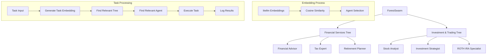

# Forest Swarm

This documentation describes the **ForestSwarm** that organizes agents into trees. Each agent specializes in processing specific tasks. Trees are collections of agents, each assigned based on their relevance to a task through keyword extraction and **litellm-based embedding similarity**.

The architecture allows for efficient task assignment by selecting the most relevant agent from a set of trees. Tasks are processed asynchronously, with agents selected based on task relevance, calculated by the similarity of system prompts and task keywords using **litellm embeddings** and cosine similarity calculations.

## Module Path: `swarms.structs.tree_swarm`

---

### Utility Functions

#### `extract_keywords(prompt: str, top_n: int = 5) -> List[str]`
Extracts relevant keywords from a text prompt using basic word splitting and frequency counting.

**Parameters:**
- `prompt` (str): The text to extract keywords from
- `top_n` (int): Maximum number of keywords to return

**Returns:**
- `List[str]`: List of extracted keywords sorted by frequency

#### `cosine_similarity(vec1: List[float], vec2: List[float]) -> float`
Calculates the cosine similarity between two embedding vectors.

**Parameters:**
- `vec1` (List[float]): First embedding vector
- `vec2` (List[float]): Second embedding vector

**Returns:**
- `float`: Cosine similarity score between -1 and 1

---

### Class: `TreeAgent`

`TreeAgent` represents an individual agent responsible for handling a specific task. Agents are initialized with a **system prompt** and use **litellm embeddings** to dynamically determine their relevance to a given task.

#### Attributes

| **Attribute**            | **Type**         | **Description**                                                                 |
|--------------------------|------------------|---------------------------------------------------------------------------------|
| `system_prompt`          | `str`            | A string that defines the agent's area of expertise and task-handling capability.|
| `llm`                    | `callable`       | The language model (LLM) used to process tasks (e.g., GPT-4).                    |
| `agent_name`             | `str`            | The name of the agent.                                                          |
| `system_prompt_embedding`| `List[float]`    | **litellm-generated embedding** of the system prompt for similarity-based task matching.|
| `relevant_keywords`      | `List[str]`      | Keywords dynamically extracted from the system prompt to assist in task matching.|
| `distance`               | `Optional[float]`| The computed distance between agents based on embedding similarity.              |
| `embedding_model_name`   | `str`            | **Name of the litellm embedding model** (default: "text-embedding-ada-002").    |

#### Methods

| **Method**         | **Input**                       | **Output**         | **Description**                                                                 |
|--------------------|---------------------------------|--------------------|---------------------------------------------------------------------------------|
| `_get_embedding(text: str)` | `text: str`              | `List[float]`    | **Internal method to generate embeddings using litellm.**                      |
| `calculate_distance(other_agent: TreeAgent)` | `other_agent: TreeAgent`   | `float`          | Calculates the **cosine similarity distance** between this agent and another agent.|
| `run_task(task: str)`                  | `task: str`                  | `Any`            | Executes the task, logs the input/output, and returns the result.               |
| `is_relevant_for_task(task: str, threshold: float = 0.7)` | `task: str, threshold: float` | `bool`  | Checks if the agent is relevant for the task using **keyword matching and litellm embedding similarity**.|

---

### Class: `Tree`

`Tree` organizes multiple agents into a hierarchical structure, where agents are sorted based on their relevance to tasks using **litellm embeddings**.

#### Attributes

| **Attribute**            | **Type**         | **Description**                                                                 |
|--------------------------|------------------|---------------------------------------------------------------------------------|
| `tree_name`              | `str`            | The name of the tree (represents a domain of agents, e.g., "Financial Tree").    |
| `agents`                 | `List[TreeAgent]`| List of agents belonging to this tree, **sorted by embedding-based distance**.  |

#### Methods

| **Method**         | **Input**                       | **Output**         | **Description**                                                                 |
|--------------------|---------------------------------|--------------------|---------------------------------------------------------------------------------|
| `calculate_agent_distances()` | `None`                  | `None`             | **Calculates and assigns distances between agents based on litellm embedding similarity of prompts.** |
| `find_relevant_agent(task: str)` | `task: str`           | `Optional[TreeAgent]` | **Finds the most relevant agent for a task based on keyword and litellm embedding similarity.** |
| `log_tree_execution(task: str, selected_agent: TreeAgent, result: Any)` | `task: str, selected_agent: TreeAgent, result: Any` | `None` | Logs details of the task execution by the selected agent.                      |

---

### Class: `ForestSwarm` 

`ForestSwarm` is the main class responsible for managing multiple trees. It oversees task delegation by finding the most relevant tree and agent for a given task using **litellm embeddings**.

#### Attributes

| **Attribute**            | **Type**         | **Description**                                                                 |
|--------------------------|------------------|---------------------------------------------------------------------------------|
| `name`                   | `str`            | Name of the forest swarm.                                                       |
| `description`            | `str`            | Description of the forest swarm.                                                |
| `trees`                  | `List[Tree]`     | List of trees containing agents organized by domain.                             |
| `shared_memory`          | `Any`            | Shared memory object for inter-tree communication.                              |
| `rules`                  | `str`            | Rules governing the forest swarm behavior.                                      |
| `conversation`           | `Conversation`   | Conversation object for tracking interactions.                                  |

#### Methods

| **Method**         | **Input**                       | **Output**         | **Description**                                                                 |
|--------------------|---------------------------------|--------------------|---------------------------------------------------------------------------------|
| `find_relevant_tree(task: str)` | `task: str`           | `Optional[Tree]`    | **Searches across all trees to find the most relevant tree based on litellm embedding similarity.**|
| `run(task: str, img: str = None, *args, **kwargs)` | `task: str, img: str, *args, **kwargs` | `Any` | **Executes the task by finding the most relevant agent from the relevant tree using litellm embeddings.**|

---

### Pydantic Models for Logging

#### `AgentLogInput`
Input log model for tracking agent task execution.

**Fields:**
- `log_id` (str): Unique identifier for the log entry
- `agent_name` (str): Name of the agent executing the task
- `task` (str): Description of the task being executed
- `timestamp` (datetime): When the task was started

#### `AgentLogOutput`
Output log model for tracking agent task completion.

**Fields:**
- `log_id` (str): Unique identifier for the log entry
- `agent_name` (str): Name of the agent that completed the task
- `result` (Any): Result/output from the task execution
- `timestamp` (datetime): When the task was completed

#### `TreeLog`
Tree execution log model for tracking tree-level operations.

**Fields:**
- `log_id` (str): Unique identifier for the log entry
- `tree_name` (str): Name of the tree that executed the task
- `task` (str): Description of the task that was executed
- `selected_agent` (str): Name of the agent selected for the task
- `timestamp` (datetime): When the task was executed
- `result` (Any): Result/output from the task execution

---

## Full Code Example

```python
from swarms.structs.tree_swarm import TreeAgent, Tree, ForestSwarm

# Create agents with varying system prompts and dynamically generated distances/keywords
agents_tree1 = [
    TreeAgent(
        system_prompt="I am a financial advisor specializing in investment planning, retirement strategies, and tax optimization for individuals and businesses.",
        agent_name="Financial Advisor",
    ),
    TreeAgent(
        system_prompt="I am a tax expert with deep knowledge of corporate taxation, Delaware incorporation benefits, and free tax filing options for businesses.",
        agent_name="Tax Expert",
    ),
    TreeAgent(
        system_prompt="I am a retirement planning specialist who helps individuals and businesses create comprehensive retirement strategies and investment plans.",
        agent_name="Retirement Planner",
    ),
]

agents_tree2 = [
    TreeAgent(
        system_prompt="I am a stock market analyst who provides insights on market trends, stock recommendations, and portfolio optimization strategies.",
        agent_name="Stock Analyst",
    ),
    TreeAgent(
        system_prompt="I am an investment strategist specializing in portfolio diversification, risk management, and market analysis.",
        agent_name="Investment Strategist",
    ),
    TreeAgent(
        system_prompt="I am a ROTH IRA specialist who helps individuals optimize their retirement accounts and tax advantages.",
        agent_name="ROTH IRA Specialist",
    ),
]

# Create trees
tree1 = Tree(tree_name="Financial Services Tree", agents=agents_tree1)
tree2 = Tree(tree_name="Investment & Trading Tree", agents=agents_tree2)

# Create the ForestSwarm
forest_swarm = ForestSwarm(
    name="Financial Services Forest",
    description="A comprehensive financial services multi-agent system",
    trees=[tree1, tree2]
)

# Run a task
task = "Our company is incorporated in Delaware, how do we do our taxes for free?"
output = forest_swarm.run(task)
print(output)
```

---

## Example Workflow

1. **Create Agents**: Agents are initialized with varying system prompts, representing different areas of expertise (e.g., financial planning, tax filing).
2. **Generate Embeddings**: Each agent's system prompt is converted to **litellm embeddings** for semantic similarity calculations.
3. **Create Trees**: Agents are grouped into trees, with each tree representing a domain (e.g., "Financial Services Tree", "Investment & Trading Tree").
4. **Calculate Distances**: **litellm embeddings** are used to calculate semantic distances between agents within each tree.
5. **Run Task**: When a task is submitted, the system:
   - Generates **litellm embeddings** for the task
   - Searches through all trees using **cosine similarity**
   - Finds the most relevant agent based on **embedding similarity and keyword matching**
6. **Task Execution**: The selected agent processes the task, and the result is returned and logged.

```plaintext
Task: "Our company is incorporated in Delaware, how do we do our taxes for free?"
```

**Process**:
- The system generates **litellm embeddings** for the task
- Searches through the `Financial Services Tree` and `Investment & Trading Tree`
- Uses **cosine similarity** to find the most relevant agent (likely the "Tax Expert")
- The task is processed, and the result is logged and returned

---

## Key Features

### **litellm Integration**
- **Embedding Generation**: Uses litellm's `embedding()` function for generating high-quality embeddings
- **Model Flexibility**: Supports various embedding models (default: "text-embedding-ada-002")
- **Error Handling**: Robust fallback mechanisms for embedding failures

### **Semantic Similarity**
- **Cosine Similarity**: Implements efficient cosine similarity calculations for vector comparisons
- **Threshold-based Selection**: Configurable similarity thresholds for agent selection
- **Hybrid Matching**: Combines keyword matching with semantic similarity for optimal results

### **Dynamic Agent Organization**
- **Automatic Distance Calculation**: Agents are automatically organized by semantic similarity
- **Real-time Relevance**: Task relevance is calculated dynamically using current embeddings
- **Scalable Architecture**: Easy to add/remove agents and trees without manual configuration

---

## Analysis of the Swarm Architecture

The **ForestSwarm Architecture** leverages a hierarchical structure (forest) composed of individual trees, each containing agents specialized in specific domains. This design allows for:

- **Modular and Scalable Organization**: By separating agents into trees, it is easy to expand or contract the system by adding or removing trees or agents.
- **Task Specialization**: Each agent is specialized, which ensures that tasks are matched with the most appropriate agent based on **litellm embedding similarity** and expertise.
- **Dynamic Matching**: The architecture uses both keyword-based and **litellm embedding-based matching** to assign tasks, ensuring a high level of accuracy in agent selection.
- **Logging and Accountability**: Each task execution is logged in detail, providing transparency and an audit trail of which agent handled which task and the results produced.
- **Asynchronous Task Execution**: The architecture can be adapted for asynchronous task processing, making it scalable and suitable for large-scale task handling in real-time systems.

---

## Mermaid Diagram of the Swarm Architecture



### Explanation of the Diagram

- **ForestSwarm**: Represents the top-level structure managing multiple trees.
- **Trees**: In the example, two trees exist—**Financial Services Tree** and **Investment & Trading Tree**—each containing agents related to specific domains.
- **Agents**: Each agent within the tree is responsible for handling tasks in its area of expertise. Agents within a tree are organized based on their **litellm embedding similarity** (distance).
- **Embedding Process**: Shows how **litellm embeddings** are used for similarity calculations and agent selection.
- **Task Processing**: Illustrates the complete workflow from task input to result logging.

---

## Testing

The ForestSwarm implementation includes comprehensive unit tests that can be run independently:

```bash
python test_forest_swarm.py
```

The test suite covers:
- **Utility Functions**: `extract_keywords`, `cosine_similarity`
- **Pydantic Models**: `AgentLogInput`, `AgentLogOutput`, `TreeLog`
- **Core Classes**: `TreeAgent`, `Tree`, `ForestSwarm`
- **Edge Cases**: Error handling, empty inputs, null values
- **Integration**: End-to-end task execution workflows

---

### Summary

This **ForestSwarm Architecture** provides an efficient, scalable, and accurate architecture for delegating and executing tasks based on domain-specific expertise. The combination of hierarchical organization, **litellm-based semantic similarity**, dynamic task matching, and comprehensive logging ensures reliability, performance, and transparency in task execution.

**Key Advantages:**
- **High Accuracy**: litellm embeddings provide superior semantic understanding
- **Scalability**: Easy to add new agents, trees, and domains
- **Flexibility**: Configurable similarity thresholds and embedding models
- **Robustness**: Comprehensive error handling and fallback mechanisms
- **Transparency**: Detailed logging and audit trails for all operations