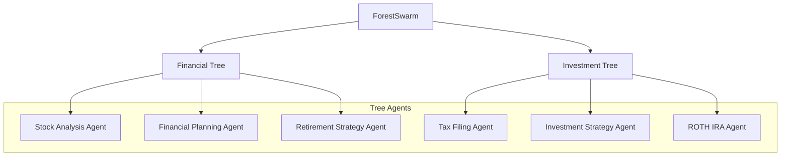

# Forest Swarm

This documentation describes the **ForestSwarm** that organizes agents into trees. Each agent specializes in processing specific tasks. Trees are collections of agents, each assigned based on their relevance to a task through keyword extraction and embedding-based similarity.

The architecture allows for efficient task assignment by selecting the most relevant agent from a set of trees. Tasks are processed asynchronously, with agents selected based on task relevance, calculated by the similarity of system prompts and task keywords.


## Module Path: `swarms.structs.tree_swarm`

---

### Class: `TreeAgent`

`TreeAgent` represents an individual agent responsible for handling a specific task. Agents are initialized with a **system prompt** and are responsible for dynamically determining their relevance to a given task.

#### Attributes

| **Attribute**            | **Type**         | **Description**                                                                 |
|--------------------------|------------------|---------------------------------------------------------------------------------|
| `system_prompt`          | `str`            | A string that defines the agent's area of expertise and task-handling capability.|
| `llm`                    | `callable`       | The language model (LLM) used to process tasks (e.g., GPT-4).                    |
| `agent_name`             | `str`            | The name of the agent.                                                          |
| `system_prompt_embedding`| `tensor`         | Embedding of the system prompt for similarity-based task matching.               |
| `relevant_keywords`      | `List[str]`      | Keywords dynamically extracted from the system prompt to assist in task matching.|
| `distance`               | `Optional[float]`| The computed distance between agents based on embedding similarity.              |

#### Methods

| **Method**         | **Input**                       | **Output**         | **Description**                                                                 |
|--------------------|---------------------------------|--------------------|---------------------------------------------------------------------------------|
| `calculate_distance(other_agent: TreeAgent)` | `other_agent: TreeAgent`   | `float`          | Calculates the cosine similarity between this agent and another agent.         |
| `run_task(task: str)`                  | `task: str`                  | `Any`            | Executes the task, logs the input/output, and returns the result.               |
| `is_relevant_for_task(task: str, threshold: float = 0.7)` | `task: str, threshold: float` | `bool`  | Checks if the agent is relevant for the task using keyword matching or embedding similarity.|

---

### Class: `Tree`

`Tree` organizes multiple agents into a hierarchical structure, where agents are sorted based on their relevance to tasks.

#### Attributes

| **Attribute**            | **Type**         | **Description**                                                                 |
|--------------------------|------------------|---------------------------------------------------------------------------------|
| `tree_name`              | `str`            | The name of the tree (represents a domain of agents, e.g., "Financial Tree").    |
| `agents`                 | `List[TreeAgent]`| List of agents belonging to this tree.                                           |

#### Methods

| **Method**         | **Input**                       | **Output**         | **Description**                                                                 |
|--------------------|---------------------------------|--------------------|---------------------------------------------------------------------------------|
| `calculate_agent_distances()` | `None`                  | `None`             | Calculates and assigns distances between agents based on similarity of prompts. |
| `find_relevant_agent(task: str)` | `task: str`           | `Optional[TreeAgent]` | Finds the most relevant agent for a task based on keyword and embedding similarity. |
| `log_tree_execution(task: str, selected_agent: TreeAgent, result: Any)` | `task: str, selected_agent: TreeAgent, result: Any` | `None` | Logs details of the task execution by the selected agent.                      |

---

### Class: `ForestSwarm` 

`ForestSwarm` is the main class responsible for managing multiple trees. It oversees task delegation by finding the most relevant tree and agent for a given task.

#### Attributes

| **Attribute**            | **Type**         | **Description**                                                                 |
|--------------------------|------------------|---------------------------------------------------------------------------------|
| `trees`                  | `List[Tree]`     | List of trees containing agents organized by domain.                             |

#### Methods

| **Method**         | **Input**                       | **Output**         | **Description**                                                                 |
|--------------------|---------------------------------|--------------------|---------------------------------------------------------------------------------|
| `find_relevant_tree(task: str)` | `task: str`           | `Optional[Tree]`    | Searches across all trees to find the most relevant tree based on task requirements.|
| `run(task: str)`                | `task: str`           | `Any`              | Executes the task by finding the most relevant agent from the relevant tree.    |

## Full Code Example

```python
from swarms.structs.tree_swarm import TreeAgent, Tree, ForestSwarm
# Example Usage:

# Create agents with varying system prompts and dynamically generated distances/keywords
agents_tree1 = [
    TreeAgent(
        system_prompt="Stock Analysis Agent",
        agent_name="Stock Analysis Agent",
    ),
    TreeAgent(
        system_prompt="Financial Planning Agent",
        agent_name="Financial Planning Agent",
    ),
    TreeAgent(
        agent_name="Retirement Strategy Agent",
        system_prompt="Retirement Strategy Agent",
    ),
]

agents_tree2 = [
    TreeAgent(
        system_prompt="Tax Filing Agent",
        agent_name="Tax Filing Agent",
    ),
    TreeAgent(
        system_prompt="Investment Strategy Agent",
        agent_name="Investment Strategy Agent",
    ),
    TreeAgent(
        system_prompt="ROTH IRA Agent", agent_name="ROTH IRA Agent"
    ),
]

# Create trees
tree1 = Tree(tree_name="Financial Tree", agents=agents_tree1)
tree2 = Tree(tree_name="Investment Tree", agents=agents_tree2)

# Create the ForestSwarm
multi_agent_structure = ForestSwarm(trees=[tree1, tree2])

# Run a task
task = "Our company is incorporated in delaware, how do we do our taxes for free?"
output = multi_agent_structure.run(task)
print(output)
```


---

## Example Workflow

1. **Create Agents**: Agents are initialized with varying system prompts, representing different areas of expertise (e.g., stock analysis, tax filing).
2. **Create Trees**: Agents are grouped into trees, with each tree representing a domain (e.g., "Financial Tree", "Investment Tree").
3. **Run Task**: When a task is submitted, the system traverses through all trees and finds the most relevant agent to handle the task.
4. **Task Execution**: The selected agent processes the task, and the result is returned.

```plaintext
Task: "Our company is incorporated in Delaware, how do we do our taxes for free?"
```

**Process**:
- The system searches through the `Financial Tree` and `Investment Tree`.
- The most relevant agent (likely the "Tax Filing Agent") is selected based on keyword matching and prompt similarity.
- The task is processed, and the result is logged and returned.

---

## Analysis of the Swarm Architecture

The **Swarm Architecture** leverages a hierarchical structure (forest) composed of individual trees, each containing agents specialized in specific domains. This design allows for:

- **Modular and Scalable Organization**: By separating agents into trees, it is easy to expand or contract the system by adding or removing trees or agents.
- **Task Specialization**: Each agent is specialized, which ensures that tasks are matched with the most appropriate agent based on relevance and expertise.
- **Dynamic Matching**: The architecture uses both keyword-based and embedding-based matching to assign tasks, ensuring a high level of accuracy in agent selection.
- **Logging and Accountability**: Each task execution is logged in detail, providing transparency and an audit trail of which agent handled which task and the results produced.
- **Asynchronous Task Execution**: The architecture can be adapted for asynchronous task processing, making it scalable and suitable for large-scale task handling in real-time systems.

---

## Mermaid Diagram of the Swarm Architecture



### Explanation of the Diagram

- **ForestSwarm**: Represents the top-level structure managing multiple trees.
- **Trees**: In the example, two trees exist—**Financial Tree** and **Investment Tree**—each containing agents related to specific domains.
- **Agents**: Each agent within the tree is responsible for handling tasks in its area of expertise. Agents within a tree are organized based on their prompt similarity (distance).

---

### Summary

This **Multi-Agent Tree Structure** provides an efficient, scalable, and accurate architecture for delegating and executing tasks based on domain-specific expertise. The combination of hierarchical organization, dynamic task matching, and logging ensures reliability, performance, and transparency in task execution.