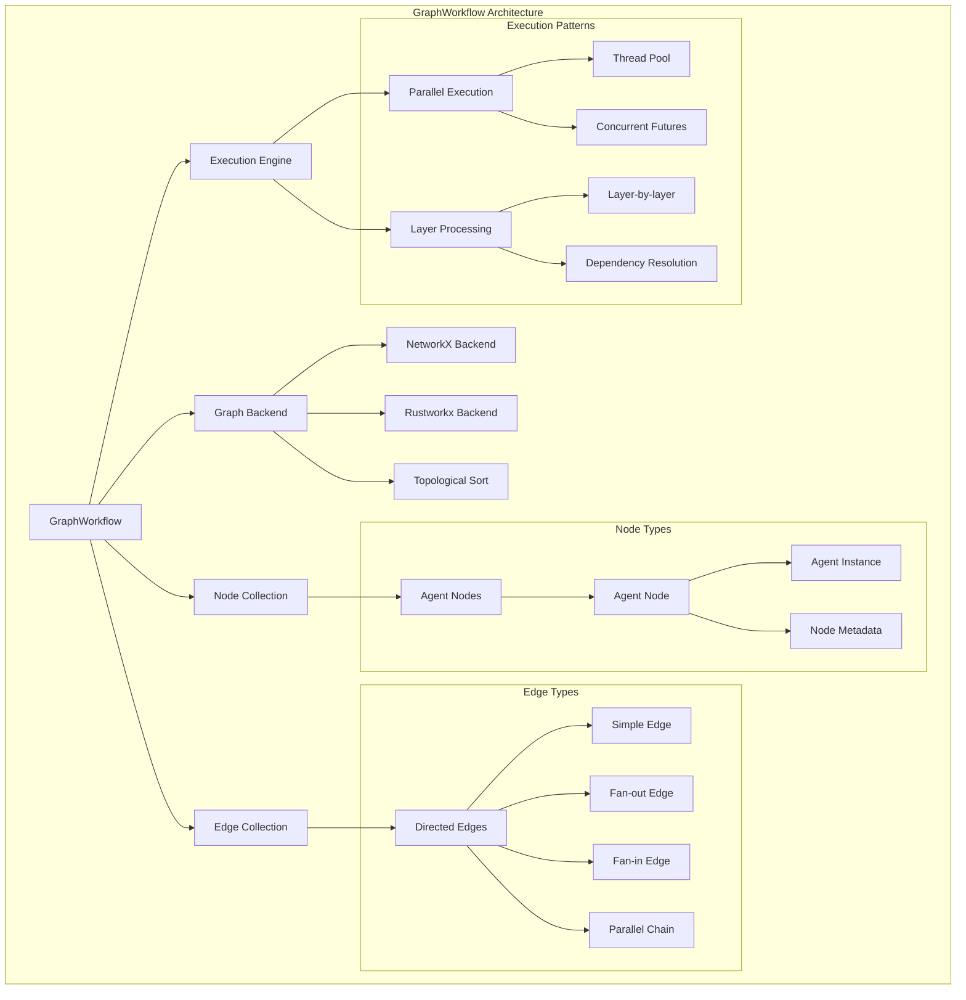

# GraphWorkflow

A powerful workflow orchestration system that creates directed graphs of agents for complex multi-agent collaboration and task execution.

## Overview

The `GraphWorkflow` class is a sophisticated workflow management system that enables the creation and execution of complex multi-agent workflows. It represents workflows as directed graphs where nodes are agents and edges represent data flow and dependencies between agents. The system supports parallel execution, automatic compilation optimization, and comprehensive visualization capabilities.

Key features:

| Feature                | Description                                                                                   |
|------------------------|-----------------------------------------------------------------------------------------------|
| **Agent-based nodes**  | Each node represents an agent that can process tasks                                          |
| **Directed graph structure** | Edges define the flow of data between agents                                            |
| **Dual backend support** | Choose between NetworkX (compatibility) or Rustworkx (performance) backends            |
| **Parallel execution** | Multiple agents can run simultaneously within layers                                          |
| **Automatic compilation** | Optimizes workflow structure for efficient execution                                       |
| **Rich visualization** | Generate visual representations using Graphviz                                                |
| **Serialization**      | Save and load workflows as JSON                                                               |
| **Pattern detection**  | Automatically identifies parallel processing patterns                                         |

## Architecture




## Class Reference

| Parameter | Type | Description | Default |
|-----------|------|-------------|---------|
| `id` | `Optional[str]` | Unique identifier for the workflow | Auto-generated UUID |
| `name` | `Optional[str]` | Human-readable name for the workflow | "Graph-Workflow-01" |
| `description` | `Optional[str]` | Detailed description of the workflow | Generic description |
| `nodes` | `Optional[Dict[str, Node]]` | Initial collection of nodes | `{}` |
| `edges` | `Optional[List[Edge]]` | Initial collection of edges | `[]` |
| `entry_points` | `Optional[List[str]]` | Node IDs that serve as starting points | `[]` |
| `end_points` | `Optional[List[str]]` | Node IDs that serve as ending points | `[]` |
| `max_loops` | `int` | Maximum number of execution loops | `1` |
| `task` | `Optional[str]` | The task to be executed by the workflow | `None` |
| `auto_compile` | `bool` | Whether to automatically compile the workflow | `True` |
| `verbose` | `bool` | Whether to enable detailed logging | `False` |
| `backend` | `str` | Graph backend to use ("networkx" or "rustworkx") | `"networkx"` |

## Graph Backends

GraphWorkflow supports two graph backend implementations, each with different performance characteristics:

### NetworkX Backend (Default)

The **NetworkX** backend is the default and most widely compatible option. It provides:

| Feature             | Description                                             |
|---------------------|---------------------------------------------------------|
| ✅ Full compatibility | Works out of the box with no additional dependencies   |
| ✅ Mature ecosystem   | Well-tested and stable                                 |
| ✅ Rich features      | Comprehensive graph algorithms and operations          |
| ✅ Python-native      | Pure Python implementation                             |

**Use NetworkX when:**

- You need maximum compatibility

- Working with small to medium-sized graphs (< 1000 nodes)

- You want zero additional dependencies

### Rustworkx Backend (High Performance)

The **Rustworkx** backend provides significant performance improvements for large graphs:

| Feature            | Description                                                     |
|--------------------|-----------------------------------------------------------------|
| ⚡ High performance| Rust-based implementation for faster operations                  |
| ⚡ Memory efficient| Optimized for large-scale graphs                                |
| ⚡ Scalable        | Better performance with graphs containing 1000+ nodes            |
| ⚡ Same API        | Drop-in replacement with identical interface                     |

**Use Rustworkx when:**

- Working with large graphs (1000+ nodes)

- Performance is critical

- You can install additional dependencies

**Installation:**
```bash
pip install rustworkx
```

**Note:** If rustworkx is not installed and you specify `backend="rustworkx"`, GraphWorkflow will automatically fall back to NetworkX with a warning.

### Backend Selection

Both backends implement the same `GraphBackend` interface, ensuring complete API compatibility. You can switch between backends without changing your code:

```python
# Use NetworkX (default)
workflow = GraphWorkflow(backend="networkx")

# Use Rustworkx for better performance
workflow = GraphWorkflow(backend="rustworkx")
```

The backend choice is transparent to the rest of the API - all methods work identically regardless of which backend is used.

### Core Methods

#### `add_node(agent: Agent, **kwargs)`

Adds an agent node to the workflow graph.

| Parameter | Type | Description |
|-----------|------|-------------|
| `agent` | `Agent` | The agent to add as a node |
| `**kwargs` | `Any` | Additional keyword arguments for the node |

**Raises:**

- `ValueError`: If a node with the same ID already exists

**Example:**

```python
workflow = GraphWorkflow()
agent = Agent(agent_name="ResearchAgent", model_name="gpt-4")
workflow.add_node(agent, metadata={"priority": "high"})
```

#### `add_edge(edge_or_source, target=None, **kwargs)`

Adds an edge to connect nodes in the workflow.

| Parameter | Type | Description |
|-----------|------|-------------|
| `edge_or_source` | `Edge` or `str` | Either an Edge object or source node ID |
| `target` | `str` | Target node ID (required if edge_or_source is not an Edge) |
| `**kwargs` | `Any` | Additional keyword arguments for the edge |

**Raises:**

- `ValueError`: If source or target nodes don't exist

**Example:**

```python
# Using Edge object
edge = Edge(source="agent1", target="agent2")
workflow.add_edge(edge)

# Using node IDs
workflow.add_edge("agent1", "agent2", metadata={"priority": "high"})
```

#### `add_edges_from_source(source, targets, **kwargs)`

Creates a fan-out pattern where one source connects to multiple targets.

| Parameter | Type | Description |
|-----------|------|-------------|
| `source` | `str` | Source node ID |
| `targets` | `List[str]` | List of target node IDs |
| `**kwargs` | `Any` | Additional keyword arguments for all edges |

**Returns:**

- `List[Edge]`: List of created Edge objects

**Example:**

```python
workflow.add_edges_from_source(
    "DataCollector",
    ["TechnicalAnalyst", "FundamentalAnalyst", "SentimentAnalyst"]
)
```

#### `add_edges_to_target(sources, target, **kwargs)`

Creates a fan-in pattern where multiple sources connect to one target.

| Parameter | Type | Description |
|-----------|------|-------------|
| `sources` | `List[str]` | List of source node IDs |
| `target` | `str` | Target node ID |
| `**kwargs` | `Any` | Additional keyword arguments for all edges |

**Returns:**

- `List[Edge]`: List of created Edge objects

**Example:**

```python
workflow.add_edges_to_target(
    ["TechnicalAnalyst", "FundamentalAnalyst", "SentimentAnalyst"],
    "SynthesisAgent"
)
```

#### `add_parallel_chain(sources, targets, **kwargs)`

Creates a full mesh connection between multiple sources and targets.

| Parameter | Type | Description |
|-----------|------|-------------|
| `sources` | `List[str]` | List of source node IDs |
| `targets` | `List[str]` | List of target node IDs |
| `**kwargs` | `Any` | Additional keyword arguments for all edges |

**Returns:**

- `List[Edge]`: List of created Edge objects


**Example:**

```python
workflow.add_parallel_chain(
    ["DataCollector1", "DataCollector2"],
    ["Analyst1", "Analyst2", "Analyst3"]
)
```

### Execution Methods

#### `run(task: str = None, img: Optional[str] = None, *args, **kwargs) -> Dict[str, Any]`

Executes the workflow with optimized parallel agent execution.

| Parameter | Type | Description |
|-----------|------|-------------|
| `task` | `str` | Task to execute (uses self.task if not provided) |
| `img` | `Optional[str]` | Image path for vision-enabled agents |
| `*args` | `Any` | Additional positional arguments |
| `**kwargs` | `Any` | Additional keyword arguments |

**Returns:**

- `Dict[str, Any]`: Execution results from all nodes

**Example:**

```python
results = workflow.run(
    task="Analyze market trends for cryptocurrency",
    max_loops=2
)
```

#### `arun(task: str = None, *args, **kwargs) -> Dict[str, Any]`

Async version of run for better performance with I/O bound operations.

| Parameter | Type | Description |
|-----------|------|-------------|
| `task` | `str` | Task to execute |
| `*args` | `Any` | Additional positional arguments |
| `**kwargs` | `Any` | Additional keyword arguments |

**Returns:**

- `Dict[str, Any]`: Execution results from all nodes

**Example:**

```python
import asyncio
results = await workflow.arun("Process large dataset")
```

### Compilation and Optimization

#### `compile()`

Pre-computes expensive operations for faster execution.

**Example:**

```python
workflow.compile()
status = workflow.get_compilation_status()
print(f"Compiled: {status['is_compiled']}")
```

#### `get_compilation_status() -> Dict[str, Any]`

Returns detailed compilation status information.

**Returns:**

- `Dict[str, Any]`: Compilation status including cache state and performance metrics

**Example:**

```python
status = workflow.get_compilation_status()
print(f"Layers: {status['cached_layers_count']}")
print(f"Max workers: {status['max_workers']}")
```

### Visualization Methods

#### `visualize(format: str = "png", view: bool = True, engine: str = "dot", show_summary: bool = False) -> str`

Generates a visual representation of the workflow using Graphviz.

| Parameter | Type | Description | Default |
|-----------|------|-------------|---------|
| `format` | `str` | Output format ('png', 'svg', 'pdf', 'dot') | `"png"` |
| `view` | `bool` | Whether to open the visualization | `True` |
| `engine` | `str` | Graphviz layout engine | `"dot"` |
| `show_summary` | `bool` | Whether to print parallel processing summary | `False` |

**Returns:**

- `str`: Path to the generated visualization file

**Example:**

```python
output_file = workflow.visualize(
    format="svg",
    show_summary=True
)
print(f"Visualization saved to: {output_file}")
```

#### `visualize_simple() -> str`

Generates a simple text-based visualization.

**Returns:**

- `str`: Text representation of the workflow

**Example:**

```python
text_viz = workflow.visualize_simple()
print(text_viz)
```

### Serialization Methods

#### `to_json(fast: bool = True, include_conversation: bool = False, include_runtime_state: bool = False) -> str`

Serializes the workflow to JSON format.

| Parameter | Type | Description | Default |
|-----------|------|-------------|---------|
| `fast` | `bool` | Whether to use fast JSON serialization | `True` |
| `include_conversation` | `bool` | Whether to include conversation history | `False` |
| `include_runtime_state` | `bool` | Whether to include runtime state | `False` |

**Returns:**

- `str`: JSON representation of the workflow

**Example:**

```python
json_data = workflow.to_json(
    include_conversation=True,
    include_runtime_state=True
)
```

#### `from_json(json_str: str, restore_runtime_state: bool = False) -> GraphWorkflow`

Deserializes a workflow from JSON format.

| Parameter | Type | Description | Default |
|-----------|------|-------------|---------|
| `json_str` | `str` | JSON string representation | Required |
| `restore_runtime_state` | `bool` | Whether to restore runtime state | `False` |

**Returns:**

- `GraphWorkflow`: A new GraphWorkflow instance

**Example:**

```python
workflow = GraphWorkflow.from_json(json_data, restore_runtime_state=True)
```

#### `save_to_file(filepath: str, include_conversation: bool = False, include_runtime_state: bool = False, overwrite: bool = False) -> str`

Saves the workflow to a JSON file.

| Parameter | Type | Description | Default |
|-----------|------|-------------|---------|
| `filepath` | `str` | Path to save the JSON file | Required |
| `include_conversation` | `bool` | Whether to include conversation history | `False` |
| `include_runtime_state` | `bool` | Whether to include runtime state | `False` |
| `overwrite` | `bool` | Whether to overwrite existing files | `False` |

**Returns:**

- `str`: Path to the saved file

**Example:**

```python
filepath = workflow.save_to_file(
    "my_workflow.json",
    include_conversation=True
)
```

#### `load_from_file(filepath: str, restore_runtime_state: bool = False) -> GraphWorkflow`

Loads a workflow from a JSON file.

| Parameter | Type | Description | Default |
|-----------|------|-------------|---------|
| `filepath` | `str` | Path to the JSON file | Required |
| `restore_runtime_state` | `bool` | Whether to restore runtime state | `False` |

**Returns:**

- `GraphWorkflow`: Loaded workflow instance

**Example:**

```python
workflow = GraphWorkflow.load_from_file("my_workflow.json")
```

### Utility Methods

#### `export_summary() -> Dict[str, Any]`

Generates a human-readable summary of the workflow.

**Returns:**

- `Dict[str, Any]`: Comprehensive workflow summary

**Example:**

```python
summary = workflow.export_summary()
print(f"Workflow has {summary['structure']['nodes']} nodes")
print(f"Compilation status: {summary['compilation_status']['is_compiled']}")
```

#### `set_entry_points(entry_points: List[str])`

Sets the entry points for the workflow.

| Parameter | Type | Description |
|-----------|------|-------------|
| `entry_points` | `List[str]` | List of node IDs to serve as entry points |

**Example:**

```python
workflow.set_entry_points(["DataCollector", "ResearchAgent"])
```

#### `set_end_points(end_points: List[str])`

Sets the end points for the workflow.

| Parameter | Type | Description |
|-----------|------|-------------|
| `end_points` | `List[str]` | List of node IDs to serve as end points |

**Example:**

```python
workflow.set_end_points(["SynthesisAgent", "ReportGenerator"])
```

### Class Methods

#### `from_spec(agents, edges, entry_points=None, end_points=None, task=None, **kwargs) -> GraphWorkflow`

Constructs a workflow from a list of agents and connections.

| Parameter | Type | Description | Default |
|-----------|------|-------------|---------|
| `agents` | `List` | List of agents or Node objects | Required |
| `edges` | `List` | List of edges or edge tuples | Required |
| `entry_points` | `List[str]` | List of entry point node IDs | `None` |
| `end_points` | `List[str]` | List of end point node IDs | `None` |
| `task` | `str` | Task to be executed by the workflow | `None` |
| `**kwargs` | `Any` | Additional keyword arguments (e.g., `backend`, `verbose`, `auto_compile`) | `{}` |

**Returns:**

- `GraphWorkflow`: A new GraphWorkflow instance

**Example:**

```python
# Using NetworkX backend (default)
workflow = GraphWorkflow.from_spec(
    agents=[agent1, agent2, agent3],
    edges=[
        ("agent1", "agent2"),
        ("agent2", "agent3"),
        ("agent1", ["agent2", "agent3"])  # Fan-out
    ],
    task="Analyze market data"
)

# Using Rustworkx backend for better performance
workflow = GraphWorkflow.from_spec(
    agents=[agent1, agent2, agent3],
    edges=[
        ("agent1", "agent2"),
        ("agent2", "agent3"),
    ],
    task="Analyze market data",
    backend="rustworkx"  # Specify backend via kwargs
)
```

## Examples

### Using Rustworkx Backend for Performance

```python
from swarms import Agent, GraphWorkflow

# Create agents
research_agent = Agent(
    agent_name="ResearchAgent",
    model_name="gpt-4",
    max_loops=1
)

analysis_agent = Agent(
    agent_name="AnalysisAgent", 
    model_name="gpt-4",
    max_loops=1
)

# Build workflow with rustworkx backend for better performance
workflow = GraphWorkflow(
    name="High-Performance-Workflow",
    backend="rustworkx"  # Use rustworkx backend
)

workflow.add_node(research_agent)
workflow.add_node(analysis_agent)
workflow.add_edge("ResearchAgent", "AnalysisAgent")

# Execute - backend is transparent to the API
results = workflow.run("What are the latest trends in AI?")
print(results)
```

**Note:** Make sure to install rustworkx first: `pip install rustworkx`

### Basic Sequential Workflow

```python
from swarms import Agent, GraphWorkflow
from swarms.prompts.multi_agent_collab_prompt import MULTI_AGENT_COLLAB_PROMPT_TWO

# Create agents
research_agent = Agent(
    agent_name="ResearchAgent",
    model_name="gpt-4",
    system_prompt=MULTI_AGENT_COLLAB_PROMPT_TWO,
    max_loops=1
)

analysis_agent = Agent(
    agent_name="AnalysisAgent", 
    model_name="gpt-4",
    system_prompt=MULTI_AGENT_COLLAB_PROMPT_TWO,
    max_loops=1
)

# Build workflow
workflow = GraphWorkflow(name="Research-Analysis-Workflow")
workflow.add_node(research_agent)
workflow.add_node(analysis_agent)
workflow.add_edge("ResearchAgent", "AnalysisAgent")

# Execute
results = workflow.run("What are the latest trends in AI?")
print(results)
```

### Parallel Processing Workflow

```python
from swarms import Agent, GraphWorkflow

# Create specialized agents
data_collector = Agent(agent_name="DataCollector", model_name="gpt-4")
technical_analyst = Agent(agent_name="TechnicalAnalyst", model_name="gpt-4")
fundamental_analyst = Agent(agent_name="FundamentalAnalyst", model_name="gpt-4")
sentiment_analyst = Agent(agent_name="SentimentAnalyst", model_name="gpt-4")
synthesis_agent = Agent(agent_name="SynthesisAgent", model_name="gpt-4")

# Build parallel workflow
workflow = GraphWorkflow(name="Market-Analysis-Workflow")

# Add all agents
for agent in [data_collector, technical_analyst, fundamental_analyst, 
              sentiment_analyst, synthesis_agent]:
    workflow.add_node(agent)

# Create fan-out pattern: data collector feeds all analysts
workflow.add_edges_from_source(
    "DataCollector",
    ["TechnicalAnalyst", "FundamentalAnalyst", "SentimentAnalyst"]
)

# Create fan-in pattern: all analysts feed synthesis agent
workflow.add_edges_to_target(
    ["TechnicalAnalyst", "FundamentalAnalyst", "SentimentAnalyst"],
    "SynthesisAgent"
)

# Execute
results = workflow.run("Analyze Bitcoin market trends")
print(results)
```

### Complex Multi-Layer Workflow

```python
from swarms import Agent, GraphWorkflow

# Create agents for different stages
data_collectors = [
    Agent(agent_name=f"DataCollector{i}", model_name="gpt-4")
    for i in range(1, 4)
]

analysts = [
    Agent(agent_name=f"Analyst{i}", model_name="gpt-4")
    for i in range(1, 4)
]

validators = [
    Agent(agent_name=f"Validator{i}", model_name="gpt-4")
    for i in range(1, 3)
]

synthesis_agent = Agent(agent_name="SynthesisAgent", model_name="gpt-4")

# Build complex workflow
workflow = GraphWorkflow(name="Complex-Research-Workflow")

# Add all agents
all_agents = data_collectors + analysts + validators + [synthesis_agent]
for agent in all_agents:
    workflow.add_node(agent)

# Layer 1: Data collectors feed all analysts in parallel
workflow.add_parallel_chain(
    [agent.agent_name for agent in data_collectors],
    [agent.agent_name for agent in analysts]
)

# Layer 2: Analysts feed validators
workflow.add_parallel_chain(
    [agent.agent_name for agent in analysts],
    [agent.agent_name for agent in validators]
)

# Layer 3: Validators feed synthesis agent
workflow.add_edges_to_target(
    [agent.agent_name for agent in validators],
    "SynthesisAgent"
)

# Visualize and execute
workflow.visualize(show_summary=True)
results = workflow.run("Comprehensive analysis of renewable energy markets")
```

### Workflow with Custom Metadata

```python
from swarms import Agent, GraphWorkflow, Edge

# Create agents with specific roles
research_agent = Agent(agent_name="ResearchAgent", model_name="gpt-4")
analysis_agent = Agent(agent_name="AnalysisAgent", model_name="gpt-4")

# Build workflow with metadata
workflow = GraphWorkflow(
    name="Metadata-Workflow",
    description="Workflow demonstrating metadata usage"
)

workflow.add_node(research_agent, metadata={"priority": "high", "timeout": 300})
workflow.add_node(analysis_agent, metadata={"priority": "medium", "timeout": 600})

# Add edge with metadata
edge = Edge(
    source="ResearchAgent",
    target="AnalysisAgent",
    metadata={"data_type": "research_findings", "priority": "high"}
)
workflow.add_edge(edge)

# Execute with custom parameters
results = workflow.run(
    "Analyze the impact of climate change on agriculture",
    max_loops=2
)
```

### Workflow Serialization and Persistence

```python
from swarms import Agent, GraphWorkflow

# Create workflow
research_agent = Agent(agent_name="ResearchAgent", model_name="gpt-4")
analysis_agent = Agent(agent_name="AnalysisAgent", model_name="gpt-4")

workflow = GraphWorkflow(name="Persistent-Workflow")
workflow.add_node(research_agent)
workflow.add_node(analysis_agent)
workflow.add_edge("ResearchAgent", "AnalysisAgent")

# Execute and get conversation
results = workflow.run("Research quantum computing applications")

# Save workflow with conversation history
filepath = workflow.save_to_file(
    "quantum_research_workflow.json",
    include_conversation=True,
    include_runtime_state=True
)

# Load workflow later
loaded_workflow = GraphWorkflow.load_from_file(
    filepath,
    restore_runtime_state=True
)

# Continue execution
new_results = loaded_workflow.run("Continue with quantum cryptography analysis")
```

### Large-Scale Workflow with Rustworkx

```python
from swarms import Agent, GraphWorkflow

# Create a large workflow with many agents
# Rustworkx backend provides better performance for large graphs
workflow = GraphWorkflow(
    name="Large-Scale-Workflow",
    backend="rustworkx",  # Use rustworkx for better performance
    verbose=True
)

# Create many agents (e.g., for parallel data processing)
agents = []
for i in range(50):
    agent = Agent(
        agent_name=f"Processor{i}",
        model_name="gpt-4",
        max_loops=1
    )
    agents.append(agent)
    workflow.add_node(agent)

# Create complex interconnections
# Rustworkx handles this efficiently
for i in range(0, 50, 10):
    source_agents = [f"Processor{j}" for j in range(i, min(i+10, 50))]
    target_agents = [f"Processor{j}" for j in range(i+10, min(i+20, 50))]
    if target_agents:
        workflow.add_parallel_chain(source_agents, target_agents)

# Compile and execute
workflow.compile()
status = workflow.get_compilation_status()
print(f"Compiled workflow with {status['cached_layers_count']} layers")

results = workflow.run("Process large dataset in parallel")
```

### Advanced Pattern Detection

```python
from swarms import Agent, GraphWorkflow

# Create a complex workflow with multiple patterns
workflow = GraphWorkflow(name="Pattern-Detection-Workflow", verbose=True)

# Create agents
agents = {
    "collector": Agent(agent_name="DataCollector", model_name="gpt-4"),
    "tech_analyst": Agent(agent_name="TechnicalAnalyst", model_name="gpt-4"),
    "fund_analyst": Agent(agent_name="FundamentalAnalyst", model_name="gpt-4"),
    "sentiment_analyst": Agent(agent_name="SentimentAnalyst", model_name="gpt-4"),
    "risk_analyst": Agent(agent_name="RiskAnalyst", model_name="gpt-4"),
    "synthesis": Agent(agent_name="SynthesisAgent", model_name="gpt-4"),
    "validator": Agent(agent_name="Validator", model_name="gpt-4")
}

# Add all agents
for agent in agents.values():
    workflow.add_node(agent)

# Create complex patterns
# Fan-out from collector
workflow.add_edges_from_source(
    "DataCollector",
    ["TechnicalAnalyst", "FundamentalAnalyst", "SentimentAnalyst", "RiskAnalyst"]
)

# Fan-in to synthesis
workflow.add_edges_to_target(
    ["TechnicalAnalyst", "FundamentalAnalyst", "SentimentAnalyst", "RiskAnalyst"],
    "SynthesisAgent"
)

# Final validation step
workflow.add_edge("SynthesisAgent", "Validator")

# Compile and get status
workflow.compile()
status = workflow.get_compilation_status()

print(f"Compilation status: {status}")
print(f"Layers: {status['cached_layers_count']}")
print(f"Max workers: {status['max_workers']}")

# Visualize with pattern detection
workflow.visualize(show_summary=True, format="png")
```

### Error Handling and Recovery

```python
from swarms import Agent, GraphWorkflow
import logging

# Set up logging
logging.basicConfig(level=logging.INFO)

# Create workflow with error handling
workflow = GraphWorkflow(
    name="Error-Handling-Workflow",
    verbose=True,
    max_loops=1
)

# Create agents
try:
    research_agent = Agent(agent_name="ResearchAgent", model_name="gpt-4")
    analysis_agent = Agent(agent_name="AnalysisAgent", model_name="gpt-4")
    
    workflow.add_node(research_agent)
    workflow.add_node(analysis_agent)
    workflow.add_edge("ResearchAgent", "AnalysisAgent")
    
    # Execute with error handling
    try:
        results = workflow.run("Analyze market trends")
        print("Workflow completed successfully")
        print(results)
        
    except Exception as e:
        print(f"Workflow execution failed: {e}")
        
        # Get workflow summary for debugging
        summary = workflow.export_summary()
        print(f"Workflow state: {summary['structure']}")
        
except Exception as e:
    print(f"Workflow setup failed: {e}")
```

## Conclusion

The `GraphWorkflow` class provides a powerful and flexible framework for orchestrating complex multi-agent workflows. Its key benefits include:

### Benefits

| Benefit         | Description                                                                                      |
|-----------------|--------------------------------------------------------------------------------------------------|
| **Scalability** | Supports workflows with hundreds of agents through efficient parallel execution                  |
| **Flexibility** | Multiple connection patterns (sequential, fan-out, fan-in, parallel chains)                      |
| **Performance** | Automatic compilation and optimization for faster execution; rustworkx backend for large-scale graphs |
| **Backend Choice** | Choose between NetworkX (compatibility) or Rustworkx (performance) based on your needs          |
| **Visualization** | Rich visual representations for workflow understanding and debugging                           |
| **Persistence** | Complete serialization and deserialization capabilities                                          |
| **Error Handling** | Comprehensive error handling and recovery mechanisms                                          |
| **Monitoring**  | Detailed logging and status reporting                                                            |

### Use Cases

| Use Case                | Description                                                        |
|-------------------------|--------------------------------------------------------------------|
| **Research Workflows**  | Multi-stage research with data collection, analysis, and synthesis |
| **Content Generation**  | Parallel content creation with validation and refinement           |
| **Data Processing**     | Complex ETL pipelines with multiple processing stages              |
| **Decision Making**     | Multi-agent decision systems with voting and consensus             |
| **Quality Assurance**   | Multi-stage validation and verification processes                  |
| **Automated Testing**   | Complex test orchestration with parallel execution                 |

### Best Practices

| Best Practice                        | Description                                                      |
|---------------------------------------|------------------------------------------------------------------|
| **Use meaningful agent names**        | Helps with debugging and visualization                           |
| **Leverage parallel patterns**        | Use fan-out and fan-in for better performance                    |
| **Choose the right backend**          | Use rustworkx for large graphs (1000+ nodes), networkx for smaller graphs |
| **Compile workflows**                 | Always compile before execution for optimal performance           |
| **Monitor execution**                 | Use verbose mode and status reporting for debugging              |
| **Save important workflows**          | Use serialization for workflow persistence                       |
| **Handle errors gracefully**          | Implement proper error handling and recovery                     |
| **Visualize complex workflows**       | Use visualization to understand and debug workflows              |

### Backend Performance Considerations

When choosing between NetworkX and Rustworkx backends:

| Graph Size | Recommended Backend | Reason |
|------------|-------------------|--------|
| < 100 nodes | NetworkX | Minimal overhead, no extra dependencies |
| 100-1000 nodes | NetworkX or Rustworkx | Both perform well, choose based on dependency preferences |
| 1000+ nodes | Rustworkx | Significant performance benefits for large graphs |
| Very large graphs (10k+ nodes) | Rustworkx | Essential for acceptable performance |

**Performance Tips:**
- Rustworkx provides 2-10x speedup for topological operations on large graphs
- Both backends support the same features and API
- You can switch backends without code changes
- Rustworkx uses less memory for large graphs

The GraphWorkflow system represents a significant advancement in multi-agent orchestration, providing the tools needed to build complex, scalable, and maintainable AI workflows.