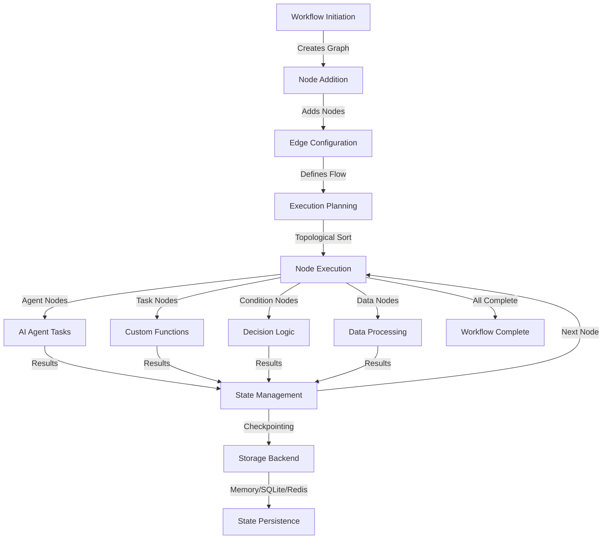

# `GraphWorkflow`

GraphWorkflow orchestrates tasks using a Directed Acyclic Graph (DAG), allowing you to manage complex dependencies where some tasks must wait for others to complete. It provides a comprehensive framework for building sophisticated pipelines with advanced state management, error handling, and performance optimization capabilities.

## Overview

The `GraphWorkflow` class establishes a graph-based workflow system with nodes representing tasks, agents, conditions, or data processors, and edges defining the flow and dependencies between these components. It includes features such as:

1. **Multiple Node Types**: Support for agents, tasks, conditions, data processors, and more
2. **Flexible Edge Types**: Sequential, conditional, parallel, and error handling edges
3. **State Management**: Multiple storage backends with checkpointing and recovery
4. **Asynchronous Execution**: Full async/await support for efficient resource utilization
5. **Error Handling**: Comprehensive retry logic and error recovery mechanisms
6. **Performance Optimization**: Parallel execution and bottleneck detection
7. **Visualization**: Mermaid diagrams and real-time dashboard monitoring
8. **Serialization**: Support for JSON, YAML, and custom DSL formats
9. **Plugin System**: Extensible architecture for custom components
10. **AI-Augmented Features**: Workflow description, optimization, and generation

## Architecture



## `GraphWorkflow` Attributes

| Attribute | Description |
|-----------|-------------|
| `name` | Name of the workflow instance |
| `description` | Human-readable description of the workflow |
| `nodes` | Dictionary of nodes in the graph |
| `edges` | List of edges connecting nodes |
| `entry_points` | Node IDs that serve as entry points |
| `end_points` | Node IDs that serve as end points |
| `graph` | NetworkX or RustWorkX graph representation |
| `max_loops` | Maximum execution loops |
| `timeout` | Overall workflow timeout in seconds |
| `auto_save` | Whether to auto-save workflow state |
| `show_dashboard` | Whether to show real-time dashboard |
| `priority` | Workflow priority level |
| `distributed` | Whether workflow supports distributed execution |
| `graph_engine` | Graph engine type (NetworkX or RustWorkX) |
| `state_backend` | Storage backend for state management |
| `auto_checkpointing` | Enable automatic checkpointing |
| `checkpoint_interval` | Checkpoint frequency in seconds |

## Node Types

| Node Type | Description | Use Case |
|-----------|-------------|----------|
| `AGENT` | Execute AI agents with task delegation | AI-powered tasks and decision making |
| `TASK` | Run custom functions and callables | Data processing and business logic |
| `CONDITION` | Implement conditional logic and branching | Decision points and flow control |
| `DATA_PROCESSOR` | Transform and process data | Data manipulation and transformation |
| `GATEWAY` | Control flow routing and decision points | Complex routing logic |
| `SUBWORKFLOW` | Embed nested workflows | Modular workflow design |
| `PARALLEL` | Execute tasks concurrently | Performance optimization |
| `MERGE` | Combine results from parallel executions | Result aggregation |

## Edge Types

| Edge Type | Description | Use Case |
|-----------|-------------|----------|
| `SEQUENTIAL` | Standard linear execution flow | Simple task dependencies |
| `CONDITIONAL` | Branch based on conditions | Decision-based routing |
| `PARALLEL` | Enable concurrent execution | Performance optimization |
| `ERROR` | Handle error conditions and recovery | Error handling and fallbacks |

## Storage Backends

| Backend | Description | Use Case |
|---------|-------------|----------|
| `MEMORY` | Fast in-memory storage | Development and testing |
| `SQLITE` | Persistent local storage | Single-machine production |
| `REDIS` | Distributed storage | Multi-machine production |
| `FILE` | Simple file-based storage | Basic persistence |
| `ENCRYPTED_FILE` | Secure encrypted storage | Sensitive data handling |

## Core Methods

| Method | Description | Inputs | Usage Example |
|--------|-------------|--------|----------------|
| `add_node(node)` | Adds a node to the workflow graph | `node` (Node): Node to add | `workflow.add_node(node)` |
| `add_edge(edge)` | Adds an edge to the workflow graph | `edge` (Edge): Edge to add | `workflow.add_edge(edge)` |
| `set_entry_points(entry_points)` | Sets the entry points for workflow execution | `entry_points` (List[str]): Entry point node IDs | `workflow.set_entry_points(["start"])` |
| `set_end_points(end_points)` | Sets the end points for workflow completion | `end_points` (List[str]): End point node IDs | `workflow.set_end_points(["end"])` |
| `run(task, initial_data)` | Executes the workflow asynchronously | `task` (str): Task description<br>`initial_data` (dict): Initial data | `await workflow.run("Process data")` |
| `validate_workflow()` | Validates the workflow structure | None | `errors = workflow.validate_workflow()` |
| `get_execution_order()` | Gets the topological order of nodes | None | `order = workflow.get_execution_order()` |
| `visualize()` | Generates a Mermaid diagram | None | `diagram = workflow.visualize()` |
| `save_state(key)` | Saves workflow state | `key` (str): State identifier | `await workflow.save_state("checkpoint")` |
| `load_state(key)` | Loads workflow state | `key` (str): State identifier | `await workflow.load_state("checkpoint")` |
| `create_checkpoint(description)` | Creates a workflow checkpoint | `description` (str): Checkpoint description | `await workflow.create_checkpoint("milestone")` |
| `to_dict()` | Converts workflow to dictionary | None | `data = workflow.to_dict()` |
| `from_dict(data)` | Creates workflow from dictionary | `data` (dict): Workflow data | `workflow = GraphWorkflow.from_dict(data)` |
| `to_yaml()` | Converts workflow to YAML | None | `yaml_str = workflow.to_yaml()` |
| `from_yaml(yaml_str)` | Creates workflow from YAML | `yaml_str` (str): YAML string | `workflow = GraphWorkflow.from_yaml(yaml_str)` |
| `save_to_file(filepath, format)` | Saves workflow to file | `filepath` (str): File path<br>`format` (str): File format | `workflow.save_to_file("workflow.json")` |
| `load_from_file(filepath)` | Loads workflow from file | `filepath` (str): File path | `workflow = GraphWorkflow.load_from_file("workflow.json")` |

## Getting Started

To use GraphWorkflow, first install the required dependencies:

```bash
pip3 install -U swarms
```

Then, you can initialize and use the workflow as follows:

```python
from swarms import Agent, GraphWorkflow, Node, Edge, NodeType

# Define agents
code_generator = Agent(
    agent_name="CodeGenerator", 
    system_prompt="Write Python code for the given task.", 
    model_name="gpt-4o-mini"
)
code_tester = Agent(
    agent_name="CodeTester", 
    system_prompt="Test the given Python code and find bugs.", 
    model_name="gpt-4o-mini"
)

# Create nodes for the graph
node1 = Node(id="generator", agent=code_generator)
node2 = Node(id="tester", agent=code_tester)

# Create the graph and define the dependency
graph = GraphWorkflow()
graph.add_nodes([node1, node2])
graph.add_edge(Edge(source="generator", target="tester"))

# Set entry and end points
graph.set_entry_points(["generator"])
graph.set_end_points(["tester"])

# Run the graph workflow
results = graph.run("Create a function that calculates the factorial of a number.")
print(results)
```

## Advanced Usage

### State Management

```python
from swarms.structs.graph_workflow import GraphWorkflow, Node, Edge, NodeType

# Create workflow with state management
workflow = GraphWorkflow(
    name="AdvancedWorkflow",
    state_backend="sqlite",
    auto_checkpointing=True
)

# Add nodes
node1 = Node(id="start", type=NodeType.TASK, callable=lambda: "Hello")
node2 = Node(id="end", type=NodeType.TASK, callable=lambda x: f"{x} World")

workflow.add_node(node1)
workflow.add_node(node2)

# Add edge
edge = Edge(source="start", target="end")
workflow.add_edge(edge)

# Save state before execution
await workflow.save_state("pre_execution")

# Execute workflow
result = await workflow.run("Execute workflow")

# Create checkpoint
checkpoint_id = await workflow.create_checkpoint("Execution completed")
```

### Complex Workflow with Multiple Node Types

```python
from swarms.structs.graph_workflow import GraphWorkflow, Node, Edge, NodeType

# Create workflow
workflow = GraphWorkflow(name="ComplexWorkflow")

# Research agent node
research_node = Node(
    id="research",
    type=NodeType.AGENT,
    agent=research_agent,
    output_keys=["research_results"],
    timeout=120.0,
    retry_count=2,
    parallel=True,
)

# Data processing node
process_node = Node(
    id="process",
    type=NodeType.DATA_PROCESSOR,
    callable=process_data,
    required_inputs=["research_results"],
    output_keys=["processed_data"],
)

# Condition node
validation_node = Node(
    id="validate",
    type=NodeType.CONDITION,
    condition=lambda data: len(data.get("processed_data", "")) > 100,
    required_inputs=["processed_data"],
    output_keys=["validation_passed"],
)

# Add nodes
workflow.add_node(research_node)
workflow.add_node(process_node)
workflow.add_node(validation_node)

# Add edges
workflow.add_edge(Edge(source="research", target="process"))
workflow.add_edge(Edge(source="process", target="validate"))

# Set entry and end points
workflow.set_entry_points(["research"])
workflow.set_end_points(["validate"])

# Execute with visualization
workflow.show_dashboard = True
result = await workflow.run("Research and analyze AI trends")
```

### Workflow Serialization

```python
# Save workflow to JSON
workflow.save_to_file("workflow.json", format="json")

# Load workflow from JSON
loaded_workflow = GraphWorkflow.load_from_file("workflow.json")

# Export to YAML
yaml_str = workflow.to_yaml()
print(yaml_str)

# Create from YAML
new_workflow = GraphWorkflow.from_yaml(yaml_str)
```

### Visualization and Analytics

```python
# Generate Mermaid diagram
mermaid_diagram = workflow.visualize()
print(mermaid_diagram)

# Export visualization
workflow.export_visualization("workflow.png", format="png")

# Get performance report
report = workflow.generate_performance_report()
print(f"Success rate: {report['success_rate']}")

# Get workflow statistics
stats = workflow.get_workflow_statistics()
print(f"Total nodes: {stats['node_count']}")
```

## Best Practices

### Performance Optimization
1. Use appropriate graph engines for your use case
2. Implement parallel execution for independent tasks
3. Monitor and optimize bottleneck nodes
4. Use state management for long-running workflows
5. Enable performance analytics for optimization insights

### Error Handling
1. Implement comprehensive retry logic
2. Use error edges for graceful failure handling
3. Monitor execution metrics for reliability
4. Create checkpoints at critical points
5. Set appropriate timeouts for each node

### State Management
1. Choose appropriate storage backends for your environment
2. Implement regular cleanup to manage storage
3. Use encryption for sensitive workflow data
4. Create checkpoints before major operations
5. Monitor state storage usage

### Workflow Design
1. Plan your workflow structure before implementation
2. Use meaningful node names and descriptions
3. Validate workflows before execution
4. Set appropriate timeouts and retry counts
5. Test workflows with various input scenarios

## Integration

GraphWorkflow integrates seamlessly with the Swarms framework, providing:
- **Agent Integration**: Direct support for Swarms agents
- **Tool Integration**: Compatibility with Swarms tools
- **Memory Integration**: Support for Swarms memory systems
- **API Integration**: REST API support for external systems

## Use Cases

### Software Development
- **Build Pipelines**: Compile, test, and deploy software
- **Code Review**: Automated code analysis and testing
- **Release Management**: Coordinate release processes

### Data Processing
- **ETL Pipelines**: Extract, transform, and load data
- **Data Validation**: Verify data quality and integrity
- **Report Generation**: Create automated reports

### AI/ML Workflows
- **Model Training**: Orchestrate machine learning pipelines
- **Data Preprocessing**: Prepare data for model training
- **Model Evaluation**: Test and validate AI models

### Business Processes
- **Approval Workflows**: Manage approval processes
- **Customer Onboarding**: Automate customer setup
- **Order Processing**: Handle order fulfillment
