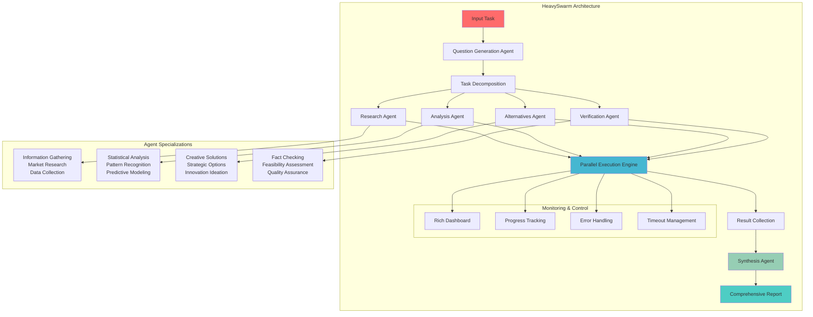

# HeavySwarm Documentation

HeavySwarm is a sophisticated multi-agent orchestration system that decomposes complex tasks into specialized questions and executes them using four specialized agents: Research, Analysis, Alternatives, and Verification. The results are then synthesized into a comprehensive response.

Inspired by X.AI's Grok 4 heavy implementation, HeavySwarm provides robust task analysis through intelligent question generation, parallel execution, and comprehensive synthesis with real-time progress monitoring.

## Architecture

The HeavySwarm follows a structured 5-phase workflow:

1. **Task Decomposition**: Complex tasks are broken down into specialized questions
2. **Question Generation**: AI-powered generation of role-specific questions
3. **Parallel Execution**: Four specialized agents work concurrently
4. **Result Collection**: Outputs are gathered and validated
5. **Synthesis**: Integration into a comprehensive final response

### Agent Specialization

| Agent               | Role/Function                                                      |
|---------------------|--------------------------------------------------------------------|
| **Research Agent**      | Comprehensive information gathering and synthesis                  |
| **Analysis Agent**      | Pattern recognition and statistical analysis                      |
| **Alternatives Agent**  | Creative problem-solving and strategic options                    |
| **Verification Agent**  | Validation, feasibility assessment, and quality assurance         |
| **Synthesis Agent**     | Multi-perspective integration and executive reporting             |

## Architecture Diagram



## Installation

```bash
pip install swarms
```

## Quick Start

```python
from swarms.structs.heavy_swarm import HeavySwarm
from swarms_tools import exa_search

swarm = HeavySwarm(
    name="Gold ETF Research Team",
    description="A team of agents that research the best gold ETFs",
    worker_model_name="claude-sonnet-4-20250514",
    show_dashboard=True,
    question_agent_model_name="gpt-4.1",
    loops_per_agent=1,
    agent_prints_on=False,
    worker_tools=[exa_search],
    random_loops_per_agent=True,
)

prompt = (
    "Find the best 3 gold ETFs. For each ETF, provide the ticker symbol, "
    "full name, current price, expense ratio, assets under management, and "
    "a brief explanation of why it is considered among the best. Present the information "
    "in a clear, structured format suitable for investors. Scrape the data from the web. "
)

out = swarm.run(prompt)
print(out)


```

## API Reference

### HeavySwarm Class

#### Constructor Parameters

| Parameter | Type | Default | Description |
|-----------|------|---------|-------------|
| `name` | `str` | `"HeavySwarm"` | Identifier name for the swarm instance |
| `description` | `str` | `"A swarm of agents that can analyze a task and generate specialized questions for each agent role"` | Description of the swarm's purpose and capabilities |
| `timeout` | `int` | `300` | Maximum execution time per agent in seconds |
| `aggregation_strategy` | `str` | `"synthesis"` | Strategy for result aggregation (currently only 'synthesis' is supported) |
| `loops_per_agent` | `int` | `1` | Number of execution loops each agent should perform |
| `question_agent_model_name` | `str` | `"gpt-4o-mini"` | Language model for question generation |
| `worker_model_name` | `str` | `"gpt-4o-mini"` | Language model for specialized worker agents |
| `verbose` | `bool` | `False` | Enable detailed logging and debug output |
| `max_workers` | `int` | `int(os.cpu_count() * 0.9)` | Maximum concurrent workers for parallel execution |
| `show_dashboard` | `bool` | `False` | Enable rich dashboard with progress visualization |
| `agent_prints_on` | `bool` | `False` | Enable individual agent output printing |
| `output_type` | `str` | `"dict-all-except-first"` | Output formatting type for conversation history |
| `worker_tools` | `tool_type` | `None` | Tools available to worker agents for enhanced functionality |
| `random_loops_per_agent` | `bool` | `False` | Enable random number of loops per agent (1-10 range) |

**Constructor Example:**
```python
swarm = HeavySwarm(
    name="AdvancedAnalysisSwarm",
    description="Comprehensive multi-agent analysis system",
    timeout=600,
    loops_per_agent=2,
    question_agent_model_name="gpt-4o",
    worker_model_name="gpt-4o",
    verbose=True,
    max_workers=8,
    show_dashboard=True,
    agent_prints_on=True,
    output_type="dict-all-except-first",
    worker_tools=None,
    random_loops_per_agent=False
)
```

#### Methods

##### `run(task: str, img: str = None) -> str`

Execute the complete HeavySwarm orchestration flow.

**Parameters:**

| Parameter | Type | Required | Default | Description |
|-----------|------|----------|---------|-------------|
| `task` | `str` | Yes | - | The main task to analyze and decompose |
| `img` | `str` | No | `None` | Image input for visual analysis tasks |

**Returns:**
- `str`: Comprehensive final analysis from synthesis agent

**Example:**
```python
result = swarm.run("Develop a go-to-market strategy for a new SaaS product")
print(result)
```

---

##### `get_questions_only(task: str) -> Dict[str, str]`

Generate and extract only the specialized questions without metadata or execution.

**Parameters:**

| Parameter | Type | Required | Default | Description |
|-----------|------|----------|---------|-------------|
| `task` | `str` | Yes | - | The main task or query to analyze and decompose into specialized questions |

**Returns:**
- `Dict[str, str]`: Clean dictionary containing only the questions:
  - `research_question` (str): Question for comprehensive information gathering
  - `analysis_question` (str): Question for pattern analysis and insights
  - `alternatives_question` (str): Question for exploring creative solutions
  - `verification_question` (str): Question for validation and feasibility
  - `error` (str): Error message if question generation fails (on error only)

**Example:**
```python
questions = swarm.get_questions_only("Analyze market trends for EVs")
print(questions['research_question'])
print(questions['analysis_question'])
```

---

##### `get_questions_as_list(task: str) -> List[str]`

Generate specialized questions and return them as an ordered list.

**Parameters:**

| Parameter | Type | Required | Default | Description |
|-----------|------|----------|---------|-------------|
| `task` | `str` | Yes | - | The main task or query to decompose into specialized questions |

**Returns:**
- `List[str]`: Ordered list of 4 specialized questions:
  - `[0]` Research question for comprehensive information gathering
  - `[1]` Analysis question for pattern analysis and insights
  - `[2]` Alternatives question for exploring creative solutions
  - `[3]` Verification question for validation and feasibility assessment
  - Single-item list containing error message (on error)

**Example:**
```python
questions = swarm.get_questions_as_list("Optimize supply chain efficiency")
for i, question in enumerate(questions):
    print(f"Agent {i+1}: {question}")
```

---

##### `show_swarm_info() -> None`

Display comprehensive swarm configuration information in a rich dashboard format.

**Parameters:**
- None

**Returns:**
- `None`: This method only displays output and has no return value.

**Example:**
```python
swarm.show_swarm_info()  # Displays configuration dashboard
```

---

##### `reliability_check() -> None`

Perform comprehensive reliability and configuration validation checks.

**Parameters:**
- None

**Returns:**
- `None`: This method only performs validation and has no return value.

**Raises:**
- `ValueError`: If loops_per_agent is 0 or negative (agents won't execute)
- `ValueError`: If worker_model_name is None (agents can't be created)
- `ValueError`: If question_agent_model_name is None (questions can't be generated)

**Example:**
```python
try:
    swarm.reliability_check()  # Automatically called in __init__
    print("All checks passed!")
except ValueError as e:
    print(f"Configuration error: {e}")
```

---

##### `create_agents() -> Dict[str, Agent]`

Create and cache the 4 specialized agents with detailed role-specific prompts.

**Parameters:**
- None

**Returns:**
- `Dict[str, Agent]`: Dictionary containing all 5 specialized agents:
  - `'research'`: Research Agent instance
  - `'analysis'`: Analysis Agent instance
  - `'alternatives'`: Alternatives Agent instance
  - `'verification'`: Verification Agent instance
  - `'synthesis'`: Synthesis Agent instance

**Example:**
```python
agents = swarm.create_agents()
research_agent = agents['research']
print(f"Research agent name: {research_agent.agent_name}")
```

## Comprehensive Full-Code Examples

### Example 1: Basic Gold ETF Research with Dashboard

```python
# heavy_swarm_example.py
"""
Complete example demonstrating HeavySwarm for financial research
with dashboard visualization and tool integration.
"""

from swarms.structs.heavy_swarm import HeavySwarm
from swarms_tools import exa_search

# Initialize HeavySwarm with comprehensive configuration
swarm = HeavySwarm(
    name="Gold ETF Research Team",
    description="A team of agents that research the best gold ETFs",
    worker_model_name="claude-sonnet-4-20250514",
    question_agent_model_name="gpt-4o-mini",
    show_dashboard=True,
    loops_per_agent=1,
    agent_prints_on=False,
    worker_tools=[exa_search],
    random_loops_per_agent=False,
    timeout=300,
    max_workers=4,
    verbose=True
)

# Define the research prompt
prompt = (
    "Find the best 3 gold ETFs. For each ETF, provide the ticker symbol, "
    "full name, current price, expense ratio, assets under management, and "
    "a brief explanation of why it is considered among the best. Present the information "
    "in a clear, structured format suitable for investors. Scrape the data from the web."
)

# Execute the analysis
print("🚀 Starting HeavySwarm analysis...")
result = swarm.run(prompt)

print("\n📊 Analysis Complete!")
print("=" * 50)
print(result)
```

### Example 2: Advanced Market Analysis with Multiple Loops

```python
# advanced_market_analysis.py
"""
Advanced example with multiple agent loops and comprehensive market analysis.
"""

from swarms.structs.heavy_swarm import HeavySwarm
from swarms_tools import exa_search, calculator, web_scraper

# Advanced configuration for in-depth analysis
swarm = HeavySwarm(
    name="AdvancedMarketAnalysis",
    description="Comprehensive market analysis with multiple iterations",
    worker_model_name="gpt-4o",
    question_agent_model_name="gpt-4o",
    show_dashboard=True,
    loops_per_agent=3,  # Multiple iterations for deeper analysis
    agent_prints_on=True,
    worker_tools=[exa_search, calculator, web_scraper],
    random_loops_per_agent=False,
    timeout=600,  # Longer timeout for complex analysis
    max_workers=8,
    verbose=True
)

# Complex multi-dimensional analysis prompt
complex_prompt = """
Conduct a comprehensive analysis of the renewable energy sector:

1. Market Size & Growth:
   - Current global market size
   - Projected growth rates (5-year and 10-year)
   - Key growth drivers and barriers

2. Technology Landscape:
   - Dominant technologies (solar, wind, hydro, etc.)
   - Emerging technologies and innovations
   - Technology adoption rates by region

3. Investment Opportunities:
   - Most promising investment sectors
   - Risk assessment and mitigation strategies
   - Return on investment projections

4. Regulatory Environment:
   - Current policy frameworks
   - Upcoming regulatory changes
   - Impact on industry development

5. Competitive Analysis:
   - Key players and market share
   - Competitive advantages and disadvantages
   - Market consolidation trends

Provide detailed analysis with data sources, assumptions, and confidence levels.
"""

print("🔬 Starting advanced market analysis...")
result = swarm.run(complex_prompt)
print(result)
```

### Example 3: Healthcare Policy Analysis with Random Loops

```python
# healthcare_policy_analysis.py
"""
Healthcare policy analysis with random agent loops for diverse perspectives.
"""

from swarms.structs.heavy_swarm import HeavySwarm
from swarms_tools import exa_search, data_analyzer, policy_tracker

# Healthcare-focused configuration with random loops
swarm = HeavySwarm(
    name="HealthcarePolicyAnalyzer",
    description="Multi-perspective healthcare policy analysis",
    worker_model_name="gpt-4o",
    question_agent_model_name="gpt-4o-mini",
    show_dashboard=True,
    loops_per_agent=1,  # Base loops (will be randomized)
    agent_prints_on=False,
    worker_tools=[exa_search, data_analyzer, policy_tracker],
    random_loops_per_agent=True,  # Enable random loop variation
    timeout=900,
    max_workers=6,
    verbose=True
)

# Healthcare policy analysis prompt
healthcare_prompt = """
Analyze the impact of recent healthcare policy changes on:

1. **Access to Care**:
   - Changes in healthcare accessibility
   - Impact on underserved populations
   - Telemedicine adoption and effectiveness

2. **Cost Implications**:
   - Healthcare spending trends
   - Insurance premium changes
   - Out-of-pocket expense analysis

3. **Quality of Care**:
   - Patient outcome metrics
   - Provider satisfaction and retention
   - Innovation in treatment protocols

4. **Healthcare Workforce**:
   - Staffing shortages and surpluses
   - Training and education requirements
   - Compensation and benefits trends

5. **Technology Integration**:
   - Electronic health records adoption
   - AI and machine learning applications
   - Cybersecurity and data privacy

Provide evidence-based analysis with statistical data and policy recommendations.
"""

print("🏥 Starting healthcare policy analysis...")
result = swarm.run(healthcare_prompt)
print(result)
```

### Example 4: Question Generation and Preview

```python
# question_generation_example.py
"""
Example demonstrating question generation capabilities without full execution.
"""

from swarms.structs.heavy_swarm import HeavySwarm

# Configure swarm for question generation
swarm = HeavySwarm(
    name="QuestionGenerator",
    description="Specialized question generation for task analysis",
    question_agent_model_name="gpt-4o",
    worker_model_name="gpt-4o-mini",
    show_dashboard=False,  # No dashboard for clean output
    verbose=False
)

# Sample task for analysis
task = "Develop a comprehensive digital transformation strategy for a traditional manufacturing company"

print("🔍 Generating specialized questions...")
print("=" * 60)

# Method 1: Get questions as dictionary
questions_dict = swarm.get_questions_only(task)
print("\n📋 Questions as Dictionary:")
for key, question in questions_dict.items():
    if key != 'error':
        print(f"\n{key.upper()}:")
        print(f"{question}")

# Method 2: Get questions as ordered list
questions_list = swarm.get_questions_as_list(task)
print("\n\n📝 Questions as Ordered List:")
for i, question in enumerate(questions_list):
    agent_names = ["Research Agent", "Analysis Agent", "Alternatives Agent", "Verification Agent"]
    print(f"\n{i+1}. {agent_names[i]}:")
    print(f"   {question}")

print("\n" + "=" * 60)
print("💡 Use these questions to understand how HeavySwarm decomposes complex tasks!")
```

### Example 5: High-Performance Configuration for Enterprise Use

```python
# enterprise_configuration.py
"""
Enterprise-grade HeavySwarm configuration for high-performance analysis.
"""

from swarms.structs.heavy_swarm import HeavySwarm
from swarms_tools import exa_search, data_analyzer, financial_modeler, risk_assessor

# Enterprise configuration with maximum performance
swarm = HeavySwarm(
    name="EnterpriseAnalysisSwarm",
    description="High-performance enterprise analysis system",
    worker_model_name="gpt-4o",  # Highest quality model
    question_agent_model_name="gpt-4o",  # Consistent high quality
    show_dashboard=True,
    loops_per_agent=5,  # Maximum depth analysis
    agent_prints_on=False,  # Clean output for enterprise use
    worker_tools=[
        exa_search,
        data_analyzer,
        financial_modeler,
        risk_assessor
    ],
    random_loops_per_agent=False,  # Consistent analysis depth
    timeout=1800,  # 30 minutes for complex analysis
    max_workers=16,  # Maximum parallelization
    verbose=True  # Full logging for enterprise monitoring
)

# Enterprise-level analysis prompt
enterprise_prompt = """
Conduct an enterprise-grade analysis for a Fortune 500 company's strategic planning:

EXECUTIVE SUMMARY REQUIREMENTS:
- Strategic positioning analysis
- Competitive landscape assessment
- Market opportunity evaluation
- Risk mitigation strategies

FINANCIAL ANALYSIS:
- Revenue optimization scenarios
- Cost structure analysis
- Investment requirement assessment
- ROI projections and sensitivity analysis

OPERATIONAL ASSESSMENT:
- Process optimization opportunities
- Technology integration roadmap
- Supply chain resilience evaluation
- Human capital strategy development

MARKET INTELLIGENCE:
- Customer segmentation analysis
- Competitive intelligence gathering
- Market trend forecasting
- Disruption risk assessment

STRATEGIC RECOMMENDATIONS:
- Short-term tactical initiatives (0-12 months)
- Medium-term strategic projects (1-3 years)
- Long-term transformation roadmap (3-5 years)
- Success metrics and KPIs

Provide analysis with executive-level presentation, detailed financial modeling,
and implementation roadmaps with measurable outcomes.
"""

print("🏢 Starting enterprise-grade analysis...")
print("⚡ This configuration uses maximum resources for comprehensive analysis")

result = swarm.run(enterprise_prompt)
print(result)
```

### Example 6: Error Handling and Reliability Testing

```python
# error_handling_example.py
"""
Example demonstrating error handling and reliability features.
"""

from swarms.structs.heavy_swarm import HeavySwarm

print("🛡️ Testing HeavySwarm Reliability Features")
print("=" * 50)

# Test 1: Valid configuration
print("\n✅ Test 1: Valid Configuration")
try:
    swarm = HeavySwarm(
        name="ReliabilityTest",
        description="Testing valid configuration",
        worker_model_name="gpt-4o-mini",
        question_agent_model_name="gpt-4o-mini",
        show_dashboard=False
    )
    print("✓ Swarm initialized successfully")
except Exception as e:
    print(f"✗ Unexpected error: {e}")

# Test 2: Invalid loops_per_agent
print("\n❌ Test 2: Invalid loops_per_agent (should fail)")
try:
    swarm = HeavySwarm(
        name="InvalidTest",
        worker_model_name="gpt-4o-mini",
        question_agent_model_name="gpt-4o-mini",
        loops_per_agent=0,  # Invalid: must be > 0
        show_dashboard=False
    )
except ValueError as e:
    print(f"✓ Expected error caught: {e}")

# Test 3: Missing worker_model_name
print("\n❌ Test 3: Missing worker_model_name (should fail)")
try:
    swarm = HeavySwarm(
        name="MissingModelTest",
        question_agent_model_name="gpt-4o-mini",
        worker_model_name=None,  # Invalid: cannot be None
        show_dashboard=False
    )
except ValueError as e:
    print(f"✓ Expected error caught: {e}")

# Test 4: Successful question generation with error handling
print("\n🔍 Test 4: Question Generation with Error Handling")
swarm = HeavySwarm(
    name="ErrorHandlingTest",
    worker_model_name="gpt-4o-mini",
    question_agent_model_name="gpt-4o-mini",
    show_dashboard=False
)

test_task = "Analyze the future of artificial intelligence in healthcare"

try:
    questions = swarm.get_questions_only(test_task)
    if 'error' in questions:
        print(f"✗ Question generation failed: {questions['error']}")
    else:
        print("✓ Question generation successful")
        print(f"✓ Generated {len(questions)} specialized questions")
except Exception as e:
    print(f"✗ Unexpected error during question generation: {e}")

print("\n" + "=" * 50)
print("🛡️ Reliability testing complete!")
```

### Example 7: Custom Tools Integration

```python
# custom_tools_example.py
"""
Example demonstrating custom tools integration with HeavySwarm.
"""

from swarms.structs.heavy_swarm import HeavySwarm
from swarms_tools import exa_search, calculator, web_scraper

# Custom tool functions (simplified examples)
def custom_data_analyzer(data):
    """Custom data analysis tool"""
    return f"Analyzed data: {len(data)} records processed"

def custom_report_generator(topic):
    """Custom report generation tool"""
    return f"Generated comprehensive report on: {topic}"

def custom_risk_assessor(scenario):
    """Custom risk assessment tool"""
    return f"Risk assessment completed for: {scenario}"

# Create custom tool objects (simplified)
custom_tools = [
    exa_search,  # Built-in tool
    calculator,  # Built-in tool
    web_scraper,  # Built-in tool
    # Note: In practice, you'd wrap custom functions in proper tool format
]

# Initialize swarm with custom tools
swarm = HeavySwarm(
    name="CustomToolsSwarm",
    description="HeavySwarm with custom tool integration",
    worker_model_name="gpt-4o",
    question_agent_model_name="gpt-4o-mini",
    show_dashboard=True,
    loops_per_agent=2,
    agent_prints_on=True,
    worker_tools=custom_tools,
    random_loops_per_agent=False,
    timeout=600,
    max_workers=6,
    verbose=True
)

# Analysis task that benefits from custom tools
analysis_prompt = """
Conduct a comprehensive competitive intelligence analysis:

1. **Market Research**:
   - Use web scraping to gather competitor data
   - Analyze market positioning and strategies
   - Identify competitive advantages and weaknesses

2. **Financial Analysis**:
   - Calculate market share percentages
   - Analyze revenue growth trends
   - Assess profitability metrics

3. **Risk Assessment**:
   - Evaluate competitive threats
   - Analyze market entry barriers
   - Assess disruption risks

4. **Strategic Recommendations**:
   - Develop competitive response strategies
   - Identify partnership opportunities
   - Recommend market positioning adjustments

Use available tools to gather and analyze real-time data for accurate insights.
"""

print("🔧 Starting analysis with custom tools integration...")
result = swarm.run(analysis_prompt)
print(result)
```

### Example 8: Batch Processing Multiple Tasks

```python
# batch_processing_example.py
"""
Example demonstrating batch processing of multiple tasks with HeavySwarm.
"""

from swarms.structs.heavy_swarm import HeavySwarm
from typing import List, Dict
import time

def batch_process_tasks(swarm: HeavySwarm, tasks: List[str]) -> Dict[str, str]:
    """
    Process multiple tasks in batch with progress tracking.

    Args:
        swarm: Configured HeavySwarm instance
        tasks: List of task descriptions to process

    Returns:
        Dictionary mapping task descriptions to results
    """
    results = {}

    print(f"🚀 Starting batch processing of {len(tasks)} tasks")
    print("=" * 60)

    for i, task in enumerate(tasks, 1):
        print(f"\n📋 Task {i}/{len(tasks)}")
        print(f"Query: {task[:100]}{'...' if len(task) > 100 else ''}")
        print("-" * 40)

        start_time = time.time()
        try:
            result = swarm.run(task)
            processing_time = time.time() - start_time

            results[task] = result
            print(".2f"
        except Exception as e:
            results[task] = f"Error: {str(e)}"
            print(f"❌ Failed after {time.time() - start_time:.2f}s: {e}")

    return results

# Configure swarm for batch processing (minimal output for efficiency)
swarm = HeavySwarm(
    name="BatchProcessor",
    description="Efficient batch processing configuration",
    worker_model_name="gpt-4o-mini",  # Faster model for batch processing
    question_agent_model_name="gpt-4o-mini",
    show_dashboard=False,  # Disable dashboard for batch processing
    loops_per_agent=1,  # Single loop for efficiency
    agent_prints_on=False,  # Clean output
    random_loops_per_agent=False,
    timeout=300,
    max_workers=4,
    verbose=False  # Minimal logging
)

# Define batch tasks
batch_tasks = [
    "Analyze the impact of remote work on commercial real estate",
    "Evaluate the potential of electric vehicles in the taxi industry",
    "Assess the cybersecurity risks of IoT devices in smart homes",
    "Explore the applications of blockchain in supply chain management",
    "Investigate the effects of social media on consumer behavior",
    "Review the potential of quantum computing in drug discovery",
    "Analyze the economic impact of climate change policies",
    "Evaluate the future of autonomous delivery systems"
]

# Process batch
batch_results = batch_process_tasks(swarm, batch_tasks)

# Summary report
print("\n" + "=" * 60)
print("📊 BATCH PROCESSING SUMMARY")
print("=" * 60)
print(f"Total tasks processed: {len(batch_results)}")
successful_tasks = sum(1 for result in batch_results.values() if not result.startswith("Error:"))
print(f"Successful tasks: {successful_tasks}")
print(f"Failed tasks: {len(batch_results) - successful_tasks}")

# Display results summary
print("\n📝 RESULTS SUMMARY:")
for i, (task, result) in enumerate(batch_results.items(), 1):
    status = "✅" if not result.startswith("Error:") else "❌"
    print(f"{i}. {status} {task[:50]}{'...' if len(task) > 50 else ''}")

print("\n💡 Batch processing complete! Individual results available in batch_results dictionary.")
```

## Acknowledgments

- Inspired by X.AI's Grok heavy implementation
- Built on the Swarms framework
- Utilizes Rich for dashboard visualization
- Powered by advanced language models

