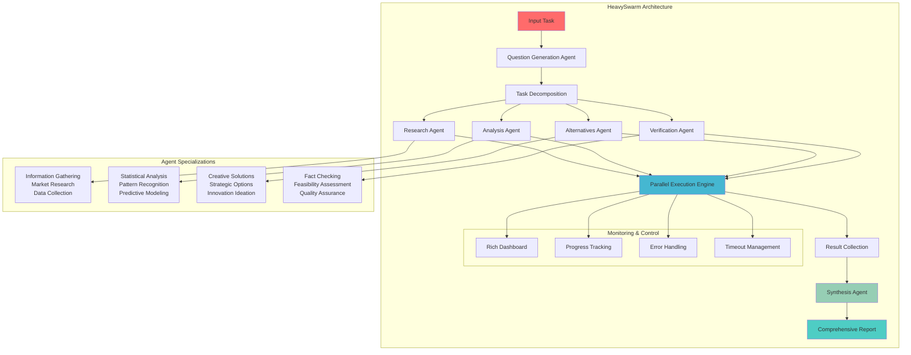

# HeavySwarm Documentation

HeavySwarm is a sophisticated multi-agent orchestration system that decomposes complex tasks into specialized questions and executes them using four specialized agents: Research, Analysis, Alternatives, and Verification. The results are then synthesized into a comprehensive response.

Inspired by X.AI's Grok 4 heavy implementation, HeavySwarm provides robust task analysis through intelligent question generation, parallel execution, and comprehensive synthesis with real-time progress monitoring.

## Architecture

### System Design

The HeavySwarm follows a structured 5-phase workflow:

1. **Task Decomposition**: Complex tasks are broken down into specialized questions
2. **Question Generation**: AI-powered generation of role-specific questions
3. **Parallel Execution**: Four specialized agents work concurrently
4. **Result Collection**: Outputs are gathered and validated
5. **Synthesis**: Integration into a comprehensive final response

### Agent Specialization

- **Research Agent**: Comprehensive information gathering and synthesis
- **Analysis Agent**: Pattern recognition and statistical analysis
- **Alternatives Agent**: Creative problem-solving and strategic options
- **Verification Agent**: Validation, feasibility assessment, and quality assurance
- **Synthesis Agent**: Multi-perspective integration and executive reporting

## Architecture Diagram



## Installation

```bash
pip install swarms
```

## Quick Start

```python
from swarms import HeavySwarm

# Initialize the swarm
swarm = HeavySwarm(
    name="MarketAnalysisSwarm",
    description="Financial market analysis swarm",
    question_agent_model_name="gpt-4o-mini",
    worker_model_name="gpt-4o-mini",
    show_dashboard=True,
    verbose=True
)

# Execute analysis
result = swarm.run("Analyze the current cryptocurrency market trends and investment opportunities")
print(result)
```

## API Reference

### HeavySwarm Class

#### Constructor Parameters

| Parameter | Type | Default | Description |
|-----------|------|---------|-------------|
| `name` | `str` | `"HeavySwarm"` | Identifier name for the swarm instance |
| `description` | `str` | `"A swarm of agents..."` | Description of the swarm's purpose |
| `agents` | `List[Agent]` | `None` | Pre-configured agent list (unused - agents created internally) |
| `timeout` | `int` | `300` | Maximum execution time per agent in seconds |
| `aggregation_strategy` | `str` | `"synthesis"` | Strategy for result aggregation |
| `loops_per_agent` | `int` | `1` | Number of execution loops per agent |
| `question_agent_model_name` | `str` | `"gpt-4o-mini"` | Model for question generation |
| `worker_model_name` | `str` | `"gpt-4o-mini"` | Model for specialized worker agents |
| `verbose` | `bool` | `False` | Enable detailed logging output |
| `max_workers` | `int` | `int(os.cpu_count() * 0.9)` | Maximum concurrent workers |
| `show_dashboard` | `bool` | `False` | Enable rich dashboard visualization |
| `agent_prints_on` | `bool` | `False` | Enable individual agent output printing |

#### Methods

##### `run(task: str, img: str = None) -> str`

Execute the complete HeavySwarm orchestration flow.

**Parameters:**

- `task` (str): The main task to analyze and decompose

- `img` (str, optional): Image input for visual analysis tasks

**Returns:**
- `str`: Comprehensive final analysis from synthesis agent

**Example:**
```python
result = swarm.run("Develop a go-to-market strategy for a new SaaS product")
```


## Real-World Applications

### Financial Services

```python
# Market Analysis
swarm = HeavySwarm(
    name="FinanceSwarm",
    worker_model_name="gpt-4o",
    show_dashboard=True
)

result = swarm.run("""
Analyze the impact of recent Federal Reserve policy changes on:
1. Bond markets and yield curves
2. Equity market valuations
3. Currency exchange rates
4. Provide investment recommendations for institutional portfolios
""")
```

### Use-cases

| Use Case                                   | Description                                 |
|---------------------------------------------|---------------------------------------------|
| Portfolio optimization and risk assessment  | Optimize asset allocation and assess risks  |
| Market trend analysis and forecasting       | Analyze and predict market movements        |
| Regulatory compliance evaluation            | Evaluate adherence to financial regulations |
| Investment strategy development             | Develop and refine investment strategies    |
| Credit risk analysis and modeling           | Analyze and model credit risk               |


-------


### Healthcare & Life Sciences

```python
# Clinical Research Analysis
swarm = HeavySwarm(
    name="HealthcareSwarm",
    worker_model_name="gpt-4o",
    timeout=600,
    loops_per_agent=2
)

result = swarm.run("""
Evaluate the potential of AI-driven personalized medicine:
1. Current technological capabilities and limitations
2. Regulatory landscape and approval pathways
3. Market opportunities and competitive analysis
4. Implementation strategies for healthcare systems
""")
```

----

**Use Cases:**

| Use Case                              | Description                                 |
|----------------------------------------|---------------------------------------------|
| Drug discovery and development analysis| Analyze and accelerate drug R&D processes   |
| Clinical trial optimization            | Improve design and efficiency of trials     |
| Healthcare policy evaluation           | Assess and inform healthcare policies       |
| Medical device market analysis         | Evaluate trends and opportunities in devices|
| Patient outcome prediction modeling    | Predict and model patient health outcomes   |

---


### Technology & Innovation

```python
# Tech Strategy Analysis
swarm = HeavySwarm(
    name="TechSwarm",
    worker_model_name="gpt-4o",
    show_dashboard=True,
    verbose=True
)

result = swarm.run("""
Assess the strategic implications of quantum computing adoption:
1. Technical readiness and hardware developments
2. Industry applications and use cases
3. Competitive landscape and key players
4. Investment and implementation roadmap
""")
```

**Use Cases:**

| Use Case                          | Description                                 |
|------------------------------------|---------------------------------------------|
| Technology roadmap development     | Plan and prioritize technology initiatives  |
| Competitive intelligence gathering | Analyze competitors and market trends       |
| Innovation pipeline analysis       | Evaluate and manage innovation projects     |
| Digital transformation strategy    | Develop and implement digital strategies    |
| Emerging technology assessment     | Assess new and disruptive technologies      |

### Manufacturing & Supply Chain

```python
# Supply Chain Optimization
swarm = HeavySwarm(
    name="ManufacturingSwarm",
    worker_model_name="gpt-4o",
    max_workers=8
)

result = swarm.run("""
Optimize global supply chain resilience:
1. Risk assessment and vulnerability analysis
2. Alternative sourcing strategies
3. Technology integration opportunities
4. Cost-benefit analysis of proposed changes
""")
```

**Use Cases:**

| Use Case                         | Description                                 |
|----------------------------------|---------------------------------------------|
| Supply chain risk management     | Identify and mitigate supply chain risks    |
| Manufacturing process optimization | Improve efficiency and productivity         |
| Quality control system design    | Develop systems to ensure product quality   |
| Sustainability impact assessment | Evaluate environmental and social impacts   |
| Logistics network optimization   | Enhance logistics and distribution networks |

## Advanced Configuration

### Custom Agent Configuration

```python
# High-performance configuration
swarm = HeavySwarm(
    name="HighPerformanceSwarm",
    question_agent_model_name="gpt-4o",
    worker_model_name="gpt-4o",
    timeout=900,
    loops_per_agent=3,
    max_workers=12,
    show_dashboard=True,
    verbose=True
)
```


## Troubleshooting

| Issue                   | Solution                                                      |
|-------------------------|---------------------------------------------------------------|
| **Agent Timeout**       | Increase timeout parameter or reduce task complexity          |
| **Model Rate Limits**   | Implement backoff strategies or use different models          |
| **Memory Usage**        | Monitor system resources with large-scale operations          |
| **Dashboard Performance** | Disable dashboard for batch processing                      |

## Contributing

HeavySwarm is part of the Swarms ecosystem. Contributions are welcome for:

- New agent specializations

- Performance optimizations

- Integration capabilities

- Documentation improvements


## Acknowledgments

- Inspired by X.AI's Grok heavy implementation

- Built on the Swarms framework

- Utilizes Rich for dashboard visualization

- Powered by advanced language models

