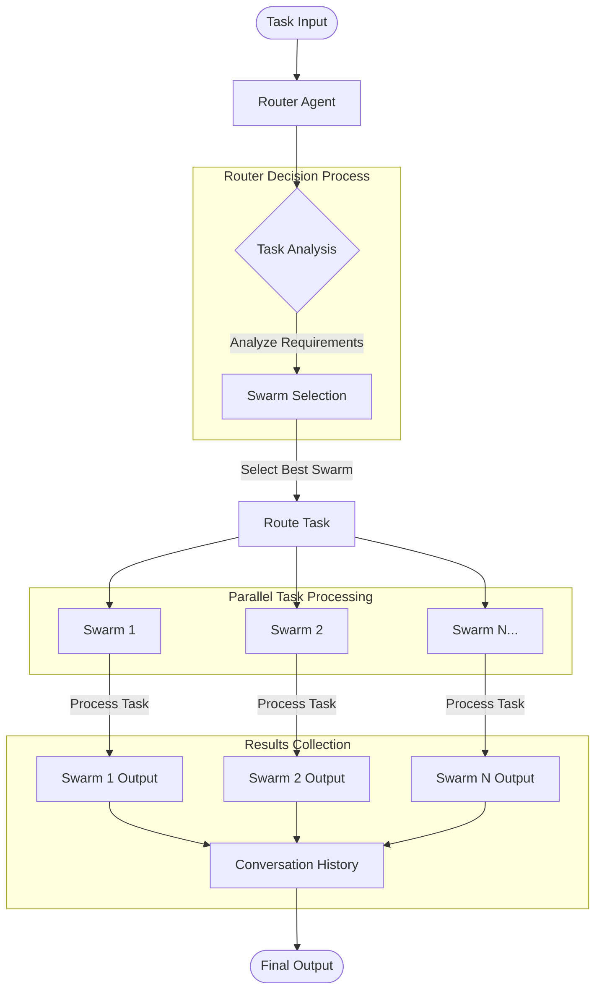

# Hybrid Hierarchical-Cluster Swarm [HHCS]

The Hybrid Hierarchical-Cluster Swarm (HHCS) is an advanced AI orchestration architecture that combines hierarchical decision-making with parallel processing capabilities. HHCS enables complex task solving by dynamically routing tasks to specialized agent swarms based on their expertise and capabilities.

## Purpose

HHCS addresses the challenge of efficiently solving diverse and complex tasks by:

- Intelligently routing tasks to the most appropriate specialized swarms

- Enabling parallel processing of multifaceted problems

- Maintaining a clear hierarchy for effective decision-making

- Combining outputs from multiple specialized agents for comprehensive solutions

## Key Features

- **Router-based task distribution**: Central router agent analyzes incoming tasks and directs them to appropriate specialized swarms

- **Hybrid architecture**: Combines hierarchical control with clustered specialization

- **Parallel processing**: Multiple swarms can work simultaneously on different aspects of complex tasks

- **Flexible swarm types**: Supports both sequential and concurrent workflows within swarms

- **Comprehensive result aggregation**: Collects and combines outputs from all contributing swarms


## Diagram

The HHCS architecture follows a hierarchical structure with the router agent at the top level, specialized swarms at the middle level, and individual agents at the bottom level.





## `HybridHierarchicalClusterSwarm` Constructor Arguments

| Parameter | Type | Default | Description |
|-----------|------|---------|-------------|
| `name` | string | "Hybrid Hierarchical-Cluster Swarm" | The name of the swarm instance |
| `description` | string | "A swarm that uses a hybrid hierarchical-peer model to solve complex tasks." | Brief description of the swarm's functionality |
| `swarms` | List[SwarmRouter] | [] | List of available swarm routers |
| `max_loops` | integer | 1 | Maximum number of processing loops |
| `output_type` | string | "list" | Format for output (e.g., "list", "json") |
| `router_agent_model_name` | string | "gpt-4o-mini" | LLM model used by the router agent |

## Methods

| Method | Parameters | Return Type | Description |
|--------|------------|-------------|-------------|
| `run` | `task` (str) | str | Processes a single task through the swarm system |
| `batched_run` | `tasks` (List[str]) | List[str] | Processes multiple tasks in parallel |
| `find_swarm_by_name` | `swarm_name` (str) | SwarmRouter | Retrieves a swarm by its name |
| `route_task` | `swarm_name` (str), `task_description` (str) | None | Routes a task to a specific swarm |
| `get_swarms_info` | None | str | Returns formatted information about all available swarms |


## Full Example

```python

from swarms import Agent, SwarmRouter
from swarms.structs.hybrid_hiearchical_peer_swarm import (
    HybridHierarchicalClusterSwarm,
)


# Core Legal Agent Definitions with short, simple prompts
litigation_agent = Agent(
    agent_name="Litigator",
    system_prompt="You handle lawsuits. Analyze facts, build arguments, and develop case strategy.",
    model_name="groq/deepseek-r1-distill-qwen-32b",
    max_loops=1,
)

corporate_agent = Agent(
    agent_name="Corporate-Attorney",
    system_prompt="You handle business law. Advise on corporate structure, governance, and transactions.",
    model_name="groq/deepseek-r1-distill-qwen-32b",
    max_loops=1,
)

ip_agent = Agent(
    agent_name="IP-Attorney",
    system_prompt="You protect intellectual property. Handle patents, trademarks, copyrights, and trade secrets.",
    model_name="groq/deepseek-r1-distill-qwen-32b",
    max_loops=1,
)

employment_agent = Agent(
    agent_name="Employment-Attorney",
    system_prompt="You handle workplace matters. Address hiring, termination, discrimination, and labor issues.",
    model_name="groq/deepseek-r1-distill-qwen-32b",
    max_loops=1,
)

paralegal_agent = Agent(
    agent_name="Paralegal",
    system_prompt="You assist attorneys. Conduct research, draft documents, and organize case files.",
    model_name="groq/deepseek-r1-distill-qwen-32b",
    max_loops=1,
)

doc_review_agent = Agent(
    agent_name="Document-Reviewer",
    system_prompt="You examine documents. Extract key information and identify relevant content.",
    model_name="groq/deepseek-r1-distill-qwen-32b",
    max_loops=1,
)

# Practice Area Swarm Routers
litigation_swarm = SwarmRouter(
    name="litigation-practice",
    description="Handle all aspects of litigation",
    agents=[litigation_agent, paralegal_agent, doc_review_agent],
    swarm_type="SequentialWorkflow",
)

corporate_swarm = SwarmRouter(
    name="corporate-practice",
    description="Handle business and corporate legal matters",
    agents=[corporate_agent, paralegal_agent],
    swarm_type="SequentialWorkflow",
)

ip_swarm = SwarmRouter(
    name="ip-practice",
    description="Handle intellectual property matters",
    agents=[ip_agent, paralegal_agent],
    swarm_type="SequentialWorkflow",
)

employment_swarm = SwarmRouter(
    name="employment-practice",
    description="Handle employment and labor law matters",
    agents=[employment_agent, paralegal_agent],
    swarm_type="SequentialWorkflow",
)

# Cross-functional Swarm Router
m_and_a_swarm = SwarmRouter(
    name="mergers-acquisitions",
    description="Handle mergers and acquisitions",
    agents=[
        corporate_agent,
        ip_agent,
        employment_agent,
        doc_review_agent,
    ],
    swarm_type="ConcurrentWorkflow",
)

dispute_swarm = SwarmRouter(
    name="dispute-resolution",
    description="Handle complex disputes requiring multiple specialties",
    agents=[litigation_agent, corporate_agent, doc_review_agent],
    swarm_type="ConcurrentWorkflow",
)


hybrid_hiearchical_swarm = HybridHierarchicalClusterSwarm(
    name="hybrid-hiearchical-swarm",
    description="A hybrid hiearchical swarm that uses a hybrid hiearchical peer model to solve complex tasks.",
    swarms=[
        litigation_swarm,
        corporate_swarm,
        ip_swarm,
        employment_swarm,
        m_and_a_swarm,
        dispute_swarm,
    ],
    max_loops=1,
    router_agent_model_name="gpt-4o-mini",
)


if __name__ == "__main__":
    hybrid_hiearchical_swarm.run(
        "What is the best way to file for a patent? for ai technology "
    )
    
``` 