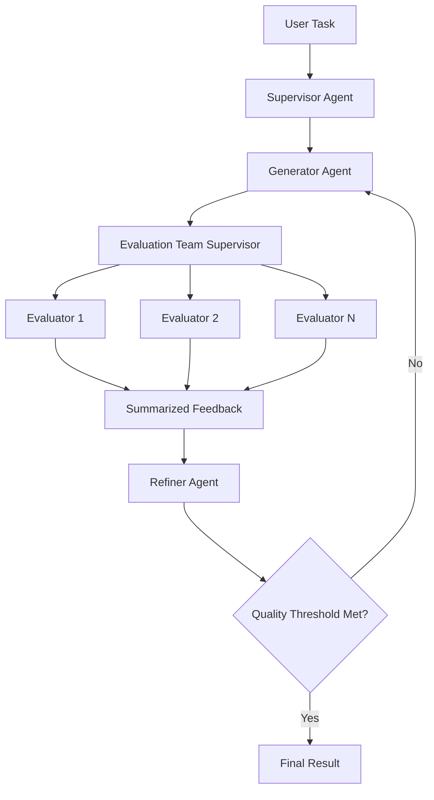

# Talk Structurally, Act Hierarchically Framework

## Overview

The **Talk Structurally, Act Hierarchically** framework is a sophisticated multi-agent system that implements the research paper "Talk Structurally, Act Hierarchically: A Collaborative Framework for LLM Multi-Agent Systems" (arXiv:2502.11098). This framework addresses key challenges in multi-agent systems through structured communication protocols and hierarchical evaluation systems.

## Key Features

### 1. Structured Communication Protocol
- **Message (M_ij)**: Specific task instructions with clear objectives
- **Background (B_ij)**: Context and problem background for comprehensive understanding
- **Intermediate Output (I_ij)**: Intermediate results passed between agents

### 2. Hierarchical Refinement System
- **Evaluation Team**: Multiple specialized evaluators with different criteria
- **Supervisor Coordination**: Centralized coordination of evaluation processes
- **Summarized Feedback**: Consolidated, actionable feedback from multiple evaluators

### 3. Graph-based Agent Orchestration
- **Dynamic Routing**: Flexible communication pathways based on task requirements
- **Context Preservation**: Maintains conversation history and shared memory
- **Iterative Refinement**: Multiple refinement loops for continuous improvement

## Architecture



## Components

### TalkHierarchicalSwarm

The main orchestrator class that manages the entire workflow.

```python
from swarms.structs.talk_hierarchical_swarm import TalkHierarchicalSwarm

swarm = TalkHierarchicalSwarm(
    name="MyTalkHierSwarm",
    supervisor=supervisor_agent,
    generators=[generator_agent],
    evaluators=[evaluator_agent1, evaluator_agent2],
    refiners=[refiner_agent],
    max_loops=3,
    enable_structured_communication=True,
    enable_hierarchical_evaluation=True
)
```

### Specialized Agents

#### TalkHierarchicalGenerator
Creates initial content using structured communication protocol.

```python
from swarms.agents.talk_hierarchical_agents import TalkHierarchicalGenerator

generator = TalkHierarchicalGenerator(
    agent_name="ContentGenerator",
    model_name="gpt-4o-mini"
)

# Generate with structured communication
result = generator.generate_with_structure(
    message="Create technical documentation",
    background="For software developers",
    intermediate_output="Previous API overview"
)
```

#### TalkHierarchicalEvaluator
Evaluates content using specific criteria and provides structured feedback.

```python
from swarms.agents.talk_hierarchical_agents import TalkHierarchicalEvaluator

evaluator = TalkHierarchicalEvaluator(
    agent_name="QualityEvaluator",
    evaluation_criteria=["accuracy", "clarity", "completeness"]
)

# Evaluate content
result = evaluator.evaluate_with_criterion(
    content="Content to evaluate",
    criterion="accuracy"
)
```

#### TalkHierarchicalRefiner
Improves content based on evaluation feedback.

```python
from swarms.agents.talk_hierarchical_agents import TalkHierarchicalRefiner

refiner = TalkHierarchicalRefiner(
    agent_name="ContentRefiner"
)

# Refine content
result = refiner.refine_with_feedback(
    original_content="Original content",
    evaluation_results=evaluation_results
)
```

#### TalkHierarchicalSupervisor
Coordinates workflow and manages structured communication.

```python
from swarms.agents.talk_hierarchical_agents import TalkHierarchicalSupervisor

supervisor = TalkHierarchicalSupervisor(
    agent_name="WorkflowSupervisor"
)

# Coordinate workflow
decision = supervisor.coordinate_workflow(
    task="Current task",
    current_state=workflow_state
)
```

## Usage Examples

### Basic Usage

```python
from swarms.structs.talk_hierarchical_swarm import TalkHierarchicalSwarm

# Create the swarm
swarm = TalkHierarchicalSwarm(
    name="DocumentationSwarm",
    max_loops=3,
    verbose=True
)

# Run a task
result = swarm.run(
    "Create comprehensive API documentation for a Python library"
)

print(f"Final Result: {result['final_result']}")
print(f"Total Loops: {result['total_loops']}")
```

### Advanced Configuration

```python
from swarms.agents.talk_hierarchical_agents import (
    TalkHierarchicalGenerator,
    TalkHierarchicalEvaluator,
    TalkHierarchicalRefiner,
    TalkHierarchicalSupervisor
)

# Create specialized agents
generator = TalkHierarchicalGenerator(
    agent_name="TechWriter",
    model_name="gpt-4o-mini"
)

evaluator1 = TalkHierarchicalEvaluator(
    agent_name="AccuracyChecker",
    evaluation_criteria=["accuracy", "technical_correctness"]
)

evaluator2 = TalkHierarchicalEvaluator(
    agent_name="ClarityChecker",
    evaluation_criteria=["clarity", "readability"]
)

refiner = TalkHierarchicalRefiner(
    agent_name="ContentImprover"
)

supervisor = TalkHierarchicalSupervisor(
    agent_name="ProjectManager"
)

# Create swarm with custom agents
swarm = TalkHierarchicalSwarm(
    name="CustomSwarm",
    supervisor=supervisor,
    generators=[generator],
    evaluators=[evaluator1, evaluator2],
    refiners=[refiner],
    max_loops=5,
    quality_threshold=8.5
)
```

### Structured Communication Example

```python
# Send structured message
structured_msg = swarm.send_structured_message(
    sender="Supervisor",
    recipient="Generator",
    message="Create a technical blog post about machine learning",
    background="Target audience: software engineers with basic ML knowledge",
    intermediate_output="Previous discussion covered AI fundamentals"
)

print(f"Message: {structured_msg.message}")
print(f"Background: {structured_msg.background}")
print(f"Intermediate Output: {structured_msg.intermediate_output}")
```

### Hierarchical Evaluation Example

```python
# Run hierarchical evaluation
evaluation_results = swarm.run_hierarchical_evaluation(
    content="Content to evaluate",
    evaluation_criteria=["accuracy", "completeness", "clarity", "relevance"]
)

for result in evaluation_results:
    print(f"Evaluator: {result.evaluator_name}")
    print(f"Criterion: {result.criterion}")
    print(f"Score: {result.score}/10")
    print(f"Feedback: {result.feedback}")
```

## Configuration Options

### TalkHierarchicalSwarm Parameters

| Parameter | Type | Default | Description |
|-----------|------|---------|-------------|
| `name` | str | "TalkHierarchicalSwarm" | Name of the swarm |
| `description` | str | "Talk Structurally, Act Hierarchically Framework" | Description |
| `supervisor` | Agent | None | Main supervisor agent |
| `generators` | List[Agent] | [] | List of generator agents |
| `evaluators` | List[Agent] | [] | List of evaluator agents |
| `refiners` | List[Agent] | [] | List of refiner agents |
| `evaluation_supervisor` | Agent | None | Evaluation team supervisor |
| `max_loops` | int | 3 | Maximum refinement loops |
| `output_type` | OutputType | "dict-all-except-first" | Output format |
| `supervisor_name` | str | "Supervisor" | Supervisor agent name |
| `evaluation_supervisor_name` | str | "EvaluationSupervisor" | Evaluation supervisor name |
| `verbose` | bool | False | Enable verbose logging |
| `enable_structured_communication` | bool | True | Enable structured communication |
| `enable_hierarchical_evaluation` | bool | True | Enable hierarchical evaluation |
| `shared_memory` | bool | True | Enable shared memory |

### Evaluation Criteria

Common evaluation criteria include:

- **Accuracy**: Factual correctness and precision
- **Completeness**: Coverage of required topics
- **Clarity**: Readability and understandability
- **Relevance**: Appropriateness to the task
- **Coherence**: Logical flow and organization
- **Technical Correctness**: Proper technical details
- **Engagement**: Interest and appeal to audience

## Best Practices

### 1. Agent Configuration
- Use specialized agents for specific roles
- Configure evaluation criteria based on task requirements
- Set appropriate quality thresholds for your use case

### 2. Communication Structure
- Always provide clear, specific messages (M_ij)
- Include relevant background context (B_ij)
- Pass meaningful intermediate outputs (I_ij)

### 3. Evaluation Setup
- Use multiple evaluators with different criteria
- Ensure evaluation criteria are well-defined
- Set appropriate confidence thresholds

### 4. Workflow Management
- Monitor conversation history for debugging
- Adjust max_loops based on task complexity
- Use quality thresholds to prevent unnecessary iterations

## Performance Considerations

### Optimization Tips
- Use appropriate model sizes for different agent roles
- Implement caching for repeated evaluations
- Monitor API usage and costs
- Use parallel evaluation when possible

### Quality vs. Speed Trade-offs
- Higher quality thresholds require more iterations
- More evaluators provide better feedback but increase latency
- Structured communication adds overhead but improves results

## Error Handling

The framework includes comprehensive error handling:

```python
try:
    result = swarm.run(task)
except Exception as e:
    print(f"Error in TalkHierarchical workflow: {e}")
    # Handle error appropriately
```

## Integration with Other Swarms

The TalkHierarchical framework can be integrated with other Swarms components:

```python
from swarms.structs.talk_hierarchical_swarm import TalkHierarchicalSwarm
from swarms.structs.hiearchical_swarm import HierarchicalSwarm

# Use TalkHierarchical for content generation
talk_hier = TalkHierarchicalSwarm()

# Use HierarchicalSwarm for task orchestration
hierarchical = HierarchicalSwarm(
    director=talk_hier.supervisor,
    agents=[talk_hier.generators, talk_hier.evaluators, talk_hier.refiners]
)
```

## Research Background

This implementation is based on the research paper:
- **Title**: "Talk Structurally, Act Hierarchically: A Collaborative Framework for LLM Multi-Agent Systems"
- **Authors**: Zhao Wang, Moriyama Sota, Wei-Yao Wang, Briti Gangopadhyay, Shingo Takamatsu
- **arXiv**: 2502.11098
- **Year**: 2025

The framework addresses key challenges in multi-agent systems:
- Context-poor communication leading to misunderstandings
- Sequential evaluation causing bias and incomplete feedback
- Lack of structured coordination between agents

## Citation

If you use this framework in your research, please cite:

```bibtex
@misc{wang2025talkhier,
      title={Talk Structurally, Act Hierarchically: A Collaborative Framework for LLM Multi-Agent Systems}, 
      author={Zhao Wang and Sota Moriyama and Wei-Yao Wang and Briti Gangopadhyay and Shingo Takamatsu},
      year={2025},
      eprint={2502.11098},
      archivePrefix={arXiv},
      primaryClass={cs.AI}
}
```

## Contributing

Contributions to improve the TalkHierarchical framework are welcome! Please:

1. Follow the existing code style and patterns
2. Add comprehensive tests for new features
3. Update documentation for any changes
4. Ensure backward compatibility when possible

## Support

For questions and support:
- Check the examples in `examples/multi_agent/talk_hierarchical_example.py`
- Review the source code in `swarms/structs/talk_hierarchical_swarm.py`
- Examine the specialized agents in `swarms/agents/talk_hierarchical_agents.py` 