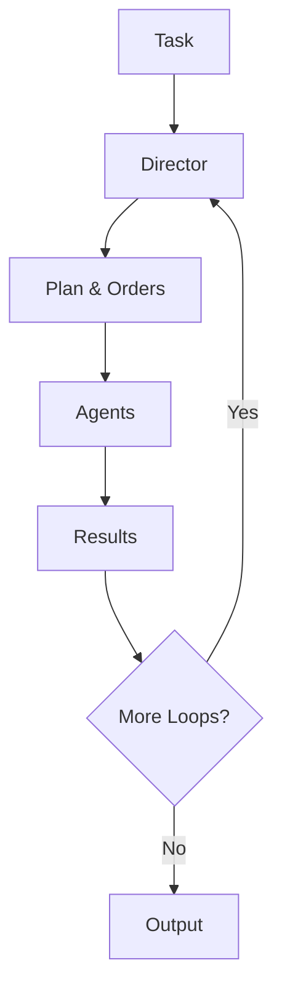

# `HierarchicalSwarm`

The `HierarchicalSwarm` is a sophisticated multi-agent orchestration system that implements a hierarchical workflow pattern. It consists of a director agent that coordinates and distributes tasks to specialized worker agents, creating a structured approach to complex problem-solving.




The Hierarchical Swarm follows a clear workflow pattern:

1. **Task Reception**: User provides a task to the swarm
2. **Planning**: Director creates a comprehensive plan and distributes orders to agents
3. **Execution**: Individual agents execute their assigned tasks (with optional real-time streaming)
4. **Feedback Loop**: Director evaluates results and issues new orders if needed (up to `max_loops`)
5. **Context Preservation**: All conversation history and context is maintained throughout the process


## Key Features

| Feature                      | Description                                                                                   |
|------------------------------|-----------------------------------------------------------------------------------------------|
| **Hierarchical Coordination**| Director agent orchestrates all operations                                                    |
| **Specialized Agents**       | Each agent has specific expertise and responsibilities                                       |
| **Iterative Refinement**     | Multiple feedback loops for improved results                                                 |
| **Context Preservation**     | Full conversation history maintained                                                         |
| **Flexible Output Formats**  | Support for various output types (dict, str, list)                                           |
| **Comprehensive Logging**    | Detailed logging for debugging and monitoring                                                |
| **Live Streaming**           | Real-time streaming callbacks for monitoring agent outputs                                   |
| **Token-by-Token Updates**   | Watch text formation in real-time as agents generate responses                               |
| **Hierarchy Visualization**  | Visual tree representation of swarm structure with `display_hierarchy()`                     |
| **Interactive Dashboard**    | Real-time Hierarchical Swarms dashboard for monitoring swarm operations                |
| **Advanced Planning**        | Optional planning phase before task distribution for better coordination                     |

## Constructor

### `HierarchicalSwarm.__init__()`

Initializes a new HierarchicalSwarm instance.

#### Important Parameters

| Parameter | Type | Default | Required | Description |
|-----------|------|---------|----------|-------------|
| `agents` | `AgentListType` | `None` | **Yes** | List of worker agents in the swarm. Must not be empty |
| `name` | `str` | `"HierarchicalAgentSwarm"` | No | The name identifier for this swarm instance |
| `description` | `str` | `"Distributed task swarm"` | No | A description of the swarm's purpose and capabilities |
| `director` | `Optional[Union[Agent, Callable, Any]]` | `None` | No | The director agent that orchestrates tasks. If None, a default director will be created |
| `max_loops` | `int` | `1` | No | Maximum number of feedback loops between director and agents (must be > 0) |
| `output_type` | `OutputType` | `"dict-all-except-first"` | No | Format for output (dict, str, list) |
| `director_model_name` | `str` | `"gpt-4o-mini"` | No | Model name for the main director agent |
| `director_name` | `str` | `"Director"` | No | Name identifier for the director agent |
| `director_temperature` | `float` | `0.7` | No | Temperature setting for the director agent (controls randomness) |
| `director_top_p` | `float` | `0.9` | No | Top-p (nucleus) sampling parameter for the director agent |
| `director_system_prompt` | `str` | `HIEARCHICAL_SWARM_SYSTEM_PROMPT` | No | System prompt for the director agent |
| `director_feedback_on` | `bool` | `True` | No | Whether director feedback is enabled |
| `feedback_director_model_name` | `str` | `"gpt-4o-mini"` | No | Model name for the feedback director agent |
| `add_collaboration_prompt` | `bool` | `True` | No | Whether to add collaboration prompts to worker agents |
| `multi_agent_prompt_improvements` | `bool` | `False` | No | Enable enhanced multi-agent collaboration prompts |
| `interactive` | `bool` | `False` | No | Enable interactive mode with Hierarchical Swarms dashboard visualization |
| `planning_enabled` | `bool` | `True` | No | Enable planning phase before task distribution |
| `autosave` | `bool` | `True` | No | Whether to enable autosaving of conversation history |
| `verbose` | `bool` | `False` | No | Whether to enable verbose logging |

#### Returns

| Type | Description |
|------|-------------|
| `HierarchicalSwarm` | A new HierarchicalSwarm instance |

#### Raises

| Exception | Condition |
|-----------|-----------|
| `ValueError` | If no agents are provided or max_loops is invalid |

## Core Methods

### `display_hierarchy()`

Displays a visual tree representation of the hierarchical swarm structure, showing the Director at the top level and all worker agents as children branches. This method uses Rich formatting to create an aesthetically pleasing console output that helps visualize the organizational structure of the swarm.

#### Returns

| Type | Description |
|------|-------------|
| `None` | Prints the hierarchy visualization to the console |

#### Example

```python
from swarms import Agent, HierarchicalSwarm

# Create specialized agents
research_agent = Agent(
    agent_name="Research-Analyst",
    agent_description="Specialized in comprehensive research and data gathering",
    model_name="gpt-4o-mini",
    max_loops=1,
    verbose=False,
)

analysis_agent = Agent(
    agent_name="Data-Analyst",
    agent_description="Expert in data analysis and pattern recognition",
    model_name="gpt-4o-mini",
    max_loops=1,
    verbose=False,
)

strategy_agent = Agent(
    agent_name="Strategy-Consultant",
    agent_description="Specialized in strategic planning and recommendations",
    model_name="gpt-4o-mini",
    max_loops=1,
    verbose=False,
)

# Create hierarchical swarm
swarm = HierarchicalSwarm(
    name="Swarms Corporation Operations",
    description="Enterprise-grade hierarchical swarm for complex task execution",
    agents=[research_agent, analysis_agent, strategy_agent],
    max_loops=1,
    interactive=False,  # Set to True to enable the Hierarchical Swarms dashboard
    director_model_name="claude-haiku-4-5",
    director_temperature=0.7,
    director_top_p=None,
    planning_enabled=True,
)

# Display the hierarchy visualization
swarm.display_hierarchy()
```

The output will show a visual tree structure like:
```
┌─ HierarchicalSwarm Hierarchy: Swarms Corporation Operations ─┐
│                                                               │
│ 🎯 Director [claude-haiku-4-5]                               │
│ ├─ 🤖 Research-Analyst [gpt-4o-mini] - Specialized in...   │
│ ├─ 🤖 Data-Analyst [gpt-4o-mini] - Expert in data...        │
│ └─ 🤖 Strategy-Consultant [gpt-4o-mini] - Specialized...   │
└───────────────────────────────────────────────────────────────┘
```

### `run()`

Executes the hierarchical swarm for a specified number of feedback loops, processing the task through multiple iterations for refinement and improvement.

#### Important Parameters

| Parameter | Type | Default | Required | Description |
|-----------|------|---------|----------|-------------|
| `task` | `Optional[str]` | `None` | **Yes*** | The initial task to be processed by the swarm. If None and interactive mode is enabled, will prompt for input |
| `img` | `Optional[str]` | `None` | No | Optional image input for the agents |
| `streaming_callback` | `Optional[Callable[[str, str, bool], None]]` | `None` | No | Callback function for real-time streaming of agent outputs. Parameters are (agent_name, chunk, is_final) where is_final indicates completion |

*Required if `interactive=False`

#### Returns

| Type | Description |
|------|-------------|
| `Any` | The formatted conversation history as output, formatted according to the `output_type` configuration |

#### Raises

| Exception | Condition |
|-----------|-----------|
| `Exception` | If swarm execution fails |

#### Example

```python
from swarms import Agent, HierarchicalSwarm

# Create specialized agents
research_agent = Agent(
    agent_name="Research-Specialist",
    agent_description="Expert in market research and analysis",
    model_name="gpt-4o-mini",
    max_loops=1,
    verbose=False,
)

financial_agent = Agent(
    agent_name="Financial-Analyst",
    agent_description="Specialist in financial analysis and valuation",
    model_name="gpt-4o-mini",
    max_loops=1,
    verbose=False,
)

# Initialize the hierarchical swarm
swarm = HierarchicalSwarm(
    name="Financial-Analysis-Swarm",
    description="A hierarchical swarm for comprehensive financial analysis",
    agents=[research_agent, financial_agent],
    max_loops=2,
    director_model_name="gpt-4o-mini",
    planning_enabled=True,
)

# Execute a complex task
task = "Analyze the market potential for Tesla (TSLA) stock"
result = swarm.run(task=task)
print(result)
```

#### Streaming Callback Example

```python
from swarms import Agent, HierarchicalSwarm

def streaming_callback(agent_name: str, chunk: str, is_final: bool):
    """Callback function for real-time streaming of agent outputs."""
    if not hasattr(streaming_callback, 'buffers'):
        streaming_callback.buffers = {}
        streaming_callback.paragraph_count = {}

    if agent_name not in streaming_callback.buffers:
        streaming_callback.buffers[agent_name] = ""
        streaming_callback.paragraph_count[agent_name] = 1
        print(f"\n🎬 {agent_name} starting...")

    if chunk.strip():
        tokens = chunk.replace('\n', ' \n ').split()
        for token in tokens:
            if token == '\n':
                if streaming_callback.buffers[agent_name].strip():
                    print(f"\n📄 {agent_name} - Paragraph {streaming_callback.paragraph_count[agent_name]} Complete:")
                    print(f"{streaming_callback.buffers[agent_name].strip()}")
                    streaming_callback.paragraph_count[agent_name] += 1
                    streaming_callback.buffers[agent_name] = ""
            else:
                streaming_callback.buffers[agent_name] += token + " "
                print(f"\r{agent_name} | {streaming_callback.buffers[agent_name].strip()}", end="", flush=True)

    if is_final:
        print(f"\n✅ {agent_name} completed!")

# Create agents
agents = [
    Agent(agent_name="Researcher", model_name="gpt-4o-mini"),
    Agent(agent_name="Analyst", model_name="gpt-4o-mini"),
]

# Initialize swarm
swarm = HierarchicalSwarm(
    name="Streaming-Analysis-Swarm",
    agents=agents,
    max_loops=1,
    director_model_name="gpt-4o-mini",
)

# Execute with streaming
task = "Analyze the impact of AI on the job market"
result = swarm.run(task=task, streaming_callback=streaming_callback)
```

### `batched_run()`

Execute the hierarchical swarm for multiple tasks in sequence. Processes a list of tasks sequentially, running the complete swarm workflow for each task independently.

#### Important Parameters

| Parameter | Type | Default | Required | Description |
|-----------|------|---------|----------|-------------|
| `tasks` | `List[str]` | - | **Yes** | List of tasks to be processed by the swarm |
| `img` | `Optional[str]` | `None` | No | Optional image input for the tasks |
| `streaming_callback` | `Optional[Callable[[str, str, bool], None]]` | `None` | No | Callback function for streaming agent outputs. Parameters are (agent_name, chunk, is_final) where is_final indicates completion |

#### Returns

| Type | Description |
|------|-------------|
| `List[Any]` | List of results for each processed task |

#### Raises

| Exception | Condition |
|-----------|-----------|
| `Exception` | If batched execution fails |

#### Example (batched_run method)

```python
from swarms import Agent, HierarchicalSwarm

# Create analysis agents
market_agent = Agent(
    agent_name="Market-Analyst",
    agent_description="Expert in market analysis and trends",
    model_name="gpt-4.1",
)

technical_agent = Agent(
    agent_name="Technical-Analyst",
    agent_description="Specialist in technical analysis and patterns",
    model_name="gpt-4.1",
)

# Initialize the swarm
swarm = HierarchicalSwarm(
    name="Analysis-Swarm",
    description="A hierarchical swarm for comprehensive analysis",
    agents=[market_agent, technical_agent],
    max_loops=2,
    director_model_name="gpt-4o-mini",
)

# Execute multiple tasks
tasks = [
    "Analyze Apple (AAPL) stock performance",
    "Evaluate Microsoft (MSFT) market position",
    "Assess Google (GOOGL) competitive landscape"
]

results = swarm.batched_run(tasks=tasks)
for i, result in enumerate(results):
    print(f"Task {i+1} Result:", result)
```

## Advanced Usage Examples

### Financial Analysis Swarm

```python
from swarms import Agent, HierarchicalSwarm

# Create specialized financial agents
market_research_agent = Agent(
    agent_name="Market-Research-Specialist",
    agent_description="Expert in market research, trend analysis, and competitive intelligence",
    system_prompt="""You are a senior market research specialist with expertise in:
    - Market trend analysis and forecasting
    - Competitive landscape assessment
    - Consumer behavior analysis
    - Industry report generation
    - Market opportunity identification
    - Risk assessment and mitigation strategies""",
    model_name="claude-3-sonnet-20240229",
)

financial_analyst_agent = Agent(
    agent_name="Financial-Analysis-Expert",
    agent_description="Specialist in financial statement analysis, valuation, and investment research",
    system_prompt="""You are a senior financial analyst with deep expertise in:
    - Financial statement analysis (income statement, balance sheet, cash flow)
    - Valuation methodologies (DCF, comparable company analysis, precedent transactions)
    - Investment research and due diligence
    - Financial modeling and forecasting
    - Risk assessment and portfolio analysis
    - ESG (Environmental, Social, Governance) analysis""",
    model_name="claude-3-sonnet-20240229",
)

# Initialize the hierarchical swarm
financial_analysis_swarm = HierarchicalSwarm(
    name="Financial-Analysis-Hierarchical-Swarm",
    description="A hierarchical swarm for comprehensive financial analysis with specialized agents",
    agents=[market_research_agent, financial_analyst_agent],
    max_loops=2,
    director_model_name="claude-3-sonnet-20240229",
    planning_enabled=True,
)

# Execute financial analysis
task = "Conduct a comprehensive analysis of Tesla (TSLA) stock including market position, financial health, and investment potential"
result = financial_analysis_swarm.run(task=task)
print(result)
```

### Development Department Swarm

```python
from swarms import Agent, HierarchicalSwarm

# Create specialized development agents
frontend_developer_agent = Agent(
    agent_name="Frontend-Developer",
    agent_description="Senior frontend developer expert in modern web technologies and user experience",
    system_prompt="""You are a senior frontend developer with expertise in:
    - Modern JavaScript frameworks (React, Vue, Angular)
    - TypeScript and modern ES6+ features
    - CSS frameworks and responsive design
    - State management (Redux, Zustand, Context API)
    - Web performance optimization
    - Accessibility (WCAG) and SEO best practices""",
    model_name="claude-3-sonnet-20240229",
)

backend_developer_agent = Agent(
    agent_name="Backend-Developer",
    agent_description="Senior backend developer specializing in server-side development and API design",
    system_prompt="""You are a senior backend developer with expertise in:
    - Server-side programming languages (Python, Node.js, Java, Go)
    - Web frameworks (Django, Flask, Express, Spring Boot)
    - Database design and optimization (SQL, NoSQL)
    - API design and REST/GraphQL implementation
    - Authentication and authorization systems
    - Microservices architecture and containerization""",
    model_name="claude-3-sonnet-20240229",
)

# Initialize the development swarm
development_department_swarm = HierarchicalSwarm(
    name="Autonomous-Development-Department",
    description="A fully autonomous development department with specialized agents",
    agents=[frontend_developer_agent, backend_developer_agent],
    max_loops=3,
    director_model_name="claude-3-sonnet-20240229",
    planning_enabled=True,
)

# Execute development project
task = "Create a simple web app that allows users to upload a file and then download it. The app should be built with React and Node.js."
result = development_department_swarm.run(task=task)
print(result)
```

## Interactive Dashboard

The `HierarchicalSwarm` includes an optional interactive dashboard that provides real-time monitoring of swarm operations. When `interactive=True`, the dashboard displays a futuristic Swarms Corporation-style interface with:

- **Real-time Status Updates**: Monitor director and agent statuses as tasks execute
- **Agent Monitoring Matrix**: Track all agents across multiple loops with full output history
- **Director Operations Panel**: View the director's plan and current orders
- **Progress Tracking**: See runtime, completion percentage, and loop progress
- **Full Output Display**: View complete agent outputs without truncation

### Enabling the Dashboard

```python
from swarms import Agent, HierarchicalSwarm

# Create agents
research_agent = Agent(
    agent_name="Research-Analyst",
    agent_description="Specialized in comprehensive research",
    model_name="gpt-4o-mini",
    max_loops=1,
    verbose=False,
)

# Create swarm with interactive dashboard
swarm = HierarchicalSwarm(
    name="Swarms Corporation Operations",
    description="Enterprise-grade hierarchical swarm",
    agents=[research_agent],
    max_loops=2,
    interactive=True,  # Enable the Hierarchical Swarms dashboard
    director_model_name="gpt-4o-mini",
    planning_enabled=True,
)

# Run with dashboard visualization
result = swarm.run("Conduct a research analysis on water stocks and ETFs")
```

The dashboard automatically:
- Starts when `run()` is called
- Updates in real-time as agents execute tasks
- Displays full conversation history across loops
- Shows director plans and orders
- Stops automatically when execution completes

### Dashboard Features

| Feature | Description |
|---------|-------------|
| **Operations Status** | Shows swarm name, description, director info, loop progress, and runtime |
| **Director Operations** | Displays the director's plan and current task orders |
| **Agent Monitoring Matrix** | Table view showing all agents, their status, tasks, and outputs across loops |
| **Detailed View** | Full output history for each agent in each loop |
| **Real-time Updates** | Dashboard refreshes automatically as operations progress |

## Autosave Feature

### Overview

The autosave feature automatically saves conversation history to disk after workflow execution completes. This is essential for:

- **Debugging**: Review complete conversation history including director orders and agent responses
- **Audit Trails**: Maintain records of hierarchical agent interactions for compliance
- **Performance Analysis**: Analyze director planning and agent execution patterns
- **Recovery**: Restore swarm state from saved conversations
- **Iterative Improvement**: Review multi-loop feedback cycles for optimization

### Configuration

Autosave is **enabled by default** (`autosave=True`). When enabled, conversation history is saved to:
```
{workspace_dir}/swarms/HierarchicalSwarm/{swarm-name}-{timestamp}/conversation_history.json
```

#### Parameters

| Parameter | Type | Default | Description |
|-----------|------|---------|-------------|
| `autosave` | `bool` | `True` | Enable/disable automatic saving of conversation history |
| `verbose` | `bool` | `False` | Enable detailed logging of autosave operations |
| `swarm_workspace_dir` | `str` | Auto-generated | Directory where conversation history is saved (read-only) |

### Setting Custom Workspace Directory

Use the `WORKSPACE_DIR` environment variable to customize the base workspace directory:

```python
import os
from swarms import Agent, HierarchicalSwarm

# Set custom workspace directory
# If not set, defaults to 'agent_workspace' in the current directory
os.environ["WORKSPACE_DIR"] = "/path/to/my_project"

# Create swarm with autosave and verbose logging
swarm = HierarchicalSwarm(
    name="analysis-swarm",
    agents=[research_agent, financial_agent],
    max_loops=2,
    autosave=True,   # Enabled by default
    verbose=True,    # Enable detailed logging
)

# Run swarm - conversation automatically saved after all loops
result = swarm.run("Analyze Tesla (TSLA) stock")

# Access the workspace directory path
print(f"Conversation saved to: {swarm.swarm_workspace_dir}")
```

### Disabling Autosave

For temporary swarms or when disk space is limited, you can disable autosave:

```python
from swarms import Agent, HierarchicalSwarm

# Create swarm without autosave
swarm = HierarchicalSwarm(
    name="temp-swarm",
    agents=[agent1, agent2],
    max_loops=1,
    autosave=False,  # Disable autosave
)

# Run swarm - no files saved to disk
result = swarm.run("Process this task")
```

### Accessing Saved Conversations

The saved conversation history is a JSON file containing the complete conversation thread, including:

- Director's planning and task distribution
- Agent responses and outputs
- Feedback loops across all iterations
- Full context preservation

```python
import json
from swarms import Agent, HierarchicalSwarm

# Create and run swarm
swarm = HierarchicalSwarm(
    name="my-swarm",
    agents=[researcher, analyst, writer],
    max_loops=2,
    autosave=True,
)

result = swarm.run("Research and analyze AI market trends")

# Read saved conversation history
conversation_file = f"{swarm.swarm_workspace_dir}/conversation_history.json"
with open(conversation_file, 'r') as f:
    conversation_data = json.load(f)
    
# Analyze director operations and agent responses
for entry in conversation_data:
    if 'role' in entry:
        print(f"Role: {entry['role']}")
        print(f"Content: {entry['content'][:100]}...")
        print("-" * 80)
```

### Verbose Logging

Enable verbose mode to see detailed autosave operations and swarm execution:

```python
from swarms import Agent, HierarchicalSwarm

swarm = HierarchicalSwarm(
    name="debug-swarm",
    agents=[agent1, agent2],
    max_loops=2,
    autosave=True,
    verbose=True,  # See detailed logs
)

# Logs will show:
# - Workspace directory creation
# - Director planning operations
# - Conversation save operations
# - File paths and timestamps
result = swarm.run("Debug this complex task")
```

### Autosave with Interactive Dashboard

When using the interactive dashboard, autosave works seamlessly:

```python
from swarms import Agent, HierarchicalSwarm

swarm = HierarchicalSwarm(
    name="monitored-swarm",
    agents=[agent1, agent2, agent3],
    max_loops=3,
    autosave=True,     # Save conversation history
    verbose=True,      # Detailed logging
    interactive=True,  # Enable dashboard
)

# Dashboard shows real-time operations
# Conversation history saved automatically after completion
result = swarm.run("Complex multi-agent task")
```

## Planning Feature

The `planning_enabled` parameter controls whether the director performs an initial planning phase before creating task orders. When enabled, the director:

1. **Analyzes the Task**: Reviews the task and conversation history
2. **Creates a Strategic Plan**: Develops a comprehensive approach before distributing orders
3. **Distributes Orders**: Assigns specific tasks to agents based on the plan

### Planning Configuration

```python
swarm = HierarchicalSwarm(
    name="Planning-Swarm",
    agents=[agent1, agent2],
    max_loops=2,
    planning_enabled=True,  # Enable planning phase
    director_model_name="gpt-4o-mini",
    director_temperature=0.7,  # Control planning creativity
    director_top_p=0.9,  # Control planning focus
)
```

### When to Use Planning

- **Complex Multi-Step Tasks**: Tasks requiring strategic coordination
- **Uncertain Requirements**: When the task needs analysis before execution
- **Resource Optimization**: When you want the director to optimize agent assignments
- **Quality Over Speed**: When thorough planning is more important than speed

### When to Disable Planning

- **Simple Tasks**: Straightforward tasks that don't need strategic planning
- **Performance Critical**: When minimizing latency is important
- **Well-Defined Workflows**: When the task structure is already clear

## Output Types

The `HierarchicalSwarm` supports various output formats through the `output_type` parameter:

| Output Type | Description | Use Case |
|-------------|-------------|----------|
| `"dict-all-except-first"` | Returns all conversation history as a dictionary, excluding the first message | Default format for comprehensive analysis |
| `"dict"` | Returns conversation history as a dictionary | When you need structured data |
| `"str"` | Returns conversation history as a string | For simple text output |
| `"list"` | Returns conversation history as a list | For sequential processing |

## Streaming Callbacks

The `HierarchicalSwarm` supports real-time streaming of agent outputs through optional callback functions. This feature allows you to monitor the text generation process as it happens, token by token.

### Streaming Callback Function Signature

```python
def streaming_callback(agent_name: str, chunk: str, is_final: bool) -> None:
    """
    Callback function for real-time streaming of agent outputs.

    Args:
        agent_name (str): The name of the agent producing the output
        chunk (str): The chunk of text generated (empty if is_final=True)
        is_final (bool): True when the agent has completed its task
    """
    pass
```

### Streaming Callback Parameters

| Parameter | Type | Description |
|-----------|------|-------------|
| `agent_name` | `str` | The name of the agent currently generating output |
| `chunk` | `str` | The text chunk generated by the agent |
| `is_final` | `bool` | Indicates if this is the final chunk (agent completed) |

### Live Paragraph Formation

The streaming callback can accumulate tokens to show live paragraph formation:

```python
def live_paragraph_callback(agent_name: str, chunk: str, is_final: bool):
    """Shows live paragraph formation as text is generated."""
    if not hasattr(live_paragraph_callback, 'buffers'):
        live_paragraph_callback.buffers = {}

    if agent_name not in live_paragraph_callback.buffers:
        live_paragraph_callback.buffers[agent_name] = ""
        print(f"\n🎬 {agent_name} starting...")

    if chunk.strip():
        tokens = chunk.replace('\n', ' \n ').split()
        for token in tokens:
            if token == '\n':
                if live_paragraph_callback.buffers[agent_name].strip():
                    print(f"\n📄 {agent_name} - Paragraph Complete:")
                    print(f"{live_paragraph_callback.buffers[agent_name].strip()}")
                    live_paragraph_callback.buffers[agent_name] = ""
            else:
                live_paragraph_callback.buffers[agent_name] += token + " "
                print(f"\r{agent_name} | {live_paragraph_callback.buffers[agent_name].strip()}", end="", flush=True)

    if is_final:
        print(f"\n✅ {agent_name} completed!")
```


## Best Practices

| Best Practice                | Description                                                                                      |
|------------------------------|--------------------------------------------------------------------------------------------------|
| **Agent Specialization**     | Create agents with specific, well-defined expertise areas                                        |
| **Clear Task Descriptions**  | Provide detailed, actionable task descriptions                                                  |
| **Appropriate Loop Count**   | Set `max_loops` based on task complexity (1-3 for most tasks)                                   |
| **Director Configuration**   | Adjust `director_temperature` (0.7-0.9) and `director_top_p` (0.9-0.95) for desired creativity |
| **Planning Strategy**        | Enable `planning_enabled` for complex tasks, disable for simple or performance-critical tasks   |
| **Interactive Dashboard**    | Use `interactive=True` during development for real-time monitoring and debugging                 |
| **Context Preservation**     | Leverage the built-in conversation history for continuity                                       |
| **Autosave Configuration**   | Keep `autosave=True` (default) to preserve conversation history for debugging and analysis     |
| **Error Handling**           | Implement proper error handling for production use                                              |
| **Streaming Callbacks**      | Use streaming callbacks for real-time monitoring and user feedback                              |
| **Callback Performance**     | Keep streaming callbacks lightweight to avoid blocking the main execution thread                |
| **Model Selection**          | Choose appropriate models for director (coordination) vs agents (specialization)              |

## Error Handling

The `HierarchicalSwarm` includes comprehensive error handling with detailed logging. Common issues and solutions:

- **No Agents**: Ensure at least one agent is provided
- **Invalid Director**: Verify the director agent is properly configured
- **Max Loops**: Set `max_loops` to a value greater than 0
- **Model Issues**: Check that all agents have valid model configurations

## Performance Considerations

| Consideration              | Description                                                                                           |
|---------------------------|-------------------------------------------------------------------------------------------------------|
| **Loop Optimization**      | Balance between thoroughness and performance with `max_loops`                                         |
| **Agent Count**            | More agents increase coordination overhead                                                            |
| **Model Selection**        | Choose appropriate models for your use case and budget                                                |
| **Planning Overhead**      | Disable `planning_enabled` if you need faster execution                                               |
| **Dashboard Impact**       | The interactive dashboard adds minimal overhead but provides valuable insights                        |
| **Director Temperature**   | Lower values (0.5-0.7) for consistent results, higher (0.8-1.0) for creativity                       |
| **Top-P Sampling**         | Use `director_top_p=None` to disable and rely only on temperature                                     |
