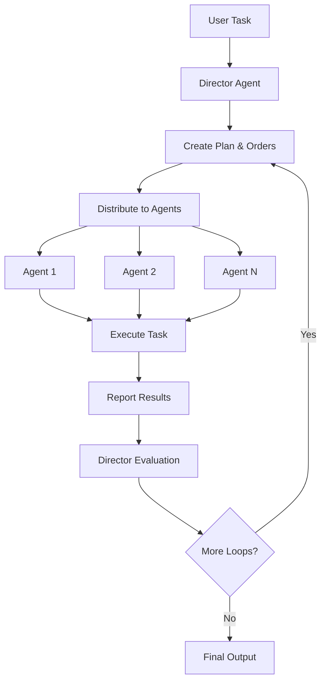

# `HierarchicalSwarm`

The `HierarchicalSwarm` is a sophisticated multi-agent orchestration system that implements a hierarchical workflow pattern. It consists of a director agent that coordinates and distributes tasks to specialized worker agents, creating a structured approach to complex problem-solving.

## Overview

The Hierarchical Swarm follows a clear workflow pattern:

1. **Task Reception**: User provides a task to the swarm
2. **Planning**: Director creates a comprehensive plan and distributes orders to agents
3. **Execution**: Individual agents execute their assigned tasks
4. **Feedback Loop**: Director evaluates results and issues new orders if needed (up to `max_loops`)
5. **Context Preservation**: All conversation history and context is maintained throughout the process

## Architecture



## Key Features

- **Hierarchical Coordination**: Director agent orchestrates all operations
- **Specialized Agents**: Each agent has specific expertise and responsibilities
- **Iterative Refinement**: Multiple feedback loops for improved results
- **Context Preservation**: Full conversation history maintained
- **Flexible Output Formats**: Support for various output types (dict, str, list)
- **Comprehensive Logging**: Detailed logging for debugging and monitoring

## `HierarchicalSwarm` Constructor

| Parameter | Type | Default | Description |
|-----------|------|---------|-------------|
| `name` | `str` | `"HierarchicalAgentSwarm"` | The name of the swarm instance |
| `description` | `str` | `"Distributed task swarm"` | Brief description of the swarm's functionality |
| `director` | `Optional[Union[Agent, Callable, Any]]` | `None` | The director agent that orchestrates tasks |
| `agents` | `List[Union[Agent, Callable, Any]]` | `None` | List of worker agents in the swarm |
| `max_loops` | `int` | `1` | Maximum number of feedback loops between director and agents |
| `output_type` | `OutputType` | `"dict-all-except-first"` | Format for output (dict, str, list) |
| `feedback_director_model_name` | `str` | `"gpt-4o-mini"` | Model name for feedback director |
| `director_name` | `str` | `"Director"` | Name of the director agent |
| `director_model_name` | `str` | `"gpt-4o-mini"` | Model name for the director agent |
| `verbose` | `bool` | `False` | Enable detailed logging |
| `add_collaboration_prompt` | `bool` | `True` | Add collaboration prompts to agents |
| `planning_director_agent` | `Optional[Union[Agent, Callable, Any]]` | `None` | Optional planning agent for enhanced planning |

## Core Methods

### `run(task, img=None, *args, **kwargs)`

Executes the hierarchical swarm for a specified number of feedback loops, processing the task through multiple iterations for refinement and improvement.

#### Parameters

| Parameter | Type | Default | Description |
|-----------|------|---------|-------------|
| `task` | `str` | **Required** | The initial task to be processed by the swarm |
| `img` | `str` | `None` | Optional image input for the agents |
| `*args` | `Any` | - | Additional positional arguments |
| `**kwargs` | `Any` | - | Additional keyword arguments |

#### Returns

| Type | Description |
|------|-------------|
| `Any` | The formatted conversation history as output based on `output_type` |

#### Example

```python
from swarms import Agent
from swarms.structs.hiearchical_swarm import HierarchicalSwarm

# Create specialized agents
research_agent = Agent(
    agent_name="Research-Specialist",
    agent_description="Expert in market research and analysis",
    model_name="gpt-4o",
)

financial_agent = Agent(
    agent_name="Financial-Analyst",
    agent_description="Specialist in financial analysis and valuation",
    model_name="gpt-4o",
)

# Initialize the hierarchical swarm
swarm = HierarchicalSwarm(
    name="Financial-Analysis-Swarm",
    description="A hierarchical swarm for comprehensive financial analysis",
    agents=[research_agent, financial_agent],
    max_loops=2,
    verbose=True,
)

# Execute a complex task
task = "Analyze the market potential for Tesla (TSLA) stock"
result = swarm.run(task=task)
print(result)
```

### `step(task, img=None, *args, **kwargs)`

Runs a single step of the hierarchical swarm, executing one complete cycle of planning, distribution, execution, and feedback.

#### Parameters

| Parameter | Type | Default | Description |
|-----------|------|---------|-------------|
| `task` | `str` | **Required** | The task to be executed in this step |
| `img` | `str` | `None` | Optional image input for the agents |
| `*args` | `Any` | - | Additional positional arguments |
| `**kwargs` | `Any` | - | Additional keyword arguments |

#### Returns

| Type | Description |
|------|-------------|
| `str` | Feedback from the director based on agent outputs |

#### Example

```python
from swarms import Agent
from swarms.structs.hiearchical_swarm import HierarchicalSwarm

# Create development agents
frontend_agent = Agent(
    agent_name="Frontend-Developer",
    agent_description="Expert in React and modern web development",
    model_name="gpt-4o",
)

backend_agent = Agent(
    agent_name="Backend-Developer",
    agent_description="Specialist in Node.js and API development",
    model_name="gpt-4o",
)

# Initialize the swarm
swarm = HierarchicalSwarm(
    name="Development-Swarm",
    description="A hierarchical swarm for software development",
    agents=[frontend_agent, backend_agent],
    max_loops=1,
    verbose=True,
)

# Execute a single step
task = "Create a simple web app for file upload and download"
feedback = swarm.step(task=task)
print("Director Feedback:", feedback)
```

### `batched_run(tasks, img=None, *args, **kwargs)`

Executes the hierarchical swarm for a list of tasks, processing each task through the complete workflow.

#### Parameters

| Parameter | Type | Default | Description |
|-----------|------|---------|-------------|
| `tasks` | `List[str]` | **Required** | List of tasks to be processed |
| `img` | `str` | `None` | Optional image input for the agents |
| `*args` | `Any` | - | Additional positional arguments |
| `**kwargs` | `Any` | - | Additional keyword arguments |

#### Returns

| Type | Description |
|------|-------------|
| `List[Any]` | List of results for each task |

#### Example

```python
from swarms import Agent
from swarms.structs.hiearchical_swarm import HierarchicalSwarm

# Create analysis agents
market_agent = Agent(
    agent_name="Market-Analyst",
    agent_description="Expert in market analysis and trends",
    model_name="gpt-4o",
)

technical_agent = Agent(
    agent_name="Technical-Analyst",
    agent_description="Specialist in technical analysis and patterns",
    model_name="gpt-4o",
)

# Initialize the swarm
swarm = HierarchicalSwarm(
    name="Analysis-Swarm",
    description="A hierarchical swarm for comprehensive analysis",
    agents=[market_agent, technical_agent],
    max_loops=2,
    verbose=True,
)

# Execute multiple tasks
tasks = [
    "Analyze Apple (AAPL) stock performance",
    "Evaluate Microsoft (MSFT) market position",
    "Assess Google (GOOGL) competitive landscape"
]

results = swarm.batched_run(tasks=tasks)
for i, result in enumerate(results):
    print(f"Task {i+1} Result:", result)
```

## Advanced Usage Examples

### Financial Analysis Swarm

```python
from swarms import Agent
from swarms.structs.hiearchical_swarm import HierarchicalSwarm

# Create specialized financial agents
market_research_agent = Agent(
    agent_name="Market-Research-Specialist",
    agent_description="Expert in market research, trend analysis, and competitive intelligence",
    system_prompt="""You are a senior market research specialist with expertise in:
    - Market trend analysis and forecasting
    - Competitive landscape assessment
    - Consumer behavior analysis
    - Industry report generation
    - Market opportunity identification
    - Risk assessment and mitigation strategies""",
    model_name="claude-3-sonnet-20240229",
)

financial_analyst_agent = Agent(
    agent_name="Financial-Analysis-Expert",
    agent_description="Specialist in financial statement analysis, valuation, and investment research",
    system_prompt="""You are a senior financial analyst with deep expertise in:
    - Financial statement analysis (income statement, balance sheet, cash flow)
    - Valuation methodologies (DCF, comparable company analysis, precedent transactions)
    - Investment research and due diligence
    - Financial modeling and forecasting
    - Risk assessment and portfolio analysis
    - ESG (Environmental, Social, Governance) analysis""",
    model_name="claude-3-sonnet-20240229",
)

# Initialize the hierarchical swarm
financial_analysis_swarm = HierarchicalSwarm(
    name="Financial-Analysis-Hierarchical-Swarm",
    description="A hierarchical swarm for comprehensive financial analysis with specialized agents",
    agents=[market_research_agent, financial_analyst_agent],
    max_loops=2,
    verbose=True,
)

# Execute financial analysis
task = "Conduct a comprehensive analysis of Tesla (TSLA) stock including market position, financial health, and investment potential"
result = financial_analysis_swarm.run(task=task)
print(result)
```

### Development Department Swarm

```python
from swarms import Agent
from swarms.structs.hiearchical_swarm import HierarchicalSwarm

# Create specialized development agents
frontend_developer_agent = Agent(
    agent_name="Frontend-Developer",
    agent_description="Senior frontend developer expert in modern web technologies and user experience",
    system_prompt="""You are a senior frontend developer with expertise in:
    - Modern JavaScript frameworks (React, Vue, Angular)
    - TypeScript and modern ES6+ features
    - CSS frameworks and responsive design
    - State management (Redux, Zustand, Context API)
    - Web performance optimization
    - Accessibility (WCAG) and SEO best practices""",
    model_name="claude-3-sonnet-20240229",
)

backend_developer_agent = Agent(
    agent_name="Backend-Developer",
    agent_description="Senior backend developer specializing in server-side development and API design",
    system_prompt="""You are a senior backend developer with expertise in:
    - Server-side programming languages (Python, Node.js, Java, Go)
    - Web frameworks (Django, Flask, Express, Spring Boot)
    - Database design and optimization (SQL, NoSQL)
    - API design and REST/GraphQL implementation
    - Authentication and authorization systems
    - Microservices architecture and containerization""",
    model_name="claude-3-sonnet-20240229",
)

# Initialize the development swarm
development_department_swarm = HierarchicalSwarm(
    name="Autonomous-Development-Department",
    description="A fully autonomous development department with specialized agents",
    agents=[frontend_developer_agent, backend_developer_agent],
    max_loops=3,
    verbose=True,
)

# Execute development project
task = "Create a simple web app that allows users to upload a file and then download it. The app should be built with React and Node.js."
result = development_department_swarm.run(task=task)
print(result)
```

## Output Types

The `HierarchicalSwarm` supports various output formats through the `output_type` parameter:

| Output Type | Description | Use Case |
|-------------|-------------|----------|
| `"dict-all-except-first"` | Returns all conversation history as a dictionary, excluding the first message | Default format for comprehensive analysis |
| `"dict"` | Returns conversation history as a dictionary | When you need structured data |
| `"str"` | Returns conversation history as a string | For simple text output |
| `"list"` | Returns conversation history as a list | For sequential processing |

## Best Practices

1. **Agent Specialization**: Create agents with specific, well-defined expertise areas
2. **Clear Task Descriptions**: Provide detailed, actionable task descriptions
3. **Appropriate Loop Count**: Set `max_loops` based on task complexity (1-3 for most tasks)
4. **Verbose Logging**: Enable verbose mode during development for debugging
5. **Context Preservation**: Leverage the built-in conversation history for continuity
6. **Error Handling**: Implement proper error handling for production use

## Error Handling

The `HierarchicalSwarm` includes comprehensive error handling with detailed logging. Common issues and solutions:

- **No Agents**: Ensure at least one agent is provided
- **Invalid Director**: Verify the director agent is properly configured
- **Max Loops**: Set `max_loops` to a value greater than 0
- **Model Issues**: Check that all agents have valid model configurations

## Performance Considerations

- **Loop Optimization**: Balance between thoroughness and performance with `max_loops`
- **Agent Count**: More agents increase coordination overhead
- **Model Selection**: Choose appropriate models for your use case and budget
- **Verbose Mode**: Disable verbose logging in production for better performance 