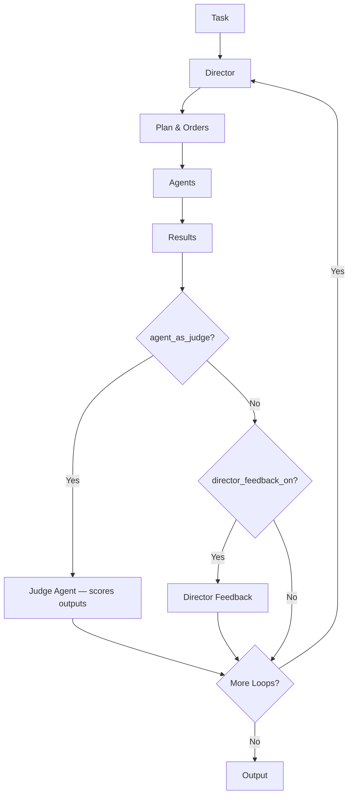

# `HierarchicalSwarm`

The `HierarchicalSwarm` is a sophisticated multi-agent orchestration system that implements a hierarchical workflow pattern. It consists of a director agent that coordinates and distributes tasks to specialized worker agents, creating a structured approach to complex problem-solving.


```mermaid
graph TD
    A[Task] --> B[Director]
    B --> C[Plan & Orders]
    C --> D[Agents]
    D --> E[Results]
    E --> F{agent_as_judge?}
    F -->|Yes| G[Judge Agent — scores outputs]
    F -->|No| H{director_feedback_on?}
    H -->|Yes| I[Director Feedback]
    H -->|No| J{More Loops?}
    G --> J
    I --> J
    J -->|Yes| B
    J -->|No| K[Output]
```

The Hierarchical Swarm follows a clear workflow pattern:

1. **Task Reception**: User provides a task to the swarm
2. **Planning**: Director creates a comprehensive plan and distributes orders to agents
3. **Execution**: Individual agents execute their assigned tasks sequentially or in parallel
4. **Evaluation**: Optionally, a judge agent scores each output with structured numeric scores
5. **Feedback Loop**: Director evaluates results and issues new orders if needed (up to `max_loops`)
6. **Context Preservation**: All conversation history and context is maintained throughout the process


## Key Features

| Feature                      | Description                                                                                   |
|------------------------------|-----------------------------------------------------------------------------------------------|
| **Hierarchical Coordination**| Director agent orchestrates all operations                                                    |
| **Specialized Agents**       | Each agent has specific expertise and responsibilities                                        |
| **Iterative Refinement**     | Multiple feedback loops for improved results                                                  |
| **Context Preservation**     | Full conversation history maintained                                                          |
| **Flexible Output Formats**  | Support for various output types (dict, str, list)                                            |
| **Comprehensive Logging**    | Detailed logging for debugging and monitoring                                                 |
| **Live Streaming**           | Real-time streaming callbacks for monitoring agent outputs                                    |
| **Token-by-Token Updates**   | Watch text formation in real-time as agents generate responses                                |
| **Hierarchy Visualization**  | Visual tree representation of swarm structure with `display_hierarchy()`                      |
| **Interactive Dashboard**    | Real-time Hierarchical Swarms dashboard for monitoring swarm operations                       |
| **Advanced Planning**        | Optional planning phase before task distribution for better coordination                      |
| **Parallel Execution**       | Run all agents concurrently via `ThreadPoolExecutor` with `parallel_execution=True`           |
| **Agent-as-Judge**           | Structured per-agent scoring (0–10) after each cycle with `agent_as_judge=True`              |
| **Async Entry Point**        | Non-blocking `arun()` method wraps `run()` in `asyncio.to_thread()`                          |

## Constructor

### `HierarchicalSwarm.__init__()`

Initializes a new HierarchicalSwarm instance.

#### Parameters

| Parameter | Type | Default | Required | Description |
|-----------|------|---------|----------|-------------|
| `agents` | `AgentListType` | `None` | **Yes** | List of worker agents in the swarm. Must not be empty |
| `name` | `str` | `"HierarchicalAgentSwarm"` | No | The name identifier for this swarm instance |
| `description` | `str` | `"Distributed task swarm"` | No | A description of the swarm's purpose and capabilities |
| `director` | `Optional[Union[Agent, Callable, Any]]` | `None` | No | The director agent that orchestrates tasks. If None, a default director will be created |
| `max_loops` | `int` | `1` | No | Maximum number of feedback loops between director and agents (must be > 0) |
| `output_type` | `OutputType` | `"dict-all-except-first"` | No | Format for output (dict, str, list) |
| `director_model_name` | `str` | `"gpt-4o-mini"` | No | Model name for the main director agent |
| `director_name` | `str` | `"Director"` | No | Name identifier for the director agent |
| `director_temperature` | `float` | `0.7` | No | Temperature setting for the director agent (controls randomness) |
| `director_top_p` | `float` | `0.9` | No | Top-p (nucleus) sampling parameter for the director agent |
| `director_system_prompt` | `str` | `HIEARCHICAL_SWARM_SYSTEM_PROMPT` | No | System prompt for the director agent |
| `director_feedback_on` | `bool` | `True` | No | Whether director freeform feedback is enabled after each cycle |
| `feedback_director_model_name` | `str` | `"gpt-4o-mini"` | No | Model name for the feedback director agent |
| `add_collaboration_prompt` | `bool` | `True` | No | Whether to add collaboration prompts to worker agents |
| `multi_agent_prompt_improvements` | `bool` | `False` | No | Enable enhanced multi-agent collaboration prompts |
| `interactive` | `bool` | `False` | No | Enable interactive mode with Hierarchical Swarms dashboard visualization |
| `planning_enabled` | `bool` | `True` | No | Enable planning phase before task distribution |
| `autosave` | `bool` | `True` | No | Whether to enable autosaving of conversation history |
| `verbose` | `bool` | `False` | No | Whether to enable verbose logging |
| `parallel_execution` | `bool` | `False` | No | Run all agents concurrently using `ThreadPoolExecutor`. Outputs are written to conversation in original submission order |
| `agent_as_judge` | `bool` | `False` | No | After each cycle, spin up a judge agent that scores every worker output (0–10) using a structured `JudgeReport`. Takes priority over `director_feedback_on` |
| `judge_agent_model_name` | `str` | `"gpt-4o-mini"` | No | Model used by the judge agent when `agent_as_judge=True` |

#### Returns

| Type | Description |
|------|-------------|
| `HierarchicalSwarm` | A new HierarchicalSwarm instance |

#### Raises

| Exception | Condition |
|-----------|-----------|
| `ValueError` | If no agents are provided or `max_loops` is invalid |

---

## Core Methods

### `run()`

Executes the hierarchical swarm for a specified number of feedback loops, processing the task through multiple iterations for refinement and improvement.

#### Parameters

| Parameter | Type | Default | Required | Description |
|-----------|------|---------|----------|-------------|
| `task` | `Optional[str]` | `None` | **Yes*** | The initial task to be processed by the swarm. If None and interactive mode is enabled, will prompt for input |
| `img` | `Optional[str]` | `None` | No | Optional image input for the agents |
| `streaming_callback` | `Optional[Callable[[str, str, bool], None]]` | `None` | No | Callback for real-time streaming. Parameters: `(agent_name, chunk, is_final)` |

*Required if `interactive=False`

#### Returns

| Type | Description |
|------|-------------|
| `Any` | The formatted conversation history, formatted according to `output_type` |

#### Example

```python
from swarms import Agent, HierarchicalSwarm

research_agent = Agent(
    agent_name="Research-Specialist",
    agent_description="Expert in market research and analysis",
    model_name="gpt-4o-mini",
    max_loops=1,
)

financial_agent = Agent(
    agent_name="Financial-Analyst",
    agent_description="Specialist in financial analysis and valuation",
    model_name="gpt-4o-mini",
    max_loops=1,
)

swarm = HierarchicalSwarm(
    name="Financial-Analysis-Swarm",
    agents=[research_agent, financial_agent],
    max_loops=2,
    director_model_name="gpt-4o-mini",
)

result = swarm.run(task="Analyze the market potential for Tesla (TSLA) stock")
print(result)
```

---

### `arun()`

Async entry point that wraps `run()` in `asyncio.to_thread()`, allowing the swarm to be awaited without blocking the event loop. Accepts the same parameters as `run()`.

#### Parameters

| Parameter | Type | Default | Required | Description |
|-----------|------|---------|----------|-------------|
| `task` | `Optional[str]` | `None` | **Yes*** | The task to be processed by the swarm |
| `img` | `Optional[str]` | `None` | No | Optional image input |
| `streaming_callback` | `Optional[Callable[[str, str, bool], None]]` | `None` | No | Callback for real-time streaming |

#### Returns

| Type | Description |
|------|-------------|
| `Any` | Same result as `run()` |

#### Example

```python
import asyncio
from swarms import Agent, HierarchicalSwarm

agents = [
    Agent(agent_name="Researcher", model_name="gpt-4o-mini", max_loops=1),
    Agent(agent_name="Analyst", model_name="gpt-4o-mini", max_loops=1),
]

swarm = HierarchicalSwarm(
    name="Async-Swarm",
    agents=agents,
    director_model_name="gpt-4o-mini",
)

result = asyncio.run(swarm.arun(task="Summarize recent AI research trends"))
print(result)
```

Use `arun()` when integrating the swarm into an existing async application (e.g., FastAPI, async CLI tools) so the swarm does not block the event loop.

---

### `batched_run()`

Executes the swarm for multiple tasks in sequence, running the complete workflow independently for each task.

#### Parameters

| Parameter | Type | Default | Required | Description |
|-----------|------|---------|----------|-------------|
| `tasks` | `List[str]` | - | **Yes** | List of tasks to be processed |
| `img` | `Optional[str]` | `None` | No | Optional image input for the tasks |
| `streaming_callback` | `Optional[Callable[[str, str, bool], None]]` | `None` | No | Callback for streaming agent outputs |

#### Returns

| Type | Description |
|------|-------------|
| `List[Any]` | List of results for each processed task |

#### Example

```python
from swarms import Agent, HierarchicalSwarm

swarm = HierarchicalSwarm(
    name="Analysis-Swarm",
    agents=[
        Agent(agent_name="Market-Analyst", model_name="gpt-4.1", max_loops=1),
        Agent(agent_name="Technical-Analyst", model_name="gpt-4.1", max_loops=1),
    ],
    director_model_name="gpt-4o-mini",
)

results = swarm.batched_run(tasks=[
    "Analyze Apple (AAPL) stock performance",
    "Evaluate Microsoft (MSFT) market position",
    "Assess Google (GOOGL) competitive landscape",
])
for i, result in enumerate(results):
    print(f"Task {i+1}:", result)
```

---

### `display_hierarchy()`

Prints a visual tree representation of the swarm structure — director at the top, worker agents as branches — using Rich formatting.

#### Example

```python
swarm.display_hierarchy()
```

```
┌─ HierarchicalSwarm Hierarchy: My Swarm ─┐
│ 🎯 Director [gpt-4o-mini]               │
│ ├─ 🤖 Research-Analyst [gpt-4o-mini]   │
│ ├─ 🤖 Data-Analyst [gpt-4o-mini]       │
│ └─ 🤖 Strategy-Consultant [gpt-4o-mini]│
└─────────────────────────────────────────┘
```

---

## New Optional Features

### Parallel Execution (`parallel_execution`)

By default, agents run sequentially — each agent waits for the previous one to finish before starting. With `parallel_execution=True`, all agents in a cycle are submitted to a `ThreadPoolExecutor` simultaneously and run concurrently.

**How it works:**

1. All `call_single_agent()` calls are submitted to a thread pool in one loop.
2. `as_completed()` collects results as each agent finishes (fastest first).
3. After all futures resolve, outputs are written to conversation in the original submission order to guarantee deterministic history.

**Worker count** is set to `max(1, int(os.cpu_count() * 0.75))` — 75% of available CPU cores.

**When to use it:**
- Agents work independently with no dependency on each other's output
- You want to minimize wall-clock time on large agent pools

**When to avoid it:**
- Agents need to read each other's outputs (use sequential mode so conversation context is populated in order)
- Tasks require strict ordering of agent contributions

```python
from swarms import Agent, HierarchicalSwarm

swarm = HierarchicalSwarm(
    name="Parallel-Swarm",
    agents=[
        Agent(agent_name="Research-Analyst", model_name="gpt-4o-mini", max_loops=1),
        Agent(agent_name="Data-Analyst", model_name="gpt-4o-mini", max_loops=1),
        Agent(agent_name="Strategy-Consultant", model_name="gpt-4o-mini", max_loops=1),
    ],
    director_model_name="gpt-4o-mini",
    director_feedback_on=False,
    parallel_execution=True,   # all 3 agents run at the same time
)

result = swarm.run(task="Analyze AI infrastructure investment trends for 2025")
print(result)
```

---

### Agent-as-Judge (`agent_as_judge`)

With `agent_as_judge=True`, after all worker agents complete their tasks in a cycle, a dedicated judge agent is instantiated to score every worker's output using a structured `JudgeReport` schema. This replaces the freeform `director_feedback_on` feedback — if both are `True`, `agent_as_judge` takes priority.

**Scoring dimensions (each 0–10, weighted composite):**

| Dimension | Weight | What it measures |
|-----------|--------|-----------------|
| Task Adherence | 25% | Did the agent do what it was assigned? |
| Accuracy & Factual Integrity | 25% | Are claims correct and well-supported? |
| Depth & Completeness | 20% | Is the response thorough or surface-level? |
| Clarity & Communication | 15% | Is the output well-structured and actionable? |
| Contribution to Swarm Goal | 15% | Does the output advance the collective mission? |

**Output schema:**

```python
class AgentScore(BaseModel):
    agent_name: str
    score: int          # 0–10 composite
    reasoning: str      # evidence-cited explanation
    suggestions: str    # concrete, actionable improvements

class JudgeReport(BaseModel):
    overall_quality: int        # 0–10 collective score
    scores: List[AgentScore]    # one entry per worker agent
    summary: str                # names best/worst agent, flags gaps
```

The `JudgeReport` is added to `self.conversation` under the role `"JudgeAgent"` and logged. With `max_loops > 1`, the director sees the scores on the next loop and can adjust its plan accordingly.

```python
from swarms import Agent, HierarchicalSwarm

swarm = HierarchicalSwarm(
    name="Judged-Swarm",
    agents=[
        Agent(agent_name="Research-Analyst", model_name="gpt-4o-mini", max_loops=1),
        Agent(agent_name="Data-Analyst", model_name="gpt-4o-mini", max_loops=1),
        Agent(agent_name="Strategy-Consultant", model_name="gpt-4o-mini", max_loops=1),
    ],
    director_model_name="gpt-4o-mini",
    director_feedback_on=False,
    agent_as_judge=True,                    # enable structured scoring
    judge_agent_model_name="gpt-4o-mini",   # model for the judge
)

result = swarm.run(task="Analyze AI infrastructure investment trends for 2025")
print(result)
```

**Difference from `director_feedback_on`:**

| | `director_feedback_on` | `agent_as_judge` |
|---|---|---|
| Output format | Unstructured string | Structured `JudgeReport` with typed fields |
| Numeric scores | No | Yes — per-agent and overall (0–10) |
| Machine-readable | No | Yes |
| Multi-loop utility | Director reads its own text feedback | Director reads structured scores and suggestions |

---

### Async Entry Point (`arun`)

`arun()` is an async wrapper around `run()` using `asyncio.to_thread()`. It does not change any swarm behavior — it simply prevents the synchronous `run()` from blocking the event loop when called from async code.

```python
import asyncio
from swarms import Agent, HierarchicalSwarm

swarm = HierarchicalSwarm(
    name="Async-Swarm",
    agents=[
        Agent(agent_name="Researcher", model_name="gpt-4o-mini", max_loops=1),
        Agent(agent_name="Analyst", model_name="gpt-4o-mini", max_loops=1),
    ],
    director_model_name="gpt-4o-mini",
)

# Works inside any async context
result = asyncio.run(
    swarm.arun(task="Analyze AI infrastructure investment trends for 2025")
)
print(result)
```

For FastAPI or other async frameworks:

```python
from fastapi import FastAPI
from swarms import Agent, HierarchicalSwarm

app = FastAPI()
swarm = HierarchicalSwarm(
    agents=[Agent(agent_name="Analyst", model_name="gpt-4o-mini", max_loops=1)],
    director_model_name="gpt-4o-mini",
)

@app.post("/analyze")
async def analyze(task: str):
    result = await swarm.arun(task=task)
    return {"result": result}
```

---

## Advanced Usage Examples

### All Three New Features Combined

```python
import asyncio
from swarms import Agent, HierarchicalSwarm

swarm = HierarchicalSwarm(
    name="FullFeature-Swarm",
    agents=[
        Agent(agent_name="Research-Analyst", model_name="gpt-4o-mini", max_loops=1),
        Agent(agent_name="Data-Analyst", model_name="gpt-4o-mini", max_loops=1),
        Agent(agent_name="Strategy-Consultant", model_name="gpt-4o-mini", max_loops=1),
    ],
    director_model_name="gpt-4.1",
    director_feedback_on=False,
    parallel_execution=True,         # agents run concurrently
    agent_as_judge=True,             # structured scoring after each cycle
    judge_agent_model_name="gpt-4.1",
)

result = asyncio.run(
    swarm.arun(task="Analyze AI infrastructure investment trends and recommend the top 3 opportunities for 2025.")
)
print(result)
```

### Financial Analysis Swarm

```python
from swarms import Agent, HierarchicalSwarm

financial_analysis_swarm = HierarchicalSwarm(
    name="Financial-Analysis-Hierarchical-Swarm",
    description="A hierarchical swarm for comprehensive financial analysis",
    agents=[
        Agent(
            agent_name="Market-Research-Specialist",
            agent_description="Expert in market research, trend analysis, and competitive intelligence",
            model_name="gpt-4o-mini",
        ),
        Agent(
            agent_name="Financial-Analysis-Expert",
            agent_description="Specialist in financial statement analysis, valuation, and investment research",
            model_name="gpt-4o-mini",
        ),
    ],
    max_loops=2,
    director_model_name="gpt-4o-mini",
    planning_enabled=True,
    agent_as_judge=True,
)

result = financial_analysis_swarm.run(
    task="Conduct a comprehensive analysis of Tesla (TSLA) stock including market position, financial health, and investment potential"
)
print(result)
```

---

## Interactive Dashboard

When `interactive=True`, the swarm renders a real-time Rich-based dashboard showing director status, agent execution, task assignments, and full output history across loops.

```python
swarm = HierarchicalSwarm(
    name="Swarms Corporation Operations",
    agents=[research_agent, analysis_agent, strategy_agent],
    max_loops=2,
    interactive=True,
    director_model_name="gpt-4o-mini",
)

result = swarm.run("Conduct a research analysis on water stocks and ETFs")
```

| Dashboard Panel | Description |
|-----------------|-------------|
| **Operations Status** | Swarm name, director info, loop progress, runtime |
| **Director Operations** | Director's plan and current task orders |
| **Agent Monitoring Matrix** | All agents, status, tasks, and outputs across loops |
| **Detailed View** | Full output history per agent per loop |

---

## Autosave

`autosave=True` (default) saves conversation history to `{workspace_dir}/swarms/HierarchicalSwarm/{swarm-name}-{timestamp}/conversation_history.json` after all loops complete.

```python
import os
os.environ["WORKSPACE_DIR"] = "my_project"  # optional — defaults to ./agent_workspace

swarm = HierarchicalSwarm(
    name="analysis-swarm",
    agents=[research_agent, financial_agent],
    autosave=True,  # default
)
```

---

## Planning Feature

When `planning_enabled=True`, the director runs an initial planning pass before creating task orders — analyzing the task, developing a strategy, then distributing assignments.

| | `planning_enabled=True` | `planning_enabled=False` |
|---|---|---|
| Best for | Complex multi-step tasks, uncertain requirements | Simple tasks, latency-sensitive workflows |
| Overhead | One extra LLM call per loop | None |

```python
swarm = HierarchicalSwarm(
    agents=[agent1, agent2],
    planning_enabled=True,
    director_temperature=0.7,
    director_top_p=0.9,
)
```

---

## Output Types

| Output Type | Description |
|-------------|-------------|
| `"dict-all-except-first"` | All conversation history as a dict, excluding the first message (default) |
| `"dict"` | Full conversation history as a dict |
| `"str"` | Conversation history as a plain string |
| `"list"` | Conversation history as a list |

---

## Streaming Callbacks

Pass a `streaming_callback` to `run()` or `arun()` to receive token-by-token output from each agent.

```python
def streaming_callback(agent_name: str, chunk: str, is_final: bool) -> None:
    if chunk.strip():
        print(f"\r{agent_name}: {chunk}", end="", flush=True)
    if is_final:
        print(f"\n✅ {agent_name} done")

result = swarm.run(task="...", streaming_callback=streaming_callback)
```

Note: streaming callbacks are only invoked in sequential mode (`parallel_execution=False`). In parallel mode, chunks from concurrent agents would interleave unpredictably.

---

## Best Practices

| Best Practice | Description |
|---|---|
| **Agent Specialization** | Create agents with specific, well-defined expertise areas |
| **Clear Task Descriptions** | Provide detailed, actionable task descriptions |
| **Appropriate Loop Count** | Set `max_loops` based on task complexity (1–3 for most tasks) |
| **Director Configuration** | Adjust `director_temperature` (0.7–0.9) for desired creativity |
| **Planning Strategy** | Enable `planning_enabled` for complex tasks, disable for simple ones |
| **Parallel vs Sequential** | Use `parallel_execution=True` for independent agents; sequential when agents build on each other |
| **Judge vs Feedback Director** | Use `agent_as_judge=True` when you need structured, numeric scores; use `director_feedback_on=True` for freeform guidance |
| **Multi-loop with Judge** | Combine `agent_as_judge=True` with `max_loops > 1` so the director can act on scores in subsequent loops |
| **Async Integration** | Use `arun()` in FastAPI or any async framework to avoid blocking the event loop |
| **Interactive Dashboard** | Use `interactive=True` during development for real-time monitoring |
| **Autosave** | Keep `autosave=True` to preserve conversation history for debugging |
| **Model Selection** | Choose capable models for director (coordination) vs smaller/faster for agents |

---

## Error Handling

The `HierarchicalSwarm` includes comprehensive error handling with detailed logging. Common issues:

| Issue | Solution |
|---|---|
| No agents provided | Pass at least one `Agent` in the `agents` list |
| `max_loops <= 0` | Set `max_loops` to a positive integer |
| Director not responding | Check `director_model_name` is a valid, accessible model |
| Judge not visible in output | Ensure `agent_as_judge=True` is set; the `JudgeReport` appears in conversation history under role `"JudgeAgent"` and is logged via `logger.info` |

---

## Performance Considerations

| Consideration | Description |
|---|---|
| **Parallel Execution** | Use `parallel_execution=True` for independent agents; removes sequential bottleneck for large agent pools |
| **Judge Overhead** | `agent_as_judge=True` adds one extra LLM call per loop; use a small/fast model via `judge_agent_model_name` |
| **Loop Optimization** | Balance thoroughness vs cost with `max_loops` |
| **Planning Overhead** | `planning_enabled=True` adds one extra director call per loop |
| **Model Selection** | A smaller model for the director/judge (e.g. `gpt-4o-mini`) reduces cost without sacrificing coordination quality |
| **Dashboard Impact** | `interactive=True` adds minimal overhead but is not recommended for production |
| **Top-P Sampling** | Use `director_top_p=None` to disable nucleus sampling and rely only on temperature |
