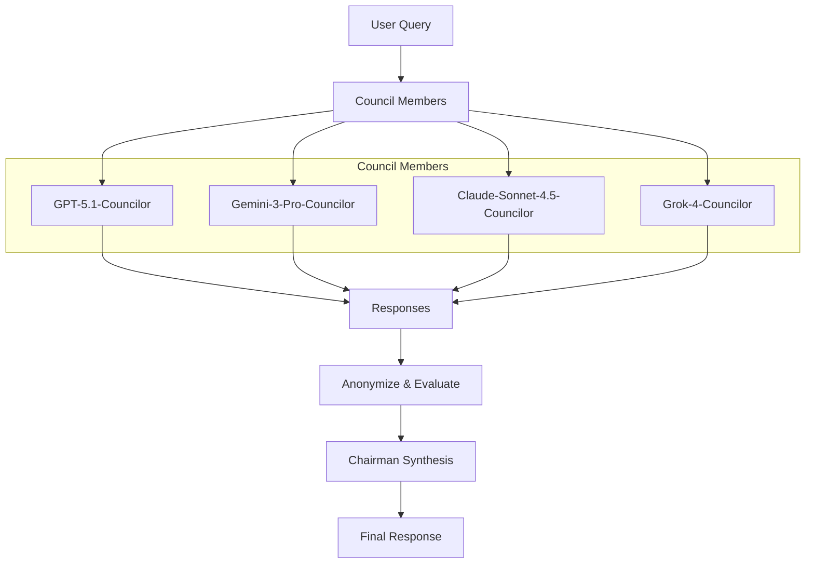

# LLM Council Class Documentation



The `LLMCouncil` class orchestrates multiple specialized LLM agents to collaboratively answer queries through a structured peer review and synthesis process. Inspired by Andrej Karpathy's llm-council implementation, this architecture demonstrates how different models evaluate and rank each other's work, often selecting responses from other models as superior to their own.

The class automatically tracks all agent messages in a `Conversation` object and formats output using `history_output_formatter`, providing flexible output formats including dictionaries, lists, strings, JSON, YAML, and more.

## Workflow Overview

The LLM Council follows a four-step process:

1. **Parallel Response Generation**: All council members independently respond to the user query
2. **Anonymization**: Responses are anonymized with random IDs (A, B, C, D, etc.) to ensure objective evaluation
3. **Peer Review**: Each member evaluates and ranks all responses (including potentially their own)
4. **Synthesis**: The Chairman agent synthesizes all responses and evaluations into a final comprehensive answer

## Class Definition

### LLMCouncil

```python
class LLMCouncil:
```

### Attributes

| Attribute | Type | Description | Default |
|-----------|------|-------------|---------|
| `council_members` | `List[Agent]` | List of Agent instances representing council members | `None` (creates default council) |
| `chairman` | `Agent` | The Chairman agent responsible for synthesizing responses | Created during initialization |
| `conversation` | `Conversation` | Conversation object tracking all messages throughout the workflow | Created during initialization |
| `output_type` | `HistoryOutputType` | Format for the output (e.g., "dict", "list", "string", "json", "yaml") | `"dict"` |
| `verbose` | `bool` | Whether to print progress and intermediate results | `True` |

## Methods

### `__init__`

Initializes the LLM Council with council members and a Chairman agent.

#### Parameters

| Parameter | Type | Default | Description |
|-----------|------|---------|-------------|
| `id` | `str` | `swarm_id()` | Unique identifier for the council instance. |
| `name` | `str` | `"LLM Council"` | Name of the council instance. |
| `description` | `str` | `"A collaborative council..."` | Description of the council's purpose. |
| `council_members` | `Optional[List[Agent]]` | `None` | List of Agent instances representing council members. If `None`, creates default council with GPT-5.1, Gemini 3 Pro, Claude Sonnet 4.5, and Grok-4. |
| `chairman_model` | `str` | `"gpt-5.1"` | Model name for the Chairman agent that synthesizes responses. |
| `verbose` | `bool` | `True` | Whether to print progress and intermediate results. |
| `output_type` | `HistoryOutputType` | `"dict"` | Format for the output. Options: "list", "dict", "string", "final", "json", "yaml", "xml", "dict-all-except-first", "str-all-except-first", "dict-final", "list-final". |

#### Returns

| Type | Description |
|------|-------------|
| `LLMCouncil` | Initialized LLM Council instance. |

#### Description

Creates an LLM Council instance with specialized council members. If no members are provided, it creates a default council consisting of:

- **GPT-5.1-Councilor**: Analytical and comprehensive responses
- **Gemini-3-Pro-Councilor**: Concise and well-processed responses  
- **Claude-Sonnet-4.5-Councilor**: Thoughtful and balanced responses
- **Grok-4-Councilor**: Creative and innovative responses

The Chairman agent is automatically created with a specialized prompt for synthesizing responses. A `Conversation` object is also initialized to track all messages throughout the workflow, including user queries, council member responses, evaluations, and the final synthesis.

#### Example Usage

```python
from swarms.structs.llm_council import LLMCouncil

# Create council with default members
council = LLMCouncil(verbose=True)

# Create council with custom members and output format
from swarms import Agent
custom_members = [
    Agent(agent_name="Expert-1", model_name="gpt-4", max_loops=1),
    Agent(agent_name="Expert-2", model_name="claude-3-opus", max_loops=1),
]
council = LLMCouncil(
    council_members=custom_members,
    chairman_model="gpt-4",
    verbose=True,
    output_type="json"  # Output as JSON string
)
```

---

### `run`

Executes the full LLM Council workflow: parallel responses, anonymization, peer review, and synthesis. All messages are tracked in the conversation object and formatted according to the `output_type` setting.

#### Parameters

| Parameter | Type | Default | Description |
|-----------|------|---------|-------------|
| `query` | `str` | Required | The user's query to process through the council. |

#### Returns

| Type | Description |
|------|-------------|
| `Union[List, Dict, str]` | Formatted output based on `output_type`. The output contains the conversation history with all messages tracked throughout the workflow. |

#### Output Format

The return value depends on the `output_type` parameter set during initialization:

- **`"dict"`** (default): Returns conversation as a dictionary/list of message dictionaries
- **`"list"`**: Returns conversation as a list of formatted strings (`"role: content"`)
- **`"string"`** or **`"str"`**: Returns conversation as a formatted string
- **`"final"`** or **`"last"`**: Returns only the content of the final message (Chairman's response)
- **`"json"`**: Returns conversation as a JSON string
- **`"yaml"`**: Returns conversation as a YAML string
- **`"xml"`**: Returns conversation as an XML string
- **`"dict-all-except-first"`**: Returns all messages except the first as a dictionary
- **`"str-all-except-first"`**: Returns all messages except the first as a string
- **`"dict-final"`**: Returns the final message as a dictionary
- **`"list-final"`**: Returns the final message as a list

#### Conversation Tracking

All messages are automatically tracked in the conversation object with the following roles:

- **`"User"`**: The original user query
- **`"{member_name}"`**: Each council member's response (e.g., "GPT-5.1-Councilor")
- **`"{member_name}-Evaluation"`**: Each council member's evaluation (e.g., "GPT-5.1-Councilor-Evaluation")
- **`"Chairman"`**: The final synthesized response

#### Description

Executes the complete LLM Council workflow:

1. **User Query Tracking**: Adds the user query to the conversation as "User" role
2. **Dispatch Phase**: Sends the query to all council members in parallel using `run_agents_concurrently`
3. **Collection Phase**: Collects all responses, maps them to member names, and adds each to the conversation with the member's name as the role
4. **Anonymization Phase**: Creates anonymous IDs (A, B, C, D, etc.) and shuffles them to ensure anonymity
5. **Evaluation Phase**: Each member evaluates and ranks all anonymized responses using `batched_grid_agent_execution`, then adds evaluations to the conversation with "{member_name}-Evaluation" as the role
6. **Synthesis Phase**: The Chairman agent synthesizes all responses and evaluations into a final comprehensive answer, which is added to the conversation as "Chairman" role
7. **Output Formatting**: Returns the conversation formatted according to the `output_type` setting using `history_output_formatter`

The method provides verbose output by default, showing progress at each stage. All messages are tracked in the `conversation` attribute for later access or export.

#### Example Usage

```python
from swarms.structs.llm_council import LLMCouncil

# Create council with default output format (dict)
council = LLMCouncil(verbose=True)

query = "What are the top five best energy stocks across nuclear, solar, gas, and other energy sources?"

# Run the council - returns formatted conversation based on output_type
result = council.run(query)

# With default "dict" output_type, result is a list of message dictionaries
# Access conversation messages
for message in result:
    print(f"{message['role']}: {message['content'][:200]}...")

# Access the conversation object directly for more control
conversation = council.conversation
print("\nFinal message:", conversation.get_final_message_content())

# Get conversation as string
print("\nFull conversation:")
print(conversation.get_str())

# Example with different output types
council_json = LLMCouncil(output_type="json", verbose=False)
result_json = council_json.run(query)  # Returns JSON string

council_final = LLMCouncil(output_type="final", verbose=False)
result_final = council_final.run(query)  # Returns only final response string
```

---

### `_create_default_council`

Creates default council members with specialized prompts and models.

#### Parameters

None (internal method).

#### Returns

| Type | Description |
|------|-------------|
| `List[Agent]` | List of Agent instances configured as council members. |

#### Description

Internal method that creates the default council configuration with four specialized agents:

- **GPT-5.1-Councilor** (`model_name="gpt-5.1"`): Analytical and comprehensive, temperature=0.7
- **Gemini-3-Pro-Councilor** (`model_name="gemini-2.5-flash"`): Concise and structured, temperature=0.7
- **Claude-Sonnet-4.5-Councilor** (`model_name="anthropic/claude-sonnet-4-5"`): Thoughtful and balanced, temperature=0.0
- **Grok-4-Councilor** (`model_name="x-ai/grok-4"`): Creative and innovative, temperature=0.8

Each agent is configured with:

- Specialized system prompts matching their role
- `max_loops=1` for single-response generation
- `verbose=False` to reduce noise during parallel execution
- Appropriate temperature settings for their style

---

## Helper Functions

### `get_gpt_councilor_prompt()`

Returns the system prompt for GPT-5.1 councilor agent.

#### Returns

| Type | Description |
|------|-------------|
| `str` | System prompt string emphasizing analytical thinking and comprehensive coverage. |

---

### `get_gemini_councilor_prompt()`

Returns the system prompt for Gemini 3 Pro councilor agent.

#### Returns

| Type | Description |
|------|-------------|
| `str` | System prompt string emphasizing concise, well-processed, and structured responses. |

---

### `get_claude_councilor_prompt()`

Returns the system prompt for Claude Sonnet 4.5 councilor agent.

#### Returns

| Type | Description |
|------|-------------|
| `str` | System prompt string emphasizing thoughtful, balanced, and nuanced responses. |

---

### `get_grok_councilor_prompt()`

Returns the system prompt for Grok-4 councilor agent.

#### Returns

| Type | Description |
|------|-------------|
| `str` | System prompt string emphasizing creative, innovative, and unique perspectives. |

---

### `get_chairman_prompt()`

Returns the system prompt for the Chairman agent.

#### Returns

| Type | Description |
|------|-------------|
| `str` | System prompt string for synthesizing responses and evaluations into a final answer. |

---

### `get_evaluation_prompt(query, responses, evaluator_name)`

Creates evaluation prompt for council members to review and rank responses.

#### Parameters

| Parameter | Type | Description |
|-----------|------|-------------|
| `query` | `str` | The original user query. |
| `responses` | `Dict[str, str]` | Dictionary mapping anonymous IDs to response texts. |
| `evaluator_name` | `str` | Name of the agent doing the evaluation. |

#### Returns

| Type | Description |
|------|-------------|
| `str` | Formatted evaluation prompt string with instructions for ranking responses. |

---

### `get_synthesis_prompt(query, original_responses, evaluations, id_to_member)`

Creates synthesis prompt for the Chairman.

#### Parameters

| Parameter | Type | Description |
|-----------|------|-------------|
| `query` | `str` | Original user query. |
| `original_responses` | `Dict[str, str]` | Dictionary mapping member names to their responses. |
| `evaluations` | `Dict[str, str]` | Dictionary mapping evaluator names to their evaluation texts. |
| `id_to_member` | `Dict[str, str]` | Mapping from anonymous IDs to member names. |

#### Returns

| Type | Description |
|------|-------------|
| `str` | Formatted synthesis prompt for the Chairman agent. |

---

## Use Cases

The LLM Council is ideal for scenarios requiring:

- **Multi-perspective Analysis**: When you need diverse viewpoints on complex topics
- **Quality Assurance**: When peer review and ranking can improve response quality
- **Transparent Decision Making**: When you want to see how different models evaluate each other
- **Synthesis of Expertise**: When combining multiple specialized perspectives is valuable

### Common Applications

- **Medical Diagnosis**: Multiple medical AI agents provide diagnoses, evaluate each other, and synthesize recommendations
- **Financial Analysis**: Different financial experts analyze investments and rank each other's assessments
- **Legal Analysis**: Multiple legal perspectives evaluate compliance and risk
- **Business Strategy**: Diverse strategic viewpoints are synthesized into comprehensive plans
- **Research Analysis**: Multiple research perspectives are combined for thorough analysis

## Examples

For comprehensive examples demonstrating various use cases, see the [LLM Council Examples](../../../examples/multi_agent/llm_council_examples/) directory:

- **Medical**: `medical_diagnosis_council.py`, `medical_treatment_council.py`
- **Finance**: `finance_analysis_council.py`, `etf_stock_analysis_council.py`
- **Business**: `business_strategy_council.py`, `marketing_strategy_council.py`
- **Technology**: `technology_assessment_council.py`, `research_analysis_council.py`
- **Legal**: `legal_analysis_council.py`

### Quick Start Example

```python
from swarms.structs.llm_council import LLMCouncil

# Create the council with default output format
council = LLMCouncil(verbose=True)

# Example query
query = "What are the top five best energy stocks across nuclear, solar, gas, and other energy sources?"

# Run the council - returns formatted conversation
result = council.run(query)

# With default "dict" output_type, result is a list of message dictionaries
# Print all messages
for message in result:
    role = message['role']
    content = message['content']
    print(f"\n{role}:")
    print(content[:500] + "..." if len(content) > 500 else content)

# Access conversation object directly for more options
conversation = council.conversation

# Get only the final response
print("\n" + "="*80)
print("FINAL RESPONSE")
print("="*80)
print(conversation.get_final_message_content())

# Get conversation as formatted string
print("\n" + "="*80)
print("FULL CONVERSATION")
print("="*80)
print(conversation.get_str())

# Export conversation to JSON
conversation.export()
```

## Customization

### Creating Custom Council Members

You can create custom council members with specialized roles:

```python
from swarms import Agent
from swarms.structs.llm_council import LLMCouncil, get_gpt_councilor_prompt

# Create custom councilor
custom_agent = Agent(
    agent_name="Domain-Expert-Councilor",
    agent_description="Specialized domain expert for specific analysis",
    system_prompt=get_gpt_councilor_prompt(),  # Or create custom prompt
    model_name="gpt-4",
    max_loops=1,
    verbose=False,
    temperature=0.7,
)

# Create council with custom members
council = LLMCouncil(
    council_members=[custom_agent, ...],  # Add your custom agents
    chairman_model="gpt-4",
    verbose=True
)
```

### Custom Chairman Model

You can specify a different model for the Chairman:

```python
council = LLMCouncil(
    chairman_model="claude-3-opus",  # Use Claude as Chairman
    verbose=True
)
```

### Custom Output Format

You can control the output format using the `output_type` parameter:

```python
# Get output as JSON string
council = LLMCouncil(output_type="json")
result = council.run(query)  # Returns JSON string

# Get only the final response
council = LLMCouncil(output_type="final")
result = council.run(query)  # Returns only final response string

# Get as YAML
council = LLMCouncil(output_type="yaml")
result = council.run(query)  # Returns YAML string

# Get as formatted string
council = LLMCouncil(output_type="string")
result = council.run(query)  # Returns formatted conversation string
```

### Accessing Conversation History

The conversation object is accessible for advanced usage:

```python
council = LLMCouncil()
council.run(query)

# Access conversation directly
conversation = council.conversation

# Get conversation history
history = conversation.conversation_history

# Export to file
conversation.export()  # Saves to default location

# Get specific format
json_output = conversation.to_json()
yaml_output = conversation.return_messages_as_dictionary()
```

## Architecture Benefits

1. **Diversity**: Multiple models provide varied perspectives and approaches
2. **Quality Control**: Peer review ensures responses are evaluated objectively
3. **Synthesis**: Chairman combines the best elements from all responses
4. **Transparency**: Full visibility into individual responses and evaluation rankings
5. **Scalability**: Easy to add or remove council members
6. **Flexibility**: Supports custom agents and models
7. **Conversation Tracking**: All messages are automatically tracked in a Conversation object for history and export
8. **Flexible Output**: Multiple output formats supported via `history_output_formatter` (dict, list, string, JSON, YAML, XML, etc.)

## Performance Considerations

- **Parallel Execution**: Both response generation and evaluation phases run in parallel for efficiency
- **Anonymization**: Responses are anonymized to prevent bias in evaluation
- **Model Selection**: Different models can be used for different roles based on their strengths
- **Verbose Mode**: Can be disabled for production use to reduce output
- **Conversation Management**: Conversation object efficiently tracks all messages in memory and supports export to JSON/YAML files
- **Output Formatting**: Choose lightweight output formats (e.g., "final") for production to reduce memory usage

## Related Documentation

- [Multi-Agent Architectures Overview](overview.md)
- [Council of Judges](council_of_judges.md) - Similar peer review pattern
- [Agent Class Reference](agent.md) - Understanding individual agents
- [Conversation Class Reference](conversation.md) - Understanding conversation tracking and management
- [Multi-Agent Execution Utilities](various_execution_methods.md) - Underlying execution methods
- [History Output Formatter](../../../swarms/utils/history_output_formatter.py) - Output formatting utilities
