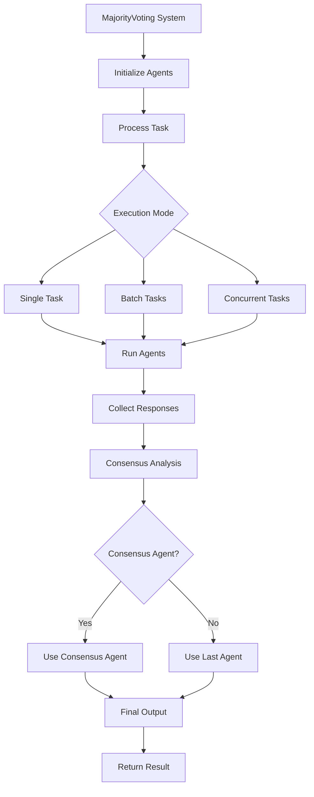

# MajorityVoting Module Documentation

The `MajorityVoting` module provides a mechanism for performing majority voting among a group of agents. Majority voting is a decision rule that selects the option which has the majority of votes. This is particularly useful in systems where multiple agents provide responses to a query, and the most common response needs to be identified as the final output.

## Architecture



### Key Concepts

- **Majority Voting**: A method to determine the most common response from a set of answers.
- **Agents**: Entities (e.g., models, algorithms) that provide responses to tasks or queries.
- **Consensus Agent**: An optional agent that analyzes the responses from all agents to determine the final consensus.
- **Conversation History**: A record of all agent interactions and responses during the voting process.
- **Output Types**: Support for different output formats (string, dictionary, list).

## Class Definition: `MajorityVoting`

```python
class MajorityVoting:
    def __init__(
        self,
        id: str = swarm_id(),
        name: str = "MajorityVoting",
        description: str = "A majority voting system for agents",
        agents: List[Agent] = None,
        consensus_agent: Optional[Agent] = None,
        autosave: bool = False,
        verbose: bool = False,
        max_loops: int = 1,
        output_type: OutputType = "dict",
        *args,
        **kwargs,
    ):
```

### Constructor Parameters

| Parameter         | Type              | Default       | Description                                                                 |
|------------------|-------------------|---------------|-----------------------------------------------------------------------------|
| `id`             | `str`             | `swarm_id()`  | Unique identifier for the majority voting system.                           |
| `name`           | `str`             | `"MajorityVoting"` | Name of the majority voting system.                                       |
| `description`    | `str`             | `"A majority voting system for agents"` | Description of the system.                    |
| `agents`         | `List[Agent]`     | `None`        | A list of agents to be used in the majority voting system. Required.       |
| `consensus_agent`| `Optional[Agent]` | `None`        | Optional agent for analyzing consensus among responses. If None, uses last agent. |
| `autosave`       | `bool`            | `False`       | Whether to autosave conversations.                                         |
| `verbose`        | `bool`            | `False`       | Whether to enable verbose logging.                                         |
| `max_loops`      | `int`             | `1`           | Maximum number of voting loops.                                            |
| `output_type`    | `OutputType`      | `"dict"`      | Output format: "str", "dict", "list", or other.                            |
| `*args`          | `Any`             | -             | Variable length argument list passed to Conversation.                      |
| `**kwargs`       | `Any`             | -             | Arbitrary keyword arguments passed to Conversation.                        |

### Methods

#### `run(task: str, *args, **kwargs) -> Any`

Runs the majority voting system for a single task and returns the consensus result.

**Parameters:**

- `task` (`str`): The task to be performed by the agents
- `*args`: Variable length argument list passed to agents
- `**kwargs`: Arbitrary keyword arguments passed to agents

**Returns:**

- `Any`: The consensus result in the specified output format (string, dict, or list)

**Raises:**

- `ValueError`: If agents list is empty

#### `batch_run(tasks: List[str], *args, **kwargs) -> List[Any]`

Runs the majority voting system for multiple tasks in sequence.

**Parameters:**

- `tasks` (`List[str]`): List of tasks to be performed by the agents
- `*args`: Variable length argument list passed to each run
- `**kwargs`: Arbitrary keyword arguments passed to each run

**Returns:**

- `List[Any]`: List of consensus results for each task

#### `run_concurrently(tasks: List[str], *args, **kwargs) -> List[Any]`

Runs the majority voting system for multiple tasks concurrently using thread pooling.

**Parameters:**

- `tasks` (`List[str]`): List of tasks to be performed by the agents
- `*args`: Variable length argument list passed to each run
- `**kwargs`: Arbitrary keyword arguments passed to each run

**Returns:**

- `List[Any]`: List of consensus results for each task, in completion order

**Note:** Uses `os.cpu_count()` workers for optimal performance.

## Usage Examples

### Example 1: Investment Analysis with Consensus Agent

This example demonstrates using MajorityVoting for financial analysis with specialized agents and a dedicated consensus agent.

```python
from swarms import Agent, MajorityVoting

# Initialize multiple specialized agents
agents = [
    Agent(
        agent_name="Market-Analysis-Agent",
        agent_description="Market trend analyst",
        system_prompt="You are a market analyst specializing in identifying growth opportunities and market trends.",
        max_loops=1,
        model_name="gpt-4o"
    ),
    Agent(
        agent_name="Risk-Assessment-Agent",
        agent_description="Risk analysis expert",
        system_prompt="You are a risk assessment expert focused on evaluating investment risks and volatility.",
        max_loops=1,
        model_name="gpt-4o"
    ),
    Agent(
        agent_name="Portfolio-Strategy-Agent",
        agent_description="Portfolio optimization specialist",
        system_prompt="You are a portfolio strategist focused on diversification and long-term growth strategies.",
        max_loops=1,
        model_name="gpt-4o"
    )
]

# Dedicated consensus agent for final analysis
consensus_agent = Agent(
    agent_name="Investment-Consensus-Agent",
    agent_description="Investment consensus analyzer",
    system_prompt="You are an expert at synthesizing investment advice from multiple perspectives into a coherent recommendation.",
    max_loops=1,
    model_name="gpt-4o"
)

# Create majority voting system
investment_system = MajorityVoting(
    name="Investment-Analysis-System",
    description="Multi-agent investment analysis with consensus evaluation",
    agents=agents,
    consensus_agent=consensus_agent,
    verbose=True,
    output_type="dict"
)

# Execute investment analysis
result = investment_system.run(
    task="""Analyze the following investment scenario and provide recommendations:
    - Budget: $50,000
    - Risk tolerance: Moderate
    - Time horizon: 5-7 years
    - Focus areas: Technology, Healthcare, Renewable Energy
    Provide specific ETF/index fund recommendations with allocation percentages."""
)

print("Investment Analysis Results:")
print(result)
```

### Example 2: Content Creation with Batch Processing

This example shows how to use batch processing for content creation tasks with multiple writing styles.

```python
from swarms import Agent, MajorityVoting

# Initialize content creation agents with different styles
content_agents = [
    Agent(
        agent_name="Creative-Writer",
        agent_description="Creative content specialist",
        system_prompt="You are a creative writer who produces engaging, story-driven content with vivid descriptions.",
        max_loops=1,
        model_name="gpt-4o"
    ),
    Agent(
        agent_name="Technical-Writer",
        agent_description="Technical content specialist",
        system_prompt="You are a technical writer who focuses on clarity, accuracy, and structured information.",
        max_loops=1,
        model_name="gpt-4o"
    ),
    Agent(
        agent_name="SEO-Optimized-Writer",
        agent_description="SEO content specialist",
        system_prompt="You are an SEO specialist who creates content optimized for search engines while maintaining quality.",
        max_loops=1,
        model_name="gpt-4o"
    ),
    Agent(
        agent_name="Conversational-Writer",
        agent_description="Conversational content specialist",
        system_prompt="You are a conversational writer who creates relatable, engaging content that connects with readers.",
        max_loops=1,
        model_name="gpt-4o"
    )
]

# Create majority voting system without dedicated consensus agent
content_system = MajorityVoting(
    name="Content-Creation-System",
    description="Multi-style content creation with majority voting",
    agents=content_agents,
    verbose=True,
    output_type="str"
)

# Define multiple content tasks
content_tasks = [
    "Write a blog post about the benefits of renewable energy adoption",
    "Create social media content for a new fitness app launch",
    "Develop a product description for eco-friendly water bottles",
    "Write an email newsletter about artificial intelligence trends"
]

# Execute batch processing
batch_results = content_system.batch_run(content_tasks)

print("Batch Content Creation Results:")
for i, result in enumerate(batch_results, 1):
    print(f"\nTask {i} Result:")
    print(result[:500] + "..." if len(str(result)) > 500 else result)
```

### Example 3: Research Analysis with Concurrent Processing

This example demonstrates concurrent processing for research analysis with multiple research perspectives.

```python
from swarms import Agent, MajorityVoting

# Initialize research agents with different methodologies
research_agents = [
    Agent(
        agent_name="Quantitative-Researcher",
        agent_description="Quantitative research specialist",
        system_prompt="You are a quantitative researcher who analyzes data, statistics, and numerical evidence.",
        max_loops=1,
        model_name="gpt-4o"
    ),
    Agent(
        agent_name="Qualitative-Researcher",
        agent_description="Qualitative research specialist",
        system_prompt="You are a qualitative researcher who focuses on patterns, themes, and contextual understanding.",
        max_loops=1,
        model_name="gpt-4o"
    ),
    Agent(
        agent_name="Literature-Review-Specialist",
        agent_description="Literature review expert",
        system_prompt="You are a literature review specialist who synthesizes existing research and identifies knowledge gaps.",
        max_loops=1,
        model_name="gpt-4o"
    ),
    Agent(
        agent_name="Methodology-Expert",
        agent_description="Research methodology specialist",
        system_prompt="You are a methodology expert who evaluates research design, validity, and reliability.",
        max_loops=1,
        model_name="gpt-4o"
    ),
    Agent(
        agent_name="Ethics-Reviewer",
        agent_description="Research ethics specialist",
        system_prompt="You are an ethics reviewer who ensures research practices are responsible and unbiased.",
        max_loops=1,
        model_name="gpt-4o"
    )
]

# Consensus agent for synthesizing research findings
research_consensus = Agent(
    agent_name="Research-Synthesis-Agent",
    agent_description="Research synthesis specialist",
    system_prompt="You are an expert at synthesizing diverse research perspectives into comprehensive, well-supported conclusions.",
    max_loops=1,
    model_name="gpt-4o"
)

# Create majority voting system for research
research_system = MajorityVoting(
    name="Research-Analysis-System",
    description="Concurrent multi-perspective research analysis",
    agents=research_agents,
    consensus_agent=research_consensus,
    verbose=True,
    output_type="list"
)

# Define research questions for concurrent analysis
research_questions = [
    "What are the environmental impacts of electric vehicle adoption?",
    "How does remote work affect employee productivity and well-being?",
    "What are the economic implications of universal basic income?",
    "How can AI be used to improve healthcare outcomes?",
    "What are the social effects of social media on mental health?"
]

# Execute concurrent research analysis
concurrent_results = research_system.run_concurrently(research_questions)

print("Concurrent Research Analysis Results:")
print(f"Total questions analyzed: {len(concurrent_results)}")
for i, result in enumerate(concurrent_results, 1):
    print(f"\nResearch Question {i}:")
    if isinstance(result, list) and len(result) > 0:
        print(f"Analysis length: {len(str(result))} characters")
        print(f"Sample output: {str(result)[:300]}...")
    else:
        print(f"Result: {result}")

```

