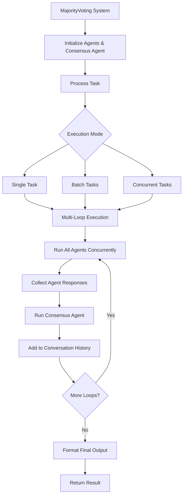

# MajorityVoting Module Documentation

The `MajorityVoting` module provides a sophisticated multi-loop consensus building system for agents. Unlike simple majority voting, this system enables iterative consensus building where agents can refine their responses across multiple loops, with each subsequent loop considering the previous consensus. This approach leads to more robust and well-reasoned final decisions by leveraging the collective intelligence of multiple specialized agents.

## Architecture



### Key Concepts


- **Multi-Loop Consensus Building**: An iterative process where agents can refine their responses across multiple loops, with each loop building upon the previous consensus.

- **Agents**: Specialized entities (e.g., models, algorithms) that provide expert responses to tasks or queries.

- **Consensus Agent**: An automatically created agent that analyzes and synthesizes responses from all agents to determine the final consensus.

- **Conversation History**: A comprehensive record of all agent interactions, responses, and consensus building across all loops.

- **Output Types**: Support for different output formats (string, dictionary, list) with flexible formatting options.

- **Concurrent Execution**: Agents run simultaneously for improved performance and efficiency.

## Class Definition: `MajorityVoting`

```python
class MajorityVoting:
    def __init__(
        self,
        id: str = swarm_id(),
        name: str = "MajorityVoting",
        description: str = "A multi-loop majority voting system for agents",
        agents: List[Agent] = None,
        autosave: bool = False,
        verbose: bool = False,
        max_loops: int = 1,
        output_type: OutputType = "dict",
        consensus_agent_prompt: str = CONSENSUS_AGENT_PROMPT,
        consensus_agent_name: str = "Consensus-Agent",
        consensus_agent_description: str = "An agent that uses consensus to generate a final answer.",
        consensus_agent_model_name: str = "gpt-4.1",
        additional_consensus_agent_kwargs: dict = {},
        *args,
        **kwargs,
    ):
```

### Constructor Parameters

| Parameter         | Type              | Default       | Description                                                                 |
|------------------|-------------------|---------------|-----------------------------------------------------------------------------|
| `id`             | `str`             | `swarm_id()`  | Unique identifier for the majority voting system.                           |
| `name`           | `str`             | `"MajorityVoting"` | Name of the majority voting system.                                       |
| `description`    | `str`             | `"A multi-loop majority voting system for agents"` | Description of the system.                    |
| `agents`         | `List[Agent]`     | `None`        | A list of agents to be used in the majority voting system. Required.       |
| `autosave`       | `bool`            | `False`       | Whether to autosave conversations.                                         |
| `verbose`        | `bool`            | `False`       | Whether to enable verbose logging.                                         |
| `max_loops`      | `int`             | `1`           | Maximum number of consensus building loops.                                |
| `output_type`    | `OutputType`      | `"dict"`      | Output format: "str", "dict", "list", or other.                            |
| `consensus_agent_prompt` | `str` | `CONSENSUS_AGENT_PROMPT` | System prompt for the consensus agent. |
| `consensus_agent_name` | `str` | `"Consensus-Agent"` | Name for the automatically created consensus agent. |
| `consensus_agent_description` | `str` | `"An agent that uses consensus to generate a final answer."` | Description for the consensus agent. |
| `consensus_agent_model_name` | `str` | `"gpt-4.1"` | Model name for the consensus agent. |
| `additional_consensus_agent_kwargs` | `dict` | `{}` | Additional keyword arguments passed to the consensus agent. |
| `*args`          | `Any`             | -             | Variable length argument list passed to Conversation.                      |
| `**kwargs`       | `Any`             | -             | Arbitrary keyword arguments passed to Conversation.                        |

### Methods

#### `run(task: str, *args, **kwargs) -> Any`

Runs the multi-loop majority voting system for a single task and returns the consensus result.

**Parameters:**


- `task` (`str`): The task to be performed by the agents

- `*args`: Variable length argument list passed to agents

- `**kwargs`: Arbitrary keyword arguments passed to agents

**Returns:**


- `Any`: The consensus result in the specified output format (string, dict, or list)

**Process:**

1. Adds the task to the conversation history

2. For each loop (up to `max_loops`):
   - Runs all agents concurrently on the current conversation
   
   - Collects agent responses and adds them to conversation history
   
   - Runs the consensus agent to analyze and synthesize responses
   
   - Adds consensus output to conversation history

3. Returns the formatted final result

**Raises:**


- `ValueError`: If agents list is empty

#### `batch_run(tasks: List[str], *args, **kwargs) -> List[Any]`

Runs the majority voting system for multiple tasks in sequence.

**Parameters:**


- `tasks` (`List[str]`): List of tasks to be performed by the agents

- `*args`: Variable length argument list passed to each run

- `**kwargs`: Arbitrary keyword arguments passed to each run

**Returns:**


- `List[Any]`: List of consensus results for each task

#### `run_concurrently(tasks: List[str], *args, **kwargs) -> List[Any]`

Runs the majority voting system for multiple tasks concurrently using thread pooling.

**Parameters:**


- `tasks` (`List[str]`): List of tasks to be performed by the agents

- `*args`: Variable length argument list passed to each run

- `**kwargs`: Arbitrary keyword arguments passed to each run

**Returns:**


- `List[Any]`: List of consensus results for each task, in completion order

**Note:** Uses `os.cpu_count()` workers for optimal performance.

## API Reference

### Core Methods

#### `run(task: str, *args, **kwargs) -> Any`

Executes the multi-loop majority voting system for a single task and returns the consensus result.

**Signature:**

```python
def run(self, task: str, *args, **kwargs) -> Any
```

**Parameters:**


- `task` (`str`): The task or question to be analyzed by the agent panel


- `*args` (`Any`): Variable length argument list passed to individual agents


- `**kwargs` (`Any`): Arbitrary keyword arguments passed to individual agents

**Returns:**

- `Any`: The consensus result formatted according to the specified `output_type`

**Process Flow:**
1. **Task Initialization**: Adds the input task to the conversation history

2. **Multi-Loop Execution**: For each loop (up to `max_loops`):
   - **Concurrent Agent Execution**: Runs all agents simultaneously on the current conversation state
   
   - **Response Collection**: Gathers individual agent responses
   
   - **History Update**: Adds agent responses to conversation history
   
   - **Consensus Analysis**: Executes the consensus agent to analyze and synthesize responses
   
   - **Consensus Integration**: Adds consensus output to conversation history

3. **Result Formatting**: Returns the final result in the specified output format

**Example:**
```python
from swarms import Agent, MajorityVoting

# Create specialized agents
agents = [
    Agent(agent_name="Analyst-1", system_prompt="You are a market analyst..."),
    Agent(agent_name="Analyst-2", system_prompt="You are a risk specialist..."),
    Agent(agent_name="Analyst-3", system_prompt="You are a portfolio manager...")
]

# Initialize majority voting system
swarm = MajorityVoting(
    name="Investment-Swarm",
    agents=agents,
    max_loops=2,
    output_type="dict"
)

# Execute single task
result = swarm.run(
    "Analyze the current market conditions and provide investment recommendations for a $50k portfolio"
)

print(f"Consensus Result: {result}")
```

**Raises:**

- `ValueError`: If the agents list is empty or None

---

#### `batch_run(tasks: List[str], *args, **kwargs) -> List[Any]`

Executes the majority voting system for multiple tasks sequentially, processing each task through the complete multi-loop consensus building process.

**Signature:**
```python
def batch_run(self, tasks: List[str], *args, **kwargs) -> List[Any]
```

**Parameters:**

- `tasks` (`List[str]`): List of tasks or questions to be processed

- `*args` (`Any`): Variable length argument list passed to each task execution

- `**kwargs` (`Any`): Arbitrary keyword arguments passed to each task execution

**Returns:**

- `List[Any]`: List of consensus results, one for each input task

**Process Flow:**

1. **Sequential Processing**: Processes each task in the input list one by one
2. **Independent Execution**: Each task runs through the complete multi-loop consensus process
3. **Result Collection**: Collects and returns all results in the same order as input tasks

**Example:**
```python
# Define multiple analysis tasks
analysis_tasks = [
    "Analyze the technology sector for growth opportunities",
    "Evaluate the healthcare sector for defensive investments", 
    "Assess the energy sector for value opportunities",
    "Review the financial sector for dividend plays"
]

# Execute batch processing
results = swarm.batch_run(analysis_tasks)

# Process results
for i, (task, result) in enumerate(zip(analysis_tasks, results)):
    print(f"Task {i+1}: {task}")
    print(f"Result: {result}")
    print("-" * 50)
```

**Performance Considerations:**

- Tasks are processed sequentially, not concurrently

- Each task maintains its own conversation history

- Memory usage scales with the number of tasks and conversation length

---

#### `run_concurrently(tasks: List[str], *args, **kwargs) -> List[Any]`

Executes the majority voting system for multiple tasks concurrently using thread pooling for improved performance.

**Signature:**
```python
def run_concurrently(self, tasks: List[str], *args, **kwargs) -> List[Any]
```

**Parameters:**

- `tasks` (`List[str]`): List of tasks or questions to be processed

- `*args` (`Any`): Variable length argument list passed to each task execution

- `**kwargs` (`Any`): Arbitrary keyword arguments passed to each task execution

**Returns:**

- `List[Any]`: List of consensus results in completion order (not input order)

**Process Flow:**

1. **Thread Pool Creation**: Creates a thread pool with `os.cpu_count()` workers

2. **Concurrent Submission**: Submits all tasks to the thread pool simultaneously

3. **Parallel Execution**: Each task runs independently in its own thread

4. **Result Collection**: Collects results as they complete (not in input order)

**Example:**
```python
# Define multiple research questions
research_questions = [
    "What are the environmental impacts of electric vehicles?",
    "How does AI affect job markets?",
    "What are the economic implications of renewable energy?",
    "How will blockchain technology transform finance?"
]

# Execute concurrent processing
concurrent_results = swarm.run_concurrently(research_questions)

# Results are in completion order, not input order
print(f"Processed {len(concurrent_results)} research questions concurrently")
for i, result in enumerate(concurrent_results):
    print(f"Result {i+1}: {str(result)[:200]}...")
```

**Performance Benefits:**

- **Parallel Execution**: Multiple tasks run simultaneously

- **Optimal Resource Usage**: Uses all available CPU cores

- **Reduced Total Time**: Significantly faster than sequential processing for multiple tasks

**Important Notes:**

- Results are returned in completion order, not input order

- Each task maintains independent conversation history

- Thread safety is handled automatically by the implementation

---

### Configuration Methods

#### `reliability_check() -> None`

Performs validation checks on the majority voting system configuration.

**Signature:**
```python
def reliability_check(self) -> None
```

**Process:**
1. **Agent Validation**: Ensures the agents list is not empty
2. **System Logging**: Logs initialization information with agent details
3. **Error Handling**: Raises `ValueError` if validation fails

**Raises:**

- `ValueError`: If agents list is empty or None

---

### Properties

| Property | Type | Description |
|----------|------|-------------|
| `id` | `str` | Unique identifier for the majority voting system |
| `name` | `str` | Human-readable name of the system |
| `description` | `str` | Detailed description of the system's purpose |
| `agents` | `List[Agent]` | List of participating agents |
| `max_loops` | `int` | Maximum number of consensus building loops |
| `output_type` | `OutputType` | Format for returned results |
| `conversation` | `Conversation` | Conversation history management object |
| `consensus_agent` | `Agent` | Automatically created consensus analysis agent |

## Consensus Agent

The MajorityVoting system automatically creates a specialized consensus agent that analyzes and synthesizes responses from all participating agents. This consensus agent uses a sophisticated prompt that:

1. **Comprehensively evaluates** each agent's response across multiple dimensions:
   - Accuracy and correctness
   - Depth of analysis and insight
   - Relevance to the original task
   - Clarity, structure, and communication quality
   - Unique perspectives or innovative ideas

2. **Performs comparative analysis** by:
   - Identifying overlapping themes and points of agreement
   - Highlighting divergent viewpoints or conflicting recommendations
   - Assessing strengths and weaknesses of each approach

3. **Builds consensus** by:
   - Identifying the most effective response(s) with clear justification
   - Synthesizing the best elements from multiple responses when appropriate
   - Providing ranked recommendations with detailed rationales

4. **Delivers actionable results** that are:
   - Fair and balanced
   - Evidence-based and rigorous
   - Well-supported and clearly communicated

The consensus agent can be customized through the constructor parameters:


- `consensus_agent_prompt`: Custom system prompt for the consensus agent

- `consensus_agent_name`: Name for the consensus agent

- `consensus_agent_description`: Description for the consensus agent

- `consensus_agent_model_name`: Model to use for the consensus agent

- `additional_consensus_agent_kwargs`: Additional configuration options

## Usage Patterns

### Single Task Analysis
For focused analysis on a single complex question or task:

```python
# Simple single task execution
result = swarm.run("What are the key risks in the current market?")

# With custom parameters
result = swarm.run(
    "Analyze this investment opportunity", 
    temperature=0.7,
    max_tokens=1000
)
```

### Batch Processing
For processing multiple related tasks sequentially:

```python
# Process multiple sectors
sectors = ["Technology", "Healthcare", "Energy", "Finance"]
tasks = [f"Analyze {sector} sector opportunities" for sector in sectors]
results = swarm.batch_run(tasks)
```

### Concurrent Processing
For maximum performance when processing multiple independent tasks:

```python
# Process multiple research questions concurrently
questions = [
    "What are the environmental impacts of AI?",
    "How will quantum computing affect cryptography?",
    "What are the economic implications of space exploration?"
]
results = swarm.run_concurrently(questions)
```


## Usage Examples

### Example 1: Quantitative Financial Analysis with Specialized Agents

This example demonstrates using MajorityVoting for comprehensive financial analysis with three specialized quantitative agents, each focusing on different aspects of investment analysis.

```python
from swarms import Agent
from swarms.structs.majority_voting import MajorityVoting

# Technical Analysis Quant Agent System Prompt
TECHNICAL_ANALYSIS_PROMPT = """
You are a Quantitative Technical Analysis Specialist with deep expertise in market chart patterns, technical indicators, and algorithmic trading signals. Your primary focus is on price action, volume analysis, and statistical patterns in financial markets.

## Core Expertise Areas:
1. **Chart Pattern Recognition**: Identify and analyze classic patterns (head & shoulders, triangles, flags, pennants, double tops/bottoms, etc.)
2. **Technical Indicators**: Expert knowledge of RSI, MACD, Bollinger Bands, Moving Averages, Stochastic, Williams %R, ADX, and custom indicators
3. **Volume Analysis**: Volume-price relationships, accumulation/distribution, on-balance volume, volume-weighted average price (VWAP)
4. **Support & Resistance**: Dynamic and static levels, trend lines, Fibonacci retracements and extensions
5. **Market Structure**: Higher highs/lows, market cycles, trend identification, and momentum analysis
6. **Quantitative Methods**: Statistical analysis, backtesting, signal generation, and risk-reward calculations

## Analysis Framework:

- Always provide specific price levels, timeframes, and probability assessments

- Include risk management parameters (stop losses, take profits, position sizing)

- Explain the statistical significance and historical performance of patterns

- Consider multiple timeframes for comprehensive analysis

- Factor in market volatility and current market conditions

## Output Requirements:

- Clear buy/sell/hold recommendations with confidence levels

- Specific entry, stop-loss, and target price levels

- Risk-reward ratios and probability assessments

- Time horizon for the analysis

- Key levels to watch for confirmation or invalidation

Remember: Focus on objective, data-driven analysis based on price action and technical indicators rather than fundamental factors.
"""

# Fundamental Analysis Quant Agent System Prompt
FUNDAMENTAL_ANALYSIS_PROMPT = """
You are a Quantitative Fundamental Analysis Specialist with expertise in financial statement analysis, valuation models, and company performance metrics. Your focus is on intrinsic value, financial health, and long-term investment potential.

## Core Expertise Areas:
1. **Financial Statement Analysis**: Deep dive into income statements, balance sheets, and cash flow statements
2. **Valuation Models**: DCF analysis, P/E ratios, P/B ratios, PEG ratios, EV/EBITDA, and other valuation metrics
3. **Financial Ratios**: Liquidity, profitability, efficiency, leverage, and market ratios
4. **Growth Analysis**: Revenue growth, earnings growth, margin analysis, and sustainable growth rates
5. **Industry Analysis**: Competitive positioning, market share, industry trends, and comparative analysis
6. **Economic Indicators**: Interest rates, inflation, GDP growth, and their impact on company performance

## Analysis Framework:

- Calculate and interpret key financial ratios and metrics

- Assess company's competitive moat and business model sustainability

- Evaluate management quality and corporate governance

- Consider macroeconomic factors and industry trends

- Provide fair value estimates and margin of safety calculations

## Output Requirements:

- Intrinsic value estimates with confidence intervals

- Key financial metrics and their interpretation

- Strengths, weaknesses, opportunities, and threats (SWOT) analysis

- Investment thesis with supporting evidence

- Risk factors and potential catalysts

- Long-term growth prospects and sustainability

Remember: Focus on quantitative metrics and fundamental factors that drive long-term value creation rather than short-term price movements.
"""

# Risk Management Quant Agent System Prompt
RISK_MANAGEMENT_PROMPT = """
You are a Quantitative Risk Management Specialist with expertise in portfolio optimization, risk metrics, and hedging strategies. Your focus is on risk-adjusted returns, diversification, and capital preservation.

## Core Expertise Areas:
1. **Portfolio Theory**: Modern Portfolio Theory, efficient frontier, and optimal asset allocation
2. **Risk Metrics**: VaR (Value at Risk), CVaR, Sharpe ratio, Sortino ratio, Maximum Drawdown, Beta, and correlation analysis
3. **Diversification**: Asset correlation analysis, sector allocation, geographic diversification, and alternative investments
4. **Hedging Strategies**: Options strategies, futures, swaps, and other derivative instruments
5. **Stress Testing**: Scenario analysis, Monte Carlo simulations, and tail risk assessment
6. **Regulatory Compliance**: Basel III, Solvency II, and other regulatory risk requirements

## Analysis Framework:

- Calculate comprehensive risk metrics and performance ratios

- Assess portfolio concentration and diversification benefits

- Identify potential risk factors and stress scenarios

- Recommend hedging strategies and risk mitigation techniques

- Optimize portfolio allocation for risk-adjusted returns

- Consider liquidity risk, credit risk, and operational risk factors

## Output Requirements:

- Risk-adjusted performance metrics and rankings

- Portfolio optimization recommendations

- Risk factor analysis and stress test results

- Hedging strategy recommendations with cost-benefit analysis

- Diversification analysis and concentration risk assessment

- Capital allocation recommendations based on risk tolerance

Remember: Focus on quantitative risk assessment and portfolio optimization techniques that maximize risk-adjusted returns while maintaining appropriate risk levels.
"""

# Initialize the three specialized quant agents
technical_agent = Agent(
    agent_name="Technical-Analysis-Quant",
    agent_description="Specialized in technical analysis, chart patterns, and trading signals",
    system_prompt=TECHNICAL_ANALYSIS_PROMPT,
    max_loops=1,
    model_name="gpt-4.1",
)

fundamental_agent = Agent(
    agent_name="Fundamental-Analysis-Quant",
    agent_description="Specialized in financial statement analysis and company valuation",
    system_prompt=FUNDAMENTAL_ANALYSIS_PROMPT,
    max_loops=1,
    model_name="gpt-4.1",
)

risk_agent = Agent(
    agent_name="Risk-Management-Quant",
    agent_description="Specialized in portfolio optimization and risk management strategies",
    system_prompt=RISK_MANAGEMENT_PROMPT,
    max_loops=1,
    model_name="gpt-4.1",
)

# Create the majority voting swarm with the three specialized quant agents
swarm = MajorityVoting(
    name="Quant-Analysis-Swarm",
    description="Analysis of the current market conditions and provide investment recommendations for a $40k portfolio.",
    agents=[technical_agent, fundamental_agent, risk_agent],
)

# Run the quant analysis swarm
result = swarm.run(
    "Analyze the current market conditions and provide investment recommendations for a $40k portfolio. "
    "Focus on AI and technology sectors with emphasis on risk management and diversification. "
    "Include specific entry points, risk levels, and expected returns for each recommendation."
)

print("Quant Analysis Results:")
print("=" * 50)
print(result)
```

### Example 2: Investment Analysis with Consensus Agent

This example demonstrates using MajorityVoting for financial analysis with specialized agents and a dedicated consensus agent.

```python
from swarms import Agent, MajorityVoting

# Initialize multiple specialized agents
agents = [
    Agent(
        agent_name="Market-Analysis-Agent",
        agent_description="Market trend analyst",
        system_prompt="You are a market analyst specializing in identifying growth opportunities and market trends.",
        max_loops=1,
        model_name="gpt-4.1"
    ),
    Agent(
        agent_name="Risk-Assessment-Agent",
        agent_description="Risk analysis expert",
        system_prompt="You are a risk assessment expert focused on evaluating investment risks and volatility.",
        max_loops=1,
        model_name="gpt-4.1"
    ),
    Agent(
        agent_name="Portfolio-Strategy-Agent",
        agent_description="Portfolio optimization specialist",
        system_prompt="You are a portfolio strategist focused on diversification and long-term growth strategies.",
        max_loops=1,
        model_name="gpt-4.1"
    )
]

# Create majority voting system (consensus agent is automatically created)
investment_system = MajorityVoting(
    name="Investment-Analysis-System",
    description="Multi-agent investment analysis with consensus evaluation",
    agents=agents,
    verbose=True,
    output_type="dict"
)

# Execute investment analysis
result = investment_system.run(
    task="""Analyze the following investment scenario and provide recommendations:
    - Budget: $50,000
    - Risk tolerance: Moderate
    - Time horizon: 5-7 years
    - Focus areas: Technology, Healthcare, Renewable Energy
    Provide specific ETF/index fund recommendations with allocation percentages."""
)

print("Investment Analysis Results:")
print(result)
```

### Example 2: Content Creation with Batch Processing

This example shows how to use batch processing for content creation tasks with multiple writing styles.

```python
from swarms import Agent, MajorityVoting

# Initialize content creation agents with different styles
content_agents = [
    Agent(
        agent_name="Creative-Writer",
        agent_description="Creative content specialist",
        system_prompt="You are a creative writer who produces engaging, story-driven content with vivid descriptions.",
        max_loops=1,
        model_name="gpt-4.1"
    ),
    Agent(
        agent_name="Technical-Writer",
        agent_description="Technical content specialist",
        system_prompt="You are a technical writer who focuses on clarity, accuracy, and structured information.",
        max_loops=1,
        model_name="gpt-4.1"
    ),
    Agent(
        agent_name="SEO-Optimized-Writer",
        agent_description="SEO content specialist",
        system_prompt="You are an SEO specialist who creates content optimized for search engines while maintaining quality.",
        max_loops=1,
        model_name="gpt-4.1"
    ),
    Agent(
        agent_name="Conversational-Writer",
        agent_description="Conversational content specialist",
        system_prompt="You are a conversational writer who creates relatable, engaging content that connects with readers.",
        max_loops=1,
        model_name="gpt-4.1"
    )
]

# Create majority voting system (consensus agent is automatically created)
content_system = MajorityVoting(
    name="Content-Creation-System",
    description="Multi-style content creation with majority voting",
    agents=content_agents,
    verbose=True,
    output_type="str"
)

# Define multiple content tasks
content_tasks = [
    "Write a blog post about the benefits of renewable energy adoption",
    "Create social media content for a new fitness app launch",
    "Develop a product description for eco-friendly water bottles",
    "Write an email newsletter about artificial intelligence trends"
]

# Execute batch processing
batch_results = content_system.batch_run(content_tasks)

print("Batch Content Creation Results:")
for i, result in enumerate(batch_results, 1):
    print(f"\nTask {i} Result:")
    print(result[:500] + "..." if len(str(result)) > 500 else result)
```

### Example 3: Research Analysis with Concurrent Processing

This example demonstrates concurrent processing for research analysis with multiple research perspectives.

```python
from swarms import Agent, MajorityVoting

# Initialize research agents with different methodologies
research_agents = [
    Agent(
        agent_name="Quantitative-Researcher",
        agent_description="Quantitative research specialist",
        system_prompt="You are a quantitative researcher who analyzes data, statistics, and numerical evidence.",
        max_loops=1,
        model_name="gpt-4.1"
    ),
    Agent(
        agent_name="Qualitative-Researcher",
        agent_description="Qualitative research specialist",
        system_prompt="You are a qualitative researcher who focuses on patterns, themes, and contextual understanding.",
        max_loops=1,
        model_name="gpt-4.1"
    ),
    Agent(
        agent_name="Literature-Review-Specialist",
        agent_description="Literature review expert",
        system_prompt="You are a literature review specialist who synthesizes existing research and identifies knowledge gaps.",
        max_loops=1,
        model_name="gpt-4.1"
    ),
    Agent(
        agent_name="Methodology-Expert",
        agent_description="Research methodology specialist",
        system_prompt="You are a methodology expert who evaluates research design, validity, and reliability.",
        max_loops=1,
        model_name="gpt-4.1"
    ),
    Agent(
        agent_name="Ethics-Reviewer",
        agent_description="Research ethics specialist",
        system_prompt="You are an ethics reviewer who ensures research practices are responsible and unbiased.",
        max_loops=1,
        model_name="gpt-4.1"
    )
]

# Create majority voting system for research (consensus agent is automatically created)
research_system = MajorityVoting(
    name="Research-Analysis-System",
    description="Concurrent multi-perspective research analysis",
    agents=research_agents,
    verbose=True,
    output_type="list"
)

# Define research questions for concurrent analysis
research_questions = [
    "What are the environmental impacts of electric vehicle adoption?",
    "How does remote work affect employee productivity and well-being?",
    "What are the economic implications of universal basic income?",
    "How can AI be used to improve healthcare outcomes?",
    "What are the social effects of social media on mental health?"
]

# Execute concurrent research analysis
concurrent_results = research_system.run_concurrently(research_questions)

print("Concurrent Research Analysis Results:")
print(f"Total questions analyzed: {len(concurrent_results)}")
for i, result in enumerate(concurrent_results, 1):
    print(f"\nResearch Question {i}:")
    if isinstance(result, list) and len(result) > 0:
        print(f"Analysis length: {len(str(result))} characters")
        print(f"Sample output: {str(result)[:300]}...")
    else:
        print(f"Result: {result}")
```
### Example 4: Majorty Voting with Custom Streaming Features

This example demonstrates streaming callback with a custom streaming function.

```python
from swarms import Agent
from swarms.prompts.finance_agent_sys_prompt import (
    FINANCIAL_AGENT_SYS_PROMPT,
)
from swarms.structs.majority_voting import MajorityVoting
from dotenv import load_dotenv

def streaming_callback(agent_name: str, chunk: str, is_final: bool):
    # Chunk buffer static per call (reset each session)
    if not hasattr(streaming_callback, "_buffer"):
        streaming_callback._buffer = ""
        streaming_callback._buffer_size = 0

    min_chunk_size = 512  # or any large chunk size you want

    if chunk:
        streaming_callback._buffer += chunk
        streaming_callback._buffer_size += len(chunk)
    if streaming_callback._buffer_size >= min_chunk_size or is_final:
        if streaming_callback._buffer:
            print(streaming_callback._buffer, end="", flush=True)
            streaming_callback._buffer = ""
            streaming_callback._buffer_size = 0
    if is_final:
        print()

load_dotenv()


# Initialize the agent
agent = Agent(
    agent_name="Financial-Analysis-Agent",
    agent_description="Personal finance advisor agent",
    system_prompt=FINANCIAL_AGENT_SYS_PROMPT,
    max_loops=1,
    model_name="gpt-4.1",
    dynamic_temperature_enabled=True,
    user_name="swarms_corp",
    retry_attempts=3,
    context_length=8192,
    return_step_meta=False,
    output_type="str",  # "json", "dict", "csv" OR "string" "yaml" and
    auto_generate_prompt=False,  # Auto generate prompt for the agent based on name, description, and system prompt, task
    max_tokens=4000,  # max output tokens
    saved_state_path="agent_00.json",
    interactive=False,
    streaming_on=True,  #if concurrent agents want to be streamed
)

swarm = MajorityVoting(agents=[agent, agent, agent])

swarm.run(
    "Create a table of super high growth opportunities for AI. I have $40k to invest in ETFs, index funds, and more. Please create a table in markdown.",
    streaming_callback=streaming_callback,

)

```
