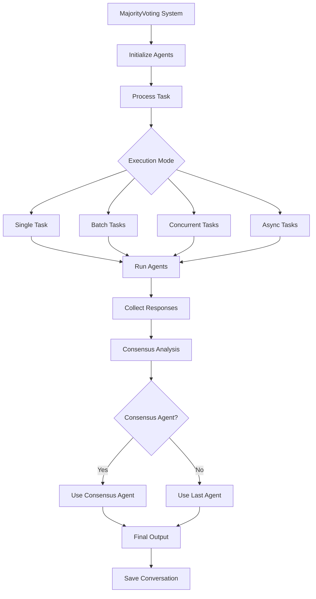

# MajorityVoting Module Documentation

The `MajorityVoting` module provides a mechanism for performing majority voting among a group of agents. Majority voting is a decision rule that selects the option which has the majority of votes. This is particularly useful in systems where multiple agents provide responses to a query, and the most common response needs to be identified as the final output.

## Architecture



### Key Concepts

- **Majority Voting**: A method to determine the most common response from a set of answers.
- **Agents**: Entities (e.g., models, algorithms) that provide responses to tasks or queries.
- **Output Parser**: A function that processes the responses from the agents before performing the majority voting.
- **Consensus Agent**: An optional agent that analyzes the responses from all agents to determine the final consensus.
- **Conversation History**: A record of all agent interactions and responses during the voting process.

## Class Definition: `MajorityVoting`

### Parameters

| Parameter         | Type           | Description                                                                 |
|------------------|----------------|-----------------------------------------------------------------------------|
| `name`           | `str`          | Name of the majority voting system. Default is "MajorityVoting".            |
| `description`    | `str`          | Description of the system. Default is "A majority voting system for agents". |
| `agents`         | `List[Agent]`  | A list of agents to be used in the majority voting system.                  |
| `output_parser`  | `Callable`     | Function to parse agent outputs. Default is `majority_voting` function.      |
| `consensus_agent`| `Agent`        | Optional agent for analyzing consensus among responses.                      |
| `autosave`       | `bool`         | Whether to autosave conversations. Default is `False`.                      |
| `verbose`        | `bool`         | Whether to enable verbose logging. Default is `False`.                      |
| `max_loops`      | `int`          | Maximum number of voting loops. Default is 1.                               |

### Methods

#### `run(task: str, correct_answer: str, *args, **kwargs) -> List[Any]`

Runs the majority voting system for a single task.

**Parameters:**
- `task` (str): The task to be performed by the agents
- `correct_answer` (str): The correct answer for evaluation
- `*args`, `**kwargs`: Additional arguments

**Returns:**
- List[Any]: The conversation history as a string, including the majority vote

#### `batch_run(tasks: List[str], *args, **kwargs) -> List[Any]`

Runs multiple tasks in sequence.

**Parameters:**
- `tasks` (List[str]): List of tasks to be performed
- `*args`, `**kwargs`: Additional arguments

**Returns:**
- List[Any]: List of majority votes for each task

#### `run_concurrently(tasks: List[str], *args, **kwargs) -> List[Any]`

Runs multiple tasks concurrently using thread pooling.

**Parameters:**
- `tasks` (List[str]): List of tasks to be performed
- `*args`, `**kwargs`: Additional arguments

**Returns:**
- List[Any]: List of majority votes for each task

#### `run_async(tasks: List[str], *args, **kwargs) -> List[Any]`

Runs multiple tasks asynchronously using asyncio.

**Parameters:**
- `tasks` (List[str]): List of tasks to be performed
- `*args`, `**kwargs`: Additional arguments

**Returns:**
- List[Any]: List of majority votes for each task

## Usage Examples

### Example 1: Basic Single Task Execution with Modern LLMs

```python
from swarms import Agent, MajorityVoting

# Initialize multiple agents with different specialties
agents = [
    Agent(
        agent_name="Financial-Analysis-Agent",
        agent_description="Personal finance advisor focused on market analysis",
        system_prompt="You are a financial advisor specializing in market analysis and investment opportunities.",
        max_loops=1,
        model_name="gpt-4o"
    ),
    Agent(
        agent_name="Risk-Assessment-Agent", 
        agent_description="Risk analysis and portfolio management expert",
        system_prompt="You are a risk assessment expert focused on evaluating investment risks and portfolio diversification.",
        max_loops=1,
        model_name="gpt-4o"
    ),
    Agent(
        agent_name="Tech-Investment-Agent",
        agent_description="Technology sector investment specialist",
        system_prompt="You are a technology investment specialist focused on AI, emerging tech, and growth opportunities.",
        max_loops=1,
        model_name="gpt-4o"
    )
]


consensus_agent = Agent(
    agent_name="Consensus-Agent",
    agent_description="Consensus agent focused on analyzing investment advice",
    system_prompt="You are a consensus agent focused on analyzing investment advice and providing a final answer.",
    max_loops=1,
    model_name="gpt-4o"
)

# Create majority voting system
majority_voting = MajorityVoting(
    name="Investment-Advisory-System",
    description="Multi-agent system for investment advice",
    agents=agents,
    verbose=True,
    consensus_agent=consensus_agent
)

# Run the analysis with majority voting
result = majority_voting.run(
    task="Create a table of super high growth opportunities for AI. I have $40k to invest in ETFs, index funds, and more. Please create a table in markdown.",
    correct_answer=""  # Optional evaluation metric
)

print(result)

```

## Batch Execution

```python
from swarms import Agent, MajorityVoting

# Initialize multiple agents with different specialties
agents = [
    Agent(
        agent_name="Financial-Analysis-Agent",
        agent_description="Personal finance advisor focused on market analysis",
        system_prompt="You are a financial advisor specializing in market analysis and investment opportunities.",
        max_loops=1,
        model_name="gpt-4o"
    ),
    Agent(
        agent_name="Risk-Assessment-Agent", 
        agent_description="Risk analysis and portfolio management expert",
        system_prompt="You are a risk assessment expert focused on evaluating investment risks and portfolio diversification.",
        max_loops=1,
        model_name="gpt-4o"
    ),
    Agent(
        agent_name="Tech-Investment-Agent",
        agent_description="Technology sector investment specialist",
        system_prompt="You are a technology investment specialist focused on AI, emerging tech, and growth opportunities.",
        max_loops=1,
        model_name="gpt-4o"
    )
]


consensus_agent = Agent(
    agent_name="Consensus-Agent",
    agent_description="Consensus agent focused on analyzing investment advice",
    system_prompt="You are a consensus agent focused on analyzing investment advice and providing a final answer.",
    max_loops=1,
    model_name="gpt-4o"
)

# Create majority voting system
majority_voting = MajorityVoting(
    name="Investment-Advisory-System",
    description="Multi-agent system for investment advice",
    agents=agents,
    verbose=True,
    consensus_agent=consensus_agent
)

# Run the analysis with majority voting
result = majority_voting.batch_run(
    task="Create a table of super high growth opportunities for AI. I have $40k to invest in ETFs, index funds, and more. Please create a table in markdown.",
    correct_answer=""  # Optional evaluation metric
)

print(result)


```