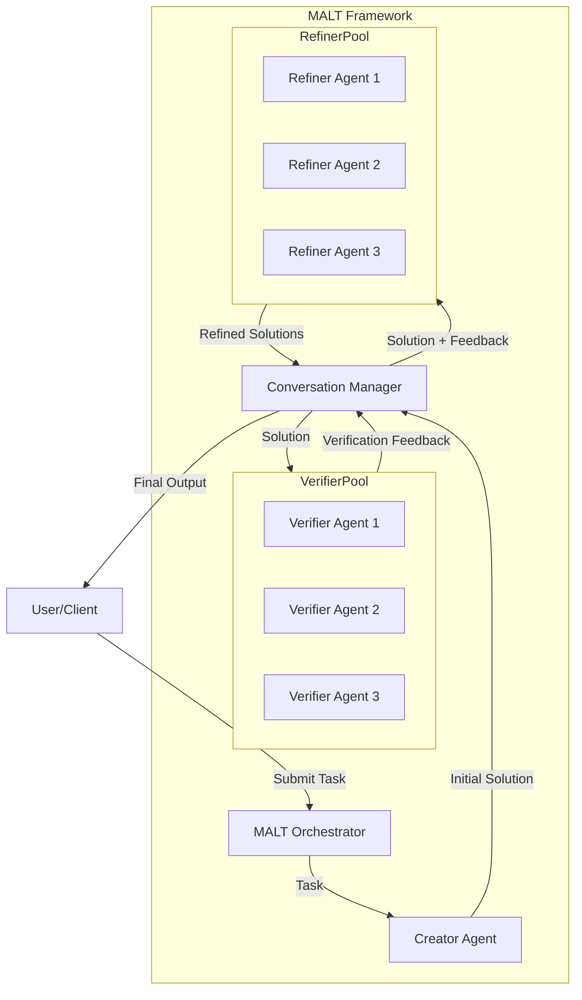
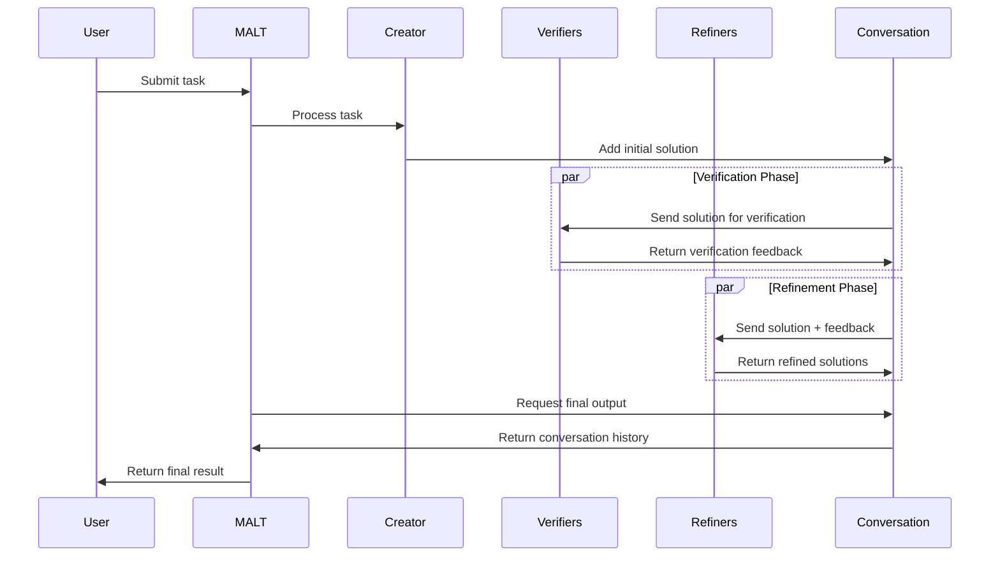

# MALT: Multi-Agent Learning Task Framework

## Overview

MALT (Multi-Agent Learning Task) is a sophisticated orchestration framework that coordinates multiple specialized AI agents to tackle complex tasks through structured conversations. Inspired by the principles outlined in the [MALT research paper](https://arxiv.org/pdf/2412.01928), this implementation provides a reliable, extensible system for multi-agent collaboration.

The framework is designed around a three-agent architecture:
1. **Creator Agent**: Generates initial content or solutions
2. **Verifier Agent**: Critically evaluates the creator's output
3. **Refiner Agent**: Improves the solution based on verifier feedback

This collaborative approach enables high-quality outputs for complex tasks by combining the strengths of multiple specialized agents, each focused on a different aspect of the problem-solving process.

## How It Works

The MALT framework follows a structured workflow:

1. A task is submitted to the system
2. The Creator Agent generates an initial solution
3. Multiple instances of the Verifier Agent independently evaluate the solution
4. Multiple instances of the Refiner Agent improve the solution based on verification feedback
5. The final refined output is returned

This process can be configured to run for multiple iterations, with each cycle potentially improving the quality of the output. The system maintains a conversation history, tracking interactions between agents throughout the workflow.

### Key Components

- **Agent**: Represents an individual AI agent with specific capabilities and responsibilities
- **Conversation**: Manages the interaction history between agents
- **MALT Orchestrator**: Coordinates the workflow and manages agent interactions
- **Concurrency Support**: Enables parallel execution of multiple agent instances

## Architecture Diagram



## Execution Workflow



## API Reference

### MALT Class

The core orchestrator that manages the multi-agent interaction process.

#### Constructor Parameters

| Parameter | Type | Default | Description |
|-----------|------|---------|-------------|
| `main_agent` | `Agent` | `None` | The primary agent (Creator) responsible for generating initial solutions |
| `refiner_agent` | `Agent` | `None` | The agent that refines solutions based on verification feedback |
| `verifier_agent` | `Agent` | `None` | The agent that verifies and evaluates solutions |
| `max_loops` | `int` | `1` | Maximum number of iterations for the task execution |
| `return_list` | `bool` | `False` | Flag to return output as a list |
| `return_dict` | `bool` | `False` | Flag to return output as a dictionary |
| `agents` | `list[Agent]` | `[]` | Alternative list of agents to use in the task |
| `preset_agents` | `bool` | `True` | Use default preset agents for mathematical proofs |

#### Methods

| Method | Parameters | Return Type | Description |
|--------|------------|-------------|-------------|
| `reliability_check` | None | None | Validates agent configuration and parameters |
| `step` | `task: str, img: str = None, *args, **kwargs` | `str` or `list` or `dict` | Executes a single iteration of the MALT workflow |
| `run` | `task: str, img: str = None, *args, **kwargs` | `str` or `list` or `dict` | Executes the complete MALT workflow for a task |
| `run_batched` | `tasks: List[str], *args, **kwargs` | `List[str]` or `List[list]` or `List[dict]` | Sequentially processes multiple tasks |
| `run_concurrently` | `tasks: List[str], *args, **kwargs` | `concurrent.futures.Future` | Processes multiple tasks in parallel using ThreadPoolExecutor |
| `__call__` | `task: str, *args, **kwargs` | Same as `run` | Allows the MALT instance to be called as a function |
| `__str__` | None | `str` | Returns the conversation history as a string |
| `__repr__` | None | `str` | Returns the conversation history as a string |


## Sample Implementations

### Default Mathematical Proof Agents

The MALT framework includes preset agents specialized for mathematical proof generation and refinement:

1. **Proof Creator Agent**: Generates original mathematical theorems and proofs
2. **Proof Verifier Agent**: Critically evaluates and identifies issues in mathematical proofs
3. **Proof Refiner Agent**: Improves proofs based on verification feedback

Each agent has a carefully designed system prompt that guides its behavior and specialization.

## Usage Examples

### Basic Usage

```python
from swarms.structs.agent import Agent
from swarms.structs.multi_agent_exec import MALT

# Initialize with preset mathematical proof agents
malt = MALT(preset_agents=True)

# Run a mathematical proof task
result = malt.run("Develop a theorem and proof related to prime numbers and their distribution.")

print(result)
```

### Custom Agents

```python
from swarms.structs.agent import Agent
from swarms.structs.multi_agent_exec import MALT

# Define custom agents
creator = Agent(
    agent_name="Physics-Creator",
    model_name="gpt-4o-mini",
    max_loops=1,
    system_prompt="You are a theoretical physicist specializing in quantum mechanics..."
)

verifier = Agent(
    agent_name="Physics-Verifier",
    model_name="gpt-4o-mini",
    max_loops=1,
    system_prompt="You are an experimental physicist who verifies theoretical claims..."
)

refiner = Agent(
    agent_name="Physics-Communicator",
    model_name="gpt-4o-mini",
    max_loops=1,
    system_prompt="You excel at explaining complex physics concepts to diverse audiences..."
)

# Initialize MALT with custom agents
malt = MALT(
    main_agent=creator,
    verifier_agent=verifier,
    refiner_agent=refiner,
    preset_agents=False,
    max_loops=1
)

# Run a physics explanation task
result = malt.run("Explain the quantum entanglement phenomenon and its implications.")
```

### Concurrent Processing

```python
from swarms.structs.multi_agent_exec import MALT

# Initialize MALT
malt = MALT()

# Define multiple tasks
tasks = [
    "Prove a theorem related to continuous functions on compact sets.",
    "Develop a theorem about convergence in infinite-dimensional Hilbert spaces.",
    "Create a theorem relating to measure theory and Lebesgue integration."
]

# Process tasks concurrently
futures = malt.run_concurrently(tasks)

# Collect results as they complete
for future in futures:
    result = future.result()
    print(result)
```

## Example: Complex Mathematical Domain

Here's an example of how MALT can generate, verify, and refine a mathematical proof:

### Input

```python
malt = MALT(preset_agents=True)
task = "Develop a theorem and rigorous proof related to the convergence properties of infinite series."
result = malt.run(task)
```

### Output Flow

1. **Creator Agent** generates a theorem and proof about conditions for absolute convergence
2. **Verifier Agents** identify issues:
   - Logical gap in lemma 2
   - Missing justification for uniform convergence claim
   - Imprecise definition of certain terms
3. **Refiner Agents** produce improved versions addressing these concerns
4. The final output contains the refined, rigorous mathematical proof

## Best Practices

1. **Task Specificity**: Provide clear, detailed task descriptions for optimal results
2. **Agent Specialization**: Design agent prompts to focus on specific aspects of the task
3. **Iteration Control**: Adjust `max_loops` based on task complexity
4. **Concurrent Verification**: Use multiple verifier instances for comprehensive evaluation
5. **Custom Agents**: Create domain-specific agents for specialized tasks

## Potential Improvements

- Autonomously create specialized agents based on task requirements
- Implement feedback loops between agents for iterative improvement
- Add support for agent-specific memory and knowledge bases
- Expand concurrency capabilities for improved performance
- Implement learning mechanisms for agent improvement over time

## References

- Original MALT paper: [arXiv:2412.01928](https://arxiv.org/pdf/2412.01928)
- Built on the swarms framework for multi-agent systems