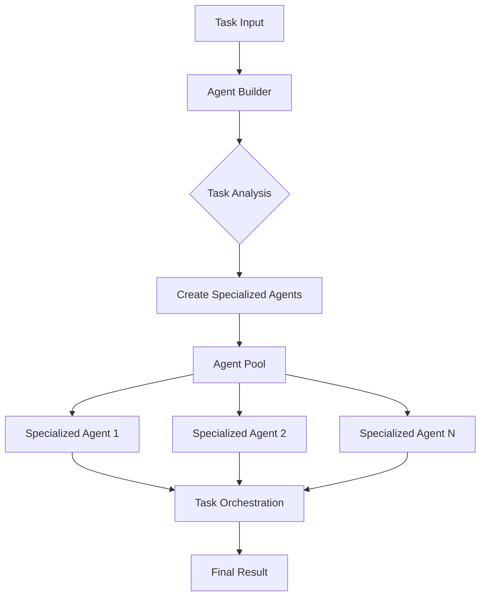
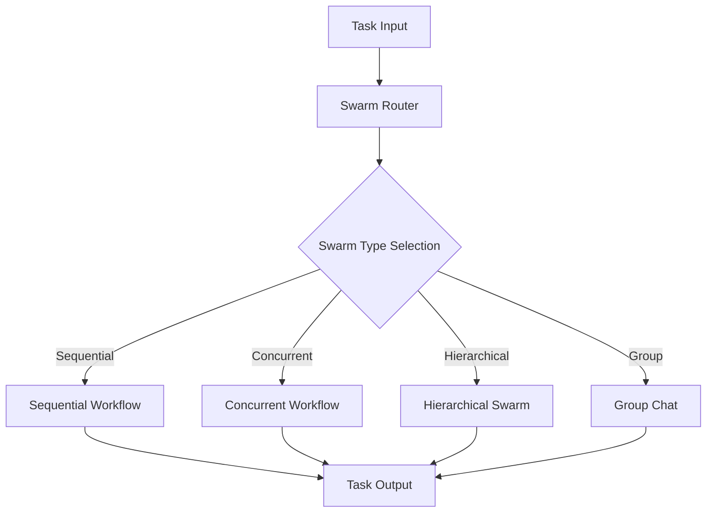

# Hierarchical Agent Orchestration Architectures

Hierarchical agent orchestration involves organizing multiple agents in structured layers to efficiently handle complex tasks. There are several key architectures available, each with distinct characteristics and use cases.

Here are the Hierarchical swarms we support:

| Architecture | Strengths | Weaknesses |
|--------------|-----------|------------|
| HHCS | - Clear task routing - Specialized swarm handling - Parallel processing capability - Good for complex multi-domain tasks | - More complex setup - Overhead in routing - Requires careful swarm design |
| Auto Agent Builder | - Dynamic agent creation - Flexible scaling - Self-organizing - Good for evolving tasks | - Higher resource usage - Potential creation overhead - May create redundant agents |
| SwarmRouter | - Multiple workflow types - Simple configuration - Flexible deployment - Good for varied task types | - Less specialized than HHCS - Limited inter-swarm communication - May require manual type selection |

## Core Architectures

### 1. Hybrid Hierarchical-Cluster Swarm (HHCS)

Hybrid Hierarchical-Cluster Swarm (HHCS) is architecture that uses a Router Agent to analyze and distribute tasks to other swarms.

- Tasks are routed to specialized swarms based on their requirements

- Enables parallel processing through multiple specialized swarms

- Ideal for complex, multi-domain tasks and enterprise-scale operations

- Provides clear task routing but requires more complex setup

### 2. Auto Agent Builder

Auto Agent Builder is a dynamic agent architecture that creates specialized agents on-demand.

- Analyzes tasks and automatically builds appropriate agents for the job

- Maintains an agent pool that feeds into task orchestration

- Best suited for evolving requirements and dynamic workloads

- Self-organizing but may have higher resource usage

### 3. SwarmRouter

SwarmRouter is a flexible system supporting multiple swarm architectures through a simple interface:

- Sequential workflows

- Concurrent workflows

- Hierarchical swarms

- Group chat interactions

- Simpler to configure and deploy compared to other architectures

- Best for general-purpose tasks and smaller scale operations

- Recommended for 5-20 agents.

## Use Case Recommendations

1. **HHCS**: Best for:
   - Enterprise-scale operations
   - Multi-domain problems
   - Complex task routing
   - Parallel processing needs

2. **Auto Agent Builder**: Best for:
   - Dynamic workloads
   - Evolving requirements
   - Research and development
   - Exploratory tasks

3. **SwarmRouter**: Best for:
   - General purpose tasks
   - Quick deployment
   - Mixed workflow types
   - Smaller scale operations

## Documentation Links

1. HHCS Documentation:
   - [Hybrid Hierarchical-Cluster Swarm Documentation](https://docs.swarms.world/en/latest/swarms/structs/hhcs/)
   - Covers detailed implementation, constructor arguments, and full examples

2. Auto Agent Builder Documentation:
   - [Agent Builder Documentation](https://docs.swarms.world/en/latest/swarms/structs/auto_agent_builder/)
   - Includes enterprise use cases, best practices, and integration patterns

3. SwarmRouter Documentation:
   - [SwarmRouter Documentation](https://docs.swarms.world/en/latest/swarms/structs/swarm_router/)
   - Provides comprehensive API reference, advanced usage, and use cases

## Best Practices for Selection

### **Evaluate Task Complexity**
   
- Simple tasks → SwarmRouter

- Complex, multi-domain tasks → HHCS

- Dynamic, evolving tasks → Auto Agent Builder

### **Consider Scale**
   
- Small scale → SwarmRouter

- Large scale → HHCS

- Variable scale → Auto Agent Builder

### **Resource Availability**
   
- Limited resources → SwarmRouter

- Abundant resources → HHCS or Auto Agent Builder

- Dynamic resources → Auto Agent Builder

### **Development Time**

- Quick deployment → SwarmRouter

- Complex system → HHCS

- Experimental system → Auto Agent Builder

This documentation provides a high-level overview of the main hierarchical agent orchestration architectures available in the system. Each architecture has its own strengths and ideal use cases, and the choice between them should be based on specific project requirements, scale, and complexity.
