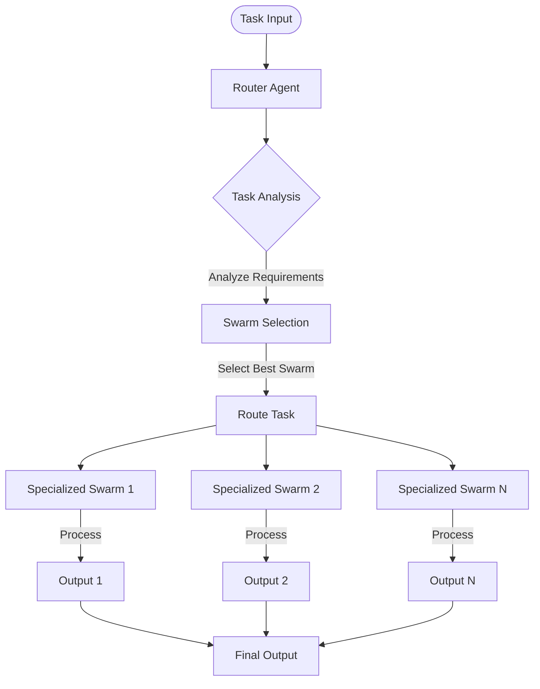
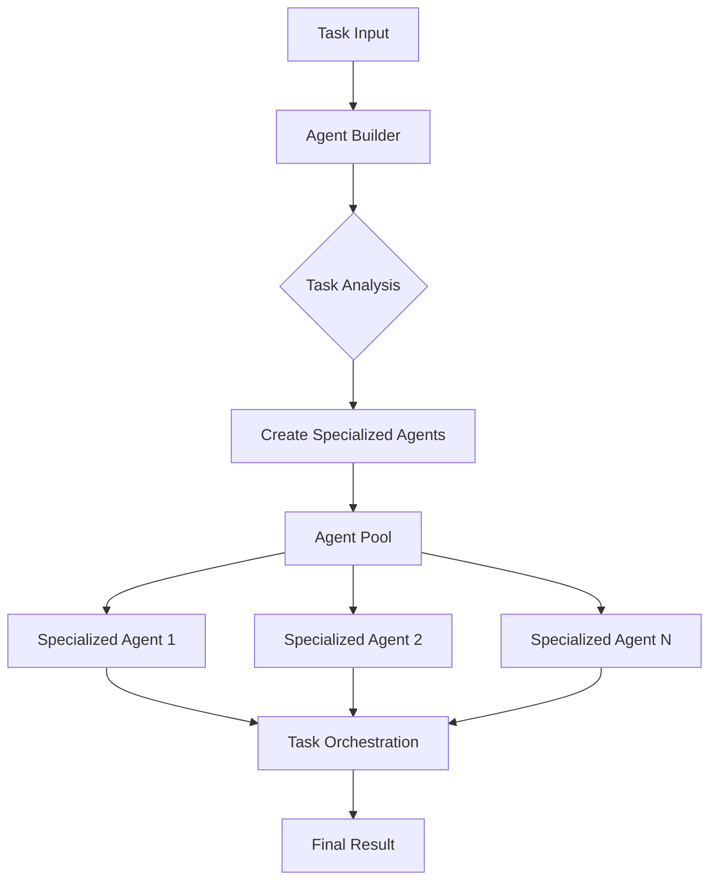
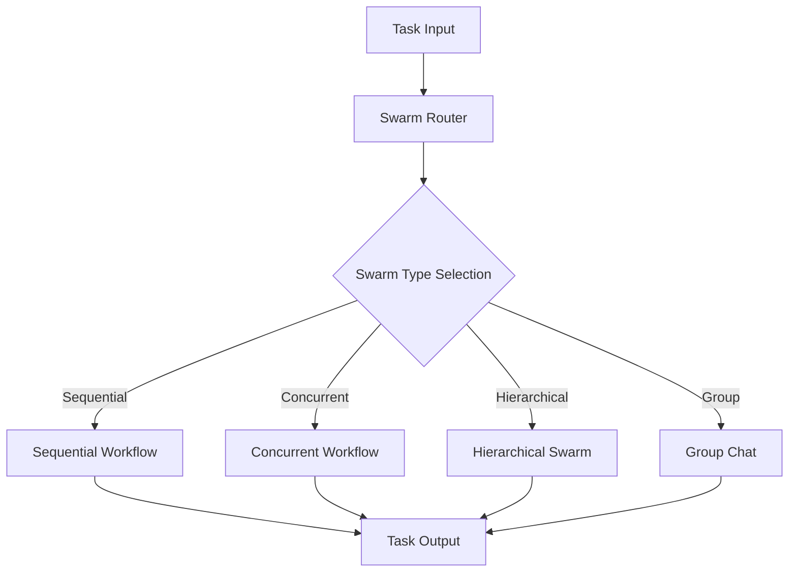

# Hierarchical Agent Orchestration Architectures

Hierarchical agent orchestration involves organizing AI agents in structured layers to efficiently handle complex tasks. There are several key architectures available, each with distinct characteristics and use cases.

## Core Architectures

### 1. Hybrid Hierarchical-Cluster Swarm (HHCS)

### 2. Auto Agent Builder

### 3. SwarmRouter

## Comparison Table

| Architecture | Strengths | Weaknesses |
|--------------|-----------|------------|
| HHCS | - Clear task routing - Specialized swarm handling - Parallel processing capability - Good for complex multi-domain tasks | - More complex setup - Overhead in routing - Requires careful swarm design |
| Auto Agent Builder | - Dynamic agent creation - Flexible scaling - Self-organizing - Good for evolving tasks | - Higher resource usage - Potential creation overhead - May create redundant agents |
| SwarmRouter | - Multiple workflow types - Simple configuration - Flexible deployment - Good for varied task types | - Less specialized than HHCS - Limited inter-swarm communication - May require manual type selection |

## Use Case Recommendations

1. **HHCS**: Best for:
   - Enterprise-scale operations
   - Multi-domain problems
   - Complex task routing
   - Parallel processing needs

2. **Auto Agent Builder**: Best for:
   - Dynamic workloads
   - Evolving requirements
   - Research and development
   - Exploratory tasks

3. **SwarmRouter**: Best for:
   - General purpose tasks
   - Quick deployment
   - Mixed workflow types
   - Smaller scale operations

## Documentation Links

1. HHCS Documentation:
   - [Hybrid Hierarchical-Cluster Swarm Documentation](docs/swarms/structs/hhcs.md)
   - Covers detailed implementation, constructor arguments, and full examples

2. Auto Agent Builder Documentation:
   - [Agent Builder Documentation](docs/swarms/structs/auto_agent_builder.md)
   - Includes enterprise use cases, best practices, and integration patterns

3. SwarmRouter Documentation:
   - [SwarmRouter Documentation](docs/swarms/structs/swarm_router.md)
   - Provides comprehensive API reference, advanced usage, and use cases

## Best Practices for Selection

1. **Evaluate Task Complexity**
   - Simple tasks → SwarmRouter
   - Complex, multi-domain tasks → HHCS
   - Dynamic, evolving tasks → Auto Agent Builder

2. **Consider Scale**
   - Small scale → SwarmRouter
   - Large scale → HHCS
   - Variable scale → Auto Agent Builder

3. **Resource Availability**
   - Limited resources → SwarmRouter
   - Abundant resources → HHCS or Auto Agent Builder
   - Dynamic resources → Auto Agent Builder

4. **Development Time**
   - Quick deployment → SwarmRouter
   - Complex system → HHCS
   - Experimental system → Auto Agent Builder

## Integration Considerations

1. **System Requirements**
   - All architectures require proper API access depending on the model your agents are using.
   - HHCS needs robust routing infrastructure
   - Auto Agent Builder needs scalable resource management
   - SwarmRouter needs workflow type definitions

2. **Monitoring**
   - Implement comprehensive logging
   - Track performance metrics
   - Monitor resource usage
   - Set up alerting systems

3. **Scaling**
   - Design for horizontal scaling
   - Implement proper load balancing
   - Consider distributed deployment
   - Plan for future growth

This documentation provides a high-level overview of the main hierarchical agent orchestration architectures available in the system. Each architecture has its own strengths and ideal use cases, and the choice between them should be based on specific project requirements, scale, and complexity.
