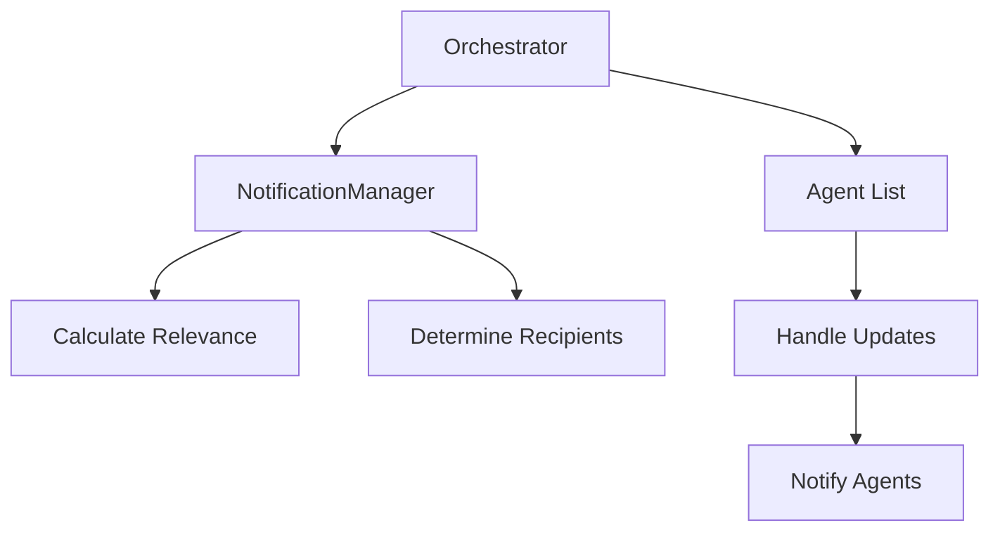

# Orchestrator

The `Orchestrator` manages communication and coordination between multiple agents, particularly for selective vector DB update notifications. It acts as a central hub for registering agents and routing notifications.

## Overview

The orchestrator maintains a list of agents and their notification preferences, using the `NotificationManager` to determine which agents should receive specific updates.



## Class Definition

```python
class Orchestrator:
    def __init__(self):
        self.notification_manager = NotificationManager()
        self.agents: List[Agent] = []
```

## Key Methods

| Method | Description |
|--------|-------------|
| `register_agent(agent: Agent)` | Register an agent with the orchestrator |
| `handle_vector_db_update(update_metadata: UpdateMetadata)` | Process a vector DB update and notify relevant agents |
| `update_agent_task_context(agent_name: str, task_context: str)` | Update an agent's current task context |

## Usage Example

```python
from swarms import Agent, Orchestrator
from swarms.structs.notification_manager import UpdateMetadata
from datetime import datetime

# Create orchestrator
orchestrator = Orchestrator()

# Create and register agents
agent1 = Agent(
    agent_name="FinancialAgent",
    expertise_areas=["finance", "stocks", "trading"],
    importance_threshold=0.6
)

agent2 = Agent(
    agent_name="TechAgent", 
    expertise_areas=["technology", "software", "AI"],
    importance_threshold=0.4
)

orchestrator.register_agent(agent1)
orchestrator.register_agent(agent2)

# Example vector DB update
update = UpdateMetadata(
    topic="stock_market",
    importance=0.8,
    timestamp=datetime.now(),
    affected_areas=["finance", "trading"]
)

# Handle update - only FinancialAgent will be notified
orchestrator.handle_vector_db_update(update)
```

## Best Practices

1. Agent Registration
   - Register all agents at initialization
   - Update agent profiles when expertise changes
   - Remove inactive agents

2. Update Handling
   - Include relevant metadata in updates
   - Set appropriate importance levels
   - Consider update timing

3. Task Context
   - Keep task contexts current
   - Clear contexts when tasks complete
   - Use contexts to improve notification relevance

4. Monitoring
   - Track notification patterns
   - Adjust thresholds as needed
   - Monitor agent responses to notifications

## Integration with Vector Databases

The orchestrator can be integrated with various vector databases:

```python
from swarms_memory import ChromaDB
from swarms import Agent, Orchestrator

# Initialize vector DB
vector_db = ChromaDB(
    metric="cosine",
    output_dir="agent_knowledge"
)

# Create agents with vector DB
agent = Agent(
    agent_name="ResearchAgent",
    expertise_areas=["research", "analysis"],
    long_term_memory=vector_db
)

# Register with orchestrator
orchestrator = Orchestrator()
orchestrator.register_agent(agent)
```

## Error Handling

The orchestrator includes error handling for:
- Invalid agent registrations
- Malformed updates
- Failed notifications
- Missing agent profiles 