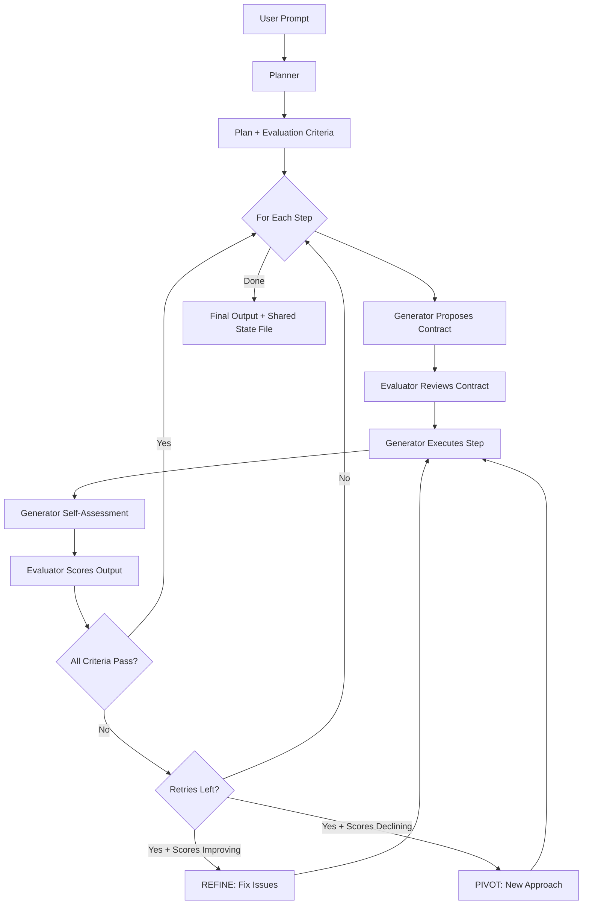

# `PlannerGeneratorEvaluator`

The `PlannerGeneratorEvaluator` is a domain-agnostic three-agent orchestration harness inspired by the GAN-style architecture described in [Anthropic's harness design research](https://www.anthropic.com/engineering/harness-design-long-running-apps). It coordinates long-running autonomous tasks from a short natural-language prompt, using an iterative generate-evaluate feedback loop to converge on high-quality output across any domain.

All three agents communicate through a single shared file on disk.



The harness follows this workflow:

1. **Planning**: Planner expands a short prompt into an ambitious plan with steps and evaluation criteria
2. **Contract Negotiation**: Generator proposes what "done" looks like for each step; Evaluator reviews
3. **Execution**: Generator produces concrete output and self-assesses before handoff
4. **Evaluation**: Evaluator scores output per-criterion with hard thresholds — any criterion below its threshold fails the step
5. **Feedback Loop**: On failure, Generator receives scores + trajectory signal (refine or pivot) and retries
6. **All state on disk**: The shared state file is the single append-only record of the entire run


## Key Features

| Feature | Description |
|---------|-------------|
| **GAN-Style Separation** | Distinct Generator and Evaluator agents prevent self-evaluation bias |
| **Step Contracts** | Generator and Evaluator agree on success criteria before execution |
| **Hard Threshold Enforcement** | Any single criterion below its threshold fails the step |
| **Score Trajectory** | Tracks score trends across retries — signals Generator to refine or pivot |
| **Self-Assessment** | Generator self-evaluates before Evaluator handoff |
| **Shared State File** | Single append-only `.md` file for all inter-agent communication |
| **Domain-Agnostic** | Planner defines evaluation criteria tailored to the task domain |
| **Custom Agents** | Pass pre-configured agents with tools, MCP, or any Agent settings |
| **Configurable Thresholds** | Default thresholds plus Planner-defined per-criterion thresholds |


## Constructor

### `PlannerGeneratorEvaluator.__init__()`

| Parameter | Type | Default | Required | Description |
|-----------|------|---------|----------|-------------|
| `model_name` | `str` | `"gpt-5.4"` | No | Model identifier for all three agents |
| `planner_model_name` | `str` | `None` | No | Override model for the Planner |
| `generator_model_name` | `str` | `None` | No | Override model for the Generator |
| `evaluator_model_name` | `str` | `None` | No | Override model for the Evaluator |
| `max_steps` | `int` | `10` | No | Upper bound on plan steps to execute |
| `max_retries_per_step` | `int` | `3` | No | Max evaluation failures before advancing |
| `working_directory` | `str` | `os.getcwd()` | No | Directory where output is produced |
| `shared_state_path` | `str` | `None` | No | Path for the shared state file (auto-generated if None) |
| `default_thresholds` | `Dict[str, float]` | `{}` | No | Fallback score thresholds by criterion name |
| `output_type` | `OutputType` | `"dict"` | No | Format for output (dict, str, list, final, json, yaml) |
| `verbose` | `bool` | `False` | No | Enable verbose logging |
| `planner_agent` | `Agent` | `None` | No | Pre-configured Agent for planning |
| `generator_agent` | `Agent` | `None` | No | Pre-configured Agent for generation (e.g., with file/code tools) |
| `evaluator_agent` | `Agent` | `None` | No | Pre-configured Agent for evaluation (e.g., with Playwright MCP) |

#### Raises

| Exception | Condition |
|-----------|-----------|
| `ValueError` | If `max_steps < 1`, `max_retries_per_step < 0`, or `model_name` is empty |

---

## Core Methods

### `run()`

Execute the full PGE harness pipeline from a short prompt to completed output.

| Parameter | Type | Default | Required | Description |
|-----------|------|---------|----------|-------------|
| `task` | `str` | — | **Yes** | A short natural-language description of the desired task |

#### Returns

| Type | Description |
|------|-------------|
| `Any` | Formatted conversation history according to `output_type` |

After `run()` completes, access `harness.last_result` for structured metadata:

| Field | Type | Description |
|-------|------|-------------|
| `output_path` | `str` | Path to the shared state file |
| `plan` | `str` | The generated plan text |
| `step_logs` | `List[Dict]` | Per-step metadata (contract, scores, retries) |
| `total_duration` | `float` | Wall-clock time in seconds |
| `total_steps_completed` | `int` | Number of steps that passed evaluation |
| `total_retries` | `int` | Total retry attempts across all steps |

---

### `batched_run()`

Run the harness on multiple tasks sequentially.

| Parameter | Type | Default | Required | Description |
|-----------|------|---------|----------|-------------|
| `tasks` | `List[str]` | — | **Yes** | List of task prompts to process |

#### Returns

| Type | Description |
|------|-------------|
| `List[Any]` | List of results, one per task |

---

## Usage Examples

### Basic Usage

```python
from swarms import PlannerGeneratorEvaluator

harness = PlannerGeneratorEvaluator(
    model_name="gpt-5.4",
    max_steps=3,
    max_retries_per_step=2,
    output_type="final",
    verbose=True,
)

result = harness.run(
    "Write a comprehensive guide on the benefits and risks of intermittent fasting"
)

print(result)
print(f"Steps completed: {harness.last_result.total_steps_completed}")
print(f"Duration: {harness.last_result.total_duration:.1f}s")
```

### Custom Agents with Tools

Pass pre-configured agents with tools so the Generator can write files and the Evaluator can verify them on disk:

```python
from swarms import Agent, PlannerGeneratorEvaluator


def write_file(filename: str, content: str) -> str:
    """Write content to a file."""
    with open(filename, "w") as f:
        f.write(content)
    return f"Written: {filename}"


def read_file(filename: str) -> str:
    """Read content from a file."""
    with open(filename, "r") as f:
        return f.read()


generator = Agent(
    agent_name="PGE-Generator",
    model_name="gpt-5.4",
    max_loops=1,
    tools=[write_file],
)

evaluator = Agent(
    agent_name="PGE-Evaluator",
    model_name="gpt-5.4",
    max_loops=1,
    tools=[read_file],
)

harness = PlannerGeneratorEvaluator(
    model_name="gpt-5.4",
    generator_agent=generator,
    evaluator_agent=evaluator,
    max_steps=3,
)

result = harness.run("Create a Python module for string manipulation utilities")
```

### Evaluator with Playwright MCP (Web App Testing)

For web application development, give the Evaluator browser automation via Playwright MCP so it can test the running app like a real user:

```python
from swarms import Agent, PlannerGeneratorEvaluator

evaluator = Agent(
    agent_name="PGE-Evaluator",
    model_name="gpt-5.4",
    max_loops=1,
    mcp_config={"url": "http://localhost:3000/playwright"},
)

harness = PlannerGeneratorEvaluator(
    model_name="gpt-5.4",
    evaluator_agent=evaluator,
    max_steps=5,
    max_retries_per_step=3,
)

result = harness.run("Build a todo app with React frontend and FastAPI backend")
```

### Custom Thresholds

Provide default score thresholds that apply when the Planner doesn't define them:

```python
from swarms import PlannerGeneratorEvaluator

harness = PlannerGeneratorEvaluator(
    model_name="gpt-5.4",
    default_thresholds={
        "accuracy": 8.0,
        "clarity": 7.0,
        "completeness": 7.0,
    },
    max_retries_per_step=4,
)

result = harness.run("Write a technical specification for a rate-limiting middleware")
```

---

## Architecture Details

### Shared State File

All inter-agent communication flows through a single append-only markdown file. Each section is timestamped and labeled:

```
# PGE Harness Shared State

## User Prompt
[original prompt]

---
### [PLANNER OUTPUT] (2026-03-25 10:30:00)
[plan with steps and evaluation criteria]

---
### [STEP 1 CONTRACT PROPOSAL] (2026-03-25 10:30:15)
[Generator's proposed contract]

---
### [STEP 1 CONTRACT REVIEW] (2026-03-25 10:30:25)
[Evaluator's review — APPROVED or AMENDMENTS REQUIRED]

---
### [STEP 1 WORK LOG] (2026-03-25 10:30:45)
[Generator's output + self-assessment]

---
### [STEP 1 EVALUATION] (2026-03-25 10:31:00)
[Evaluator's per-criterion scores, findings, and feedback]
```

### Refine vs. Pivot

When a step fails evaluation, the harness computes a score trajectory across retries:

- **Scores improving** → REFINE: keep the current direction, fix specific issues
- **Scores declining or stagnant** → PIVOT: take a fundamentally different approach

This signal is passed to the Generator alongside the Evaluator's feedback.

### Evaluation Criteria

The Planner defines domain-appropriate criteria as part of the plan. Each criterion has:

| Field | Description |
|-------|-------------|
| **Name** | Short label (e.g., "accuracy", "clarity") |
| **Weight** | Relative importance (high, standard, low) |
| **Description** | What it measures and what good/bad looks like |
| **Threshold** | Minimum passing score (1-10). Any criterion below threshold = step fails |
