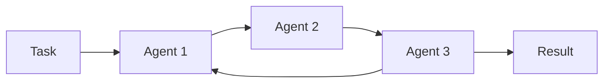

# RoundRobin: Round-Robin Task Execution in a Swarm

The `RoundRobinSwarm` class is designed to manage and execute tasks among multiple agents in a round-robin fashion. This approach ensures that each agent in a swarm receives an equal opportunity to execute tasks, which promotes fairness and efficiency in distributed systems. It is particularly useful in environments where collaborative, sequential task execution is needed among various agents.

This swarm implements an AutoGen-style communication pattern where agents are shuffled randomly each loop for varied interaction patterns. Each agent receives the full conversation context to build upon others' responses.

## What is Round-Robin?

Round-robin is a scheduling technique commonly used in computing for managing processes in shared systems. It involves assigning a fixed time slot to each process and cycling through all processes in a circular order without prioritization. In the context of swarms of agents, this method ensures equitable distribution of tasks and resource usage among all agents.

## Application in Swarms

In swarms, `RoundRobinSwarm` utilizes the round-robin scheduling to manage tasks among agents like software components, autonomous robots, or virtual entities. This strategy is beneficial where tasks are interdependent or require sequential processing.

## Architecture



Each agent receives the task with full conversation history, responds, then passes context to the next agent. This cycle repeats for `max_loops` iterations.

## Class Attributes

| Attribute | Type | Description |
|-----------|------|-------------|
| `name` | `str` | Name of the swarm. |
| `description` | `str` | Description of the swarm's purpose. |
| `agents` | `List[Agent]` | List of agents participating in the swarm. |
| `verbose` | `bool` | Enables or disables detailed logging of swarm operations. |
| `max_loops` | `int` | Limits the number of times the swarm cycles through all agents. |
| `callback` | `callable` | Callback function executed after each loop. |
| `index` | `int` | Maintains the current position in the agent list to ensure round-robin execution. |
| `max_retries` | `int` | Maximum number of retries for agent execution. |
| `output_type` | `OutputType` | Type of output format (e.g., "final", "all", "json"). |
| `conversation` | `Conversation` | Conversation history for the swarm. |

## Methods

### `__init__`

Initializes the swarm with the provided list of agents, verbosity setting, and operational parameters.

**Parameters:**

| Parameter | Type | Default | Description |
|-----------|------|---------|-------------|
| `name` | `str` | `"RoundRobinSwarm"` | Name of the swarm. |
| `description` | `str` | `"A swarm implementation..."` | Description of the swarm's purpose. |
| `agents` | `List[Agent]` | **Required** | List of agents in the swarm. |
| `verbose` | `bool` | `False` | Boolean flag for detailed logging. |
| `max_loops` | `int` | `1` | Maximum number of execution cycles. |
| `callback` | `callable` | `None` | Function called after each loop with `(loop_index, result)` arguments. |
| `max_retries` | `int` | `3` | Maximum number of retries for agent execution. |
| `output_type` | `OutputType` | `"final"` | Type of output format. |

**Raises:**

- `ValueError`: If no agents are provided during initialization.

---

### `run`

Executes a specified task across all agents in a randomized round-robin manner, cycling through each agent repeatedly for the number of specified loops.

```python
def run(self, task: str, *args, **kwargs) -> Union[str, dict, list]
```

**Parameters:**

| Parameter | Type | Description |
|-----------|------|-------------|
| `task` | `str` | The task string to be executed by the agents. |
| `*args` | `Any` | Variable length argument list passed to each agent. |
| `**kwargs` | `Any` | Arbitrary keyword arguments passed to each agent. |

**Returns:**

| Type | Description |
|------|-------------|
| `Union[str, dict, list]` | The result of the task execution in the format specified by `output_type`. |

**Raises:**

- `ValueError`: If no agents are configured for the swarm.

- `Exception`: If an exception occurs during task execution.

**Conceptual Behavior:**

| Step | Description |
|------|-------------|
| 1    | Add the initial task to the conversation history. |
| 2    | Shuffle agents randomly for varied interaction patterns. |
| 3    | Each agent receives the full conversation context and processes the task. |
| 4    | Agents build upon insights from previous agents in the conversation. |
| 5    | After an agent completes its part, its response is added to the conversation. |
| 6    | This cycle continues until the specified maximum number of loops is completed. |
| 7    | Optionally, a callback function is invoked after each loop. |
| 8    | Returns the formatted conversation history based on `output_type`. |

---

### `run_batch`

Execute multiple tasks sequentially through the round-robin swarm. Each task is processed independently through the full round-robin execution cycle.

```python
def run_batch(self, tasks: List[str]) -> List[Union[str, dict, list]]
```

**Parameters:**

| Parameter | Type | Description |
|-----------|------|-------------|
| `tasks` | `List[str]` | A list of task strings to be executed. |

**Returns:**

| Type | Description |
|------|-------------|
| `List[Union[str, dict, list]]` | A list of results, one for each task, in the format specified by `output_type`. |

## Examples

### Basic Usage with `run`

In this example, `RoundRobinSwarm` is used to distribute a sales task among a group of specialized agents. Each agent contributes their unique perspective to the collaborative output.

```python
from swarms import Agent, RoundRobinSwarm

# Define sales agents
sales_agent1 = Agent(
    agent_name="Sales Agent 1 - Automation Specialist",
    system_prompt="You're Sales Agent 1, your purpose is to generate sales for a company by focusing on the benefits of automating accounting processes!",
    agent_description="Generate sales by focusing on the benefits of automation!",
    model_name="gpt-4.1",
    max_loops=1,
)

sales_agent2 = Agent(
    agent_name="Sales Agent 2 - Cost Saving Specialist",
    system_prompt="You're Sales Agent 2, your purpose is to generate sales for a company by emphasizing the cost savings of using swarms of agents!",
    agent_description="Generate sales by emphasizing cost savings!",
    model_name="gpt-4.1",
    max_loops=1,
)

sales_agent3 = Agent(
    agent_name="Sales Agent 3 - Efficiency Specialist",
    system_prompt="You're Sales Agent 3, your purpose is to generate sales for a company by highlighting the efficiency and accuracy of our swarms of agents in accounting processes!",
    agent_description="Generate sales by highlighting efficiency and accuracy!",
    model_name="gpt-4.1",
    max_loops=1,
)

# Initialize the swarm with sales agents
sales_swarm = RoundRobinSwarm(
    name="SalesTeamSwarm",
    description="A collaborative sales team for generating comprehensive sales content",
    agents=[sales_agent1, sales_agent2, sales_agent3],
    verbose=True,
    max_loops=2,
    output_type="final",
)

# Define a sales task
task = "Generate a sales email for an accountant firm executive to sell swarms of agents to automate their accounting processes."

# Run the task
result = sales_swarm.run(task)
print(result)
```

### Batch Processing with `run_batch`

Use `run_batch` when you need to process multiple independent tasks through the swarm. Each task is executed separately with full round-robin collaboration.

```python
from swarms import Agent, RoundRobinSwarm

# Define research agents
researcher1 = Agent(
    agent_name="Technical Researcher",
    system_prompt="You are a technical researcher who analyzes topics from a technical perspective.",
    model_name="gpt-4.1",
    max_loops=1,
)

researcher2 = Agent(
    agent_name="Market Researcher",
    system_prompt="You are a market researcher who analyzes topics from a business and market perspective.",
    model_name="gpt-4.1",
    max_loops=1,
)

# Initialize the swarm
research_swarm = RoundRobinSwarm(
    name="ResearchSwarm",
    agents=[researcher1, researcher2],
    verbose=True,
    max_loops=1,
    output_type="json",
)

# Define multiple research tasks
tasks = [
    "Analyze the current state of AI in healthcare.",
    "Research the impact of automation on manufacturing.",
    "Evaluate emerging trends in renewable energy.",
]

# Run all tasks and get results
results = research_swarm.run_batch(tasks)

# Process each result
for i, result in enumerate(results):
    print(f"Task {i + 1} Result:")
    print(result)
    print("-" * 50)
```

### Using Callbacks

You can use callbacks to monitor or process intermediate results after each loop:

```python
def my_callback(loop_index: int, result: str):
    """Called after each loop completes."""
    print(f"Loop {loop_index + 1} completed")
    print(f"Latest result: {result[:100]}...")  # Print first 100 chars

swarm = RoundRobinSwarm(
    agents=[agent1, agent2, agent3],
    max_loops=3,
    callback=my_callback,
)

result = swarm.run("Analyze this complex topic from multiple perspectives.")
```

## Conclusion

The RoundRobinSwarm class provides a robust and flexible framework for managing tasks among multiple agents in a fair and efficient manner. This class is especially useful in environments where tasks need to be distributed evenly among a group of agents, ensuring that all tasks are handled timely and effectively. Through the round-robin algorithm, each agent in the swarm is guaranteed an equal opportunity to contribute to the overall task, promoting efficiency and collaboration.
