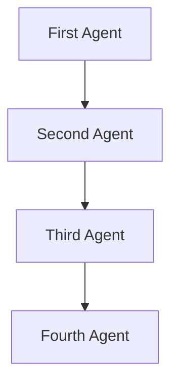

# SequentialWorkflow Documentation

**Overview:**
A Sequential Swarm architecture processes tasks in a linear sequence. Each agent completes its task before passing the result to the next agent in the chain. This architecture ensures orderly processing and is useful when tasks have dependencies.

**Use-Cases:**

- Workflows where each step depends on the previous one, such as assembly lines or sequential data processing.
- Scenarios requiring strict order of operations.
- Multi-step content creation, analysis, and refinement workflows.



## Attributes

| Attribute        | Type          | Description                                      |
|------------------|---------------|--------------------------------------------------|
| `id`             | `str`         | Unique identifier for the workflow instance. Defaults to `"sequential_workflow"`. |
| `name`           | `str`         | Human-readable name for the workflow. Defaults to `"SequentialWorkflow"`. |
| `description`    | `str`         | Description of the workflow's purpose. |
| `agents`         | `List[Union[Agent, Callable]]` | The list of agents or callables in the workflow. |
| `max_loops`      | `int`         | Maximum number of times to execute the workflow. Defaults to `1`. |
| `output_type`    | `OutputType`  | Format of the output from the workflow. Defaults to `"dict"`. |
| `shared_memory_system` | `callable` | Optional callable for managing shared memory between agents. |
| `multi_agent_collab_prompt` | `bool` | If True, appends a collaborative prompt to each agent's system prompt. |
| `team_awareness` | `bool`        | Enables sequential awareness features (passed to internal `AgentRearrange`). Defaults to `False`. |
| `autosave` | `bool` | Whether to enable autosaving of conversation history. Defaults to `True`. |
| `verbose` | `bool` | Whether to enable verbose logging. Defaults to `False`. |
| `flow`           | `str`         | A string representing the order of agents (e.g., "Agent1 -> Agent2 -> Agent3"). |
| `agent_rearrange`| `AgentRearrange` | Internal helper for managing agent execution. |
| `swarm_workspace_dir` | `str` | The workspace directory where conversation history is saved (set automatically when autosave is enabled). |

## Methods

### `__init__(self, agents: List[Union[Agent, Callable]] = None, max_loops: int = 1, team_awareness: bool = False, *args, **kwargs)`

The constructor initializes the `SequentialWorkflow` object.

- **Parameters:**
  - `id` (`str`, optional): Unique identifier for the workflow. Defaults to `"sequential_workflow"`.
  - `name` (`str`, optional): Name of the workflow. Defaults to `"SequentialWorkflow"`.
  - `description` (`str`, optional): Description of the workflow. Defaults to a standard description.
  - `agents` (`List[Union[Agent, Callable]]`, optional): The list of agents or callables to execute in sequence.
  - `max_loops` (`int`, optional): The maximum number of loops to execute the workflow. Defaults to `1`.
  - `output_type` (`OutputType`, optional): Output format for the workflow. Defaults to `"dict"`.
  - `shared_memory_system` (`callable`, optional): Callable for shared memory management. Defaults to `None`.
  - `multi_agent_collab_prompt` (`bool`, optional): If True, appends a collaborative prompt to each agent's system prompt. Defaults to `False`.
  - `team_awareness` (`bool`, optional): Enables sequential awareness features in the underlying `AgentRearrange`. Defaults to `False`.
  - `autosave` (`bool`, optional): Whether to enable autosaving of conversation history. Defaults to `True`.
  - `verbose` (`bool`, optional): Whether to enable verbose logging. Defaults to `False`.
  - `*args`: Variable length argument list.
  - `**kwargs`: Arbitrary keyword arguments.

### `run(self, task: str, img: Optional[str] = None, imgs: Optional[List[str]] = None, *args, **kwargs) -> str`

Runs the specified task through the agents in the dynamically constructed flow.

- **Parameters:**
  - `task` (`str`): The task for the agents to execute.
  - `img` (`Optional[str]`, optional): An optional image input for the agents.
  - `imgs` (`Optional[List[str]]`, optional): Optional list of images for the agents.
  - `*args`: Additional positional arguments.
  - `**kwargs`: Additional keyword arguments.

- **Returns:**
  - The final result after processing through all agents.

### `run_batched(self, tasks: List[str]) -> List[str]`

Executes a batch of tasks through the agents in the dynamically constructed flow.

- **Parameters:**
  - `tasks` (`List[str]`): A list of tasks for the agents to execute.

- **Returns:**
  - `List[str]`: A list of final results after processing through all agents.

### `async run_async(self, task: str) -> str`

Executes the specified task through the agents asynchronously.

- **Parameters:**
  - `task` (`str`): The task for the agents to execute.

- **Returns:**
  - `str`: The final result after processing through all agents.

### `async run_concurrent(self, tasks: List[str]) -> List[str]`

Executes a batch of tasks through the agents concurrently.

- **Parameters:**
  - `tasks` (`List[str]`): A list of tasks for the agents to execute.

- **Returns:**
  - `List[str]`: A list of final results after processing through all agents.

## Usage Examples

### Basic Sequential Workflow

This example demonstrates a simple two-agent workflow for researching and writing a blog post.

```python
from swarms import Agent, SequentialWorkflow

# Agent 1: The Researcher
researcher = Agent(
    agent_name="Researcher",
    system_prompt="Your job is to research the provided topic and provide a detailed summary.",
    model_name="gpt-4o-mini",
)

# Agent 2: The Writer
writer = Agent(
    agent_name="Writer",
    system_prompt="Your job is to take the research summary and write a beautiful, engaging blog post about it.",
    model_name="gpt-4o-mini",
)

# Create a sequential workflow where the researcher's output feeds into the writer's input
workflow = SequentialWorkflow(agents=[researcher, writer])

# Run the workflow on a task
final_post = workflow.run("The history and future of artificial intelligence")
print(final_post)
```

### Legal Practice Workflow

This example shows how to create a sequential workflow with multiple specialized legal agents.

```python
from swarms import Agent, SequentialWorkflow

# Litigation Agent
litigation_agent = Agent(
    agent_name="Alex Johnson",
    system_prompt="As a Litigator, you specialize in navigating the complexities of lawsuits. Your role involves analyzing intricate facts, constructing compelling arguments, and devising effective case strategies to achieve favorable outcomes for your clients.",
    model_name="gpt-4o-mini",
    max_loops=1,
)

# Corporate Attorney Agent
corporate_agent = Agent(
    agent_name="Emily Carter",
    system_prompt="As a Corporate Attorney, you provide expert legal advice on business law matters. You guide clients on corporate structure, governance, compliance, and transactions, ensuring their business operations align with legal requirements.",
    model_name="gpt-4o-mini",
    max_loops=1,
)

# IP Attorney Agent
ip_agent = Agent(
    agent_name="Michael Smith",
    system_prompt="As an IP Attorney, your expertise lies in protecting intellectual property rights. You handle various aspects of IP law, including patents, trademarks, copyrights, and trade secrets, helping clients safeguard their innovations.",
    model_name="gpt-4o-mini",
    max_loops=1,
)

# Initialize and run the workflow
swarm = SequentialWorkflow(
    agents=[litigation_agent, corporate_agent, ip_agent],
    name="litigation-practice",
    description="Handle all aspects of litigation with a focus on thorough legal analysis and effective case management.",
)

swarm.run("Create a report on how to patent an all-new AI invention and what platforms to use and more.")
```

### Startup Idea Validation Workflow

This example demonstrates a 3-step process for generating, validating, and pitching a startup idea.

```python
from swarms import Agent, SequentialWorkflow

# 1. Generate an idea
idea_generator = Agent(
    agent_name="IdeaGenerator",
    system_prompt="Generate a unique startup idea.",
    model_name="gpt-4o-mini"
)

# 2. Validate the idea
validator = Agent(
    agent_name="Validator",
    system_prompt="Take this startup idea and analyze its market viability.",
    model_name="gpt-4o-mini"
)

# 3. Create a pitch
pitch_creator = Agent(
    agent_name="PitchCreator",
    system_prompt="Write a 3-sentence elevator pitch for this validated startup idea.",
    model_name="gpt-4o-mini"
)

# Create the sequential workflow
workflow = SequentialWorkflow(agents=[idea_generator, validator, pitch_creator])

# Run the workflow
elevator_pitch = workflow.run("Generate and validate a startup idea in the AI space")
print(elevator_pitch)
```

### Advanced: Materials Science Workflow

This example shows a complex workflow with multiple specialized materials science agents.

```python
from swarms import Agent, SequentialWorkflow

# Chief Metallurgist
chief_metallurgist = Agent(
    agent_name="Chief-Metallurgist",
    system_prompt="As the Chief Metallurgist, you oversee the entire alloy development process, analyzing atomic structure, phase diagrams, and composition development.",
    model_name="gpt-4o",
    max_loops=1,
)

# Materials Scientist
materials_scientist = Agent(
    agent_name="Materials-Scientist",
    system_prompt="As the Materials Scientist, you analyze physical and mechanical properties including density, thermal properties, tensile strength, and microstructure.",
    model_name="gpt-4o",
    max_loops=1,
)

# Process Engineer
process_engineer = Agent(
    agent_name="Process-Engineer",
    system_prompt="As the Process Engineer, you develop manufacturing processes including melting procedures, heat treatment protocols, and quality control methods.",
    model_name="gpt-4o",
    max_loops=1,
)

# Quality Assurance Specialist
qa_specialist = Agent(
    agent_name="QA-Specialist",
    system_prompt="As the QA Specialist, you establish quality standards, testing protocols, and documentation requirements.",
    model_name="gpt-4o",
    max_loops=1,
)

# Applications Engineer
applications_engineer = Agent(
    agent_name="Applications-Engineer",
    system_prompt="As the Applications Engineer, you analyze potential applications, performance requirements, and competitive positioning.",
    model_name="gpt-4o",
    max_loops=1,
)

# Cost Analyst
cost_analyst = Agent(
    agent_name="Cost-Analyst",
    system_prompt="As the Cost Analyst, you evaluate material costs, production costs, and economic viability.",
    model_name="gpt-4o",
    max_loops=1,
)

# Create the agent list
agents = [
    chief_metallurgist,
    materials_scientist,
    process_engineer,
    qa_specialist,
    applications_engineer,
    cost_analyst,
]

# Initialize the workflow
swarm = SequentialWorkflow(
    name="alloy-development-system",
    agents=agents,
)

# Run the workflow
result = swarm.run(
    """Analyze and develop a new high-strength aluminum alloy for aerospace applications
    with improved fatigue resistance and corrosion resistance compared to 7075-T6,
    while maintaining similar density and cost effectiveness."""
)
print(result)
```

## Configuration Options

### Agent Parameters

| Parameter | Description | Default |
|-----------|-------------|---------|
| `agent_name` | Human-readable name for the agent | Required |
| `system_prompt` | Detailed role description and expertise | Required |
| `model_name` | LLM model to use | "gpt-4o-mini" |
| `max_loops` | Maximum number of processing loops | 1 |

### Workflow Parameters

| Parameter | Description | Default |
|-----------|-------------|---------|
| `agents` | List of agents to execute in sequence | Required |
| `name` | Name of the workflow | "SequentialWorkflow" |
| `description` | Description of workflow purpose | Standard description |
| `max_loops` | Number of times to execute workflow | 1 |
| `team_awareness` | Enable sequential awareness features | False |
| `autosave` | Enable automatic saving of conversation history | True |
| `verbose` | Enable verbose logging | False |

## Autosave Feature

Autosave is enabled by default (`autosave=True`). Conversation history is automatically saved to `{workspace_dir}/swarms/SequentialWorkflow/{workflow-name}-{timestamp}/conversation_history.json`.

To set a custom workspace directory name, use the `WORKSPACE_DIR` environment variable:

```python
import os
from swarms import Agent, SequentialWorkflow

# Set custom workspace directory where conversation history will be saved
# If not set, defaults to 'agent_workspace' in the current directory
os.environ["WORKSPACE_DIR"] = "my_project"

# Create workflow (autosave enabled by default)
workflow = SequentialWorkflow(
    name="content-workflow",
    agents=[writer, editor],
)

# Run workflow - conversation automatically saved
result = workflow.run("Write a blog post about AI")
```

## Best Practices

1. **Clear Agent Roles**: Give each agent a specific, well-defined role with a detailed system prompt.
2. **Ordered Dependencies**: Arrange agents in an order that makes sense for your workflow (e.g., research before writing).
3. **Agent Names**: Use descriptive agent names that clearly indicate their function.
4. **System Prompts**: Write comprehensive system prompts that explain the agent's expertise and responsibilities.
5. **Task Clarity**: Provide clear, specific tasks when calling `run()`.

## Logging and Error Handling

The `run` method includes comprehensive logging to track workflow execution:

```bash
2023-05-08 10:30:15.456 | INFO | Sequential Workflow Name: SequentialWorkflow is ready to run.
```

All errors during execution are logged and re-raised for proper error handling.

## Accessing Workflow Information

The `SequentialWorkflow` automatically creates a flow string showing the agent execution order:

```python
workflow = SequentialWorkflow(agents=[agent1, agent2, agent3])
print(workflow.flow)  # Output: "Agent1 -> Agent2 -> Agent3"
```

## Advanced Features

### Team Awareness

Enable `team_awareness=True` to provide agents with context about their position in the workflow (this feature is managed by the internal `AgentRearrange` object):

```python
workflow = SequentialWorkflow(
    agents=[researcher, writer, editor],
    team_awareness=True,
)
```

### Multi-Agent Collaboration Prompt

Set `multi_agent_collab_prompt=True` to automatically append a collaboration prompt to each agent's system prompt:

```python
workflow = SequentialWorkflow(
    agents=[agent1, agent2, agent3],
    multi_agent_collab_prompt=True,
)
```

## Notes

- The `SequentialWorkflow` internally uses `AgentRearrange` to manage agent execution.
- Each agent receives the output of the previous agent as its input.
- The workflow executes agents in the exact order they appear in the `agents` list.
- The workflow is designed for production use with comprehensive error handling and logging.
- For parallel execution, consider using `ConcurrentWorkflow` or `SpreadSheetSwarm` instead.

## Related Architectures

- **[ConcurrentWorkflow](https://docs.swarms.world/en/latest/swarms/structs/concurrent_workflow/)**: For running agents in parallel
- **[AgentRearrange](https://docs.swarms.world/en/latest/swarms/structs/agent_rearrange/)**: For complex agent relationships and dynamic flows
- **[SwarmRouter](https://docs.swarms.world/en/latest/swarms/structs/swarm_router/)**: Universal orchestrator for switching between different swarm types
