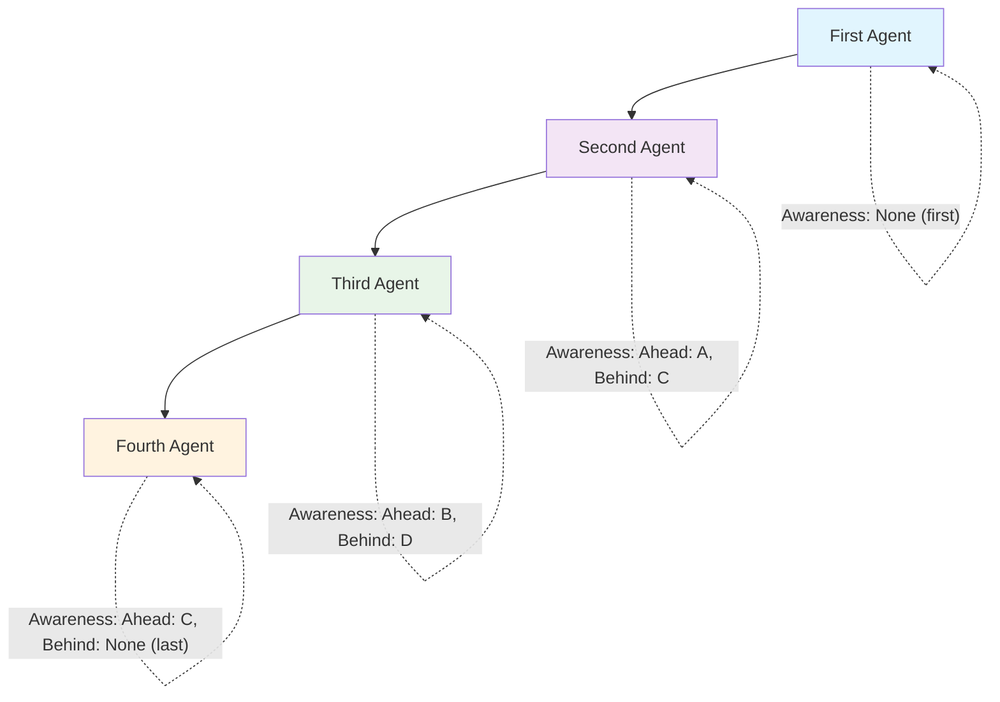

# SequentialWorkflow Documentation

**Overview:**
A Sequential Swarm architecture processes tasks in a linear sequence. Each agent completes its task before passing the result to the next agent in the chain. This architecture ensures orderly processing and is useful when tasks have dependencies. The system now includes **sequential awareness** features that allow agents to know about the agents ahead and behind them in the workflow, significantly enhancing coordination and context understanding. [Learn more here in the docs:](https://docs.swarms.world/en/latest/swarms/structs/agent_rearrange/)

**Use-Cases:**

- Workflows where each step depends on the previous one, such as assembly lines or sequential data processing.
- Scenarios requiring strict order of operations.
- **NEW**: Enhanced workflows where agents need context about their position in the sequence for better coordination.



## **Sequential Awareness Feature**

The SequentialWorkflow now includes a powerful **sequential awareness** feature that automatically provides each agent with context about their position in the workflow:

### What Agents Know Automatically

- **Agent ahead**: The agent that completed their task before them
- **Agent behind**: The agent that will receive their output next
- **Workflow position**: Their step number and role in the sequence

### Benefits

1. **Better Coordination**: Agents can reference previous work and prepare output for the next step
2. **Context Understanding**: Each agent knows their role in the larger workflow
3. **Improved Quality**: Output is tailored for the next agent in the sequence
4. **Enhanced Logging**: Better tracking of agent interactions and workflow progress

## Attributes

| Attribute        | Type          | Description                                      |
|------------------|---------------|--------------------------------------------------|
| `agents`         | `List[Agent]` | The list of agents in the workflow.              |
| `flow`           | `str`         | A string representing the order of agents.       |
| `agent_rearrange`| `AgentRearrange` | Manages the dynamic execution of agents with sequential awareness. |
| `team_awareness` | `bool`        | **NEW**: Enables sequential awareness features. Defaults to `False`. |
| `time_enabled`   | `bool`        | **NEW**: Enables timestamps in conversation. Defaults to `False`. |
| `message_id_on`  | `bool`        | **NEW**: Enables message IDs in conversation. Defaults to `False`. |

## Methods

### `__init__(self, agents: List[Agent] = None, max_loops: int = 1, team_awareness: bool = False, streaming_callback: Optional[Callable[[str], None]] = None, time_enabled: bool = False, message_id_on: bool = False, *args, **kwargs)`

The constructor initializes the `SequentialWorkflow` object with enhanced sequential awareness capabilities.

- **Parameters:**
  - `agents` (`List[Agent]`, optional): The list of agents in the workflow. Defaults to `None`.
  - `max_loops` (`int`, optional): The maximum number of loops to execute the workflow. Defaults to `1`.
  - `team_awareness` (`bool`, optional): **NEW**: Enables sequential awareness features. Defaults to `False`.
  - `time_enabled` (`bool`, optional): **NEW**: Enables timestamps in conversation. Defaults to `False`.
  - `message_id_on` (`bool`, optional): **NEW**: Enables message IDs in conversation. Defaults to `False`.
  - `streaming_callback` (`Callable[[str], None]`, optional): **NEW**: Enables streaming callback in conversation. Defaults to `None`.
  - `*args`: Variable length argument list.
  - `**kwargs`: Arbitrary keyword arguments.

### `run(self, task: str) -> str`

Runs the specified task through the agents in the dynamically constructed flow with enhanced sequential awareness.

- **Parameters:**
  - `task` (`str`): The task for the agents to execute.

- **Returns:**
  - `str`: The final result after processing through all agents.

### **NEW: Sequential Awareness Methods**

#### `get_agent_sequential_awareness(self, agent_name: str) -> str`

Gets the sequential awareness information for a specific agent, showing which agents come before and after in the sequence.

- **Parameters:**
  - `agent_name` (`str`): The name of the agent to get awareness for.

- **Returns:**
  - `str`: A string describing the agents ahead and behind in the sequence.

#### `get_sequential_flow_structure(self) -> str`

Gets the overall sequential flow structure information showing the complete workflow with relationships between agents.

- **Returns:**
  - `str`: A string describing the complete sequential flow structure.

## **Usage Example with Sequential Awareness:**

```python
from swarms import Agent, SequentialWorkflow

# Initialize agents for individual tasks
agent1 = Agent(
  agent_name="ICD-10 Code Analyzer",
  system_prompt="Analyze medical data and provide relevant ICD-10 codes.",
  model_name="gpt-4o",
  max_loops=1,
)
agent2 = Agent(
  agent_name="ICD-10 Code Summarizer",
  system_prompt="Summarize the findings and suggest ICD-10 codes.",
  model_name="gpt-4o",
  max_loops=1,
)
agent3 = Agent(
  agent_name="ICD-10 Code Validator",
  system_prompt="Validate and finalize the ICD-10 code recommendations.",
  model_name="gpt-4o",
  max_loops=1,
)

# Create the Sequential workflow with enhanced awareness
workflow = SequentialWorkflow(
  agents=[agent1, agent2, agent3], 
  max_loops=1, 
  verbose=False,
  team_awareness=True,    # Enable sequential awareness
  time_enabled=True,      # Enable timestamps
  message_id_on=True      # Enable message IDs
)

# Get workflow structure information
flow_structure = workflow.get_sequential_flow_structure()
print("Workflow Structure:")
print(flow_structure)

# Get awareness for specific agents
analyzer_awareness = workflow.get_agent_sequential_awareness("ICD-10 Code Analyzer")
summarizer_awareness = workflow.get_agent_sequential_awareness("ICD-10 Code Summarizer")
validator_awareness = workflow.get_agent_sequential_awareness("ICD-10 Code Validator")

print(f"\nAnalyzer Awareness: {analyzer_awareness}")
print(f"Summarizer Awareness: {summarizer_awareness}")
print(f"Validator Awareness: {validator_awareness}")

# Run the workflow
result = workflow.run(
  "Analyze the medical report and provide the appropriate ICD-10 codes."
)
print(f"\nFinal Result: {result}")
```

**Expected Output:**
```
Workflow Structure:
Sequential Flow Structure:
Step 1: ICD-10 Code Analyzer
Step 2: ICD-10 Code Summarizer (follows: ICD-10 Code Analyzer) (leads to: ICD-10 Code Validator)
Step 3: ICD-10 Code Validator (follows: ICD-10 Code Summarizer)

Analyzer Awareness: 
Summarizer Awareness: Sequential awareness: Agent ahead: ICD-10 Code Analyzer | Agent behind: ICD-10 Code Validator
Validator Awareness: Sequential awareness: Agent ahead: ICD-10 Code Summarizer
```

## **How Sequential Awareness Works**

### 1. **Automatic Context Injection**
When `team_awareness=True`, the system automatically adds awareness information to each agent's conversation context before they run:

- **First Agent**: No awareness info (starts the workflow)
- **Middle Agents**: Receive info about both the agent ahead and behind
- **Last Agent**: Receives info about the agent ahead only

### 2. **Enhanced Agent Prompts**
Each agent receives context like:
```
Sequential awareness: Agent ahead: ICD-10 Code Analyzer | Agent behind: ICD-10 Code Validator
```

### 3. **Improved Coordination**
Agents can now:
- Reference previous work more effectively
- Prepare output specifically for the next agent
- Understand their role in the larger workflow
- Provide better context for subsequent steps

## **Advanced Usage Examples**

### **Example 1: Research → Analysis → Report Workflow**
```python
# Create specialized agents
researcher = Agent(
    agent_name="Researcher",
    system_prompt="Conduct thorough research on the given topic."
)

analyzer = Agent(
    agent_name="Data Analyzer", 
    system_prompt="Analyze research data and identify key insights."
)

reporter = Agent(
    agent_name="Report Writer",
    system_prompt="Write comprehensive reports based on analysis."
)

# Create workflow with awareness
workflow = SequentialWorkflow(
    agents=[researcher, analyzer, reporter],
    team_awareness=True,
    time_enabled=True
)

# Run with enhanced coordination
result = workflow.run("Research and analyze the impact of AI on healthcare")
```

### **Example 2: Code Review Workflow**
```python
# Create code review agents
linter = Agent(
    agent_name="Code Linter",
    system_prompt="Check code for syntax errors and style violations."
)

reviewer = Agent(
    agent_name="Code Reviewer",
    system_prompt="Review code quality and suggest improvements."
)

tester = Agent(
    agent_name="Code Tester",
    system_prompt="Write and run tests for the reviewed code."
)

# Create workflow
workflow = SequentialWorkflow(
    agents=[linter, reviewer, tester],
    team_awareness=True
)

# Run code review process
result = workflow.run("Review and test the authentication module")
```

## **Notes:**

- **Enhanced Logging**: The workflow now logs sequential awareness information for better debugging and monitoring.
- **Automatic Context**: No manual configuration needed - awareness is automatically provided when `team_awareness=True`.
- **Backward Compatibility**: Existing workflows continue to work without changes.
- **Performance**: Sequential awareness adds minimal overhead while significantly improving coordination.

### Logging and Error Handling

The `run` method now includes enhanced logging to track the sequential awareness flow and captures detailed information about agent interactions:

```bash
2023-05-08 10:30:15.456 | INFO | SequentialWorkflow:run:45 - Starting sequential workflow execution
2023-05-08 10:30:15.457 | INFO | SequentialWorkflow:run:52 - Added sequential awareness for ICD-10 Code Summarizer: Sequential awareness: Agent ahead: ICD-10 Code Analyzer | Agent behind: ICD-10 Code Validator
2023-05-08 10:30:15.458 | INFO | SequentialWorkflow:run:52 - Added sequential awareness for ICD-10 Code Validator: Sequential awareness: Agent ahead: ICD-10 Code Summarizer
```

## Additional Tips

- **Enable Team Awareness**: Set `team_awareness=True` to unlock the full potential of sequential coordination.
- **Use Descriptive Agent Names**: Clear agent names make the awareness information more useful.
- **Monitor Logs**: Enhanced logging provides insights into how agents are coordinating.
- **Iterative Improvement**: Use the awareness features to refine agent prompts and improve workflow quality.

## **Benefits of Sequential Awareness**

1. **Improved Quality**: Agents produce better output when they understand their context
2. **Better Coordination**: Reduced redundancy and improved handoffs between agents
3. **Enhanced Debugging**: Clear visibility into agent interactions and workflow progress
4. **Scalable Workflows**: Easy to add new agents while maintaining coordination
5. **Professional Workflows**: Mimics real-world team collaboration patterns

The SequentialWorkflow with sequential awareness represents a significant advancement in multi-agent coordination, enabling more sophisticated and professional workflows that closely mirror human team collaboration patterns.


## **Usage Example with Streaming Callback in Sequential Workflows:**

```python
from swarms.structs.agent import Agent
from swarms.structs.sequential_workflow import SequentialWorkflow

"""Callback Function to Be Used"""
def streaming_callback(agent_name: str, chunk: str, is_final: bool):
    if chunk:
        print(chunk, end="", flush=True)
    if is_final:
        print()

def create_agents():
    """Create specialized agents for the workflow."""
    return [
        Agent(
            agent_name="Research_Agent",
            agent_description="Specialized in gathering and analyzing information",
            system_prompt="You are a research specialist. Provide detailed, accurate information on any topic.",
            model_name="gpt-4o-mini",
            max_loops=1,
            streaming_on=True,
            print_on=False,
        ),
        Agent(
            agent_name="Analysis_Agent",
            agent_description="Expert at analyzing data and drawing insights",
            system_prompt="You are an analysis expert. Break down complex information and provide clear insights.",
            model_name="gpt-4o-mini",
            max_loops=1,
            streaming_on=True,
            print_on=False,
        ),
    ]

if __name__ == "__main__":
    agents = create_agents()
    workflow = SequentialWorkflow(
        id="research_analysis_workflow",
        name="Research Analysis Workflow",
        description="A sequential workflow that researches and analyzes topics",
        agents=agents,
        max_loops=1,
        output_type="str",
        multi_agent_collab_prompt=True,
    )

    task = "What are the latest advancements in AI?"

    workflow.run(
        task=task,
        streaming_callback=streaming_callback,
    )
```
