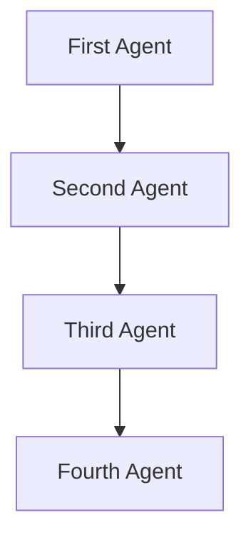

# SequentialWorkflow Documentation

**Overview:**
A Sequential Swarm architecture processes tasks in a linear sequence. Each agent completes its task before passing the result to the next agent in the chain. This architecture ensures orderly processing and is useful when tasks have dependencies. [Learn more here in the docs:](https://docs.swarms.world/en/latest/swarms/structs/agent_rearrange/)

**Use-Cases:**

- Workflows where each step depends on the previous one, such as assembly lines or sequential data processing.

- Scenarios requiring strict order of operations.



## Attributes

| Attribute        | Type          | Description                                      |
|------------------|---------------|--------------------------------------------------|
| `agents`         | `List[Agent]` | The list of agents in the workflow.              |
| `flow`           | `str`         | A string representing the order of agents.       |
| `agent_rearrange`| `AgentRearrange` | Manages the dynamic execution of agents.        |

## Methods

### `__init__(self, agents: List[Agent] = None, max_loops: int = 1, *args, **kwargs)`

The constructor initializes the `SequentialWorkflow` object.

- **Parameters:**
  - `agents` (`List[Agent]`, optional): The list of agents in the workflow. Defaults to `None`.
  - `max_loops` (`int`, optional): The maximum number of loops to execute the workflow. Defaults to `1`.
  - `*args`: Variable length argument list.
  - `**kwargs`: Arbitrary keyword arguments.

### `run(self, task: str) -> str`

Runs the specified task through the agents in the dynamically constructed flow.

- **Parameters:**
  - `task` (`str`): The task for the agents to execute.

- **Returns:**
  - `str`: The final result after processing through all agents.

## **Usage Example:**

```python

from swarms import Agent, SequentialWorkflow

# Initialize agents for individual tasks
agent1 = Agent(
  agent_name="ICD-10 Code Analyzer",
  system_prompt="Analyze medical data and provide relevant ICD-10 codes.",
  model_name="gpt-4o",
  max_loops=1,
)
agent2 = Agent(
  agent_name="ICD-10 Code Summarizer",
  system_prompt="Summarize the findings and suggest ICD-10 codes.",
  model_name="gpt-4o",
  max_loops=1,
)

# Create the Sequential workflow
workflow = SequentialWorkflow(
  agents=[agent1, agent2], max_loops=1, verbose=False
)

# Run the workflow
workflow.run(
  "Analyze the medical report and provide the appropriate ICD-10 codes."
)

```

This example initializes a `SequentialWorkflow` with three agents and executes a task, printing the final result.

##  **Notes:**

- Logs the task execution process and handles any exceptions that occur during the task execution.

### Logging and Error Handling

The `run` method includes logging to track the execution flow and captures errors to provide detailed information in case of failures. This is crucial for debugging and ensuring smooth operation of the workflow.

## Additional Tips

- Ensure that the agents provided to the `SequentialWorkflow` are properly initialized and configured to handle the tasks they will receive.

- The `max_loops` parameter can be used to control how many times the workflow should be executed, which is useful for iterative processes.

- Utilize the logging information to monitor and debug the task execution process.
