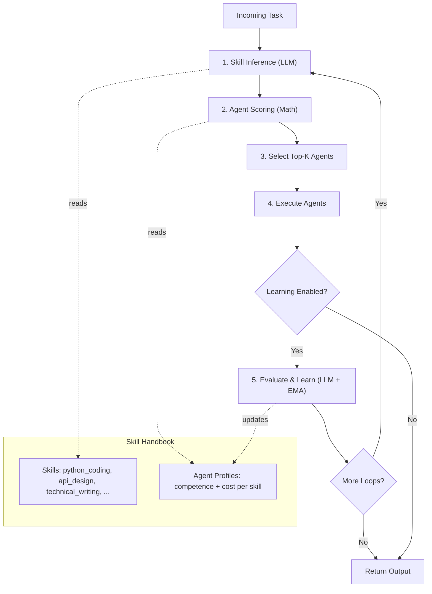
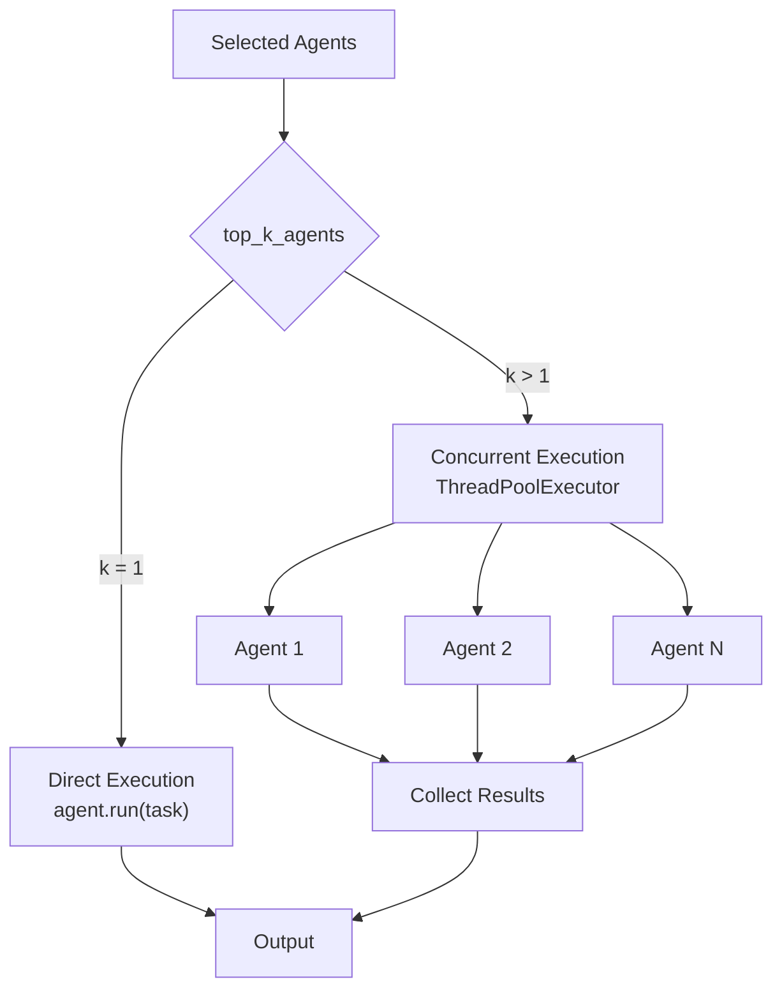

# SkillOrchestra Documentation

SkillOrchestra is a skill-aware agent orchestration system based on the paper ["SkillOrchestra: Learning to Route Agents via Skill Transfer"](https://arxiv.org/abs/2602.19672). Instead of end-to-end RL routing, it maintains a **Skill Handbook** that profiles each agent on fine-grained skills, infers which skills a task requires via LLM, and matches agents to tasks via explicit competence-cost scoring.

## Table of Contents
- [Installation](#installation)
- [How It Works](#how-it-works)
- [Key Components](#key-components)
- [Arguments](#arguments)
- [Methods](#methods)
- [Usage Examples](#usage-examples)
  - [Basic Usage](#basic-usage)
  - [Custom Skill Handbook](#custom-skill-handbook)
  - [Multi-Agent Selection](#multi-agent-selection)
  - [Learning from Execution](#learning-from-execution)
  - [Software Development Team](#software-development-team)
  - [Financial Analysis Team](#financial-analysis-team)
- [Architecture](#architecture)
- [Best Practices](#best-practices)

## Installation

```bash
pip install swarms
```

## How It Works

SkillOrchestra routes tasks through a 5-step pipeline:

```
Task → Skill Inference → Agent Scoring → Agent Selection → Execution → Learning
```

1. **Skill Inference** — An LLM analyzes the incoming task and identifies which fine-grained skills are required (e.g., `python_coding`, `data_analysis`, `technical_writing`), each with an importance weight.
2. **Agent Scoring** — Each agent is scored using a weighted competence-cost formula against the required skills. This step is pure math — no LLM calls.
3. **Agent Selection** — The top-k agents with the highest scores are selected.
4. **Execution** — Selected agents execute the task. Multiple agents run concurrently via `ThreadPoolExecutor`.
5. **Learning** (optional) — An LLM evaluates the output quality, and agent skill profiles are updated via exponential moving average (EMA).

### Scoring Formula

For each agent, the score is computed as:

```
score = Σ (competence_weight × competence_i × importance_i + cost_weight × normalized_cost_i × importance_i) / total_importance
```

Where:
- `competence_i` is the agent's estimated probability of success on skill `i`
- `normalized_cost_i` is `1 - (cost - min_cost) / (max_cost - min_cost)` (lower cost = higher score)
- `importance_i` is how important the skill is for the task

## Key Components

### Data Models

| Model | Description |
|-------|-------------|
| `SkillDefinition` | A fine-grained skill with name, description, and optional category |
| `AgentSkillProfile` | An agent's competence (0-1) and cost on a specific skill, with execution statistics |
| `AgentProfile` | Complete skill profile for a single agent |
| `SkillHandbook` | Central data structure mapping all skills to all agent profiles |
| `TaskSkillInference` | LLM output: skills required by a given task with importance weights |
| `AgentSelectionResult` | Result of agent scoring with name, score, and reasoning |
| `ExecutionFeedback` | Post-execution quality assessment for updating skill profiles |

### Arguments Table

| Argument | Type | Default | Description |
|----------|------|---------|-------------|
| `name` | `str` | `"SkillOrchestra"` | Name identifier for the orchestrator |
| `description` | `str` | `"Skill-aware agent orchestration..."` | Description of the orchestrator's purpose |
| `agents` | `List[Union[Agent, Callable]]` | `None` | List of agents to orchestrate (required, at least 1) |
| `max_loops` | `int` | `1` | Maximum execution-feedback loops per task |
| `output_type` | `OutputType` | `"dict"` | Output format: `"dict"`, `"str"`, `"json"`, `"final"`, etc. |
| `model` | `str` | `"gpt-4o-mini"` | LLM model for skill inference and evaluation |
| `temperature` | `float` | `0.1` | LLM temperature for inference calls |
| `skill_handbook` | `Optional[SkillHandbook]` | `None` | Pre-built skill handbook. If `None`, auto-generated from agent descriptions |
| `auto_generate_skills` | `bool` | `True` | Whether to auto-generate handbook when none is provided |
| `cost_weight` | `float` | `0.3` | Weight for cost component in scoring (0-1) |
| `competence_weight` | `float` | `0.7` | Weight for competence component in scoring (0-1) |
| `top_k_agents` | `int` | `1` | Number of agents to select per task |
| `learning_enabled` | `bool` | `True` | Whether to update skill profiles after execution via EMA |
| `learning_rate` | `float` | `0.1` | EMA learning rate for profile updates |
| `autosave` | `bool` | `True` | Whether to save conversation history and handbook to disk |
| `verbose` | `bool` | `False` | Whether to log detailed information |
| `print_on` | `bool` | `True` | Whether to print panels to console |

### Methods Table

| Method | Arguments | Returns | Description |
|--------|-----------|---------|-------------|
| `run` | `task: str, img: Optional[str], imgs: Optional[List[str]]` | `Any` | Run the full pipeline on a single task |
| `__call__` | `task: str, *args, **kwargs` | `Any` | Callable interface — delegates to `run()` |
| `batch_run` | `tasks: List[str]` | `List[Any]` | Run multiple tasks sequentially |
| `concurrent_batch_run` | `tasks: List[str]` | `List[Any]` | Run multiple tasks concurrently |
| `get_handbook` | — | `dict` | Return the current skill handbook as a dictionary |
| `update_handbook` | `handbook: SkillHandbook` | `None` | Replace the skill handbook |

## Usage Examples

### Basic Usage

The simplest way to use SkillOrchestra — it auto-generates a skill handbook from agent descriptions.

```python
from swarms import Agent, SkillOrchestra

# Define agents with distinct specializations
code_agent = Agent(
    agent_name="CodeExpert",
    description="Expert Python developer who writes clean, efficient, production-ready code",
    system_prompt="You are an expert Python developer. Write clean, well-documented, production-ready code with proper error handling and type hints.",
    model_name="gpt-4o-mini",
    max_loops=1,
)

writer_agent = Agent(
    agent_name="TechWriter",
    description="Technical writing specialist who creates clear documentation and tutorials",
    system_prompt="You are a technical writing specialist. Write clear, comprehensive documentation with examples and proper formatting.",
    model_name="gpt-4o-mini",
    max_loops=1,
)

researcher_agent = Agent(
    agent_name="Researcher",
    description="Research analyst who gathers, synthesizes, and compares information",
    system_prompt="You are a research analyst. Provide thorough, well-structured analysis with comparisons, trade-offs, and actionable recommendations.",
    model_name="gpt-4o-mini",
    max_loops=1,
)

# Create SkillOrchestra — auto-generates skill handbook from agent descriptions
orchestra = SkillOrchestra(
    name="DevTeamOrchestra",
    agents=[code_agent, writer_agent, researcher_agent],
    model="gpt-4o-mini",
    top_k_agents=1,          # Select the single best agent per task
    learning_enabled=False,  # Disable profile updates for simplicity
    output_type="final",     # Return only the final agent output
)

# Inspect the auto-generated skill handbook
print("Generated Skill Handbook:")
for skill in orchestra.skill_handbook.skills:
    print(f"  - {skill.name}: {skill.description}")

# Run a task — routes to the most competent agent automatically
result = orchestra.run("Write a Python function to parse and validate JSON config files")
print(result)
```

### Custom Skill Handbook

You can provide a pre-built skill handbook for full control over skill definitions and agent profiles.

```python
from swarms import Agent
from swarms.structs.skill_orchestra import (
    SkillOrchestra,
    SkillHandbook,
    SkillDefinition,
    AgentProfile,
    AgentSkillProfile,
)

# Define skills manually
skills = [
    SkillDefinition(
        name="python_coding",
        description="Writing Python code with proper patterns and error handling",
        category="engineering",
    ),
    SkillDefinition(
        name="api_design",
        description="Designing RESTful APIs with proper structure and documentation",
        category="engineering",
    ),
    SkillDefinition(
        name="technical_writing",
        description="Writing clear technical documentation and tutorials",
        category="documentation",
    ),
    SkillDefinition(
        name="data_analysis",
        description="Analyzing datasets and producing insights",
        category="analysis",
    ),
]

# Define agent profiles with explicit competence and cost
agent_profiles = [
    AgentProfile(
        agent_name="CodeExpert",
        skill_profiles=[
            AgentSkillProfile(skill_name="python_coding", competence=0.95, cost=1.2),
            AgentSkillProfile(skill_name="api_design", competence=0.9, cost=1.0),
            AgentSkillProfile(skill_name="technical_writing", competence=0.4, cost=1.5),
            AgentSkillProfile(skill_name="data_analysis", competence=0.6, cost=1.3),
        ],
    ),
    AgentProfile(
        agent_name="TechWriter",
        skill_profiles=[
            AgentSkillProfile(skill_name="python_coding", competence=0.3, cost=1.5),
            AgentSkillProfile(skill_name="api_design", competence=0.5, cost=1.2),
            AgentSkillProfile(skill_name="technical_writing", competence=0.95, cost=0.8),
            AgentSkillProfile(skill_name="data_analysis", competence=0.4, cost=1.4),
        ],
    ),
    AgentProfile(
        agent_name="DataAnalyst",
        skill_profiles=[
            AgentSkillProfile(skill_name="python_coding", competence=0.7, cost=1.0),
            AgentSkillProfile(skill_name="api_design", competence=0.3, cost=1.5),
            AgentSkillProfile(skill_name="technical_writing", competence=0.5, cost=1.2),
            AgentSkillProfile(skill_name="data_analysis", competence=0.95, cost=0.9),
        ],
    ),
]

handbook = SkillHandbook(skills=skills, agent_profiles=agent_profiles)

# Create agents
code_agent = Agent(agent_name="CodeExpert", description="Expert Python developer", model_name="gpt-4o-mini", max_loops=1)
writer_agent = Agent(agent_name="TechWriter", description="Technical writing specialist", model_name="gpt-4o-mini", max_loops=1)
data_agent = Agent(agent_name="DataAnalyst", description="Data analysis expert", model_name="gpt-4o-mini", max_loops=1)

# Pass the custom handbook
orchestra = SkillOrchestra(
    agents=[code_agent, writer_agent, data_agent],
    skill_handbook=handbook,
    auto_generate_skills=False,
)

# This routes to DataAnalyst (highest competence on data_analysis)
result = orchestra.run("Analyze the sales dataset and identify trends for Q3")
```

### Multi-Agent Selection

Select multiple agents per task by setting `top_k_agents > 1`. Selected agents execute concurrently.

```python
from swarms import Agent, SkillOrchestra

agents = [
    Agent(agent_name="BackendDev", description="Backend API developer with database expertise", model_name="gpt-4o-mini", max_loops=1),
    Agent(agent_name="FrontendDev", description="Frontend developer specializing in React and UI/UX", model_name="gpt-4o-mini", max_loops=1),
    Agent(agent_name="SecurityEngineer", description="Security expert for vulnerability assessment and secure coding", model_name="gpt-4o-mini", max_loops=1),
]

orchestra = SkillOrchestra(
    agents=agents,
    top_k_agents=2,  # Select the top 2 agents for each task
    output_type="dict",
)

# Both BackendDev and SecurityEngineer likely selected for this task
result = orchestra.run("Design a secure authentication system with JWT tokens and refresh token rotation")
```

### Learning from Execution

Enable learning to update agent skill profiles over time based on execution quality.

```python
from swarms import Agent, SkillOrchestra

agents = [
    Agent(agent_name="GeneralistA", description="General-purpose assistant", model_name="gpt-4o-mini", max_loops=1),
    Agent(agent_name="GeneralistB", description="General-purpose assistant", model_name="gpt-4o-mini", max_loops=1),
]

orchestra = SkillOrchestra(
    agents=agents,
    learning_enabled=True,   # Enable EMA profile updates
    learning_rate=0.1,       # How fast profiles adapt (higher = faster)
    max_loops=2,             # Run 2 loops: execute, learn, refine, learn
)

# After each execution, the LLM evaluates output quality and updates
# the agent's competence scores via exponential moving average:
#   new_competence = old_competence * (1 - lr) + quality_score * lr
result = orchestra.run("Summarize the key findings from this research paper")

# Inspect updated profiles
handbook = orchestra.get_handbook()
for profile in handbook["agent_profiles"]:
    print(f"\n{profile['agent_name']}:")
    for sp in profile["skill_profiles"]:
        print(f"  {sp['skill_name']}: competence={sp['competence']:.3f}, executions={sp['execution_count']}")
```

### Software Development Team

```python
from swarms import Agent, SkillOrchestra

# Define a full dev team
agents = [
    Agent(
        agent_name="ArchitectAgent",
        description="Software architect who designs system architecture, selects technology stacks, and creates scalable solutions",
        system_prompt="You are a software architect. Design clean, scalable system architectures with clear component boundaries and data flow.",
        model_name="gpt-4o-mini",
        max_loops=1,
    ),
    Agent(
        agent_name="BackendAgent",
        description="Backend developer specializing in APIs, databases, and server-side logic",
        system_prompt="You are a backend developer. Write robust server-side code with proper API design, database queries, and error handling.",
        model_name="gpt-4o-mini",
        max_loops=1,
    ),
    Agent(
        agent_name="FrontendAgent",
        description="Frontend developer specializing in React, CSS, and responsive UI components",
        system_prompt="You are a frontend developer. Build responsive, accessible UI components with clean React code and modern CSS.",
        model_name="gpt-4o-mini",
        max_loops=1,
    ),
    Agent(
        agent_name="DevOpsAgent",
        description="DevOps engineer handling CI/CD pipelines, Docker, Kubernetes, and cloud infrastructure",
        system_prompt="You are a DevOps engineer. Design and implement CI/CD pipelines, containerization, and cloud infrastructure.",
        model_name="gpt-4o-mini",
        max_loops=1,
    ),
    Agent(
        agent_name="QAAgent",
        description="QA engineer who writes test plans, test cases, and automated tests",
        system_prompt="You are a QA engineer. Write comprehensive test plans, unit tests, integration tests, and end-to-end tests.",
        model_name="gpt-4o-mini",
        max_loops=1,
    ),
]

orchestra = SkillOrchestra(
    name="DevTeam",
    agents=agents,
    model="gpt-4o-mini",
    top_k_agents=1,
    learning_enabled=True,
    output_type="final",
)

# Each task automatically routes to the best-matched agent
tasks = [
    "Design the microservices architecture for an e-commerce platform",        # → ArchitectAgent
    "Write a REST API endpoint for user registration with input validation",   # → BackendAgent
    "Build a responsive product card component with image carousel",           # → FrontendAgent
    "Set up a GitHub Actions CI/CD pipeline with Docker and Kubernetes",       # → DevOpsAgent
    "Write a test plan and pytest test cases for the user registration API",   # → QAAgent
]

# Run all tasks sequentially
results = orchestra.batch_run(tasks)

# Or run concurrently for independent tasks
results = orchestra.concurrent_batch_run(tasks)
```

### Financial Analysis Team

```python
from swarms import Agent, SkillOrchestra

agents = [
    Agent(
        agent_name="QuantAnalyst",
        description="Quantitative analyst specializing in statistical modeling, risk metrics, and portfolio optimization",
        system_prompt="You are a quantitative analyst. Build statistical models, compute risk metrics (VaR, Sharpe, etc.), and optimize portfolios.",
        model_name="gpt-4o-mini",
        max_loops=1,
    ),
    Agent(
        agent_name="FundamentalAnalyst",
        description="Fundamental analyst who evaluates company financials, earnings reports, and intrinsic valuations",
        system_prompt="You are a fundamental analyst. Analyze financial statements, compute valuation metrics, and assess company health.",
        model_name="gpt-4o-mini",
        max_loops=1,
    ),
    Agent(
        agent_name="ComplianceOfficer",
        description="Regulatory compliance specialist for financial regulations, reporting requirements, and audit procedures",
        system_prompt="You are a compliance officer. Ensure regulatory compliance, review reporting requirements, and flag potential violations.",
        model_name="gpt-4o-mini",
        max_loops=1,
    ),
]

orchestra = SkillOrchestra(
    name="FinanceTeam",
    agents=agents,
    model="gpt-4o-mini",
    competence_weight=0.8,  # Prioritize competence over cost
    cost_weight=0.2,
    output_type="final",
)

# Routes to QuantAnalyst
result = orchestra.run("Calculate the Value-at-Risk for a portfolio with 60% equities, 30% bonds, 10% alternatives")

# Routes to FundamentalAnalyst
result = orchestra.run("Analyze Apple's Q3 earnings report and estimate fair value using DCF model")

# Routes to ComplianceOfficer
result = orchestra.run("Review our trading desk procedures for MiFID II compliance gaps")
```

## Architecture

### Pipeline Flow



### Scoring & Selection

```mermaid
flowchart LR
    subgraph Task Skills
        TS1["python_coding (importance: 0.9)"]
        TS2["api_design (importance: 0.5)"]
    end

    subgraph Agent Profiles
        AP1["CodeExpert\npython: 0.95, api: 0.90"]
        AP2["TechWriter\npython: 0.30, api: 0.50"]
        AP3["Researcher\npython: 0.60, api: 0.30"]
    end

    Task Skills --> SCORE["Scoring Formula\nscore = sum(w_c * competence * importance\n+ w_cost * norm_cost * importance)\n/ total_importance"]
    Agent Profiles --> SCORE

    SCORE --> R1["CodeExpert: 0.68"]
    SCORE --> R2["TechWriter: 0.31"]
    SCORE --> R3["Researcher: 0.42"]

    R1 --> SEL["Select Top-K"]
    R2 --> SEL
    R3 --> SEL
    SEL --> WIN["CodeExpert selected"]
```

### Execution Modes



## Best Practices

### Agent Design

- **Write descriptive agent descriptions** — The auto-generated skill handbook is only as good as your agent descriptions. Be specific about what each agent can do.
- **Use distinct specializations** — Agents with overlapping skills reduce the effectiveness of skill-based routing. Make each agent clearly specialized.
- **Keep system prompts focused** — System prompts should reinforce the agent's specialization, not try to make the agent a generalist.

### Tuning Weights

- **Default (0.7 competence / 0.3 cost)** — Good for most use cases where quality matters more than cost.
- **High competence weight (0.9 / 0.1)** — Use when quality is critical and cost is not a concern.
- **Balanced (0.5 / 0.5)** — Use when you want a balance between quality and cost efficiency.
- **High cost weight (0.3 / 0.7)** — Use for high-volume, cost-sensitive workloads where "good enough" is acceptable.

### Learning Configuration

- **`learning_rate=0.1`** (default) — Slow adaptation, stable profiles. Good for production.
- **`learning_rate=0.3`** — Faster adaptation. Good for initial calibration of a new team.
- **`max_loops=1`** — Single pass, no refinement. Best for simple tasks.
- **`max_loops=2-3`** — Execute, evaluate, refine. Good for complex tasks that benefit from iterative improvement.

### Error Handling

```python
try:
    result = orchestra.run(task)
except ValueError as e:
    # Configuration errors (no agents, invalid weights)
    print(f"Configuration error: {e}")
except Exception as e:
    # Execution errors (LLM failures, agent errors)
    print(f"Execution error: {e}")
```

### Inspecting Routing Decisions

Enable `verbose=True` and `print_on=True` to see detailed routing information:

```python
orchestra = SkillOrchestra(
    agents=agents,
    verbose=True,    # Logs skill inference and scoring details
    print_on=True,   # Prints formatted panels to console
)
```

### Saving and Loading Handbooks

```python
import json
from swarms.structs.skill_orchestra import SkillHandbook

# Save a tuned handbook
handbook_dict = orchestra.get_handbook()
with open("my_handbook.json", "w") as f:
    json.dump(handbook_dict, f, indent=2)

# Load and reuse later
with open("my_handbook.json") as f:
    data = json.load(f)

handbook = SkillHandbook.model_validate(data)
orchestra = SkillOrchestra(
    agents=agents,
    skill_handbook=handbook,
    auto_generate_skills=False,
)
```
