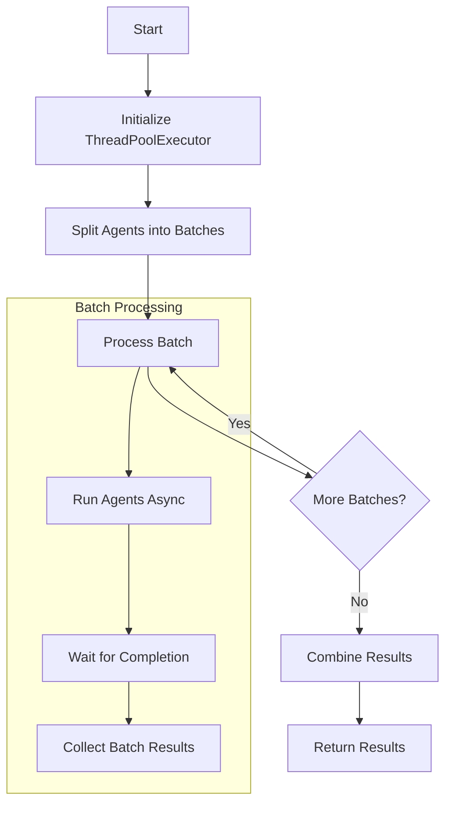

# Concurrent Agents API Reference

This documentation covers the API for running multiple agents concurrently using various execution strategies. The implementation uses `asyncio` with `uvloop` for enhanced performance and `ThreadPoolExecutor` for handling CPU-bound operations.

## Table of Contents
- [Core Functions](#core-functions)
- [Advanced Functions](#advanced-functions)
- [Utility Functions](#utility-functions)
- [Resource Monitoring](#resource-monitoring)
- [Usage Examples](#usage-examples)

## Core Functions

### run_agents_concurrently()

Primary function for running multiple agents concurrently with optimized performance using both uvloop and ThreadPoolExecutor.

#### Arguments

| Parameter    | Type           | Required | Default        | Description |
|-------------|----------------|----------|----------------|-------------|
| agents      | List[AgentType]| Yes      | -              | List of Agent instances to run concurrently |
| task        | str            | Yes      | -              | Task string to execute |
| batch_size  | int           | No       | CPU count      | Number of agents to run in parallel in each batch |
| max_workers | int           | No       | CPU count * 2  | Maximum number of threads in the executor |

#### Returns
`List[Any]`: List of outputs from each agent

#### Flow Diagram



### run_agents_sequentially()

Runs multiple agents sequentially for baseline comparison or simple use cases.

#### Arguments

| Parameter | Type           | Required | Default | Description |
|-----------|----------------|----------|---------|-------------|
| agents    | List[AgentType]| Yes      | -       | List of Agent instances to run |
| task      | str            | Yes      | -       | Task string to execute |

#### Returns
`List[Any]`: List of outputs from each agent

## Advanced Functions

### run_agents_with_different_tasks()

Runs multiple agents with different tasks concurrently.

#### Arguments

| Parameter        | Type                          | Required | Default        | Description |
|-----------------|-------------------------------|----------|----------------|-------------|
| agent_task_pairs| List[tuple[AgentType, str]]   | Yes      | -              | List of (agent, task) tuples |
| batch_size      | int                           | No       | CPU count      | Number of agents to run in parallel |
| max_workers     | int                           | No       | CPU count * 2  | Maximum number of threads |

### run_agents_with_timeout()

Runs multiple agents concurrently with timeout limits.

#### Arguments

| Parameter    | Type           | Required | Default        | Description |
|-------------|----------------|----------|----------------|-------------|
| agents      | List[AgentType]| Yes      | -              | List of Agent instances |
| task        | str            | Yes      | -              | Task string to execute |
| timeout     | float          | Yes      | -              | Timeout in seconds for each agent |
| batch_size  | int           | No       | CPU count      | Number of agents to run in parallel |
| max_workers | int           | No       | CPU count * 2  | Maximum number of threads |

## Usage Examples

```python
from swarms.structs.agent import Agent
from your_module import run_agents_concurrently

# Initialize agents
agents = [
    Agent(
        agent_name=f"Analysis-Agent-{i}",
        system_prompt="You are a financial analysis expert",
        llm=model,
        max_loops=1
    )
    for i in range(5)
]

# Basic concurrent execution
task = "Analyze the impact of rising interest rates on tech stocks"
outputs = run_agents_concurrently(agents, task)

# Running with timeout
outputs_with_timeout = run_agents_with_timeout(
    agents=agents,
    task=task,
    timeout=30.0,
    batch_size=2
)

# Running different tasks
task_pairs = [
    (agents[0], "Analyze tech stocks"),
    (agents[1], "Analyze energy stocks"),
    (agents[2], "Analyze retail stocks")
]
different_outputs = run_agents_with_different_tasks(task_pairs)
```

## Resource Monitoring

### ResourceMetrics

A dataclass for system resource metrics.

#### Properties

| Property        | Type  | Description |
|----------------|-------|-------------|
| cpu_percent    | float | Current CPU usage percentage |
| memory_percent | float | Current memory usage percentage |
| active_threads | int   | Number of active threads |

### run_agents_with_resource_monitoring()

Runs agents with system resource monitoring and adaptive batch sizing.

#### Arguments

| Parameter         | Type           | Required | Default | Description |
|------------------|----------------|----------|---------|-------------|
| agents           | List[AgentType]| Yes      | -       | List of Agent instances |
| task             | str            | Yes      | -       | Task string to execute |
| cpu_threshold    | float          | No       | 90.0    | Max CPU usage percentage |
| memory_threshold | float          | No       | 90.0    | Max memory usage percentage |
| check_interval   | float          | No       | 1.0     | Resource check interval in seconds |

## Performance Considerations

- All functions are decorated with `@profile_func` for performance monitoring
- Default batch sizes and worker counts are optimized based on CPU cores
- Resource monitoring helps prevent system overload
- Using `uvloop` provides better performance than standard `asyncio`

## Error Handling

- Functions handle asyncio event loop creation/retrieval
- Timeout mechanism prevents infinite waiting
- Resource monitoring allows for adaptive performance adjustment