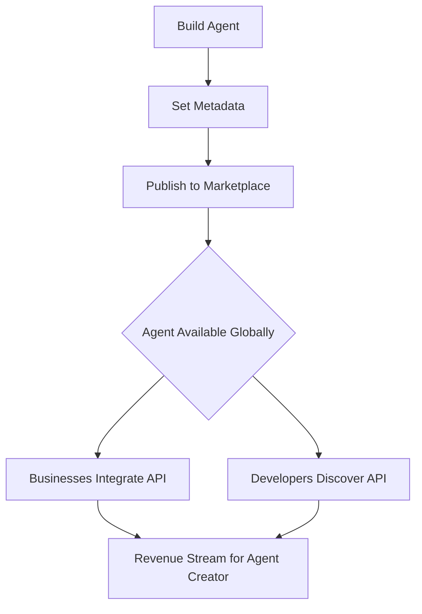

## Visionary Document: The Swarms Cloud and Agent Marketplace

### Introduction

We stand at the dawn of a new era—the **Agentic Economy**, where the power of intelligent automation is in the hands of everyone. The Swarms Cloud and Agent Marketplace will serve as the epicenter of this economy, enabling developers, businesses, and creators to easily publish, discover, and leverage intelligent agents. Our vision is to make publishing agents as simple as possible through an intuitive CLI, while empowering users to generate income by posting their APIs on the marketplace.

The Swarms Marketplace is more than just a platform—it’s a **revolutionary ecosystem** that will change how we think about automation and intelligence. By building this platform, we aim to democratize access to agent-driven solutions, enabling a seamless bridge between creators and consumers of automation. With every agent posted to the marketplace, a ripple effect is created, driving innovation across industries and providing an unparalleled opportunity for monetization.

---

### The Agent Marketplace

#### A Unified Platform for Automation

In the Swarms Marketplace, **agents will be the new currency of efficiency**. Whether you’re building agents for marketing, finance, customer service, or any other domain, the Swarms Cloud will allow you to showcase your agentic APIs, easily discoverable by anyone needing those capabilities.

We envision the marketplace to function like an API store, where users can search for specific agent capabilities, purchase access to agents, or even integrate their existing systems with agent-based APIs that others have developed. Each agent you publish will come with a potential income stream as businesses and developers integrate your creations into their workflows.

#### The Opportunity to Monetize Your APIs

The Swarms Marketplace is designed to let developers and businesses generate income by sharing their agent APIs. Once your agent is published to the marketplace, other users can browse, test, and integrate it into their operations. You will be able to set custom pricing, usage tiers, and licensing terms for your API, ensuring you can profit from your innovations.

Our vision for monetization includes:
- **API subscriptions**: Allow users to subscribe to your agent API with recurring payments.
- **Per-use pricing**: Offer users a pay-as-you-go model where they only pay for the API calls they use.
- **Licensing**: Enable others to purchase full access to your agent for a set period or on a project basis.

### Publishing Agents: Simplicity Through CLI

The complexity of deploying agents to a marketplace should never be a barrier. Our goal is to **streamline the publishing process** into something as simple as a command-line interaction. The Swarms CLI will be your one-stop solution to get your agent up and running on the marketplace.

#### CLI Workflow:

1. **Create an Agent**: Build your agent using the Swarms framework or any custom framework of your choice.
2. **Set Agent Metadata**: Through the CLI, input the metadata about your agent, including its capabilities, pricing, and target industries.
3. **Publish to Marketplace**: Run the simple `swarms publish` command to instantly deploy your agent to the marketplace.
4. **Monitor Usage and Income**: Use the Swarms Cloud dashboard to view your agent's interactions, track API usage, and receive payouts.

Here’s an example of how easy publishing will be:

```bash
$ swarms create-agent --name "CustomerSupportAgent" --type "LLM" 
$ swarms set-metadata --description "An intelligent agent for customer support operations" --pricing "subscription" --rate "$20/month"
$ swarms publish
```

Within minutes, your agent will be live and accessible to the global marketplace!

---

### Empowering Businesses

For businesses, the marketplace offers **an unprecedented opportunity to automate tasks**, integrate pre-built agents, and drastically cut operational costs. Companies no longer need to build every system from scratch. With the marketplace, they can simply discover and plug in the agentic solutions that best suit their needs.

Mermaid Diagram for Publishing Agents:



---

### The Future of Automation: Agents as APIs

In this future we’re creating, **agents will be as ubiquitous as APIs**. The Swarms Marketplace will be an expansive repository of intelligent agents, each contributing to the automation and streamlining of everyday tasks. Imagine a world where every business can access highly specific, pre-built intelligence for any task, from customer support to supply chain management, and integrate these agents into their processes in minutes.

Mermaid Diagram for API Discovery and Integration:


---

### Conclusion

The Swarms Cloud and Agent Marketplace will usher in an **agent-powered future**, where **automation is accessible to all**, and **monetization opportunities** are boundless. Our vision is to create a space where developers can not only build and showcase their agents but can also create sustainable income streams from their creations. The CLI will remove the friction of deployment, and the marketplace will enable a **self-sustaining ecosystem** of agentic intelligence that powers the next generation of automation. 

Together, we will shape the **Agentic Economy**, where **collaboration, innovation, and financial opportunity** intersect. Welcome to the future of intelligent automation. Welcome to **Swarms Cloud**.