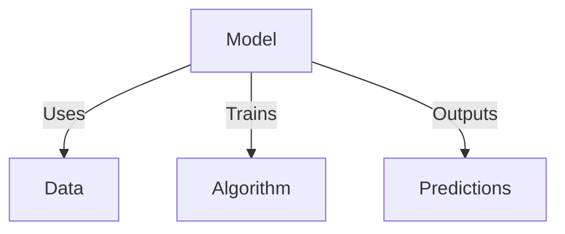
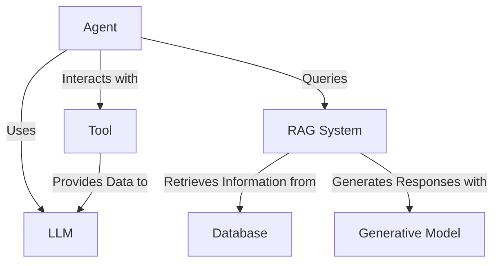
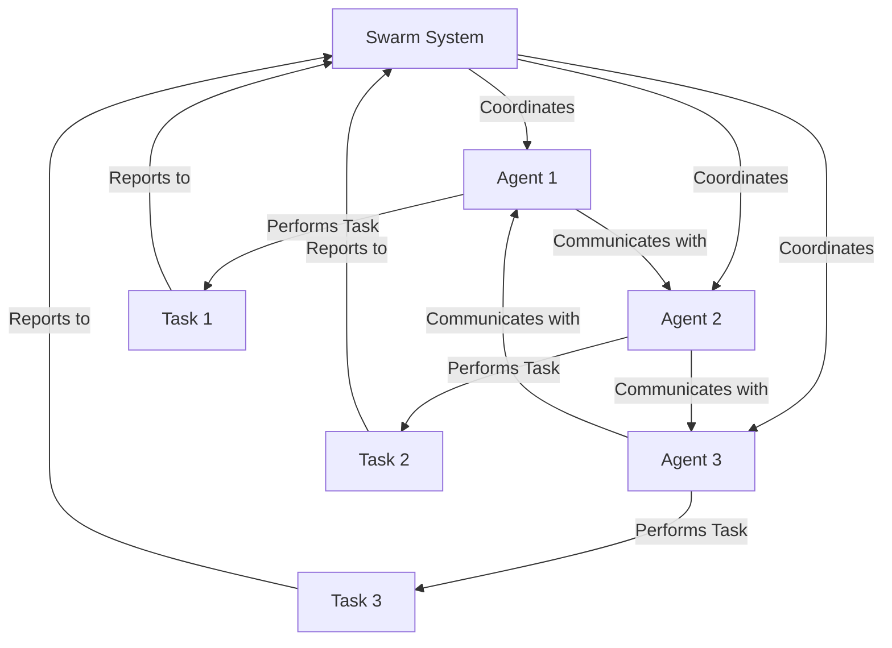

To create a comprehensive overview of the Swarms framework, we can break it down into key concepts such as models, agents, tools, Retrieval-Augmented Generation (RAG) systems, and swarm systems. Below are conceptual explanations of these components along with mermaid diagrams to illustrate their interactions.

### Swarms Framework Overview

#### 1. **Models**
Models are the core component of the Swarms framework, representing the neural networks and machine learning models used to perform various tasks. These can be Large Language Models (LLMs), vision models, or any other AI models.

#### 2. **Agents**
Agents are autonomous units that use models to perform specific tasks. In the Swarms framework, agents can leverage tools and interact with RAG systems.

- **LLMs with Tools**: These agents use large language models along with tools like databases, APIs, and external knowledge sources to enhance their capabilities.
- **RAG Systems**: These systems combine retrieval mechanisms with generative models to produce more accurate and contextually relevant outputs.

#### 3. **Swarm Systems**
Swarm systems involve multiple agents working collaboratively to achieve complex tasks. These systems coordinate and communicate among agents to ensure efficient and effective task execution.

### Mermaid Diagrams

#### Models

#### Agents: LLMs with Tools and RAG Systems

#### Swarm Systems

### Conceptualization

1. **Models**: The basic building blocks trained on specific datasets to perform tasks.
2. **Agents**: Intelligent entities that utilize models and tools to perform actions. LLM agents can use additional tools to enhance their capabilities.
3. **RAG Systems**: Enhance agents by combining retrieval mechanisms (to fetch relevant information) with generative models (to create contextually relevant responses).
4. **Swarm Systems**: Complex systems where multiple agents collaborate, communicate, and coordinate to perform complex, multi-step tasks efficiently.

### Summary
The Swarms framework leverages models, agents, tools, RAG systems, and swarm systems to create a robust, collaborative environment for executing complex AI tasks. By coordinating multiple agents and enhancing their capabilities with tools and retrieval-augmented generation, Swarms can handle sophisticated and multi-faceted applications effectively.