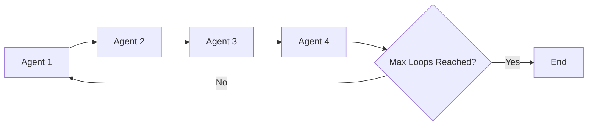
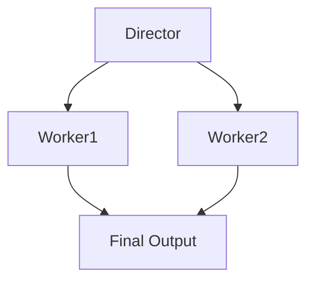
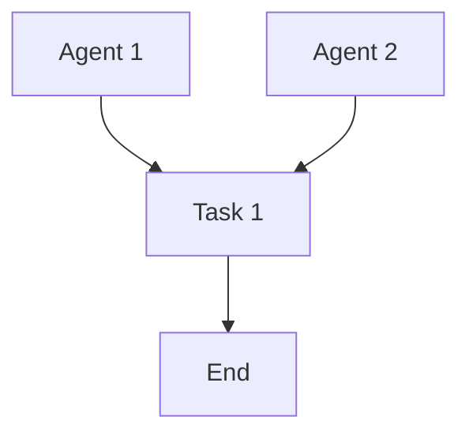
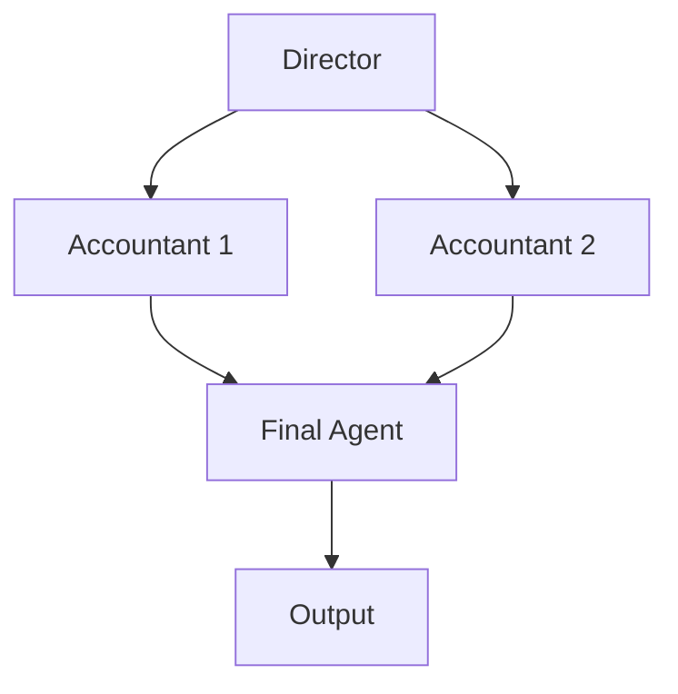
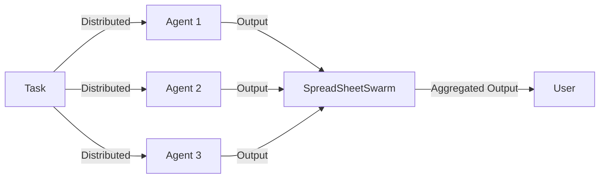
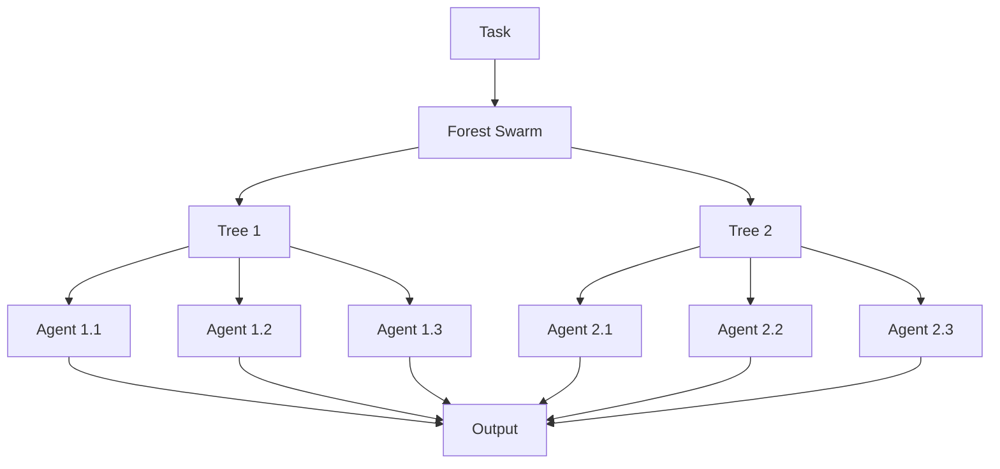

# Multi-Agent Orchestration:
Swarms was designed to facilitate the communication between many different and specialized agents from a vast array of other frameworks such as langchain, autogen, crew, and more.

In traditional swarm theory, there are many types of swarms usually for very specialized use-cases and problem sets. Such as Hiearchical and sequential are great for accounting and sales, because there is usually a boss coordinator agent that distributes a workload to other specialized agents.


| **Name**                      | **Description**                                                                                                                                                         | **Code Link**                                                                                      | **Use Cases**                                                                                     |
|-------------------------------|-------------------------------------------------------------------------------------------------------------------------------------------------------------------------|----------------------------------------------------------------------------------------------------|---------------------------------------------------------------------------------------------------|
| Hierarchical Swarms           | A system where agents are organized in a hierarchy, with higher-level agents coordinating lower-level agents to achieve complex tasks.                                   | [Code Link](https://docs.swarms.world/en/latest/swarms/concept/swarm_architectures/#hierarchical-swarm) | Manufacturing process optimization, multi-level sales management, healthcare resource coordination |
| Agent Rearrange               | A setup where agents rearrange themselves dynamically based on the task requirements and environmental conditions.                                                       | [Code Link](https://docs.swarms.world/en/latest/swarms/structs/agent_rearrange/)                   | Adaptive manufacturing lines, dynamic sales territory realignment, flexible healthcare staffing  |
| Concurrent Workflows          | Agents perform different tasks simultaneously, coordinating to complete a larger goal.                                                                                  | [Code Link](https://docs.swarms.world/en/latest/swarms/concept/swarm_architectures/#concurrent-workflows) | Concurrent production lines, parallel sales operations, simultaneous patient care processes       |
| Sequential Coordination       | Agents perform tasks in a specific sequence, where the completion of one task triggers the start of the next.                                                           | [Code Link](https://docs.swarms.world/en/latest/swarms/structs/sequential_workflow/)               | Step-by-step assembly lines, sequential sales processes, stepwise patient treatment workflows     |
| Parallel Processing           | Agents work on different parts of a task simultaneously to speed up the overall process.                                                                                | [Code Link](https://docs.swarms.world/en/latest/swarms/concept/swarm_architectures/#parallel-processing) | Parallel data processing in manufacturing, simultaneous sales analytics, concurrent medical tests  |
| Mixture of Agents             | A heterogeneous swarm where agents with different capabilities are combined to solve complex problems.                                                                  | [Code Link](https://docs.swarms.world/en/latest/swarms/structs/moa/)                               | Financial forecasting, complex problem-solving requiring diverse skills                           |
| Graph Workflow                | Agents collaborate in a directed acyclic graph (DAG) format to manage dependencies and parallel tasks.                                                                  | [Code Link](https://docs.swarms.world/en/latest/swarms/structs/graph_workflow/)                    | AI-driven software development pipelines, complex project management                              |
| Group Chat                    | Agents engage in a chat-like interaction to reach decisions collaboratively.                                                                                           | [Code Link](https://docs.swarms.world/en/latest/swarms/structs/group_chat/)                        | Real-time collaborative decision-making, contract negotiations                                    |
| Agent Registry                | A centralized registry where agents are stored, retrieved, and invoked dynamically.                                                                                     | [Code Link](https://docs.swarms.world/en/latest/swarms/structs/agent_registry/)                    | Dynamic agent management, evolving recommendation engines                                         |
| Spreadsheet Swarm             | Manages tasks at scale, tracking agent outputs in a structured format like CSV files.                                                                                   | [Code Link](https://docs.swarms.world/en/latest/swarms/structs/spreadsheet_swarm/)                 | Large-scale marketing analytics, financial audits                                                 |
| Forest Swarm                  | A swarm structure that organizes agents in a tree-like hierarchy for complex decision-making processes.                                                                 | [Code Link](https://docs.swarms.world/en/latest/swarms/structs/forest_swarm/)                      | Multi-stage workflows, hierarchical reinforcement learning                                        |


## Understanding Swarms

### What is a Swarm?

A swarm, in the context of multi-agent systems, refers to a group of more than two agents working collaboratively to achieve a common goal. These agents can be software entities, such as llms that interact with each other to perform complex tasks. The concept of a swarm is inspired by natural systems like ant colonies or bird flocks, where simple individual behaviors lead to complex group dynamics and problem-solving capabilities.

### How Swarm Architectures Facilitate Communication

Swarm architectures are designed to establish and manage communication between agents within a swarm. These architectures define how agents interact, share information, and coordinate their actions to achieve the desired outcomes. Here are some key aspects of swarm architectures:

1. **Hierarchical Communication**: In hierarchical swarms, communication flows from higher-level agents to lower-level agents. Higher-level agents act as coordinators, distributing tasks and aggregating results. This structure is efficient for tasks that require top-down control and decision-making.

2. **Parallel Communication**: In parallel swarms, agents operate independently and communicate with each other as needed. This architecture is suitable for tasks that can be processed concurrently without dependencies, allowing for faster execution and scalability.

3. **Sequential Communication**: Sequential swarms process tasks in a linear order, where each agent's output becomes the input for the next agent. This ensures that tasks with dependencies are handled in the correct sequence, maintaining the integrity of the workflow.

4. **Mesh Communication**: In mesh swarms, agents are fully connected, allowing any agent to communicate with any other agent. This setup provides high flexibility and redundancy, making it ideal for complex systems requiring dynamic interactions.

5. **Federated Communication**: Federated swarms involve multiple independent swarms that collaborate by sharing information and results. Each swarm operates autonomously but can contribute to a larger task, enabling distributed problem-solving across different nodes.

Swarm architectures leverage these communication patterns to ensure that agents work together efficiently, adapting to the specific requirements of the task at hand. By defining clear communication protocols and interaction models, swarm architectures enable the seamless orchestration of multiple agents, leading to enhanced performance and problem-solving capabilities.


## Table of Contents
1. [Sequential Workflow](#sequential-workflow)
2. [Agent Rearrange](#agent-rearrange)
3. [Graph Swarm](#graph-swarm)
4. [Mixture of Agents](#mixture-of-agents)
5. [Spreadsheet Swarm](#spreadsheet-swarm)
6. [Forest Swarm](#forest-swarm)

## Sequential Workflow

The `SequentialWorkflow` allows you to execute tasks with agents in a sequential manner, passing the output of one agent to the next until a specified maximum number of loops is reached.

### Diagram



### Example Usage

```python
from swarms import Agent, SequentialWorkflow
from swarm_models import Anthropic

# Initialize the language model
llm = Anthropic()

# Initialize agents for individual tasks
agent1 = Agent(
    agent_name="Blog generator",
    system_prompt="Generate a blog post like Stephen King",
    llm=llm,
    max_loops=1,
    dashboard=False,
    tools=[],
)
agent2 = Agent(
    agent_name="Summarizer",
    system_prompt="Summarize the blog post",
    llm=llm,
    max_loops=1,
    dashboard=False,
    tools=[],
)

# Create the Sequential workflow
workflow = SequentialWorkflow(
    agents=[agent1, agent2],
    max_loops=1,
    verbose=False
)

# Run the workflow
result = workflow.run(
    "Generate a blog post on how swarms of agents can help businesses grow."
)
print(result)
```

### Methods

| Method | Description | Parameters | Return Value |
|--------|-------------|------------|--------------|
| `__init__` | Initialize the SequentialWorkflow | `agents`: List of Agent objects<br>`max_loops`: Maximum number of iterations<br>`verbose`: Boolean for verbose output | None |
| `run` | Execute the workflow | `input_data`: Initial input for the first agent | Final output after all agents have processed |

### Inputs

| Input | Type | Description |
|-------|------|-------------|
| `agents` | List[Agent] | List of Agent objects to be executed sequentially |
| `max_loops` | int | Maximum number of times the entire sequence will be repeated |
| `verbose` | bool | If True, print detailed information during execution |

### Output

The `run` method returns the final output after all agents have processed the input sequentially.

## Agent Rearrange

The `AgentRearrange` orchestration technique allows you to define and map out relationships between various agents, enabling both linear and concurrent workflows.

### Diagram



### Example Usage

```python
from swarms import Agent, AgentRearrange
from swarm_models import Anthropic

# Initialize the director agent
director = Agent(
    agent_name="Director",
    system_prompt="Directs the tasks for the workers",
    llm=Anthropic(),
    max_loops=1,
    dashboard=False,
    streaming_on=True,
    verbose=True,
    stopping_token="<DONE>",
    state_save_file_type="json",
    saved_state_path="director.json",
)

# Initialize worker 1
worker1 = Agent(
    agent_name="Worker1",
    system_prompt="Generates a transcript for a YouTube video on what swarms are",
    llm=Anthropic(),
    max_loops=1,
    dashboard=False,
    streaming_on=True,
    verbose=True,
    stopping_token="<DONE>",
    state_save_file_type="json",
    saved_state_path="worker1.json",
)

# Initialize worker 2
worker2 = Agent(
    agent_name="Worker2",
    system_prompt="Summarizes the transcript generated by Worker1",
    llm=Anthropic(),
    max_loops=1,
    dashboard=False,
    streaming_on=True,
    verbose=True,
    stopping_token="<DONE>",
    state_save_file_type="json",
    saved_state_path="worker2.json",
)

# Create a list of agents
agents = [director, worker1, worker2]

# Define the flow pattern
flow = "Director -> Worker1 -> Worker2"

# Using AgentRearrange class
agent_system = AgentRearrange(agents=agents, flow=flow)
output = agent_system.run(
    "Create a format to express and communicate swarms of LLMs in a structured manner for YouTube"
)
print(output)
```

### Methods

| Method | Description | Parameters | Return Value |
|--------|-------------|------------|--------------|
| `__init__` | Initialize the AgentRearrange | `agents`: List of Agent objects<br>`flow`: String describing the agent flow | None |
| `run` | Execute the workflow | `input_data`: Initial input for the first agent | Final output after all agents have processed |

### Inputs

| Input | Type | Description |
|-------|------|-------------|
| `agents` | List[Agent] | List of Agent objects to be orchestrated |
| `flow` | str | String describing the flow of agents (e.g., "A -> B, C") |

### Output

The `run` method returns the final output after all agents have processed the input according to the specified flow.

## Graph Swarm

The `GraphSwarm` is a workflow management system that uses a directed acyclic graph (DAG) to model dependencies between tasks and agents, allowing for efficient task assignment and execution.

### Diagram



### Example Usage

```python
import os
from dotenv import load_dotenv
from swarms import Agent, Edge, GraphWorkflow, Node, NodeType
from swarm_models import OpenAIChat

load_dotenv()

api_key = os.environ.get("OPENAI_API_KEY")

llm = OpenAIChat(
    temperature=0.5, openai_api_key=api_key, max_tokens=4000
)
agent1 = Agent(llm=llm, max_loops=1, autosave=True, dashboard=True)
agent2 = Agent(llm=llm, max_loops=1, autosave=True, dashboard=True)

def sample_task():
    print("Running sample task")
    return "Task completed"

wf_graph = GraphWorkflow()
wf_graph.add_node(Node(id="agent1", type=NodeType.AGENT, agent=agent1))
wf_graph.add_node(Node(id="agent2", type=NodeType.AGENT, agent=agent2))
wf_graph.add_node(
    Node(id="task1", type=NodeType.TASK, callable=sample_task)
)
wf_graph.add_edge(Edge(source="agent1", target="task1"))
wf_graph.add_edge(Edge(source="agent2", target="task1"))

wf_graph.set_entry_points(["agent1", "agent2"])
wf_graph.set_end_points(["task1"])

print(wf_graph.visualize())

# Run the workflow
results = wf_graph.run()
print("Execution results:", results)
```

### Methods

| Method | Description | Parameters | Return Value |
|--------|-------------|------------|--------------|
| `add_node` | Add a node to the graph | `node`: Node object | None |
| `add_edge` | Add an edge to the graph | `edge`: Edge object | None |
| `set_entry_points` | Set the entry points of the graph | `entry_points`: List of node IDs | None |
| `set_end_points` | Set the end points of the graph | `end_points`: List of node IDs | None |
| `visualize` | Generate a visual representation of the graph | None | String representation of the graph |
| `run` | Execute the workflow | None | Dictionary of execution results |

### Inputs

| Input | Type | Description |
|-------|------|-------------|
| `Node` | Object | Represents a node in the graph (agent or task) |
| `Edge` | Object | Represents an edge connecting two nodes |
| `entry_points` | List[str] | List of node IDs where the workflow starts |
| `end_points` | List[str] | List of node IDs where the workflow ends |

### Output

The `run` method returns a dictionary containing the execution results of all nodes in the graph.

## Mixture of Agents

The `MixtureOfAgents` is an implementation based on the paper "Mixture-of-Agents Enhances Large Language Model Capabilities". It allows for parallelization followed by sequential processing in another loop.

### Diagram



### Example Usage

```python
from swarms import Agent, OpenAIChat, MixtureOfAgents

# Initialize the director agent
director = Agent(
    agent_name="Director",
    system_prompt="Directs the tasks for the accountants",
    llm=OpenAIChat(),
    max_loops=1,
    dashboard=False,
    streaming_on=True,
    verbose=True,
    stopping_token="<DONE>",
    state_save_file_type="json",
    saved_state_path="director.json",
)

# Initialize accountant 1
accountant1 = Agent(
    agent_name="Accountant1",
    system_prompt="Prepares financial statements",
    llm=OpenAIChat(),
    max_loops=1,
    dashboard=False,
    streaming_on=True,
    verbose=True,
    stopping_token="<DONE>",
    state_save_file_type="json",
    saved_state_path="accountant1.json",
)

# Initialize accountant 2
accountant2 = Agent(
    agent_name="Accountant2",
    system_prompt="Audits financial records",
    llm=OpenAIChat(),
    max_loops=1,
    dashboard=False,
    streaming_on=True,
    verbose=True,
    stopping_token="<DONE>",
    state_save_file_type="json",
    saved_state_path="accountant2.json",
)

# Create a list of agents
agents = [director, accountant1, accountant2]

# Swarm
swarm = MixtureOfAgents(
    name="Mixture of Accountants",
    agents=agents,
    layers=3,
    final_agent=director,
)

# Run the swarm
out = swarm.run("Prepare financial statements and audit financial records")
print(out)
```

### Methods

| Method | Description | Parameters | Return Value |
|--------|-------------|------------|--------------|
| `__init__` | Initialize the MixtureOfAgents | `name`: Name of the swarm<br>`agents`: List of Agent objects<br>`layers`: Number of processing layers<br>`final_agent`: Agent for final processing | None |
| `run` | Execute the swarm | `task`: Input task for the swarm | Final output after all agents have processed |

### Inputs

| Input | Type | Description |
|-------|------|-------------|
| `name` | str | Name of the swarm |
| `agents` | List[Agent] | List of Agent objects to be used in the swarm |
| `layers` | int | Number of processing layers in the swarm |
| `final_agent` | Agent | Agent responsible for final processing |

### Output

The `run` method returns the final output after all agents have processed the input according to the specified layers and final agent.

## Spreadsheet Swarm

The `SpreadSheetSwarm` is designed for concurrent management and oversight of thousands of agents, facilitating a one-to-many approach for efficient task processing and output analysis.

### Diagram



### Example Usage

```python
import os
from swarms import Agent
from swarm_models import OpenAIChat
from swarms.structs.spreadsheet_swarm import SpreadSheetSwarm

# Define custom system prompts for each social media platform
TWITTER_AGENT_SYS_PROMPT = """
You are a Twitter marketing expert specializing in real estate. Your task is to create engaging, concise tweets to promote properties, analyze trends to maximize engagement, and use appropriate hashtags and timing to reach potential buyers.
"""

INSTAGRAM_AGENT_SYS_PROMPT = """
You are an Instagram marketing expert focusing on real estate. Your task is to create visually appealing posts with engaging captions and hashtags to showcase properties, targeting specific demographics interested in real estate.
"""

FACEBOOK_AGENT_SYS_PROMPT = """
You are a Facebook marketing expert for real estate. Your task is to craft posts optimized for engagement and reach on Facebook, including using images, links, and targeted messaging to attract potential property buyers.
"""

LINKEDIN_AGENT_SYS_PROMPT = """
You are a LinkedIn marketing expert for the real estate industry. Your task is to create professional and informative posts, highlighting property features, market trends, and investment opportunities, tailored to professionals and investors.
"""

EMAIL_AGENT_SYS_PROMPT = """
You are an Email marketing expert specializing in real estate. Your task is to write compelling email campaigns to promote properties, focusing on personalization, subject lines, and effective call-to-action strategies to drive conversions.
"""

api_key = os.getenv("OPENAI_API_KEY")

# Model
model = OpenAIChat(
    openai_api_key=api_key, model_name="gpt-4-0314", temperature=0.1
)

# Initialize your agents for different social media platforms
agents = [
    Agent(
        agent_name="Twitter-RealEstate-Agent",
        system_prompt=TWITTER_AGENT_SYS_PROMPT,
        llm=model,
        max_loops=1,
        dynamic_temperature_enabled=True,
        saved_state_path="twitter_realestate_agent.json",
        user_name="realestate_swarms",
        retry_attempts=1,
    ),
    Agent(
        agent_name="Instagram-RealEstate-Agent",
        system_prompt=INSTAGRAM_AGENT_SYS_PROMPT,
        llm=model,
        max_loops=1,
        dynamic_temperature_enabled=True,
        saved_state_path="instagram_realestate_agent.json",
        user_name="realestate_swarms",
        retry_attempts=1,
    ),
    Agent(
        agent_name="Facebook-RealEstate-Agent",
        system_prompt=FACEBOOK_AGENT_SYS_PROMPT,
        llm=model,
        max_loops=1,
        dynamic_temperature_enabled=True,
        saved_state_path="facebook_realestate_agent.json",
        user_name="realestate_swarms",
        retry_attempts=1,
    ),
    Agent(
        agent_name="LinkedIn-RealEstate-Agent",
        system_prompt=system_prompt=LINKEDIN_AGENT_SYS_PROMPT,
        llm=model,
        max_loops=1,
        dynamic_temperature_enabled=True,
        saved_state_path="linkedin_realestate_agent.json",
        user_name="realestate_swarms",
        retry_attempts=1,
    ),
    Agent(
        agent_name="Email-RealEstate-Agent",
        system_prompt=EMAIL_AGENT_SYS_PROMPT,
        llm=model,
        max_loops=1,
        dynamic_temperature_enabled=True,
        saved_state_path="email_realestate_agent.json",
        user_name="realestate_swarms",
        retry_attempts=1,
    ),
]

# Create a Swarm with the list of agents
swarm = SpreadSheetSwarm(
    name="Real-Estate-Marketing-Swarm",
    description="A swarm that processes real estate marketing tasks using multiple agents on different threads.",
    agents=agents,
    autosave_on=True,
    save_file_path="real_estate_marketing_spreadsheet.csv",
    run_all_agents=False,
    max_loops=2,
)

# Run the swarm
swarm.run(
    task="""
    Create posts to promote luxury properties in North Texas, highlighting their features, location, and investment potential. Include relevant hashtags, images, and engaging captions.

    Property:
    $10,399,000
    1609 Meandering Way Dr, Roanoke, TX 76262
    Link to the property: https://www.zillow.com/homedetails/1609-Meandering-Way-Dr-Roanoke-TX-76262/308879785_zpid/
    
    What's special:
    Unveiling a new custom estate in the prestigious gated Quail Hollow Estates! This impeccable residence, set on a sprawling acre surrounded by majestic trees, features a gourmet kitchen equipped with top-tier Subzero and Wolf appliances. European soft-close cabinets and drawers, paired with a double Cambria Quartzite island, perfect for family gatherings. The first-floor game room & media room add extra layers of entertainment. Step into the outdoor sanctuary, where a sparkling pool and spa, and sunken fire pit, beckon leisure. The lavish master suite features stunning marble accents, custom his & her closets, and a secure storm shelter. Throughout the home, indulge in the visual charm of designer lighting and wallpaper, elevating every space. The property is complete with a 6-car garage and a sports court, catering to the preferences of basketball or pickleball enthusiasts. This residence seamlessly combines luxury & recreational amenities, making it a must-see for the discerning buyer.
    
    Facts & features:
    Interior
    Bedrooms & bathrooms:
    Bedrooms: 6
    Bathrooms: 8
    Full bathrooms: 7
    1/2 bathrooms: 1
    Primary bedroom features: Built-in Features, En Suite Bathroom, Walk-In Closet(s)
    Cooling: Central Air, Ceiling Fan(s), Electric
    Appliances included: Built-In Gas Range, Built-In Refrigerator, Double Oven, Dishwasher, Gas Cooktop, Disposal, Ice Maker, Microwave, Range, Refrigerator, Some Commercial Grade, Vented Exhaust Fan, Warming Drawer, Wine Cooler
    Features: Wet Bar, Built-in Features, Dry Bar, Decorative/Designer Lighting Fixtures, Eat-in Kitchen, Elevator, High Speed Internet, Kitchen Island, Pantry, Smart Home, Cable TV, Walk-In Closet(s), Wired for Sound
    Flooring: Hardwood
    Has basement: No
    Number of fireplaces: 3
    Fireplace features: Living Room, Primary Bedroom
    Interior area: Total interior livable area: 10,466 sqft
    Total spaces: 12
    Parking features: Additional Parking
    Attached garage spaces: 6
    Carport spaces: 6
    Levels: Two
    Stories: 2
    Patio & porch: Covered
    Exterior features: Built-in Barbecue, Barbecue, Gas Grill, Lighting, Outdoor Grill, Outdoor Living Area, Private Yard, Sport Court, Fire Pit
    Pool features: Heated, In Ground, Pool, Pool/Spa Combo
    Fencing: Wrought Iron
    Lot size: 1.05 Acres
    Additional structures: Outdoor Kitchen
    Parcel number: 42232692
    Special conditions: Standard
    Construction type & style: SingleFamily
    Architectural style: Contemporary/Modern, Detached
    Property subtype: Single Family Residence
    """
)
```

### Methods

| Method | Description | Parameters | Return Value |
|--------|-------------|------------|--------------|
| `__init__` | Initialize the SpreadSheetSwarm | `name`: Name of the swarm<br>`description`: Description of the swarm<br>`agents`: List of Agent objects<br>`autosave_on`: Boolean to enable autosave<br>`save_file_path`: Path to save the spreadsheet<br>`run_all_agents`: Boolean to run all agents or not<br>`max_loops`: Maximum number of loops | None |
| `run` | Execute the swarm | `task`: Input task for the swarm | Dictionary of agent outputs |

### Inputs

| Input | Type | Description |
|-------|------|-------------|
| `name` | str | Name of the swarm |
| `description` | str | Description of the swarm's purpose |
| `agents` | List[Agent] | List of Agent objects to be used in the swarm |
| `autosave_on` | bool | Enable autosaving of results |
| `save_file_path` | str | Path to save the spreadsheet results |
| `run_all_agents` | bool | Whether to run all agents or select based on relevance |
| `max_loops` | int | Maximum number of processing loops |

### Output

The `run` method returns a dictionary containing the outputs of each agent that processed the task.

## Forest Swarm

The `ForestSwarm` architecture is designed for efficient task assignment by dynamically selecting the most suitable agent from a collection of trees. This is achieved through asynchronous task processing, where agents are chosen based on their relevance to the task at hand.

### Diagram



### Example Usage

```python
from swarms.structs.tree_swarm import TreeAgent, Tree, ForestSwarm

# Create agents with varying system prompts and dynamically generated distances/keywords
agents_tree1 = [
    TreeAgent(
        system_prompt="Stock Analysis Agent",
        agent_name="Stock Analysis Agent",
    ),
    TreeAgent(
        system_prompt="Financial Planning Agent",
        agent_name="Financial Planning Agent",
    ),
    TreeAgent(
        agent_name="Retirement Strategy Agent",
        system_prompt="Retirement Strategy Agent",
    ),
]

agents_tree2 = [
    TreeAgent(
        system_prompt="Tax Filing Agent",
        agent_name="Tax Filing Agent",
    ),
    TreeAgent(
        system_prompt="Investment Strategy Agent",
        agent_name="Investment Strategy Agent",
    ),
    TreeAgent(
        system_prompt="ROTH IRA Agent", agent_name="ROTH IRA Agent"
    ),
]

# Create trees
tree1 = Tree(tree_name="Financial Tree", agents=agents_tree1)
tree2 = Tree(tree_name="Investment Tree", agents=agents_tree2)

# Create the ForestSwarm
multi_agent_structure = ForestSwarm(trees=[tree1, tree2])

# Run a task
task = "Our company is incorporated in Delaware, how do we do our taxes for free?"
output = multi_agent_structure.run(task)
print(output)
```

### Methods

| Method | Description | Parameters | Return Value |
|--------|-------------|------------|--------------|
| `__init__` | Initialize the ForestSwarm | `trees`: List of Tree objects | None |
| `run` | Execute the ForestSwarm | `task`: Input task for the swarm | Output from the most relevant agent |

### Inputs

| Input | Type | Description |
|-------|------|-------------|
| `trees` | List[Tree] | List of Tree objects, each containing TreeAgent objects |
| `task` | str | The task to be processed by the ForestSwarm |

### Output

The `run` method returns the output from the most relevant agent selected based on the input task.

This concludes the comprehensive documentation for the various swarm architectures in the Swarms library. Each architecture offers unique capabilities for orchestrating multiple agents to perform complex tasks efficiently.