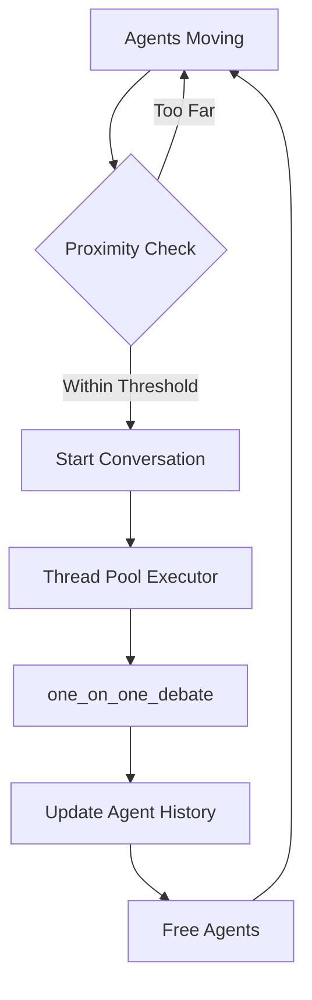

# Agent Map Simulation 🗺️🤖

An interactive simulation system where AI agents move around a 2D map and automatically engage in conversations when they come into close proximity with each other. Built on top of the **Swarms** framework, this simulation demonstrates multi-agent interactions with real-time visualization.

## 🎯 Features

- **Spatial Agent Movement**: Agents move randomly across a 2D map with configurable movement speeds
- **Proximity-Based Conversations**: When agents get close enough, they automatically start debating topics
- **Multi-threaded Conversations**: Multiple conversations can happen simultaneously across the map
- **Live Visualization**: Real-time matplotlib visualization showing agent positions and active conversations
- **Conversation Management**: Complete tracking and logging of all agent interactions
- **Specialized Agent Types**: Pre-configured agents with different financial expertise
- **Export Capabilities**: Save detailed conversation summaries and simulation results

## 🚀 Quick Start

### Prerequisites

Make sure you have the required dependencies:

```bash
pip install matplotlib numpy swarms
```

### Basic Usage

1. **Run the full demo with 6 specialized agents:**
```bash
python demo_simulation.py
```

2. **Run a quick demo with just 2 agents:**
```bash
python demo_simulation.py --quick
```

3. **Use the simulation in your own code:**
```python
from swarms import Agent
from agent_map_simulation import AgentMapSimulation

# Create simulation
sim = AgentMapSimulation(map_width=50, map_height=50)

# Add agents
agent = Agent(agent_name="TestAgent", model_name="gemini-2.5-flash")
sim.add_agent(agent)

# Start simulation
sim.start_simulation()
sim.setup_visualization()
sim.start_live_visualization()
```

## 🏗️ Architecture

### Core Components

#### 1. `Position`
Simple dataclass representing 2D coordinates with distance calculation.

#### 2. `AgentState`
Tracks the complete state of an agent in the simulation:
- Current position and target position
- Conversation status and partner
- Movement speed and conversation radius
- Conversation history

#### 3. `ConversationManager`
Handles all conversation logic:
- Manages active conversations with threading
- Uses the existing `one_on_one_debate` function from Swarms
- Tracks conversation history and status
- Thread-safe conversation state management

#### 4. `AgentMapSimulation`
The main simulation controller:
- Manages agent movement and positioning
- Detects proximity for conversation triggers
- Provides visualization and monitoring
- Handles simulation lifecycle

### Conversation Flow



## 🎮 Simulation Controls

### Map Configuration
```python
simulation = AgentMapSimulation(
    map_width=100.0,           # Map width in units
    map_height=100.0,          # Map height in units
    proximity_threshold=8.0,   # Distance for conversation trigger
    update_interval=2.0        # Simulation update frequency
)
```

### Agent Configuration
```python
simulation.add_agent(
    agent=my_agent,
    position=Position(x=10, y=10),  # Optional starting position
    movement_speed=2.0,             # Units per second
    conversation_radius=8.0         # Conversation detection radius
)
```

## 👥 Pre-built Agent Types

The demo includes 6 specialized financial agents:

1. **QuantTrader-Alpha**: Quantitative trading and algorithmic analysis
2. **MarketAnalyst-Beta**: Market research and fundamental analysis  
3. **RiskManager-Gamma**: Enterprise risk management and compliance
4. **CryptoExpert-Delta**: Cryptocurrency and DeFi specialist
5. **PolicyEconomist-Epsilon**: Macroeconomic policy expert
6. **BehaviorAnalyst-Zeta**: Behavioral finance and market psychology

Each agent has specialized knowledge and will engage in debates related to their expertise.

## 📊 Visualization

### Live Visualization Features
- **Blue circles**: Available agents (not in conversation)
- **Red circles**: Agents currently in conversation
- **Purple lines**: Active conversation links
- **Dashed circles**: Conversation detection radius
- **Topic labels**: Current conversation topics displayed
- **Real-time updates**: Automatic refresh showing movement and status

### Visualization Controls
```python
# Set up visualization
sim.setup_visualization(figsize=(14, 10))

# Start live updating visualization
sim.start_live_visualization(update_interval=3.0)

# Manual updates
sim.update_visualization()
```

## 📈 Monitoring & Export

### Real-time Status
```python
# Print current simulation state
sim.print_status()

# Get detailed state data
state = sim.get_simulation_state()
```

### Conversation Export
```python
# Save detailed conversation summary
filename = sim.save_conversation_summary()

# Custom filename
sim.save_conversation_summary("my_simulation_results.txt")
```

## 🔧 Advanced Usage

### Custom Agent Creation

```python
def create_custom_agent(name: str, expertise: str) -> Agent:
    """Create a specialized agent with custom system prompt."""
    return Agent(
        agent_name=name,
        agent_description=f"Expert in {expertise}",
        system_prompt=f"""You are an expert in {expertise}.
        Engage in thoughtful discussions while staying true to your expertise.
        Be collaborative but maintain your professional perspective.""",
        model_name="gemini-2.5-flash",
        dynamic_temperature_enabled=True,
        output_type="str-all-except-first",
        max_loops="auto"
    )
```

### Simulation Events

```python
# Add agents during simulation
new_agent = create_custom_agent("NewExpert", "blockchain technology")
sim.add_agent(new_agent)

# Remove agents
sim.remove_agent("AgentName")

# Check active conversations
active_convs = sim.conversation_manager.get_active_conversations()
```

### Custom Movement Patterns

The simulation uses random movement by default, but you can extend it:

```python
class CustomSimulation(AgentMapSimulation):
    def _generate_random_target(self, agent_state):
        # Custom movement logic
        # Example: agents prefer certain areas
        if "Crypto" in agent_state.agent.agent_name:
            # Crypto agents gravitate toward center
            return Position(
                x=self.map_width * 0.5 + random.uniform(-10, 10),
                y=self.map_height * 0.5 + random.uniform(-10, 10)
            )
        return super()._generate_random_target(agent_state)
```

## 🎯 Example Use Cases

### 1. Financial Trading Simulation
- Multiple trading agents with different strategies
- Market condition changes trigger different behaviors
- Risk management agents monitor and intervene

### 2. Research Collaboration
- Academic agents with different specializations
- Collaborative knowledge building through proximity conversations
- Track cross-disciplinary insights

### 3. Educational Scenarios
- Student agents learning from expert agents
- Knowledge transfer through spatial interactions
- Monitor learning progress and topic coverage

### 4. Product Development
- Agents representing different stakeholders (engineering, marketing, design)
- Cross-functional collaboration through spatial meetings
- Track decision-making processes

## 🐛 Troubleshooting

### Common Issues

1. **Matplotlib Backend Issues**
   ```python
   import matplotlib
   matplotlib.use('TkAgg')  # or 'Qt5Agg'
   ```

2. **Threading Conflicts**
   - Ensure proper cleanup with `sim.stop_simulation()`
   - Use try/finally blocks for cleanup

3. **Memory Usage**
   - Limit conversation history depth
   - Reduce visualization update frequency
   - Use fewer agents for long-running simulations

### Performance Tips

- **Reduce Update Frequency**: Increase `update_interval` for better performance
- **Limit Conversation Loops**: Set `max_loops` in `one_on_one_debate` to smaller values
- **Optimize Visualization**: Reduce `update_interval` in live visualization
- **Memory Management**: Periodically clear old conversation histories

## 🤝 Contributing

This simulation system is built on the Swarms framework and can be extended in many ways:

- Add new agent behaviors and movement patterns
- Implement different conversation triggers (topic-based, time-based)
- Create new visualization modes (3D, network graphs)
- Add more sophisticated agent interactions
- Implement learning and adaptation mechanisms

## 📄 License

This project follows the same license as the Swarms framework.

---

## 🎉 Have Fun!

Watch your agents come to life as they move around the map and engage in fascinating conversations! The simulation demonstrates the power of autonomous agents working together in a spatial environment.

For questions or issues, please refer to the Swarms documentation or community forums. 