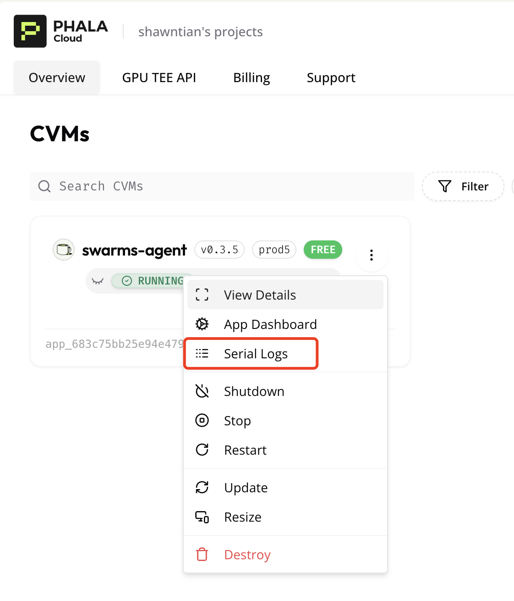
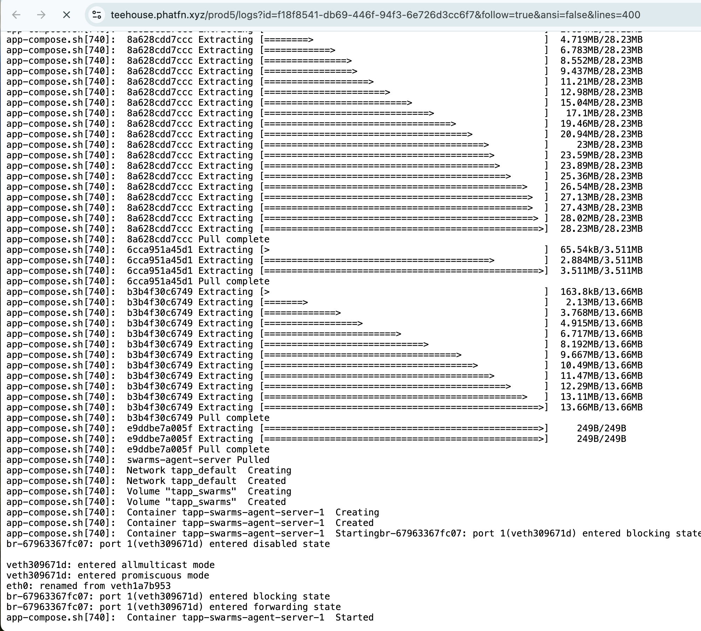
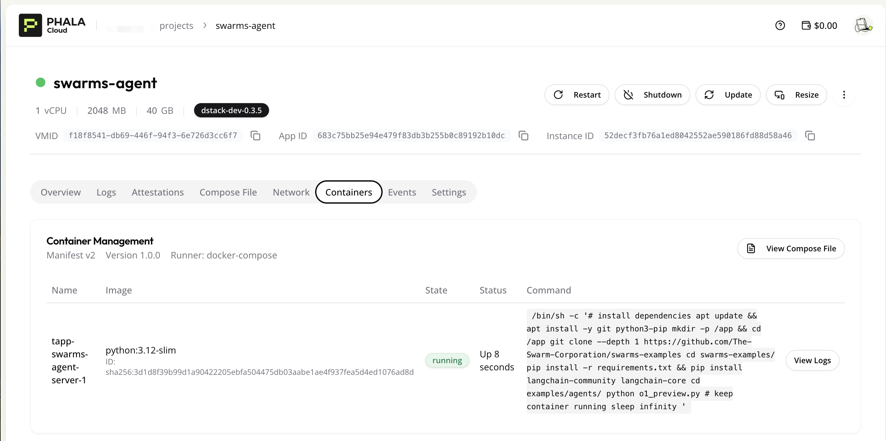

# Running Swarms Agent in Phala TEE

Welcome! This guide will walk you through running your Swarms Agent in a Trusted Execution Environment (TEE) using Phala Cloud. This setup ensures your agent runs in a secure, isolated environment.

## 📋 Prerequisites

- A Swarms Agent code repository (or docker image)
- A Phala Cloud account
- An OpenAI API key

## 📝 Step-by-Step Guide

### 1. ⚙️ Configure Your Environment

First, prepare your `docker-compose.yaml` file. You can find an example in [docker-compose.yaml](./docker-compose.yaml). Make sure to have your OpenAI API key ready.

```yaml
services:
  swarms-agent-server:
    image: python:3.12-slim
    volumes:
      - swarms:/app
    restart: always
    environment:
      - OPENAI_API_KEY=${OPENAI_API_KEY}
    command: # Run swarms agent example
      - /bin/sh
      - -c
      - |
        # install dependencies
        apt update && apt install -y git python3-pip
        mkdir -p /app && cd /app

        git clone --depth 1 https://github.com/The-Swarm-Corporation/swarms-examples
        cd swarms-examples/
        pip install -r requirements.txt && pip install langchain-community langchain-core
        cd examples/agents/
        python o1_preview.py

        # keep container running
        sleep infinity

volumes:
  swarms:
```

### 2. 🚀 Deploy Your Agent

1. Navigate to the [Phala Cloud dashboard](https://cloud.phala.network/dashboard)
2. Create a new Swarms agent application
   <p align="center">
   
   </p>

### 3. 📊 Monitor Your Deployment

1. Check the initialization logs of your agent
   <p align="center">
   
   
   </p>

2. Verify your container is running
   <p align="center">
   
   </p>

3. Monitor your agent's output
   <p align="center">
   
   </p>

### 4. ✅ Verify TEE Attestation

Ensure your agent is running in a secure TEE environment by checking the attestation proof on the [TEE Attestation Explorer](https://proof.t16z.com/).

<p align="center">

</p>

## 🎉 Success!

You've successfully deployed your Swarms Agent in a secure TEE environment using Phala Cloud. Your agent is now running in an isolated, trusted execution environment, ensuring enhanced security for your AI operations.

If you have any questions, please reach out to us on [Phala Cloud](https://cloud.phala.network/).
